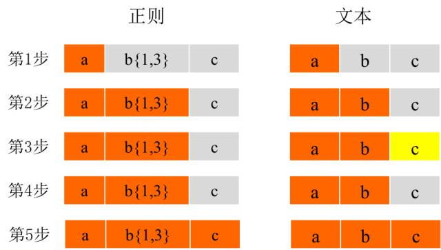
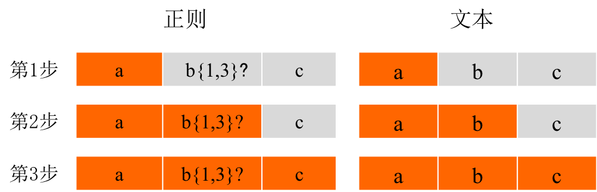
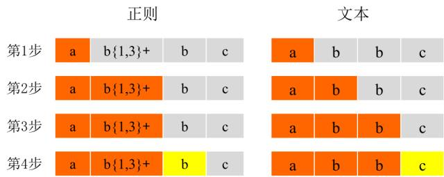

https://blog.csdn.net/weixin_34075551/article/details/93571810

正则表达式也有可能存在性能问题。

https://www.cnblogs.com/study-everyday/p/7426862.html

正则表达式全集：

https://tool.oschina.net/uploads/apidocs/jquery/regexp.html

# 正则表达式参照表

| 非打印字符   | 解释                                                         |
| ------------ | ------------------------------------------------------------ |
| \f           | 匹配一个换页符。等价于 \x0c 和 \cL。                         |
| \n           | 换页字符                                                     |
| \r           | 匹配回车字符                                                 |
| \s           | 匹配任何空白字符，包括空格、制表符、换页符等等。等价于 [ \f\n\r\t\v]。注意 Unicode 正则表达式会匹配全角空格符。 |
| \v           | 匹配一个垂直制表符。等价于 \x0b 和 \cK。                     |
| \S           | 匹配任何非空白字符。等价于 \[^ \f\n\r\t\v\]。                |
| \t           | 匹配一个制表符，等价于 \x09 和 \cI。                         |
| **特殊字符** | **解释**                                                     |
| $            | 匹配输入字符串的结尾位置。                                   |
| ()           | 标记一个子表达式的开始和结束位置。子表达式可以获取供以后使用。要匹配这些字符，请使用 \\( 和\ \)。 |
| *            | 匹配前面的子表达式**零次或多次**。要匹配*字符，要用\\\*      |
| +            | 匹配前面的子表达式一次或多次。要匹配+字符，要用\\+           |
| .            | 匹配除换行符 \n 之外的任何单字符。要匹配 . ，请使用 \\. 。   |
| [            | 标记一个中括号表达式的开始。要匹配 [，请使用 \[。            |
| ?            | 匹配前面的子表达式**零次或一次**，或指明一个非贪婪限定符。要匹配 ? 字符，请使用 \?。 |
| \            | 将下一个字符标记为或特殊字符、或原义字符、或向后引用、或八进制转义符。例如， 'n' 匹配字符 'n'。'\n' 匹配换行符。序列 '\\\\\' 匹配 "\\"，而 '\\(' 则匹配 "("。 |
| ^            | 匹配输入字符串的开始位置，除非在方括号表达式中使用，此时它表示不接受该字符集合。要匹配 ^ 字符本身，请使用 \^。 |
| {            | 标记限定符表达式的开始。要匹配 {，请使用 \\{。               |
| \|           | 指明两项之间的一个选择。要匹配\|，请使用\\|                  |
| **限定符号** | **解释**                                                     |
| *            | 匹配前面的子表达式零次或多次。例如，zo* 能匹配 "z" 以及 "zoo"。* 等价于{0,}。 |
| +            | 匹配前面的子表达式一次或多次。例如，'zo+' 能匹配 "zo" 以及 "zoo"，但不能匹配 "z"。+ 等价于 {1,}。 |
| ?            | 匹配前面的子表达式零次或一次。例如，"do(es)?" 可以匹配 "do" 、 "does" 中的 "does" 、 "doxy" 中的 "do" 。? 等价于 {0,1}。 |
| {n}          | n 是一个非负整数。匹配确定的 n 次。例如，'o{2}' 不能匹配 "Bob" 中的 'o'，但是能匹配 "food" 中的两个 o。 |
| {n,}         | n 是一个非负整数。至少匹配n 次。例如，'o{2,}' 不能匹配 "Bob" 中的 'o'，但能匹配 "foooood" 中的所有 o。'o{1,}' 等价于 'o+'。'o{0,}' 则等价于 'o*'。 |
| {n,m}        | m 和 n 均为非负整数，其中n <= m。最少匹配 n 次且最多匹配 m 次。例如，"o{1,3}" 将匹配 "fooooood" 中的前三个 o。'o{0,1}' 等价于 'o?'。**请注意在逗号和两个数之间不能有空格。** |
| **定位符**   | **解释**                                                     |
| \b           | 匹配一个单词边界，即字与空格间的位置。                       |
| \B           | 非单词边界匹配。                                             |

# 正则表达式举例

| 例子     | 解释                                                         |
| -------- | ------------------------------------------------------------ |
| x\|y     | 匹配x或y                                                     |
| [xyz]    | 字符集合。匹配所包含的任意一个字符。例如，“`[abc]`”可以匹配“`plain`”中的“`a`”。 |
| \[^xyz\] | 负值字符集合。匹配未包含的任意字符。例如，“`[^abc]`”可以匹配“`plain`”中的“`p`”。 |
| [a-z]    | 字符范围。匹配指定范围内的任意字符。例如，“`[a-z]`”可以匹配“`a`”到“`z`”范围内的任意小写字母字符。 |
| [^a-z]   | 负值字符范围。匹配任何不在指定范围内的任意字符。例如，“`[^a-z]`”可以匹配任何不在“`a`”到“`z`”范围内的任意字符。 |
|          |                                                              |


# 一、正则表达式的引擎

一句话总结：简单地说，实现正则表达式引擎的有两种方式：DFA 自动机（Deterministic Final Automata 确定型有穷自动机）和 NFA 自动机（Non deterministic Finite Automaton 不确定型有穷自动机）。

- DFA 自动机的时间复杂度是线性的，更加稳定，但是功能有限。

-  NFA 的时间复杂度比较不稳定，有时候很好，有时候不怎么好，好不好取决于你写的正则表达式。但是胜在 NFA 的功能更加强大，所以包括 Java 、.NET、Perl、Python、Ruby、PHP 等语言都使用了 NFA 去实现其正则表达式。

NFA 对应的是正则表达式主导的匹配，而 DFA 对应的是文本主导的匹配。

# 二、NFA

NFA是以正则表达式为基准去匹配的，也就是说，NFA 自动机会读取正则表达式的一个一个字符，然后拿去和目标字符串匹配，匹配成功就换正则表达式的下一个字符，否则继续和目标字符串的下一个字符比较。

## 1.三种模式

贪婪模式、懒惰模式、独占模式

在关于数量的匹配中，有 + ? * {min,max} 四种两次，

- 如果只是单独使用，那么它们就是贪婪模式。

- 如果它们之后加一个 ? 符号，那么原先的贪婪模式就会变成**懒惰模式**，即尽可能地少匹配，会回溯。

- 如果在它们之后多加一个+符号，那么原先的贪婪模式就会变成**独占模式**，即尽可能地多匹配，但**不是回溯**。

| 贪婪   | 懒惰    | 独占    |
| ------ | ------- | ------- |
| X?     | X??     | X?+     |
| X*     | X*?     | X*+     |
| X+     | X+?     | X++     |
| X{n}   | X{n}?   | X{n}+   |
| X{n,}  | X{n,}?  | X{n,}+  |
| X{n,m} | X{n,m}? | X{n,m}+ |

## 2.NFA 回溯

```Java
text="abbc"
regex="ab{1,3}c"
```

上面的这个例子的目的比较简单，匹配以 a 开头，以 c 结尾，中间有 1-3 个 b 字符的字符串。NFA 对其解析的过程是这样子的：

- 首先，读取正则表达式第一个匹配符 a 和 字符串第一个字符 a 比较，匹配了。于是读取正则表达式第二个字符。
- 读取正则表达式第二个匹配符 b{1,3} 和字符串的第二个字符 b 比较，匹配了。但因为 b{1,3} 表示 1-3 个 b 字符串，以及 NFA 自动机的贪婪特性（也就是说要尽可能多地匹配），所以此时并不会再去读取下一个正则表达式的匹配符，而是依旧使用 b{1,3} 和字符串的第三个字符 b 比较，发现还是匹配。于是继续使用 b{1,3} 和字符串的第四个字符 c 比较，发现不匹配了。此时就会发生回溯。
- 发生回溯是怎么操作呢？发生回溯后，我们已经读取的字符串第四个字符 c 将被吐出去，指针回到第三个字符串的位置。之后，程序读取正则表达式的下一个操作符 c，读取当前指针的下一个字符 c 进行对比，发现匹配。于是读取下一个操作符，但这里已经结束了。



## 3.懒惰模式如何匹配

```Java
text="abbc"
regex="ab{1,3}?c"
```

正则表达式的第一个操作符 a 与 字符串第一个字符 a 匹配，匹配成功。于是正则表达式的第二个操作符 b{1,3}? 和 字符串第二个字符 b 匹配，匹配成功。因为最小匹配原则，所以拿正则表达式第三个操作符 c 与字符串第三个字符 b 匹配，发现不匹配。于是**回溯**回去，拿正则表达式第二个操作符 b{1,3}? 和字符串第三个字符 b 匹配，匹配成功。于是再拿正则表达式第三个操作符 c 与字符串第四个字符 c 匹配，匹配成功。于是结束。



## 4.独占模式的匹配

如果在以上四种表达式后加上一个加号（+），则会开启**独占模式**。同贪婪模式一样，独占模式一样会匹配最长。不过在独占模式下，正则表达式尽可能长地去匹配字符串，一旦匹配不成功就会结束匹配而不会回溯。

如果有正则表达式：

```Java
ab{1,3}+bc 
```

需要对字符串"abbc"进行匹配。




可以发现，在第2和第3步，b{1,3}+会将文本中的2个字母b都匹配上，结果文本中只剩下一个字母c。那么在第4步时，正则中的b和文本中的c进行匹配，当无法匹配时，并不进行回溯，这时候整个文本就无法和正则表达式发生匹配。如果将正则表达式中的加号（+）去掉，那么这个文本整体就是匹配的了。

# 三、问题

## 1.正则表达式导致CPU使用率高的关键原因

Java 正则表达式使用的引擎实现是 NFA 自动机，这种正则表达式引擎在进行字符匹配时会发生**回溯（backtracking）**。而一旦发生回溯，那其消耗的时间就会变得很长，有可能是几分钟，也有可能是几个小时，时间长短取决于回溯的次数和复杂度。

```Java
public static void main(String[] args) {
    String badRegex = "^([hH][tT]{2}[pP]://|[hH][tT]{2}[pP][sS]://)(([A-Za-z0-9-~]+).)+([A-Za-z0-9-~\\\\/])+$";
    String bugUrl = "http://www.fapiao.com/dddp-web/pdf/download?request=6e7JGxxxxx4ILd-kExxxxxxxqJ4-CHLmqVnenXC692m74H38sdfdsazxcUmfcOH2fAfY1Vw__%5EDadIfJgiEf";
    if (bugUrl.matches(badRegex)) {
        System.out.println("match!!");
    } else {
        System.out.println("no match!!");
    }
}
```

上述例子会导致CPU利用率直接飙升到91.4%，判断之后就是正则表达式有问题。

```Java
^([hH][tT]{2}[pP]://|[hH][tT]{2}[pP][sS]://)(([A-Za-z0-9-~]+).)+([A-Za-z0-9-~\\/])+$
```

我们可以将这个正则表达式分为三部分：

```Java
第一部分：校验协议。^([hH][tT]{2}[pP]://|[hH][tT]{2}[pP][sS]://)。
第二部分：校验域名。(([A-Za-z0-9-~]+).)+。
第三部分：校验参数。([A-Za-z0-9-~\\/])+$。
```

出问题的URL为：

```Java
http://www.fapiao.com/dzfp-web/pdf/download?request=6e7JGm38jfjghVrv4ILd-kEn64HcUX4qL4a4qJ4-CHLmqVnenXC692m74H5oxkjgdsYazxcUmfcOH2fAfY1Vw__%5EDadIfJgiEf
```

对于第一部分匹配到http://这部分没有问题，但是在校验www.fapiao.com时，是使用xxxx.这种方式去校验，那么匹配过程为：

```Java
www.
fapiao.
com/dzfp-web/pdf/download?request=6e7JGm38jfjghVrv4ILd-kEn64HcUX4qL4a4qJ4-CHLmqVnenXC692m74H5oxkjgdsYazxcUmfcOH2fAfY1Vw__%5EDadIfJgiEf
```

## 2.Java中如何使用正则表达式

Java的String类中提供了一个matches方法进行正则匹配，它表示的是

```java
// String中的方法
public boolean matches(String regex) {
    return Pattern.matches(regex, this);
}
// Pattern中的方法
public static boolean matches(String regex, CharSequence input) {
    Pattern p = Pattern.compile(regex);
    Matcher m = p.matcher(input);
    return m.matches();
}
// Matcher中的方法
public boolean matches() {
    return match(from, ENDANCHOR);
}
boolean match(int from, int anchor) {
    this.hitEnd = false;
    this.requireEnd = false;
    from        = from < 0 ? 0 : from;
    this.first  = from;
    this.oldLast = oldLast < 0 ? from : oldLast;
    for (int i = 0; i < groups.length; i++)
        groups[i] = -1;
    acceptMode = anchor;
    boolean result = parentPattern.matchRoot.match(this, from, text);
    if (!result)
        this.first = -1;
    this.oldLast = this.last;
    return result;
}
```
Matcher中的

- find()方法是部分匹配，是查找输入串与模式匹配的子串，如果该匹配的串有组还可以使用group()函数。将移动下次匹配的位置。

- matchers()方法是全部匹配，是将整个字符串与模式匹配，如果要验证一个输入的数据是否为数字或其他类型，一般要用matches()。但如果前部分匹配成功，将移动下次匹配的位置。

**①字符匹配** 
Pattern p = Pattern.compile(expression); // 正则表达式 
Matcher m = p.matcher(str); // 操作的字符串 
boolean b = m.matches(); //返回是否匹配的结果 
System.out.println(b); 

Pattern p = Pattern.compile(expression); // 正则表达式 
Matcher m = p.matcher(str); // 操作的字符串 
boolean b = m. lookingAt (); //返回是否匹配的结果 
System.out.println(b); 

Pattern p = Pattern.compile(expression); // 正则表达式 
Matcher m = p.matcher(str); // 操作的字符串 
boolean b = m..find (); //返回是否匹配的结果 
System.out.println(b); 

**②分割字符串** 
Pattern pattern = Pattern.compile(expression); //正则表达式 
String[] strs = pattern.split(str); //操作字符串 得到返回的字符串数组 

**③替换字符串** 
Pattern p = Pattern.compile(expression); // 正则表达式 
Matcher m = p.matcher(text); // 操作的字符串 
String s = m.replaceAll(str); //替换后的字符串 

**④查找替换指定字符串** 
Pattern p = Pattern.compile(expression); // 正则表达式 
Matcher m = p.matcher(text); // 操作的字符串 
StringBuffer sb = new StringBuffer(); 
int i = 0; 
while (m.find()) { 
    m.appendReplacement(sb, str); 
    i++;    //字符串出现次数 
} 
m.appendTail(sb);//从截取点将后面的字符串接上 
String s = sb.toString(); 

**⑤查找输出字符串** 
Pattern p = Pattern.compile(expression); // 正则表达式 
Matcher m = p.matcher(text); // 操作的字符串 
while (m.find()) { 
    matcher.start() ;
    matcher.end();
    matcher.group(1);
}

# 四、常见的非获取匹配

## 1. (?:pattern)

匹配pattern但不获取匹配结果，也就是说这是一个非获取匹配，不进行存储供以后使用。这在使用或字符“`(|)`”来组合一个模式的各个部分是很有用。

例如“`industr(?:y|ies)`”就是一个比“`industry|industries`”更简略的表达式。

## 2. (?=pattern)

正向肯定预查。它在任何匹配pattern的字符串处查找字符串，它仅仅是检查是否匹配，而不将预查的结果包含其中。当然，它也是非获取匹配。