# 一、垃圾回收

摘自：《深入理解Java虚拟机：JVM高级特性与最佳实践.周志明.高清扫描版.pdf》

## 一、自动内存管理机制

JVM在执行Java程序的过程中会把它所管理的内存划分为若干个不同的数据区域。

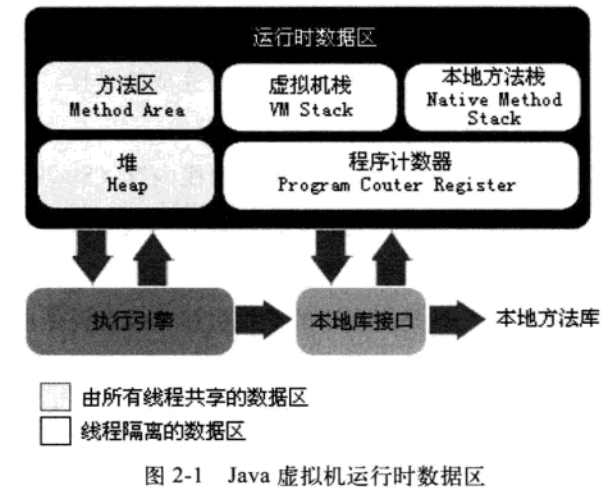


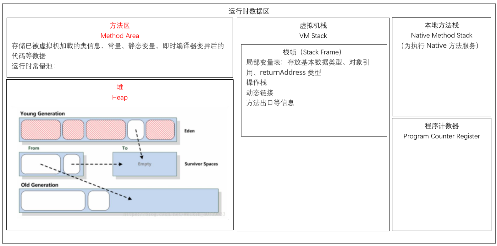

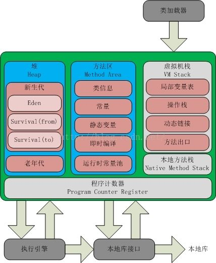

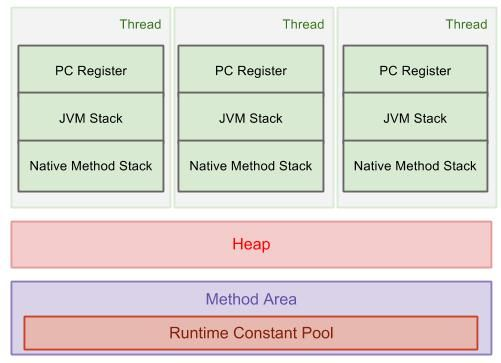

### 1.程序计数器

程序计数器（Program Counter Register）是一块较小的内存空间，它的作用可以看做是当前线程所执行的字节码的行号指示器。在虚拟机的概念模型里（仅是概念模型，各种虚拟机可能会通过一些更高效的方式去实现），字节码解释器工作时就是通过改变这个计数器的值来选取下一条需要执行的字节码指令，分支、循环、跳转、异常处理、线程恢复等基础功能都需要依赖这个计数器来完成。

- 如果线程正在执行的是一个Java方法，这个计数器记录的是正在执行的虚拟机字节指令的地址；

- 如果正在执行的是Native方法，这个计数器值则为空（Undefined）。

**此内存区域是唯一一个在Java虚拟机规范中没有规定任何OutOfMemoryError情况的区域。**

> 命题：如何自定义一个 Native方法？

### 2.虚拟机栈

和程序计数器一样，Java虚拟机栈（Java Virtual Machine Stacks）也是线程私有的，它的生命周期与线程相同。虚拟机栈描述的是Java方法执行的内存模型：每个方法被执行的时候都会同时创建一个栈帧（Stack Frame）用于存储局部变量表、操作栈、动态链接、方法出口等信息。每一个方法被调用直至执行完成的过程，就对应着一个栈帧在虚拟机栈中从入栈到出栈的过程。

局部变量表存放了编译期可知的各种基本数据类型（boolean、byte、char、short、int、float、long、double）、对象引用（reference类型，它不等同于对象本身，根据不同的虚拟机实现，它可能是一个指向对象起始地址引用指针，也可能是指向一个代表对象的句柄或者其他与对象相关的位置）和returnAddress类型（指向了一条字节码指令的地址）。

其中64位长度的long和double类型的数据会占用2个局部变量空间（Slot），其余的数据类型只占用1个。局部变量表所需的内存空间在编译期完成分配，当进入一个方法时，这个方法需要再帧中分配多大的局部变量空间完全是确定的，在方法运行期间不会改变局部变量表的大小。

在Java虚拟机规范中，对这个区域规定了两种异常状况：如果线程请求的栈深度大于虚拟机所允许的深度，将抛出StackOverflowError异常；如果虚拟机栈可以动态扩展（当前大部分的Java虚拟机都可以动态扩展，只不过Java虚拟机规范中也允许固定长度的虚拟机栈），当扩展时无法申请到足够的内存时会抛出OutOfMemoryError异常。

> 命题：方法开始执行之后，JVM中会发生什么？

### 3.本地方法栈

本地方法栈（Native Method Stacks）与虚拟机栈所发挥的作用是非常相似的，其区别不过是虚拟机为虚拟机执行Java方法（也就是字节码）服务，而本地方法栈则是为虚拟机使用到的Native方法服务。与虚拟机一样，本地方法栈区域会抛出StackOverflowError和OutOfMemoryError异常。

### 4.Java堆

对于大多数应用来说，Java堆（Java Heap）是Java虚拟机所管理的内存中最大的一块。Java堆是被所有线程共享的一块内存区域，在虚拟机启动时创建。此区域的唯一目的就是存放对象实例，几乎所有的对象实例都在这里分配内存。在Java虚拟机规范中描述的是：所有对象实例以及数组都要在堆上分配，但是随着JIT编译器的发展和逃逸分析技术的逐渐成熟，栈分配、标量替换优化技术将会导致一些微妙的变化发生，所有的对象都分配在堆上也渐渐变得不是那么“绝对”了。

Java堆是垃圾收集管理的主要区域，因此很多时候也被称作“GC堆”（Garbage Collected Heap）。如果从内存回收的角度来看，由于现在收集器基本都是采用的分代收集算法，所以Java堆中还可以细分为：新生代和老年代；再细致一点的有Eden空间、From Survivor空间、To Survivor空间等。如果从内存分配的角度看，线程共享的Java堆中可能划分出多个线程私有的分配缓冲区（Thread Local Allocation Buffer，TLAB）。不过，无论如何划分，都与存放内容无关，无论哪个区域，存储的都仍然是对象实例，进一步划分的目的是为了更好地回收内存，或者更快地分配内存。

Java堆可以处于物理上不连续的内存空间中，只要逻辑上是连续的即可。在实现上，既可以固定大小，也可以是可扩展的，不过当前主流的虚拟机都是按照可扩展来实现的（通过-Xmx和-Xms控制）。如果在堆中没有内存完成实例分配，并且堆也无法再扩展时，将会抛出OutOfMemoryError异常。

### 5.方法区

方法区（Method Area）与Java堆一样，是各个线程共享的内存区域，**它用于存储已被虚拟机加载的类信息、常量、静态变量、即时编译器变异后的代码等数据**。虽然Java虚拟机规范把方法区描述为堆的一个逻辑部分，但它却有一个别名叫做Non-Heap（非堆），目的应该是与Java堆区分开。

Java虚拟机规范对这个区域的限制非常宽松，除了和Java堆一样不需要连续的内存和可疑选择固定大小或者可扩展外，还可以选择不实现垃圾收集。相对而言，垃圾收集行为在这个区域是比较少出现的，但并非数据进入了方法区就如永久代的名字一样“永久”存在了。这个区域的回收目标主要是针对常量池的回收和对类型的卸载，一般来说这个区域的回收“成绩”比较难令人满意，尤其是类型的卸载，条件相当苛刻，但是这部分区域的回收确实是有必要的。

当方法区无法满足内存分配的需求时，将抛出OutOfMemoryError异常。

> Java8中将方法区移除，使用Meta-space替换元空间替代

#### 5.1运行时常量池

运行时常量池（Runtime Constant Pool）是方法区的一部分。Class文件中除了有类的版本、字段、方法、接口等描述信息外，还有一项信息是常量池（Constant Pool Table），用于存放编译期生成的各种字面量和符号引用，这部分内容将在类加载后存放到方法区的运行时常量池中。

运行时常量池相对于Class文件常量池的另外一个重要特征是具备动态性，Java语言并不要求常量一定只能在编译期产生，也就是并非置入Class文件中常量池的内容才能进入方法区运行时常量池，运行期间也可能将新的常量池放入池中，这种特性被开发人员利用得比较多的便是String类的intern()方法。

> 关于String类的intern()方法：
>
> - 返回字符串对象的规范化表示形式。
> - 一个初始时为空的字符串池，它由类 String 私有地维护。
>
> - 当调用 intern 方法时，如果池已经包含一个等于此 String 对象的字符串（该对象由 equals(Object) 方法确定），则返回池中的字符串。否则，将此 String 对象添加到池中，并且返回此 String 对象的引用。
>
> - 它遵循对于任何两个字符串 s 和 t，当且仅当 s.equals(t) 为 true 时，s.intern() == t.intern() 才为 true。
>
> - 所有字面值字符串和字符串赋值常量表达式都是内部的。
>
> ```Java
> String str1 = "a";
> String str2 = "b";
> String str3 = "ab";
> String str4_1 = "a" + "b";
> String str4 = str1 + str2;
> String str5 = new String("ab");
> // 字符串中内容相同，比较方式是一位一位地比较字符
> System.out.println(str5.equals(str3));
> // str4不会进入到常量池中
> System.out.println(str3 == str4);
> // str4_1字符串相加的时候，都是静态字符串的结果会添加到字符串池
> System.out.println(str3 == str4_1);
> // new创建的String不会进入常量池
> System.out.println(str5 == str3);
> // intern()获取的是常量池中对象的引用
> System.out.println(str5.intern() == str3);
> System.out.println(str5.intern() == str4);
> ```

### 6.直接内存

直接内存（Direct Memory）并不是虚拟机运行时数据区的一部分，也不是Java虚拟机规范中定义的内存区域，但是这部分内存也被频繁地适用，而且也有可能导致OutOfMemoryError异常出现。

在JDK1.4中新加入了NIO（New Input/Output）类，引入了一种基于通道（Channel）与缓冲区（Buffer）的I/O方式，它可以使用Native函数直接分配堆外内存，然后通过一个存储在Java里面的DirectByteBuffer对象作为这块内存的引用进行操作。这样能在一些场景中显著提高性能，因为避免了在Java堆和Native堆中来回复制数据。

### 7.对象访问

```Java
Object obj = new Object();
```

假设这代码出现在方法体中：

- “Object obj”这部分的语义将会反映到Java栈的本地变量表中，作为一个reference类型数据出现。

- “new Object()”这部分的语义将会反映到Java堆中，形成一块存储了Object类型所有实例数据值（Instance Data，对象中各个实例字段的数据）的结构化内存，根据具体类型以及虚拟机实现的对象内存布局（Object Memory Layout）的不同，这块内存的长度是不固定的。
- 另外，在Java堆中还必须包含能查找到此对象类型数据（如对象类型、父类、实现的接口、方法等）的地址信息，这些类型数据则存储在方法区中。

> 思考：对象嵌套对象，在new动作时是如何体现的？

由于reference类型访问到Java堆中的对象的具体位置，主流的访问方式有两种：使用句柄和直接指针。

- 使用句柄：Java堆中将会划分出一块内存来作为句柄池，reference中存储的就是对象的句柄地址，句柄中包含了对象实例数据和类型数据各自的具体信息。

  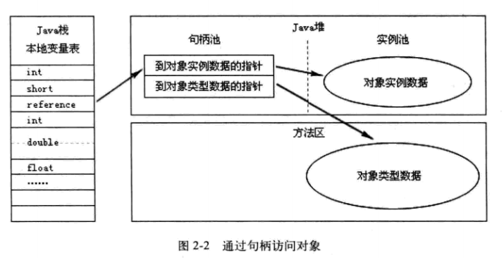

- 直接指针：Java堆对象的布局中就必须考虑如何放置访问类型数据的相关信息，reference中直接存储的就是对象地址。

  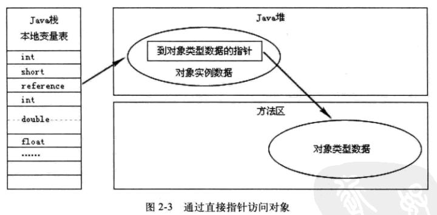

两种对象的访问方式各有优势，使用句柄方式访问的最大好处就是reference中存储的是稳定的句柄地址，在对象被移动（垃圾收集时移动对象是非常普遍的行为）时会改变句柄中的实例数据指针，而reference本身不需要被修改。

使用直接指针访问方式的最大好处就是速度更快，它节省了一次指针定位的时间开销，由于对象的访问在Java中非常频繁，因此这类开销积少成多后也是一项非常可观的执行成本。Sun HotSpot使用的是第二种方式进行对象的访问。

## 二、垃圾收集器与内存分配策略

程序计数器、虚拟机栈、本地方法栈三个区域随线程而生，随线程而灭，这几个区域的内存分配和回收都具备确定性，方法结束或线程结束时，内存自然就跟随着回收了。

Java堆和方法区只有在程序处于运行期间才能知道会创建哪些对象，这部分内存的分配和回收都是动态的，垃圾收集器所关注的就是这部分内存。

确定哪些对象“存活”，哪些已经“死去”（不可能再被任何途径使用的对象）的方法有两种：引用计数算法和根搜索法。

### 1.引用计数法

给对象添加一个引用计数器，每当有一个地方引用它时，计数器值就加1；当引用失效时，计数器值就减1；任何时刻计数器都为0的对象就是不可能再被使用的。

但是它很难解决对象之间的相互循环引用问题。

### 2.根搜索法（GC Roots Tracing）

算法思路是：通过一系列名为“GC Roots”的对象作为起始点，从这些节点开始向下搜索，搜索走过的路径称为引用链（Reference Chain），当一个对象到GC Roots没有任何引用链相连（用图论的话来说就是从GC Roots到这个对象不可达）时，则证明此对象是不可用的。

在Java语言中，可作为GC Roots的对象包括下面几种：

- 虚拟机栈（栈帧中的本地变量表）中的引用的对象
- 方法区中的类静态属性引用的对象
- 方法区中的常量引用的对象，如：字符串常量池
- 本地方法栈中JNI（即一般说的Native方法）的引用的对象

> 思考：静态变量放置在哪里？

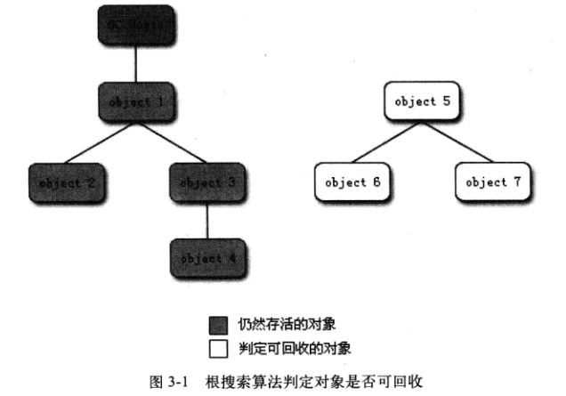

#### 2.1 四种引用类型

在JDK1.2之后，Java对引用的概念进行了扩充，将引用分为强引用（Strong Reference）、软引用（Soft Reference）、弱引用（Weak Reference）、虚引用（Phantom Reference）四中，这四种引用强度一次逐渐减弱。

- **强引用**就是在程序代码中普遍存在的，类似“Object obj=new Object()”这类的引用，只要强引用还在，垃圾收集器永远不会回收掉被引用的对象。
- **软引用**用来描述一些还有用，但并非必须的对象。对于软引用关联着的对象，在系统将要发生内存溢出异常之前，将会把这些对象列进回收范围之中并进行第二次回收。如果这次回收还是没有足够的内存，才回抛出内存溢出异常。在JDK1.2之后，提供了SoftReference类来实现软引用。可以用来做**内存敏感的高速缓存**。
- **弱引用**也是用来描述非必须对象的，被弱引用关联的对象只能生存到下一次垃圾收集发生之前。无论当前内存是否足够，都会回收掉只被弱引用关联的对象，WeakReference类来实现软引用。https://www.cnblogs.com/zjj1996/p/9140385.html
- **虚引用也被称为幽灵引用或者幻影引用**，它是最弱的一种引用关系。一个对象是否有虚引用的存在，完全对其生存时间构成影响，也无法通过虚引用来取得一个对象实例。**为一个对象设置虚引用关联的唯一目的就是希望能在这个对象被收集器回收时收到一个系统通知。**虚引用必须和引用队列关联使用，当垃圾回收器准备回收一个对象时，如果发现它还有虚引用，就会把这个虚引用加入到与之 关联的引用队列中。程序可以通过判断引用队列中是否已经加入了虚引用，来了解被引用的对象是否将要被垃圾回收。如果程序发现某个虚引用已经被加入到引用队列，那么就可以在所引用的对象的内存被回收之前采取必要的行动，PhantomReference类来实现软引用。

#### 2.2 对象的内存结构


### 3.生存还是死亡

在根搜索算中不可达的对象，也并非是“非死不可”的，这时候它们暂时处于“缓刑”阶段，要真正宣告一个对象死亡，至少要经历两次标记过程：如果对象在跟搜索后发现没有与GC Roots相连接的引用链，那么它将会被第一次标记并且进行一次筛选，筛选条件是此对象是否有必要执行finalize()方法。当对象没有覆盖finalize()方法，或者finalize()方法已经被虚拟机调用过，虚拟机将这两种情况都视为“没有必要执行”。

如果这个对象被判定为有必要执行finalize()方法，那么这个对象将会被放置在一个名为F-Queue的队列中，并在稍后由一条虚拟机自动建立的、低优先级的Finalizer线程去执行。这里所谓的“执行”是指虚拟机会出发这个方法，但并不承诺会等待它运行结束。这样的原因是，如果一个对象在finalize()方法中执行缓慢，或者发生了死循环（更极端的情况），将很可能会导致F-Queue队列中的其他对象永久处于等待状态，甚至导致整个内存回收系统崩溃。finalize()方法是对象逃脱死亡的最后一次机会，稍后GC将对F-Queue重的对象进行第二次小规模的标记，如果对象要在finalize()中成功拯救自己——只要重新与引用链上的任何一个对象建立关联即可，譬如把自己（this关键字）赋值给某个类变量或对象的成员变量，那在第二次标记时它将被移除出“即将回收”的集合；如果对象这个时候还没有逃脱，那它就真的离死不远了。

### 4.回收方法区

永久代的垃圾收集主要回收两部分内容：废弃常量和无用的类。

回收废弃常量是没有任何对象引用常量池中的常量时，也没有其他地方引用这个字面量时，如果发生内存怒回收，此常量会被“请”出常量池。常量池中的其他类（接口）、方法、字段的符号引用也与此类似。

判定一个类是否是“无用的类”的条件相对苛刻许多。类需要同时满足下面3个条件才能算是“无用的类”。

- 该类所有的实例都已经被回收，Java对重不存在该类的任何实例
- 加载该类的ClassLoader已经被回收
- 该类对应的java.lang.Class对象没有在任何地方被引用，无法在任何地方通过反射访问该类。

在大量使用反射、动态代理、CGLib等bytecode框架的场景，以及动态生成JSP和OSGi这类频繁自定义ClassLoader的场景都需要虚拟机具备类卸载的功能，以保证永久代不会溢出。

### 5.垃圾收集算法

#### （1）标记-清除法

最基础的收集算法是“标记-清除”（Mark-Sweep）算法，算法分为”标记“和”清除“两个阶段：首先标记出所有需要回收的对象，标记完成后统一回收掉所有被标记的对象。标记过程前面已经介绍了。

它存在连个主要的缺点：一是效率问题，标记和清除过程的效率都不高；另一个是空间问题，标记清除之后会产生大量不连续的内存碎片，空间碎片太多可能会导致，当程序在以后的运行过程中需要分配较大对象时无法找到足够的连续内存空间而不得不提前出发另一次垃圾收集动作。

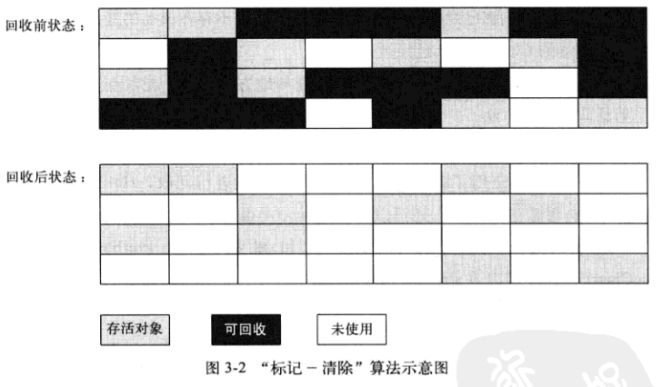

#### （2）复制算法

为了解决效率问题，一种称为“复制”（Copying）的收集算法出现了，它将可用内存按容量划分为大小相等的两块，每次只是用其中的一块。当这一块的内存用完了，就将还存活着的对象复制到另外一块上面，然后再把已使用过的内存空间一次清理掉。这样使得每次都是对其中的一块进行内存回收，内存分配时也就不用考虑内存碎片等复杂情况，只要移动堆顶指针，按顺序分配内存即可，实现简单，运行高效。只是这种算法的代价是将内存缩小为原来的一般。

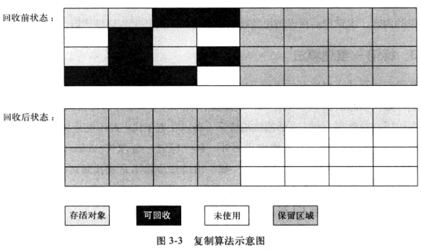

现在的商业虚拟机都采用这种收集算法来回收**新生代**，IBM的专门研究表明，新生代中的对象98%是朝生夕死的，所以并不需要按照1:1的比例来划分内存空间，而是将**内存分为一块较大的Eden空间和两块较小的Survivor空间**，每次使用Eden和其中的一块Survivor。当回收时，将Eden和Survivor中还存活着的对象一次性地拷贝到另一块Survivor空间上，最后清理掉Eden和刚才用过的Survivor的空间。HotSpot虚拟机默认Eden和Survivor的大小比例是8:1，也就是每次新生代中可用内存空间为整个新生代容量的90%，只有10%的内存是会被“浪费”的。当然，98%的对象可回收只是一般场景下的数据，我们没有办法保证每次回收都只有不多于10%的对象存活，当Survivor空间不够用时，需要依赖其他内存（这里指老年代）进行分配担保（Handle Promotion）。

#### （3）标记-整理法

复制收集算法在对象存活率较高时就要执行较多的复制操作，效率将会变低。更关键的是，如果不想浪费50%的空间，就需要有额外的空间进行分配担保，以应对被使用的内存中所有对象都100%存活的极端情况，所以老年代一般不能直接选用这种算法。

根据老年代的特点，有人提出了“标记-整理”（Mark-Compact）算法，标记过程仍然与“标记-清除”算法一样，随后让所有存活的对象都向一端移动，然后直接清理掉端边界以外的内存。

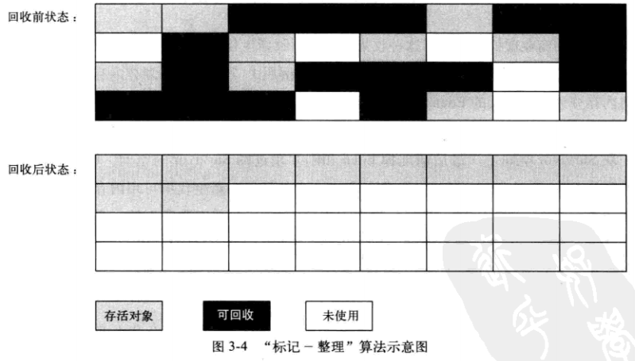

#### （4）分代收集算法

当前商业虚拟机的垃圾收集都采用“分代收集”（Generational Collection）算法，根据对象的存活周期的不同将内存划分为几块，一般是将Java堆分为新生代和老年代，这样就可以根据各个年代的特点采用最合适的手机算法。对于新生代，每次垃圾收集时都发现有大批对象死去，只有少量存活，那就选用复制算法，只需要付出少量存活对象的复制成本就可以完成收集。而老年代因为对象存活率高、没有额外空间对它进行分配担保，就必须使用“标记-清理”或“标记-整理”算法进行垃圾回收。

### 6.安全点和安全区

#### 6.1 安全点

在OopMap的协助下，HotSpot可以快速准确地完成GC Roots枚举，但一个很现实的问题随之而 来:可能导致引用关系变化，或者说导致OopMap内容变化的指令非常多，如果为每一条指令都生成 对应的OopMap，那将会需要大量的额外存储空间，这样垃圾收集伴随而来的空间成本就会变得无法 忍受的高昂。

实际上HotSpot也的确没有为每条指令都生成OopMap，前面已经提到，只是在“特定的位置”记录了这些信息，这些位置被称为安全点(Safepoint)。有了安全点的设定，也就**决定了用户程序执行时并非在代码指令流的任意位置都能够停顿下来开始垃圾收集，而是强制要求必须执行到达安全点后才能够暂停**。因此，安全点的选定既不能太少以至于让收集器等待时间过长，也不能太过频繁以至于过分增大运行时的内存负荷。安全点位置的选取基本上是以“是否具有让程序长时间执行的特征”为标准 进行选定的，因为每条指令执行的时间都非常短暂，程序不太可能因为指令流长度太长这样的原因而长时间执行，“长时间执行”的最明显特征就是指令序列的复用，例如方法调用、循环跳转、异常跳转 等都属于指令序列复用，所以只有具有这些功能的指令才会产生安全点。

而主动式中断的思想是当垃圾收集需要中断线程的时候，不直接对线程操作，仅仅简单地设置一 个标志位，各个线程执行过程时会不停地主动去轮询这个标志，一旦发现中断标志为真时就自己在最 近的安全点上主动中断挂起。轮询标志的地方和安全点是重合的，另外还要加上所有创建对象和其他 需要在Java堆上分配内存的地方，这是为了检查是否即将要发生垃圾收集，避免没有足够内存分配新对象。

#### 6.2 安全区

使用安全点的设计似乎已经完美解决如何停顿用户线程，让虚拟机进入垃圾回收状态的问题了， 但实际情况却并不一定。安全点机制保证了程序执行时，在不太长的时间内就会遇到可进入垃圾收集 过程的安全点。但是，程序“不执行”的时候呢?所谓的程序不执行就是没有分配处理器时间，典型的 场景便是用户线程处于Sleep 状态或者Blocked状态，这时候线程无法响应虚拟机的中断请求，不能再走 到安全的地方去中断挂起自己，虚拟机也显然不可能持续等待线程重新被激活分配处理器时间。对于 这种情况，就必须引入安全区域(Safe Region)来解决。

安全区域是指能够确保在某一段代码片段之中，引用关系不会发生变化，因此，在这个区域中任意地方开始垃圾收集都是安全的。我们也可以把安全区域看作被扩展拉伸了的安全点。

当用户线程执行到安全区域里面的代码时，首先会标识自己已经进入了安全区域，那样当这段时间里虚拟机要发起垃圾收集时就不必去管这些已声明自己在安全区域内的线程了。当线程要离开安全区域时，它要检查虚拟机是否已经完成了根节点枚举(或者垃圾收集过程中其他需要暂停用户线程的阶段)，如果完成了，那线程就当作没事发生过，继续执行;否则它就必须一直等待，直到收到可以离开安全区域的信号。

### 7.垃圾收集器

如果说收集算法是内存回收的方法论，垃圾收集器就是内存回收的具体实现。

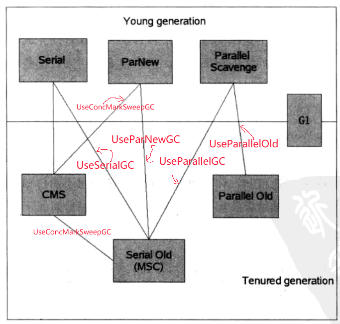

如果两个收集器之间存在连线，就说明他们可以搭配使用。

#### （1）Serial收集器

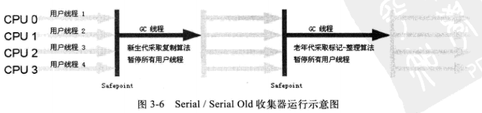

Serial收集器是最基本、历史最悠久的收集器。这个收集器是一个单线程的收集器，它在进行垃圾收集时，必须暂停其他所有工作线程（Sun将这件事情称之为“Stop The World”），直到它收集结束。“Stop The World”这项工作时有虚拟机在后台自动发起和自动完成的，在用户不可见的情况下把用户的正常工作的线程全部停掉。它依然是虚拟机运行在Client模式下的默认新生代收集器。

它的优点是：简单而高效（与其他收集器的单线程比）。

要点：

- 针对新生代
- 采用复制算法
- 单线程收集
- Stop The World
- HotSpot在Client模式下的默认新生代收集器
- 可以和老年代收集器的CMS和Serial Old配合使用

#### （2）ParNew收集器

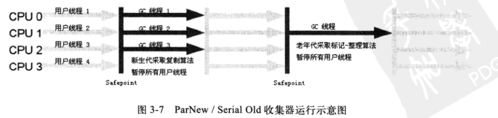

ParNew收集器其实就是Serial收集器的多线程版本，除了使用多条线程进行垃圾收集之外，其余行为包括Serial收集器可用的所有控制参数（例如：-XX:SurvivorRatio、**-XX:PretenureSizeThreadhold**、-XX:HandlePromotionFailure等）、收集算法、Stop The World、对象分配规则、回收策略等都与Serial收集器完全一样。

ParNew是许多运行Server模式下的虚拟机中首选的新生代收集器。ParNew收集器也是使用-XX:+UseConcMarkSweepGC选项后的默认新生代收集器 ，也可以使用-XX:+UseParNewGC选项来强制指定它。可以使用-XX:ParallelGCThreads参数来限制垃圾收集的线程数。

> 并行（Parallel）：指多条垃圾收集线程并行工作，但此时用户线程仍然处于等待状态
>
> 并发（Concurrent）：指用户线程与垃圾收集线程同时执行（但不一定是并行的，可能会交替执行），用户程序继续运行，而垃圾收集程序运行与另一个CPU上。

要点：

- 除了多线程外，其他的和Serial收集器一样
- 可以和老年代收集器的CMS和Serial Old配合使用

#### （3）Parallel Scavenge收集器

Parallel Scanvenge收集器也是一个新生代收集器，它也是复制算法的收集器，又是并行的多线程收集器。Parallel Scavenge与其他收集器的关注点不同，Parallel Scavenge收集器的目标则是达到一个可控制的吞吐量（Throughput）。所谓吞吐量就是CPU用于用户代码的实现与CPU总消耗时间的比值，即
$$
吞吐量 = \frac{运行用户代码时间}{(运行用户代码时间+垃圾收集时间)}
$$
虚拟机总共运行了100分钟，其中垃圾收集划掉1分钟，那吞吐量就是99%。

停顿时间越短适合需要与用户交互的程序，良好的响应速度能提升用户体验；而高吞吐量则可以最高效率地利用CPU时间，尽快地完成程序的运算任务，主要适合在后台运算而不需要太多交互的任务。

Parallel Scaveng通过下面两个参数精确控制吞吐量：

- 参数-XX:MaxGCPauseMills控制最大垃圾收集停顿时间。参数设置的越小，GC停顿时间缩短是以牺牲吞吐量和新生代空间来换取的，系统将新生代调小，垃圾收集速度就会变得更快，但是同样也会变得更频繁，吞吐量也就会下降。
- -XX:GCTimeRatio参数设置吞吐量的大小。GCTimeRatio参数的值应当是一个大于0小于100的整数，垃圾收集时间占用应用程序时间的比例，公式为 : 1/(1+ GCTimeRatio的值）。如果把参数设置为19，那允许的最大GC时间就占总时间的5%（即1/(1+19)）。默认值为99，就是允许最大1%（即1/(99+1)）的垃圾收集时间。

要点：

- 新生代收集器
- 采用的是复制算法
- 多线程
- 关注吞吐量，高效率地适用CPU时间
- 可以和老年代的Serial Old和Parallel Old配合使用

#### （4）Serial Old收集器

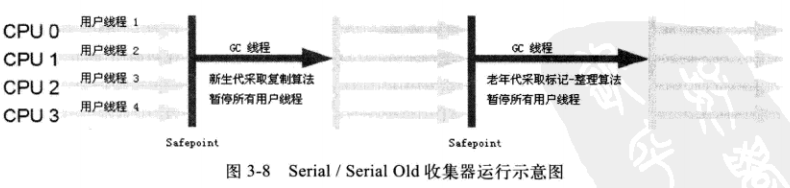

Serial Old是Serial收集器的老年代版本，它同样是一个单线程的收集器，使用的是“标记-整理”算法。

要点：

- 老年代收集器
- 单线程收集器
- 使用“标记-整理”算法

#### （5）Parallel Old收集器

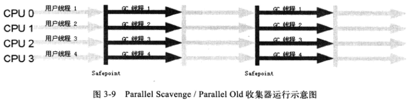

Parallel Old是Parallel Scavenge收集器的老年代版本，使用多线程和“标记-整理”算法。

要点：

- 老年代收集器
- 多线程
- 使用“标记-整理”算法

#### （6）CMS收集器

CMS（Concurrent Mark Sweep）收集器是一种以获取最短回收停顿时间为目标的收集器。目前很大一部分的Java应用都集中在互联网站或B/S系统的服务端上，这类应用尤其重视服务的响应速度，希望系统停顿时间最短，以给用户带来较好的体验。CMS收集器就非常符合这类应用的需求。

CMS收集器是基于“标记-清除”算法实现的。一般包括6个阶段：

- 初始标记
- 并发标记
- 并发预清理
- 重新标记
- 并发清理
- 并发重置


**初始标记：**在这个阶段，需要虚拟机停顿正在执行的任务，STW（Stop The World）。这个过程从垃圾回收的“根对象”开始，**只扫描到能够和“根对象”直接关联的对象**，并作为标记。所以这个过程虽然暂停了整个JVM，但是很快就完成了。

**并发标记**：这个阶段紧随着初始标记阶段，在初始标记的基础上继续向下追溯标记。并发标记阶段，应用程序和并发标记线程并发执行，所以用户不会感受到停顿。

**并发预清理**：并发预清理阶段仍然是并发的。在这个阶段，虚拟机查找在执行并发标记阶段新进入老年代的对象（可能会有一些对象从新生代晋升到老年代，或者有一些对象被分配到老年代）。通过重新扫描，减少下一个阶段“重新标记”的工作，因为下一个阶段会Stop The World。

**重新标记**：这个阶段会暂停虚拟机，收集器扫描在CMS堆中剩余的对象。扫描从“根对象”开始向下追溯，并处理对象关联。

**并发清理**：清理垃圾对象，这个阶段收集器线程和应用程序线程并发执行

**并发重置**：这个阶段，重置CMS收集器的数据结构，等待下一次垃圾回收。

CMS的缺点：

- CMS采取的是“标记-清理”算法，不会整理空间，会产生空间碎片。
- 需要更多的CPU资源
- 需要更大的堆空间。CMS标记阶段应用程序的线程还是在执行的，那么就会有堆空间继续分配的情况，为了保证在CMS回收完堆之前还有空间分配给正在运行的应用程序，就必须预留一部分空间。

要点：

- 它的目标是：获取最短回收停顿时间为目标
- 使用“标记-清除”算法实现
- 回收老年代

##### GC日志


##### 关键参数

-XX:

#### （7）G1收集器

博客：https://tech.meituan.com/2016/09/23/g1.html

G1（Garbage First）收集器是当前收集器技术发展的最前沿成果，在JDK 1.6 Update14中提供了Early Access版本的G1收集器以供试用。

G1收集器较前面的CMS有两个显著的改进：一是G1收集器是基于“标记-整理”算法实现的收集器，也就是说它不会产生空间碎片。二是它可以非常精确地控制停顿，既能让使用者明确指定在一个长度为M毫秒的时间片段内，消耗在垃圾收集上的时间不得超过N毫秒，这几乎已经是实时Java（RTSJ）的垃圾收集器的特征了。

G1将整个Java堆（包括新生代、老年代）划分为多个大小固定的独立区域（Region），并且跟踪这些区域里面的垃圾堆积程度，在后台维护一个优先列表，每次根据允许的收集时间，优先回收垃圾最多的区域（这就是Garbage First名称的来由）。

##### 重要概念

###### Region

传统的GC收集器将连续的内存空间划分为新生代、老年代和永久代（JDK 8去除了永久代，引入了元空间Metaspace），这种划分的特点是各代的存储地址（逻辑地址，下同）是连续的。如下图所示：


而G1的各代存储地址是不连续的，每一代都使用了n个不连续的大小相同的Region，每个Region占有一块连续的虚拟内存地址。如下图所示：


在上图中，我们注意到还有一些Region标明了H，它代表Humongous，这表示这些Region存储的是巨大对象（humongous object，H-obj），即大小大于等于region一半的对象。H-obj有如下几个特征： 

* H-obj直接分配到了old gen，防止了反复拷贝移动。
* H-obj在global concurrent marking阶段的cleanup 和 full GC阶段回收。 
* 在分配H-obj之前先检查是否超过 initiating heap occupancy percent和the marking threshold, 如果超过的话，就启动global concurrent marking，为的是提早回收，防止 evacuation failures 和 full GC。

为了减少连续H-objs分配对GC的影响，需要把大对象变为普通的对象，建议增大Region size。

一个Region的大小可以通过参数-XX:G1HeapRegionSize设定，取值范围从1M到32M，且是2的指数。如果不设定，那么G1会根据Heap大小自动决定。

###### SATB

全称是Snapshot-At-The-Beginning，由字面理解，是GC开始时活着的对象的一个快照。它是通过Root Tracing得到的，作用是维持并发GC的正确性。 那么它是怎么维持并发GC的正确性的呢？根据三色标记算法，我们知道对象存在三种状态： 

* 白：对象没有被标记到，标记阶段结束后，会被当做垃圾回收掉。 
* 灰：对象被标记了，但是它的field还没有被标记或标记完。 
* 黑：对象被标记了，且它的所有field也被标记完了。

由于并发阶段的存在，Mutator和Garbage Collector线程同时对对象进行修改，就会出现白对象漏标的情况，这种情况发生的前提是： 

- Mutator赋予一个黑对象该白对象的引用。 
- Mutator删除了所有从灰对象到该白对象的直接或者间接引用。

> Mutator：除了垃圾收集器之外的部分；
>
> Collector：垃圾收集器

对于第一个条件，在并发标记阶段，如果该白对象是new出来的，并没有被灰对象持有，那么它会不会被漏标呢？Region中有两个top-at-mark-start（TAMS）指针，分别为prevTAMS和nextTAMS。在TAMS以上的对象是新分配的，这是一种隐式的标记。对于在GC时已经存在的白对象，如果它是活着的，它必然会被另一个对象引用，即条件二中的灰对象。如果灰对象到白对象的直接引用或者间接引用被替换了，或者删除了，白对象就会被漏标，从而导致被回收掉，这是非常严重的错误，所以SATB破坏了第二个条件。也就是说，一个对象的引用被替换时，可以通过write barrier 将旧引用记录下来。

SATB也是有副作用的，如果被替换的白对象就是要被收集的垃圾，这次的标记会让它躲过GC，这就是float garbage。因为SATB的做法精度比较低，所以造成的float garbage也会比较多。

###### Rset

全称是Remembered Set，是辅助GC过程的一种结构，典型的空间换时间工具，和Card Table有些类似。还有一种数据结构也是辅助GC的：Collection Set（CSet），它记录了GC要收集的Region集合，集合里的Region可以是任意年代的。在GC的时候，对于old->young和old->old的跨代对象引用，只要扫描对应的CSet中的RSet即可。 逻辑上说每个Region都有一个RSet，RSet记录了其他Region中的对象引用本Region中对象的关系，属于points-into结构（谁引用了我的对象）。而Card Table则是一种points-out（我引用了谁的对象）的结构，每个Card 覆盖一定范围的Heap（一般为512Bytes）。G1的RSet是在Card Table的基础上实现的：每个Region会记录下别的Region有指向自己的指针，并标记这些指针分别在哪些Card的范围内。 这个RSet其实是一个Hash Table，Key是别的Region的起始地址，Value是一个集合，里面的元素是Card Table的Index。

下图表示了RSet、Card和Region的关系：


上图中有三个Region，每个Region被分成了多个Card，在不同Region中的Card会相互引用，Region1中的Card中的对象引用了Region2中的Card中的对象，蓝色实线表示的就是points-out的关系，而在Region2的RSet中，记录了Region1的Card，即红色虚线表示的关系，这就是points-into。 而维系RSet中的引用关系靠post-write barrier和Concurrent refinement threads来维护。

post-write barrier记录了跨Region的引用更新，更新日志缓冲区则记录了那些包含更新引用的Cards。一旦缓冲区满了，Post-write barrier就停止服务了，会由Concurrent refinement threads处理这些缓冲区日志。 RSet究竟是怎么辅助GC的呢？在做YGC的时候，只需要选定young generation region的RSet作为根集，这些RSet记录了old->young的跨代引用，避免了扫描整个old generation。 而mixed gc的时候，old generation中记录了old->old的RSet，young->old的引用由扫描全部young generation region得到，这样也不用扫描全部old generation region。所以RSet的引入大大减少了GC的工作量。

###### Pause Prediction Model

Pause Prediction Model 即停顿预测模型。它在G1中的作用是： >G1 uses a pause prediction model to meet a user-defined pause time target and selects the number of regions to collect based on the specified pause time target.

G1 GC是一个响应时间优先的GC算法，它与CMS最大的不同是，用户可以设定整个GC过程的期望停顿时间，参数-XX:MaxGCPauseMillis指定一个G1收集过程目标停顿时间，默认值200ms，不过它不是硬性条件，只是期望值。那么G1怎么满足用户的期望呢？就需要这个停顿预测模型了。G1根据这个模型统计计算出来的历史数据来预测本次收集需要选择的Region数量，从而尽量满足用户设定的目标停顿时间。 停顿预测模型是以衰减标准偏差为理论基础实现的：

```c++
//  share/vm/gc_implementation/g1/g1CollectorPolicy.hpp
double get_new_prediction(TruncatedSeq* seq) {
    return MAX2(seq->davg() + sigma() * seq->dsd(),
                seq->davg() * confidence_factor(seq->num()));
}
```

在这个预测计算公式中：davg表示衰减均值，sigma()返回一个系数，表示信赖度，dsd表示衰减标准偏差，confidence_factor表示可信度相关系数。而方法的参数TruncateSeq，顾名思义，是一个截断的序列，它只跟踪了序列中的最新的n个元素。

在G1 GC过程中，每个可测量的步骤花费的时间都会记录到TruncateSeq（继承了AbsSeq）中，用来计算衰减均值、衰减变量，衰减标准偏差等：

```c++
// src/share/vm/utilities/numberSeq.cpp

void AbsSeq::add(double val) {
  if (_num == 0) {
    // if the sequence is empty, the davg is the same as the value
    _davg = val;
    // and the variance is 0
    _dvariance = 0.0;
  } else {
    // otherwise, calculate both
    _davg = (1.0 - _alpha) * val + _alpha * _davg;
    double diff = val - _davg;
    _dvariance = (1.0 - _alpha) * diff * diff + _alpha * _dvariance;
  }
}
```

比如要预测一次GC过程中，RSet的更新时间，这个操作主要是将Dirty Card加入到RSet中，具体原理参考前面的RSet。每个Dirty Card的时间花费通过_cost_per_card_ms_seq来记录，具体预测代码如下：

```c++
//  share/vm/gc_implementation/g1/g1CollectorPolicy.hpp

 double predict_rs_update_time_ms(size_t pending_cards) {
    return (double) pending_cards * predict_cost_per_card_ms();
 }
 double predict_cost_per_card_ms() {
    return get_new_prediction(_cost_per_card_ms_seq);
 }
```

get_new_prediction就是我们开头说的方法，现在大家应该基本明白停顿预测模型的实现原理了。

##### GC过程


##### GC日志

##### 关键参数


-XX:G1HeapRegionSize 设定G1的Region的大小，范围为 1MB~32MB，且应为2的N次幂


### 8.垃圾收集参数整理

> 需要注意：在JDK 8中将 Serial+CMS、ParNew+Serial Old这个组合声明为废弃（JEP 173），并在JDK 9中完全取消了这些组合的支持（JEP 214）。

#### 垃圾收集器相关参数

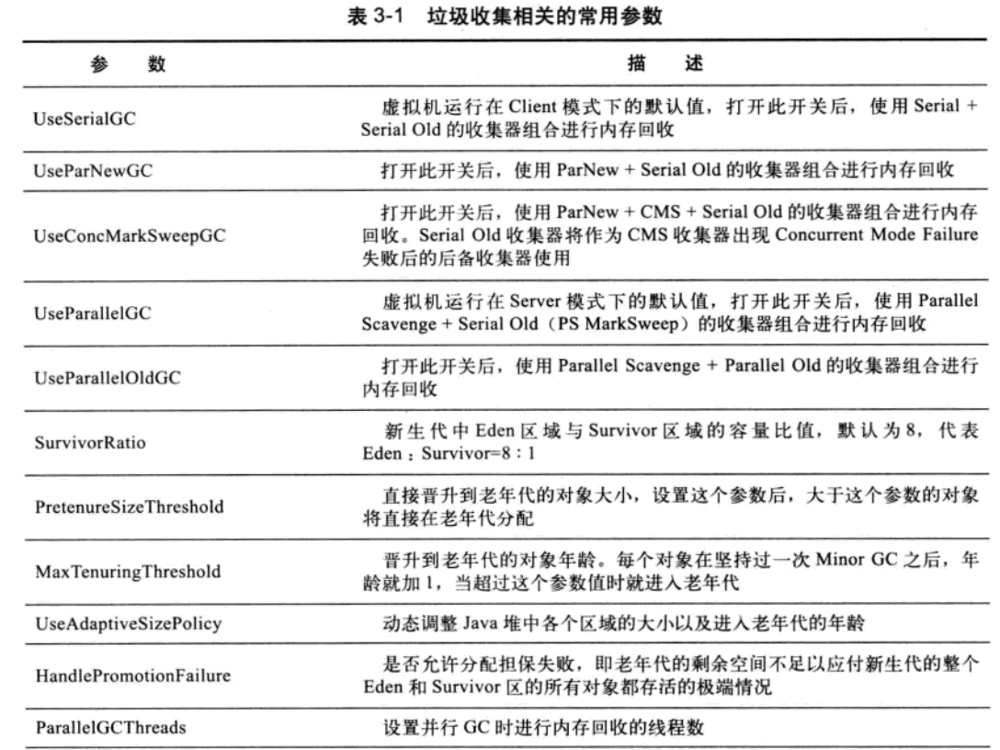

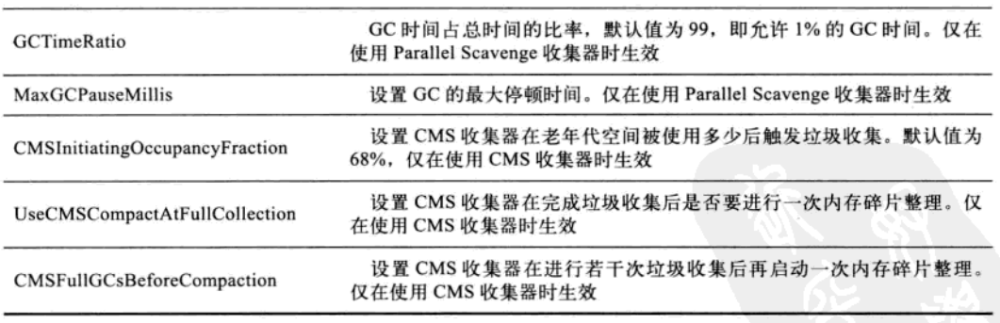

配置参数：HeapDumpBeforeFullGC可以在发生full gc之前就生成dump文件，再使用jvisualvm工具去查看结果如何。

#### 垃圾收集日志相关参数

| 描述                                     | JDK9以前                                                     | JDK9后              |
| ---------------------------------------- | ------------------------------------------------------------ | ------------------- |
| 查看GC基本信息                           | -XX:+PrintGC                                                 | -Xlog:gc            |
| 查看GC详细信息，将所有GC细分过程全部打印 | -XX:+PrintGCDetails                                          | -Xlog:gc*           |
| 查看GC前后的堆、方法区可用容量变化       | -XX:+PrintHeapAtGC                                           | -Xlog:gc+heap=debug |
| 查看GC过程中用户线程并发时间已经停顿时间 | -XX:+PrintGCApplicationConcurrentTime、-XX:+PrintGCApplicationStoppedTime | -Xlog:safepoint     |
|                                          |                                                              |                     |


### 9.内存分配和回收策略

#### （1）对象优先在Eden空间中分配

#### （2）大对象直接进入老年代

> 可以通过 -XX:PretenureSizeThreshold=3145726 参数来设置大对象的大小，单位是b

#### （3）长期存活的对象进入老年代

如果对象在Eden出生并经过第一次Minor GC后仍然存活，并且能被Survivor容纳的话，将被移动到Survivor空间中，并将对象年龄设为1。对象在Survivor区中每熬过一次Minor GC，年龄就增加1岁，当它的年龄增加到一定程度（默认为15岁）时，就会被晋升到老年代。可以通过-XX:MaxTenuringThreshold来设置。

> 新生代GC（Minor GC）：指发生在新生代的垃圾收集动作，因为Java对象大多都具备朝生夕死的特性，所以Minor GC非常频繁，一般回收速度也比较快。
>
> 老年代GC（Major GC / Full GC）：指发生在老年代的GC，出现Major GC，经常会伴随至少一次的Minor GC（但非绝对的，在ParallelScavenge收集器的收集策略里就有直接进行Major GC的策略选择过程）。MajorGC的速度一般会比Major GC慢十倍以上。

#### （4）动态年龄判断

如果在Survivor空间中相同年龄所有对象大小的总和大于Survivor空间的一半，年龄大于或等于该年龄的对象可以直接进入老年代，无须等到MaxTenuringThreshold中要求的年龄。

#### （5）空间分配担保

在发生Minor GC时，虚拟机会检测之前每次晋升到老年代的平均大小是否大于老年代的剩余空间大小，如果大于，则改为直接进行一次Full GC。如果小于，则查看HandlePromotionFailure设置是否允许担保失败；如果允许，那只会进行Minor GC；如果不允许，则也要改为进行一次Full GC。

# 二、虚拟机基本原理

## 一、Java虚拟机运行Java字节码


### 1.JVM内存结构

堆、栈、方法区、直接内存、堆和栈区别

### 2.Java内存模型

内存可见性、重排序、顺序一致性、volatile、锁、final

在多线程中稍微不注意就会出现线程安全问题，什么是线程安全问题？我的认识是，在多线程下代码执行的结果与预期正确的结果不一致，代码就是线程不安全的，否则则是线程安全的。在《深入理解Java虚拟机》中的定义原文是：当多个线程访问同一对象时，如果不用考虑这些线程在运行时环境下的调度与交替运行，也不需要进行额外的同步，或者在调用方法进行任何其他操作，调用这个对象的行为都可以获取正确的结果，那这个对象就是线程安全的。

**出现线程安全的问题一般是因为主内存和工作内存数据不一致和重排序导致的**，而解决线程安全的问题最重要的就是理解这两种问题是怎么来的，那么理解他们的核心就在于理解Java内存模型（JMM）。

在多线程条件下，多个线程肯定会相互协作完成一件事情，一般来说就会涉及到**多个线程相互通信告知笔记当前的执行结果**等，另外，为了性能优化，还会设计到编译器指令重排序和处理器指令重排序。

并发编程中主要需要解决两个问题：1、线程之间如何通信；2、线程之间如何完成同步（这里的线程指的是并发执行的活动实体）。通信是指线程之间以何种机制来交换信息，主要有两种：共享内存和消息传递。Java内存模型是共享内存的并发模型，线程之间通过读-写共享变量来完成隐式通信。

1）哪些是共享变量：在Java程序中所有实例域，静态域和数组元素都是放在堆内存中（所有线程均可访问到，是可以共享的），而局部变量，方法定义参数和异常处理器参数不会在线程间共享。共享数据会出现线程安全的问题，而非共享数据不会出现线程安全的问题。

2）JMM抽象结构模型：我们知道CPU的处理速度和主存的读写速度不是一个量级的，为了平衡这种巨大的差异，每个CPU都会有缓存。因此，共享变量会先放在主存中，每个线程都有自己的工作内存，并且会把位于主存中的共享变量拷贝到自己的工作内存，之后的读写操作均使用位于工作内存的变量副本，并在某个时刻将工作内存的变量副本写回到主存中去。JMM就从抽象层次定义了这种方式，并且JMM决定了一个线程对共享变量的写入何时对其他线程是可见的。


如图为JMM抽象示意图，线程A和线程B之间要完成通信的话，要经历如下两步：

- 线程A从主内存中将共享变量读入线程A的工作内存后并进行操作，之后将数据重新写回到主内存中
- 线程B从主内存中读取最新的共享变量

从横向上看，线程A和线程B就好像通过共享变量在进行隐式通信。这其中很有意思的问题，如果线程A更新后数据并没有及时写回到主存，而此时线程B读到的是过期的数据，这就出现了“脏读”现象。可以通过同步机制（控制不同线程间操作发生的相对顺序）来解决或者通过volatile关键字使得每次volatile变量都能够强制刷新到主存，而对每个线程都是可见的。

#### （1）重排序

在不改变程序执行结果的前提下，尽可能提高并行度。JMM对底层尽量减少约束，使其能够发挥自身优势。因此，在执行程序时，为了提高性能，编译器和处理器常常会对指令进行重排序。一般重排序可以分为如下三种：


- 编译器优化的重排序。编译器在不改变单线程程序语义的前提下，可以重新安排语句的执行顺序；
- 指令级并行的重排序。现代处理器采用指令级并行技术来将多条指令重叠执行。如果不存在数据依赖性，处理器可以改变语句对应机器指令的执行顺序。
- 内存系统的重排序。由于处理器使用缓存和读/写缓冲区，这使得加载和存储操作看上去可能是在乱序中执行的。

如图，1属于编译器重排序，而2和3统称为处理器重排序。这些重排序会导致线程安全的问题，一个很经典的例子就是DCL问题，这个在以后的文章中会具体去聊。**针对编译器重排序，JMM的编译器重排序规则会禁止一些特定类型的编译器重排序；针对处理器重排序，编译器在生成指令序列的时候会通过插入内存屏障指令来禁止某些特殊的处理器重排序。**

```Java
double pi = 3.14 //A
double r = 1.0 //B
double area = pi * r * r //C
```

这是一个计算圆面积的代码，由于A、B之间没有任何关系，对最终结果也不会存在关系，他们之间的执行顺序可以重排序。因此可以执行顺序是A->B->C或者A->B->C执行最终结果都是3.14，即A和B之间没有数据依赖性。具体的定义为：如果两个操作访问同一变量，且这两个操作有一个写操作，此时两个操作就存在数据依赖性，这里存在三种情况：读后写；写后写；写后读，这三者都是存在数据依赖性的，如果重排序则会对最终执行结果产生影响。编译器和处理器在重排序时，会遵守数据依赖性，编译器和处理器不会改变存在数据依赖关系的两个操作的执行顺序。

另外还有一个比较有意思的是as-if-serial语义。它的意思是：不管怎么重排（编译器和处理器为了提供并行度），（单线程）程序的执行结果不能改变。编译器，runtime和处理器都必须遵守as-if-serial语义。as-if-serial语义把单线程程序保护了起来，**遵守as-if-serial语义的编译器，runtime和处理器共同为编写单线程程序的程序员创建了一个幻觉：单线程程序是按程序的顺序来执行的**。比如上面计算圆面积的代码，在单线程中，会让人感觉代码是一行一行顺序执行上，实际上A,B两行不存在数据依赖性可能会进行重排序，即A，B不是顺序执行的。as-if-serial语义使程序员不必担心单线程中重排序的问题干扰他们，也无需担心内存可见性问题。

#### （2）happens-before规则

上面的内容讲述了排序规则，一会是编译器重排序一会是处理器重排序，如果让程序员再去了解这些底层的实现以及具体规则，那么程序员的负担就太重了，严重影响了并发编程的效率。因此，JMM为程序员在上层提供了六条规则，这样我们就可以根据规则去推论跨线程的内存可见性问题，而不是再去理解底层重排序的规则。

1）happens-before定义

**JSR-133使用happens-before的概念来指定两个操作之间的执行顺序。由于这两个操作可以在一个线程内，也可以是在不同线程之间。**因此JMM可以通过happens-before关系向程序员提供跨线程的内存可见性保证（如果A线程的写操作a与B线程的读操作b之间存在happens-before关系，尽管a操作和b操作在不同的线程中执行，但JMM向程序员保证a操作将对b操作可见）。具体定义为：

- 如果一个操作happens-before另一个操作，那么第一个操作的执行结果将对第二个操作可见。而第一个操作的执行顺序排在第二个操作之前。
- 两个操作之间存在happens-before关系，并不意味着Java平台的具体实现必须要按照happens-before关系指定的顺序来执行。如果重排序之后的执行结果，与按happens-before关系来执行的结果一直，那么这种重排序并不非法（也就是说，JMM允许这种重排序）。

上面的第一个是JMM对程序员的承诺。从程序员的角度来说，可以这样理解happens-before关系：如果A happens-before B，那么Java内存模型将向程序员保证——A操作的结果将对B可见，且A的执行顺序排在B之前，注意，这只是JMM向程序员做出的保证。

第二个是JMM对编译器和处理器重排序的约束规则。如前面所言，JMM其实是在遵循一个基本原则：只要不改变程序的执行结果（指的是单线程程序和正确同步的对县城程序），编译器和处理器怎么优化都行。JMM这么做的原因是：程序员对于两个操作是否真的被重排序并不关心，程序员关心的是程序执行时的语义不能被改变（即执行结果不能改变）。因此，happens-before关系本质上和as-if-serial语义是一回事。

对于happens-before和as-if-serial：

- as-if-serial语义保证单线程内程序的执行结果不被改变，happens-before关系保证正确同步的多线程程序的执行结果不被改变。
- as-if-serial语义给编写单线程程序的程序员创造了一个幻境：单线程程序是按程序的顺序来执行的。happens-before关系给编写正确同步的多线程程序的程序员创造了一个幻境：正确同步的多线程程序是按happens-before指定的顺序来执行的。
- as-if-serial语义和happens-before这么做的目的，都是为了在不改变程序执行结果的前提下，尽可能地提高程序的并行度。

2）具体规则：

具有的一共有六项规则：

- 程序顺序规则：一个线程中的每个操作，happens-before于该线程总的任意后续操作。
- 监视器锁规则：对于一个锁的解锁，happens-before于随后对这个锁的加锁。
- volatile变量规则：对一个volatile域的写，happens-before于任意后续对这个volatile域的读。
- 传递性：如果A happens-before B, B happens-before C, 那么 A happens-before C。
- start()规则：如果线程A执行了操作ThreadB.start()（启动线程B），那么A线程的ThreadB.start()操作happens-before于线程B中的任意操作。
- join()规则：如果线程A执行操作ThreadB.join()并成功返回，那么线程B中的任意操作happens-before于线程A从ThreadB.join()操作成功返回。
- 程序终端规则：对于线程interrupted()方法的调用先行于被中断线程的代码检测到中断时间的发生。
- 对象finalize规则：一个对象的初始化完成（构造函数执行结束）先行于发生它的finalize()方法的开始。

**final:**

final可以修饰变量、方法和类，用于表示所修饰的内容一旦赋值之后就不会再被改变，比如String类就是一个final类型的类。final修饰变量的时候只能在构造函数中赋值或者在定义这个变量的时候赋值（final int j=10;）

final修饰方法时，父类的final方法是不能被子类重写的；final方法可以被重载（可以没有final修饰符）。当一个类被final修饰时，该类是不能被子类继承的。

与锁和volatile相比，对final域的读写更像是普通的变量访问。对于final域，编译器和处理器要遵守两个重排序规则。

- 在构造函数内对一个final域的写入，与随后把这个被构造对象的引用赋值给一个引用变量，这两个操作之间不能重排序。
- 初次读一个包含final域的对象的引用，与随后初次读这个final域，这两个操作之间不能重排序。


这里假设一个线程A执行writer()方法，随后另一个线程B执行reader()方法。下面我们通过这两个线程的交互来说明这两个规则。

**1）写final域的重排序规则：**写final域的重排序规则禁止把final域的写重排序到构造函数之外。这个规则的实现包含下面两个方面。

- JMM禁止编译器把final域的写重排序到构造函数之外。
- 编译器会在final域的写之后，构造函数return之前，插入一个StoreStore屏障。这个屏障禁止处理器把final域的写重排序到构造函数之外。

现在我们分析writer()方法。writer()方法只包含一行代码：finalExample=new FinalExample()。这个代码包含两个步骤，如下：

- 构造一个FinalExample类型的对象。
- 把这个对象的引用赋值给引用变量obj。

假设线程B读对象引用于读对象的成员域之间没有重排序，下图是一种可能的执行时序。

在图中，写普通域的操作被编译器重排序到了构造函数之外，读线程B错误地读取了普通变量i初始化之前的值。而写final域的操作，被写final域的重排序规则“限定”在了构造函数之内，线程B正确读取了final变量初始化之后的值。


写域的重排序规则可以确保：在对象引用为任意线程可见之前，对象的final域已经被正确初始化过了，而普通域则不具有这个保障。在上图中，在读取线程B“看到”对象引用obj时，很可能obj对象还没有构造完成（对普通域i的写操作被重排序到构造函数外，此时初始值1还没有写入普通域i）。

**2）读final域的重排序规则**：在一个线程中，初次读对象引用于初次读该对象包含的final域，JMM禁止处理器重排序这两个操作（注意，这个规则仅仅针对处理器）。编译器会在读final域操作的前面插入一个LoadLoad屏障。初次读对象引用于初次读该对象包含的final域，这两个操作之间存在间接依赖关系。由于编译器遵守间接依赖关系，因此编译器不会重排序这两个操作。大多数处理器会遵守间接依赖，也不会重排序这两个操作。但少数处理器允许对间接依赖关系的操作做重排序（比如alpha处理器），这个规则就是专门用来针对这种处理器的。 

reader()方法包含3个操作：

- 初次读引用变量obj
- 初次读引用变量obj指向对象的普通域j。
- 初次读引用变量obj指向对象的final域i。

现在假设写线程A没有发生任何重排序，同时程序再不遵守间接依赖的处理器上执行，下图是一种可能的执行时序。


在上图中，读对象的普通域的操作被处理器重排序到读对象引用之前。读普通域时，该域还没有被写线程A写入。这是一个错误的读取操作。而读final域的重排序规则会把读对象final域的操作“限定”在读对象引用之后，此时该final域已经被A线程初始化过了，这是一个正确的读取操作。

读final域的重排序可以确保：在读一个对象的final域之前，一定会先读包含这个final域的对象的引用。在这个示例程序中，如果该引用不为null，那么引用对象的final域一定已经被A线程初始化过了。

**3）final域为引用类型**：上面看到的final域是基础数据类型，如果final域是引用类型，将会是什么效果呢？


对于引用类型，写final域的重排序规则对编译器和处理器增加了如下约束：在构造函数内对一个final引用的对象的成员域的写入，与随后在构造函数外把这个构造对象的引用赋值给一个引用变量，这两个操作之间不能重排序。假设首先A线程执行writeOne()方法，执行完成后线程B执行writeTwo()方法，执行完毕后线程C执行reader()方法，下图是可能的线程执行时序。


在图中，1是对final域的写入，2是对这个final域的对象的成员域的写入，3是把被构造的对象的引用赋值给某个引用变量。这里除了1和3不能重排序外，2和3也不能重排序。

JMM可以确保读线程C至少能看到写线程A在构造函数中对final引用对象的成员域的写入。即C至少能看到数组下标0的值为1。而写线程B对数组元素的写入，读线程C可能看得到，也可能看不到。JMM不保证线程B的写入对读线程C可见，因为写线程B和读线程C之间存在数据竞争关系，此时的执行结果不可预知。如果想要确保读线程C看到写线程B对数组元素的写入，写线程B和读线程C之间需要使用同步原语（lock或volatile）来确保内存可见性。

### 3.垃圾回收

内存分配策略、垃圾收集器（G1）、GC算法、GC参数、对象存活的判定 

### 4.JVM参数及调优

| 参数配置                        | 含义                                      |
| ------------------------------- | ----------------------------------------- |
| -XX:+HeapDumpOnOutOfMemoryError | 让JVM在发生OutOfMemoryError时Dump堆栈信息 |
|                                 |                                           |
|                                 |                                           |


### 5.Java对象模型

oop-klass、对象头


### 6.HotSpot

即时编译器、编译优化

### 7.类加载机制

classLoader、类加载过程、双亲委派（破坏双亲委派）、模块化（jboss modules、osgi、jigsaw）

#### （1）Class类文件结构

Java编译器可以把Java代码编译为存储字节码的Class文件。Java语言中的各种变量、关键字和运算符号的语义最终都是由多条字节码命令组合而成的，因此字节码命令所能提供的语义描述能力肯定会比Java语言本身更强大。

Class文件是一组以8位字节为基础单位的二进制流，各个数据项目严格按照顺序紧凑地排列再Class文件中，中间没有添加任何分隔符，使得整个Class。无符号数属于基本的数据类型，以u1、u2、u4、u8来分别代表1个字节、2个字节、4个字节和8个字节的无符号数，无符号数可以用来描述数字、索引引用、数量值、或者按照utf8编码构成字符串值。


##### ①魔数与Class文件的版本

每个Class文件的头4个字节称为魔数（Magic Number），它的唯一作用是用于确定这个文件是否为一个虚拟机接受的Class文件。很多文件存储标准中都使用魔数来进行身份识别，譬如图片格式，如gif或jpeg等在文件头中都存在有魔数。Class文件的魔数值为0xCAFEBASE 。

- Java语言中Class文件的头4个字节的魔数值为0xCAFEBASE

- 紧接着魔数的4个字节存储的是Class文件的版本号：第5和第6个字节是次版本号（Minor Version），第7第8个字节是主版本号（Major Version）。Java的版本号是从45开始的，JDK1.1之后的每个JDK大版本发布主版本号向上加1。高版本的JDK能向下兼容以前版本的Class文件，但不能运行以后版本的Class文件。

  

##### ②常量池

由于常量池中常量的数量是不固定的，所以在常量池的入口需要放置一项u2类型的数据，代表常量池容量计数值（constant_pool_count），从1开始而不是从0开始。上图中常量池容量为十六进制0x0016，即十进制的22，这就代表常量池中有21项常量，索引值为1~21。第0项常量空出来是有特殊考虑的，在特定情况下需要表达“不引用任何一个常量池项目”的意思。常量池之中主要存放两大类常量：字面量（Literal）和符号引用（Symbolic References）。

字面量比较接近于Java语言层面的常量概念，如文本字符串、被声明为final的常量值等。而符号引用则属于编译原理方面的概念，包括了下面三类常量：

- 类和接口的全限定名（Fully Qualified Name）
- 字段的名称和描述符（Descriptor）
- 方法的名称和描述符


这11种常量类型各自均有自己的结构。

##### ③访问标志

在常量池结束后，紧接着的是2个字节代表访问标志（access_flags），用于识别一些类或接口层次的访问信息：包括：这个Class是类还是接口；是否定义为public类型；是否定义为abstract类型；如果是类的话，是否被声明为final，等等。


##### ④类索引、父类索引与接口索引集合

##### ⑤字段表集合

##### ⑥方法表集合

##### ⑦属性表集合


#### （2）虚拟机类加载机制

虚拟机把描述类的数据从Class文件加载到内存，并对数据进行校验、转换解析和初始化，最终形成可以被虚拟机直接使用的Java类型，这就是虚拟机的类加载机制。

在Java语言中，类型的加载和连接过程都是程序运行期间完成的，这样会在类加载时稍微增加一些性能开销，但是却能为Java应用程序提供高度的灵活性，Java中天生可以动态扩展的语言特性就是依赖运行期动态加载和动态连接这个特点实现的。

##### ①类加载的时机

类从被加载到虚拟机内存中开始，到卸载出内存为止，它的整个生命周期包括了：加载（Loading）、验证（Verification）、准备（Preparation）、解析（Resolution）、初始化（Initialization）、使用（Using）和卸载（Unloading）七个阶段。其中验证、准备和解析三个部分统称为连接（Linking）。


虚拟机规范中并没有进行强制约束第一阶段“加载”什么时候进行。但是对于初始化阶段，虚拟机规范中则是严格规定有且只有四种情况必须立即对类进行“初始化”（而加载、验证、准备自然需要在此之前开始）：

- 遇到new、getstatic、putstatic或invokestatic这4条字节码指令时，如果类没有进行初始化过，则需要先触发其初始化。生成这4条指令的最常见的Java代码场景是：使用new关键字实例化对象的时候、读取或设置一个类的静态字段（被final修饰、已在编译期把结果放入常量池的静态字段除外）的时候，以及调用一个类的静态方法的时候，以及调用一个类的静态方法的时候。
- 使用java.lang.reflect包的方法对类进行发射调用的时候，如果类没有进行过初始化，则需要先出发其初始化。
- 当初始化一个类的时候，如果发现其父类还没有进行过初始化，则需要先触发其父类的初始化。
- 当虚拟机启动时，用户需要指定一个要执行的主类（包括main()方法的那个类），虚拟机会先初始化这个主类。

这四个场景中的行为称为对一个类进行主动引用。除此之外所有引用类的方式，都不会触发初始化，称为被动引用。

```Java
public class 类的初始化 {
	public static void main(String[] args) {
		System.out.println(SubClass.val);
	}
}
class SuperClass{
	static{
		System.out.println("Super init!");
	}
	public static int val = 10;
}

class SubClass extends SuperClass{
	static{
		System.out.println("Sub init!");
	}
}

输出的结果为：
Super init!
10
```

上述代码不会输出“Sub init!”。**对于静态字段，只有直接定义这个字段的类才会被初始化**，因此通过其子类引用父类中定义的静态字段，只会触发父类的初始化而不会触发子类的初始化。至于是否要触发子类的加载和验证，虚拟机规范中没有明确规定，这点取决于虚拟机的具体实现。对于Sun HotSpot虚拟机来说，可通过-XX:+TraceClassLoading参数看到此操作会导致子类的加载。

```Java
public class ClassInitialTest {
	public static void main(String[] args) {
		SuperClass s[] = new SuperClass[10]; 
	}
}
```

上述代码没有输出“Super init!”，说明没有触发这个类的初始化阶段，对于用于代码来说，这并不是一个合法的类名称，它是一个由虚拟机自动生成的、直接继承于java.lang.Object的子类，创建动作由字节码指令newarray触发。

```Java
public class ClassInitialTest {
	public static void main(String[] args) {
		System.out.println(ConstClass.HELLOWROLD);
	}
}
class ConstClass{
	public static final String HELLOWROLD = "Hello World";
	static{
		System.out.println("ConstClass init!");
	}
}
输出为：
Hello World
```

上述代码运行之后，也没有输出“ConstClass init!”，因为它引用了ConstClass类中的常量HELLOWROLD，但是在编译阶段将此常量的值“Hello World”存储到了NotInitialization类的常量池中，对常量ConstClass.HELLOWROLD的引用实际都转化为NotInitialization类对自身常量池的引用了。也就是说实际上NotInitialization的Class文件中并没有ConstClass类的符号引用入口，这两个类在编译成Class之后就不存在任何联系了。

接口的加载过程与类加载过程稍有些不同，接口也有初始化过程，接口“有且仅有”需要开始初始化场景中的第三种：当一个类在初始化时，要求其父类全部都已经被初始化过了，但是一个接口在初始化时，并不要求其父接口全部都完成了初始化，只有在真正使用父接口的时候（如引用接口中定义的常量）才会初始化。

下面，详细讲解一下类加载的全过程：加载、验证、准备、解析和初始化五个阶段的过程。

##### ②加载

“加载”（Loading）阶段是“类加载”（Class Loading）过程的一个阶段，虚拟机需要完成以下三件事情：

- 通过类的全限定名来获取定义此类的二进制字节流
- 将这个字节流所代表的静态存储结构转化为方法区的运行时的数据结构
- 在Java堆中生成一个代表这个类的java.lang.Class对象，作为方法区这些数据的访问入口

相对于类加载过程的其他阶段，加载阶段（准确地说，是加载阶段获取类的二进制字节流的动作）是开发期可控性最强的阶段，因为加载阶段既可以使用系统提供的类加载器来完成，也可以由用户自定义的类加载器去完成。

加载阶段与连接阶段的部分内容（如一部分字节码文件格式验证动作）是交叉进行的，加载阶段尚未完成，连接阶段可能已经开始，但这些夹在夹在阶段之中进行的动作，仍然属于连接阶段的内容，这两个阶段的开始时间仍然保持着固定的先后顺序。

##### ③验证

验证是连接阶段的第一步，这一阶段的目的是为了确保Class文件的字节流中包含的信息符合当前虚拟机的要求，并且不会危害虚拟机自身的安全。大致上都会完成下面四个阶段的检验过程：文件格式验证、元数据验证、字节码验证和符号引用验证。

- 文件格式验证：验证字节流是否符合Class文件格式的规范，并且能被当前版本的虚拟机处理。
- 元数据验证：对字节码描述的信息进行语义分析，以保证去描述的信息符合Java语言的规范
- 字节码验证：进行数据流和控制流分析，保证被校验类的方法在运行时不会做出危害虚拟机安全的行为
- 符号引用验证：虚拟机将符号转化为直接引用的时候，这个转化动作将在连接的第三阶段——解析阶段中发生。符号验证可以看做是对类自身以外（常量池中的各种符号引用）的信息进行匹配性的校验。

##### ④准备

准备阶段正式为类变量分配内存并设置类变量初始值的阶段，这些内存都将在方法区中进行分配。这个时候进行内存中分配的仅包括类变量（被static修饰的变量），而不包括实例变量，实例变量将会在对象实例化时随着对象一起分配到Java堆中。其次这里所说的初始值“通常情况”下是数据类型的零值，假设一个类变量的定义为：

```Java 
public static int value  =  123;
```

那么变量value在准备阶段过后的初始值为0而不是123，因为这时候尚未开始执行任何Java方法，而把value赋值为123的putstatic指令是程序被编译后，存放于类构造器\<clinit\>()方法之中，所以把value赋值为123的动作将在初始化阶段才会被执行。


上面提到，在“通常情况”下初始值是零值，那相对的会有一些“特殊情况”：如果类字段的字段属性表中存在ConstantValue属性，那么在准备阶段value就会被初始化为ConstantValue属性所指定的值，假设上面类变量value的定义为：

```Java
public static final int value = 123;
```

编译时javac会为value生成ConstantValue属性，在准备阶段虚拟机就会根据ConstantValue的设置将value赋值为123。

##### ⑤解析

解析阶段是虚拟机将常量池内的符号引用替换为直接引用的过程，符号引用在Class文件中以CONSTANT_Class_info、CONSTANT_Fieldref_info、CONSTANT_Methodref_info等类型的常量出现，那解析阶段中所说的直接引用和符号引用又有什么关联呢？

- 符号引用（Symbolic References）：符号引用以一组符号来描述所引用的目标，符号可以是任何形式的字面量，只要使用时能无歧义地定位到目标即可。符号引用于虚拟机实现的内存布局无关，引用的目标并不一定已经加载到内存中。
- 直接引用（Direct References）：直接引用可以使直接指向目标的指针、相对偏移量或是一个能间接定位到目标的句柄。直接引用是与虚拟机实现的内存布局相关的，同一个符号引用在不同虚拟机实例上翻译出来的直接引用一般不会相同，如果有了直接引用，那引用的目标必定已经在内存中存在。

虚拟机规范中并未规定解析阶段发生的具体时间，只要求了在执行anewarray、checkcast、getfield、getstatic、instanceof、invokeinterface、invokespecial、invokestatic、invokevirtual、multianewarray、new、putfield和putstatic这13个用于操作符号引用的字节码指令之前，先对他们所使用的符号引用进行解析。所以虚拟机实现会根据需要来判断，到底是在类被加载器加载时就对常量池中的符号引用进行解析，还是等到一个符号引用将要被使用前采取解析它。

类或接口的解析

字段解析

##### ⑥初始化

类初始化阶段是类加载过程的最后一步。前面的类加载过程中，除了在加载阶段用户应用程序可以通过自定义类加载器参与之外，其余动作完全由虚拟机主导和控制。到了初始化阶段，才真正开始执行类中定义的Java程序代码（或者说是字节码）。

在准备阶段，变量已经赋过一次系统要求的初始值，而在初始化阶段，则是根据程序员通过程序制定的主观计划去初始化类变量和其他资源，或者可以从另外一个角度来表达：初始化阶段是执行类构造器\<clinit\>()方法的过程。\<clinit\>()方法执行过程中可能会影响程序运行行为的一些特点和细节：

- \<clinit\>()方法是由编译器自动收集类中的所有类变量的赋值动作和静态语句块（static{}块）中的语句合并产生的，编译器收集的顺序是由语句在源文件中出现的顺序决定的，静态语句块只能访问到定义在静态语句块之前的变量，**定义在它之后的变量，在前面的静态语句块中可以赋值，但是不能访问。**

- \<clinit\>()方法与类构造函数（或者说实例构造器\<clinit\>()方法）不同，它不需要显示地调用父类的构造器，虚拟机会保证在子类的\<clinit\>()方法执行之前，父类的\<clinit\>()方法已经执行完毕。因此在虚拟机中第一个被执行的\<clinit\>()方法的类肯定是java.lang.Object()。

- 由于父类的\<clinit\>()方法先执行，也就意味着父类中定义的静态语句块要优先于子类的变量赋值操作。

  ```Java
  public class ClassInitialTest2 {
  	public static void main(String[] args) {
  		System.out.println(SubClass2.B);
  	}
  }
  class SuperClass2{
  	public static int A = 1;
  	static{
  		A = 2;
  	}
  }
  class SubClass2 extends SuperClass2{
  	public static int B = A;
  }
  输出结果为：
  2
  ```

- \<clinit\>()方法对于类或接口来说并不是必须的，如果一个类中没有静态语句块，也没有对变量的赋值操作，那么编译器可以不为这个类生成\<clinit\>()方法。

- 接口中不能使用静态语句块，但仍然有变量初始化的赋值操作，因此接口与类一样都会生成\<clinit\>()方法。但接口与类不同的是，执行接口的\<clinit\>()方法不需要先执行父接口的\<clinit\>()方法。只有当父接口中定义的变量被使用时，父接口才会被初始化。另外，接口的实现类在初始化时也一样不会执行接口的\<clinit\>()方法。

- 虚拟机会保证一个类的\<clinit\>()方法在多线程环境中被正确加锁和同步，如果多个线程同时去初始化一个类，那么只会有一个线程去执行这个类的\<clinit\>()方法，其他线程都需要阻塞等待，直到活动线程执行\<clinit\>()方法完毕。如果在一个类的\<clinit\>()方法中有耗时很长的操作，那就可能造成多个进程阻塞，在实际应用中这种阻塞往往使很隐蔽的。

  

#### （3）类加载器

“通过一个类的全限定名来获取描述此类的二进制字节流”这个动作放到Java虚拟机外部去实现，以便让应用程序自己决定如何去获取所需要的类。实现这个动作的代码模块被称为“类加载器”。类加载器在类层次划分、OSGi、热部署、代码加密等领域大放异彩。

##### ①类与类加载器

类加载器虽然只用于实现类的加载动作，但它在Java程序中起到的作用却远远不限于类加载阶段。对于任意一个类，都需要由加载它的类加载器和这个类本身一同确立其在Java虚拟机中的唯一性。即：比较两个类是否“相等”，只有在这个类是由同一个类加载器加载的前提之下才有意义，否则即使这两个类是源于同一个Class文件，只要加载它们的类加载器不同，那这两个类就必定不相等。

这里所指的“相等”，包括类的Class对象的equals()方法、isAssignableFrom()方法、isInstance()方法的返回结果，也包括了使用instanceof关键字做对象所属关系判定等情况。如果没有注意到类加载器的影响，在某些情况下可能会产生具有迷惑性的结果。

```Java
import java.io.IOException;
import java.io.InputStream;

public class ClassLoadTest {

	public static void main(String[] args) throws Exception {
		ClassLoader classLoader = new ClassLoader() {
			@Override
			public Class<?> loadClass(String name)
					throws ClassNotFoundException {
				String fileName = name.substring(name.lastIndexOf(".")+1)+".class";
				InputStream inputStream = getClass().getResourceAsStream(fileName);
				if(inputStream == null)
					return super.loadClass(name);
				try {
					byte[] b = new byte[inputStream.available()];
					inputStream.read(b);
					return defineClass(name,b,0,b.length);
				} catch (IOException e) {
					throw new ClassNotFoundException();
				} 
			}
		};
		Object obj = classLoader.loadClass("classLoad.ClassLoadTest").newInstance();
		System.out.println(obj.getClass());
		System.out.println(obj instanceof classLoad.ClassLoadTest);
	}
}

输出结果为：
class classLoad.ClassLoadTest
false
```

自定义的类加载器classLoader，加载与自己在同一路径下的Class文件。然后通过newInstance()方法获取它的实例，但是在做instanceof类型检查的时候返回的却是false，这是因为虚拟机中存在了两个ClassLoader类，一个是由系统应用程序类加载器加载的，另外一个是由我们自定义的类加载器加载的，虽然都来自同一个Class文件，但依然是两个独立的类，做对象所属类型检查时结果自然为false。

##### ②双亲委派模型

站在虚拟机的角度讲，只存在两种不同的类加载器：一种是启动类加载器（Bootstrap ClassLoader），这个类加载器使用C++语言实现，是虚拟机自身的一部分；另外一种就是所有其他的类加载器，这些类加载器都由Java语言实现，独立于虚拟机外部，并且全部继承自抽象类java.lang.ClassLoader。

从开发人员角度看，大致分为以下三种系统提供的类加载器：

- 启动类加载器（Bootstrap ClassLoader）：这个类加载器负责将存放在<JAVA_HOME>\lib目录中的，或者被-Xbootclasspath参数所指定的路径中的，并且是虚拟机识别的（仅按照文件名识别，如rt.jar，名字不符合的类库即使放在lib目录中也不会被加载）类库加载到虚拟机内存中。启动类加载器无法被Java程序直接引用。
- 扩展类加载器（Extension ClassLoader）：这个加载器由sun.misc.Launcher$ExtClassLoader实现，它负责加载<JAVA_HOME>\lib\ext目录中的，或者被java.ext.dirs系统变量所指定的路径中的所有类库，开发者可以直接使用扩展类加载器。
- 应用程序类加载器（Application ClassLoader）：这个类加载器由sun.misc.Launcher$AppClassLoader来实现。由于这个类加载器是ClassLoader中的getSystemClassLoader()方法的返回值，所以一般也称它为系统类加载器。它负责加载用户类路径（ClassPath）上所指定的类库，开发者可以直接使用这个类加载器，如果应用程序中没有自定义过自己的类加载器，一般情况下这个就是程序中默认的类加载器。

我们的应用程序都是由这三种类加载器相互配合进行加载的，如果有必要，还可以加入自己定义的类加载器。这些类加载器支架的关系一般会如下图所示：


上图展示的这种层次关系，就被称为类加载器的双亲委派模型（Parents Delegation Model）。双亲委派模型要求除了顶层的启动类加载器外，其余的类加载器都应当有自己的父类加载器。这里类加载器之间的父子关系一般不会以继承（Inheritance）的关系来实现，而都是使用组合（Composition）关系来复用父加载器的代码。

> 为什么要用组合来实现双亲委派模型呢？暂时还没搞清楚

双亲委派模型的工作过程是：如果一个类加载器收到了类加载的请求，它首先不会自己去尝试加载这个类，而是把这个请求委派给父类加载器去完成，每一个层次的类加载器都是如此，因此所有的加载请求最终都应该传送到顶层的启动类加载器中，只有当父加载器反馈自己无法完成这个请求（它的搜索范围内没有找到所指的类）时，子加载器才会尝试自己去加载。

使用双亲委派模型来组织类加载器之间的关系，有一个显而易见的好处就是Java类随着它的类加载器依据具备了一种带有优先级的层次关系。例如类java.lang.Object，它存放在rt.jar之中，无论哪一个类加载器加载这个类，最终都是委派给启动类加载器进行加载，因此Object类在程序的各种类加载器环境中都是同一个类。

```java
// classLoader为自定义的类加载器。
Object obj = classLoader.loadClass("java.lang.Object").newInstance();
System.out.println(obj.getClass());
System.out.println(obj instanceof java.lang.Object);
输出结果为：
class java.lang.Object
true
```

相反，如果没有使用双亲委派模型，由各个类加载器自行去加载的话，如果用户自己写了一个名为java.lang.Object的类，并放在程序的ClassPath中，那系统中将会出现多个不同的Object类，Java类型体系中最基础的行为也就无从保证，应用程序也将会变得一片混乱。尝试写一个与rt.jar类库中已有类重名的Java类，将会发现可以正常编译，但永远无法被加载运行。

> 即使自定义了自己的类加载器，强行用defineClass()方法去加载一个以"java.lang"开头的类也不会成功。将会收到虚拟机自己抛出的“java.lang.java.lang.SecurityException: Prohibited package name: java.lang”异常。

双亲委派模型对于保证Java程序的稳定孕足很重要，但它的实现却非常简单，实现双亲委派的代码都集中在java.lang.ClassLoader的loadClass()方法中。其逻辑为：先检查是否已经被加载过，若没有加载则调用父加载器的loadClass()方法，若父加载器为空则默认使用启动类加载器作为父加载器。如果父加载器加载失败，则在抛出ClassNotFoundException异常后，再调用自己的findClass()方法进行加载。

```Java
protected Class<?> loadClass(String name, boolean resolve)
    throws ClassNotFoundException
{
    synchronized (getClassLoadingLock(name)) {
        // 首先检查类是否被加载过
        Class<?> c = findLoadedClass(name);
        if (c == null) {
            long t0 = System.nanoTime();
            try {
                if (parent != null) {
                    c = parent.loadClass(name, false);
                } else {
                    c = findBootstrapClassOrNull(name);
                }
            } catch (ClassNotFoundException e) {
                // ClassNotFoundException thrown if class not found
                // from the non-null parent class loader
                // 父类无法完成加载请求
            }

            if (c == null) {
                // If still not found, then invoke findClass in order
                // to find the class.
                // 如果父类加载器无法完成加载的时候，再调用本身的findClass进行加载
                long t1 = System.nanoTime();
                c = findClass(name);

                // this is the defining class loader; record the stats
                sun.misc.PerfCounter.getParentDelegationTime().addTime(t1 - t0);
                sun.misc.PerfCounter.getFindClassTime().addElapsedTimeFrom(t1);
                sun.misc.PerfCounter.getFindClasses().increment();
            }
        }
        if (resolve) {
            resolveClass(c);
        }
        return c;
    }
}
```

##### ③破坏双亲委派模型

双亲委派模型并不是一个强制的约束模型，而是Java设计者们推荐给开发者的类加载器实现方式。在Java的世界里面大部分的类加载器都遵循这个模型，但也有例外的情况，到现在为止，双亲委派模型主要出现过三次较大规模的“被破坏”情况。

第一次发生在双亲委派模型出现之前——即JDK1.2发布之前，为了向前兼容，JDK1.2之后的java.lang.ClassLoader添加了一个新的protected方法findClass()，在此之前，用户去继承java.lang.ClassLoader的唯一目的就是为了重写loadClass()方法，因为虚拟机在进行类加载的时候会调用加载器的私有方法loadClassInternal()，而这个方法的唯一逻辑就是去调用自己的loadClass()。在JDK1.2之后已不提倡再去覆盖loadClass()方法，而应当把自己的类加载逻辑写到findClass()方法中，在loadClass()方法的逻辑里如果父类加载失败，则会调用自己的findClass()方法来完成加载，这样就可以保证新写出来的类加载器是符合双亲委派模型规则的。

第二次是由模型本身的缺陷所导致的，双亲委派很好的解决了各个类加载器的基础类的统一问题（越基础的类由越上层的加载器进行加载），基础类之所以被称为“基础”，是因为它们总是作为被用户代码调用的API，但是如果基础类又要调回用户的代码，那该怎么办呢？

JNDI-> Thread Context ClassLoader线程上下文类加载器（见：深入理解Java虚拟机的195页）。

第三次是由于用户对程序对泰兴的追求而导致的，这里所说的”动态性“指的是当前一些非常”热“门的名词：代码热替换（HotSwap）、模块热部署（Hot Deployment）等。

### 8.虚拟机性能监控与故障处理工具

jps, jstack, jmap、jstat, jconsole, jinfo, jhat, javap, btrace、Tprofiler

 JDK开发团队选择采用Java代码来实现这些监控工具是有特别用意的：当应用程序部署到生产环境后，无论是直接接触物理服务器还是远程Telnet到服务器上都可能会受到限制。借助tools.jar类库里面的接口，我们可以直接在应用程序中实现功能强大的监控分析功能。

> tools.jar中的类库不属于Java的标准API，如果引入这个类库，就意味着你的程序只能运行于Sun Hotspot（或一些从Sun买了JDK的源码Licence的虚拟机，如IBM J9、BEA JRockit）上面，或者部署程序时需要一起部署tools.jar。

| 名称   | 主要作用                                                     |
| ------ | ------------------------------------------------------------ |
| jps    | JVM Process Status Tool，显示指定系统内所有的HotSpot虚拟机进程 |
| jstat  | JVM Statistics Monitoring Tool，用于手机HotSpot虚拟机各方便的运行数据 |
| jinfo  | Configuration Info for Java，显示虚拟机配置信息              |
| jmap   | Memory Map for Java，生成虚拟机的内存存储快照（heapdump文件） |
| jhat   | JVM Heap Dump Browser，用于分析heapdump文件，它会建立一个HTTP/HTML服务器，让用户可以在浏览器上查看分析结果 |
| jstack | Stack Trace for Java，显示虚拟机的线程快照                   |

以下是JDK的命令行工具：

#### （1）jps：虚拟机进程状况工具

JDK的很多小工具的名字都参考了Unix命令的命名方式，jps（JVM Process Status Tool）是其中的典型。

可以列出正在运行的虚拟机进程，并显示虚拟机执行主类（Main Class，main()函数所在的类）的名称以及这些进程的本地虚拟机的唯一ID（LVMID，Local Virtual Machine Identifier）。

它虽然功能比较单一，但是它是使用频率最高的JDK命令行工具，因为其他的JDK工具大多须要输入它查询到的LVMID来确定要监控的是哪一个虚拟机进程。对于本地虚拟机进程来说，LVMID与操作系统的进程ID（PID，Process Identifier）是一致的。

使用Windows的任务管理器或Unix的ps命令可以查询到虚拟机进程的LVMID，但如果同时启动了多个虚拟机进程，无法根据进程名称定为时，那就只能依赖jps命令显示主类的功能才能区分了。

jps命令格式：

```shell
jps [options] [hostid]
```

jps可以通过RMI协议查询开启了RMI服务的远程虚拟机进程状态，hostid为RMI注册表中注册的主机名。jps的其他常用选项如下：

| 选项 | 作用                                               |
| ---- | -------------------------------------------------- |
| -q   | 只输出LVMID，省略主类的名称                        |
| -m   | 输出虚拟机进程启动时传递给主类main()函数的参数     |
| -l   | 输出主类的全名，如果进程执行的是jar包，输出jar路径 |
| -v   | 输出虚拟机进程启动时JVM参数                        |

#### （2）jstat：虚拟机统计信息监视工具

jstat（JVM Statistics Monitoring Tool）是用于监视虚拟机各种运行状态信息的命令行工具。它可以显示本地或远程虚拟机进程中类装载、内存、垃圾收集、JIT编译等运行数据，在没有GUI图形界面，只提供纯文本控制台环境的服务器上，它将是运行期定位虚拟机性能问题的首选工具。

jstat的命令格式为：

```shell
jstat [ option vmid [interval[s|ms] [count]]]
```

在命令格式中的VMID与LVMID需要特别说明一下：如果是本地虚拟机进程，VMID与LVMID是一致的，如果是远程虚拟机进程，那VMID的格式应当是：

```shell
[protocol:][//]lvmid [interval[s|ms] [count]]
```

参数interval和count代表查询间隔和次数，如果省略这两个参数，说明只查询一次，假设需要每250毫秒查询一次进程2764垃圾收集的状况，一共查询20次，那命令应当是：

```shell
jstat -gc 2764 250 20
```

选项option代表着用户希望查询的虚拟机信息，主要分为3类：类装载、垃圾收集和运行期编译状况，具体如下表：

| 选项              | 作用                                                         |
| ----------------- | ------------------------------------------------------------ |
| -class            | 监视类装载、卸载数量、总空间及类装载所耗费的时间             |
| -gc               | 监视Java堆状况，包括Eden区、2个survivor区、老年代、永久代等的容量、已用空间、GC时间合计等信息 |
| -gccapacity       | 监视内容与-gc基本相同，但输出主要关注Java堆各个区域使用到的最大和最小空间 |
| -gcutil           | 监视内容与-gc基本相同，但输出主要关注已使用空间占总空间的百分比 |
| -gccause          | 与-gcutil功能一样，但是会额外输出导致上一次GC产生的原因      |
| -gcnew            | 监视新生代GC的状况                                           |
| -gcnewcapacity    | 监视内容与-gcnew基本相同，输出主要关注使用到的最大和最小空间 |
| -gcold            | 监视老年代GC的状况                                           |
| -gcoldcapacity    | 监视内容与-gcold基本相同，输出主要关注使用到的最大和最小空间 |
| -compiler         | 输出JIT编译器编译过的方法、耗时等信息                        |
| -printcompilation | 输出已经被JIT编译的方法                                      |

jstat监视选项众多，无法逐一显示，下面看一个例子：


结果表明：这台服务器的新生代Eden区（E，表示Eden）使用了6.2%的空间，两个Survivor区（S0、S1，表示Survivor0、Survivor1）里面都是空的，老年代（O，表示Old）和永久代（P，表示Permanent）则分别使用了41.42%和47.20%的空间。程序运行以来共发生Minor GC（YGC，表示Young GC）16次，总耗时0.105秒，发生Full GC（FGC，表示Full GC）3次，Full GC总耗时（FGCT，表示Full GC Time）为0.472秒，所有GC总耗时（GCT，表示GC Time）为0.577秒。

> ps：我在本地使用的时候没有P，应该是变成了M了，表示元数据区使用的比例。
>
> HotSpot VM去掉“持久代”，以“元数据区”（Metaspace）替代之。！！！！！！

使用jstat工具在纯文本状态下监视虚拟机状态的变化，确实不如后面将会提到的VisualVM等可视化的监视工具直接以图表展现的那样直观。但依旧是一种常用的监控方式。

#### （3）jinfo：Java配置信息工具

jinfo（Configuration Info Of Java）的作用是实时地查看和调整虚拟机的各项参数。使用jps -v 可以查看虚拟机启动时显示指定的参数列表，如果想知道未被显示指定的参数的系统默认值，可以使用jinfo -flag选项查询。（如果只限于JDK1.6或以上的版本的话，使用java -XX:+PrintFlagsFinal查看参数默认值也是一个很好的选择），jinfo还可以使用-sysprops选项把虚拟机进程的System.getProperties()的内容打印出来。在JDK1.6之后，jinfo在windows和Linux平台都有提供，并且加入了运行期修改参数的能力。

jinfo命令格式为：

```shell
jinfo [option] pid
```

```shell
打开12768的GC详细信息（在进程中会输出GC的详细信息）
jinfo -flag +PrintGCDetails 12768
关闭12768输出GC详细信息
jinfo -flag -PrintGCDetails 12768
```

#### （4）jmap：Java内存映像工具

jmap（Memory Map for Java）命令用于生成堆转储快照（一般称为heapdump或dump文件）。如果不使用jmap命令，要想获取Java堆转储快照还有一些比较“暴力”的手段：譬如使用-XX:+HeapDumpOnOutOfMemoryError参数，可以让虚拟机在OOM异常出现之后自动生成dump文件，通过-XX:+HeapDumpOnCtrlBreak参数则可以使用[Ctrl]+[Break]键让虚拟机生成dump文件，又或者在Linux系统下通过Kill -3 命令发送进程退出信号“恐吓”一下虚拟机，也能拿到dump文件。

jmap的作用不仅仅是为了获取dump文件，它还可以查询finalize执行队列，Java堆和永久代的详细信息，如空间使用率、当前用的是哪种收集器等。

| 选项           | 作用                                                         |
| -------------- | ------------------------------------------------------------ |
| -dump          | 生成Java堆转储快照。格式为：-dump:[live,]format=b,file=\<filename>，其中live子参数说明是否只dump出存活的对象 |
| -finalizerinfo | 显示在F-Queue中等待Finalizer线程执行finalize方法的对象。     |
| -heap          | 显示Java堆详细信息，如使用哪种回收器、参数配置、分代状况等。 |
| -histo         | 显示堆中对象统计信息，包括类、实例数量和合计容量             |
| -clstats       | 输出类加载器的分析结果                                       |
| -F             | 当虚拟机进程对-dump选项没有响应时，可使用这个选项强制生成dump快照。 |

#### （5）jhat：虚拟机堆转储快照分析工具

jhat命令与jmap搭配使用，来分析jmap生成的存储快照。jhat内置了一个微型的HTTP/HTML服务器，生成dump文件的分析结果后，可以在浏览器中查看。使用方式为“jhat dump文件”。

分析结果默认以包为单位进行分组显示，分析内存泄漏问题主要会使用到其中的“Heap Histogram”（与jmap -histo功能一样）与OQL页签的功能一样，前者可以找到内存中容量最大的对象，后者是标准的对象查询语言，使用类似SQL的语法对内存中的对象进行查询统计。


#### （6）jstack：Java堆栈跟踪工具

jstack（Stack Trace for Java）命令用于生成虚拟机当前时刻的线程快照（一般称为threaddump或javacore文件）。线程快照就是当前虚拟机内每一条线程正在执行的方法堆栈的集合，生成线程快照的目的是定位线程出现长时间停顿的原因，如果线程间死锁、死循环、请求外部资源导致长时间等待等都是线程长时间停顿的常见原因。线程出现停顿的时候通过jstack来查看各个线程的调用堆栈，就可以知道没有响应的线程到底在后台做些什么事情，或者等待着什么资源。

jstack命令格式为：

```shell
jstack [option] vmid
```

| 选项 | 作用                                         |
| ---- | -------------------------------------------- |
| -F   | 当正常输出的请求不被响应时，强制输出线程堆栈 |
| -l   | 除堆栈外，显示关于锁的附加信息               |
| -m   | 如果调用本地方法的话，可以显示C/C++的堆栈    |


在JDK1.5中，java.lang.Thread类新增了一个getAllStackTraces()方法用于获取虚拟机中所有线程的StackTraceElement对象。使用这个方法就可以通过简单的几行代码就完成jstack的大部分功能，在实际项目中不妨调用这个方法做个管理员页面，可以随时使用浏览器来查看线程堆栈。

以下是JDK的可视化工具。

#### （7）jconsole：Java监视与管理控制台

通过JDK/bin目录下的jconsole启动JConsole后，将自动搜索出本机的所有虚拟机进程，不需要用户自己再使用jps来查询了。

内存监控：监视收集器管理的虚拟机内存（Java堆和永久代）的变化趋势。相当于可视化的jstat命令

线程：线程页签相当于可视化jstack命令，遇到线程停顿的时候可以使用这个页签进行监控分析。

#### （8）visualvm：多合一故障处理工具

VisualVM（All-in-One Java Troubleshooting Tool）是到目前为止，随JDK发布的功能最强大的运行监视和故障处理程序。它除了运行监视、故障处理外，还有性能分析（Profiling）等。它有一个很大的有点就是：不需要被监视的程序基于特殊Agent运行，因此它对应用程序的实际性能的影响很小，使得它可以直接应用在生产环境中，这个有点是JProfiler、YourKit等工具无法与之媲美的。

VisualVM可以做到：

- 显示虚拟机进程及进程的配置和环境信息（jps、jinfo）
- 监视应用程序的CPU、GC、堆、方法区及线程的信息（jstat、jstack）
- dump及分析堆转储快照（jmap、jhat）
- 方法级的程序运行性能分析，找出被调用最多、运行时间最长的方法。
- 离线程序快照：收集程序的运行时配置、线程dump、内存dump等信息建立一个快照，可以将快照发送开发者处进行Bug反馈。
- 其他plugins的无限可能性....


找到<JAVA_HOME>\bin下面的jvisualvm.exe运行即可。在首次启动VisualVM后，读者不必着急找应用程序进行检测，因为现在VisualVM还没有加载任何插件，虽然基本的监视、线程面板的功能主程序都以默认插件的形式提供了，但是不给VisualVM装任何扩展插件，就相当于放弃了它最精华的功能。

插件可以手动安装和在线安装。

> 插件地址<从书上摘的>：http://java.net/projects/visualvm/content/pluginscenters.html

### 

