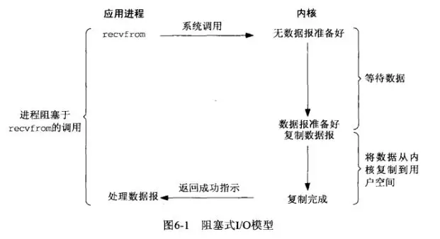
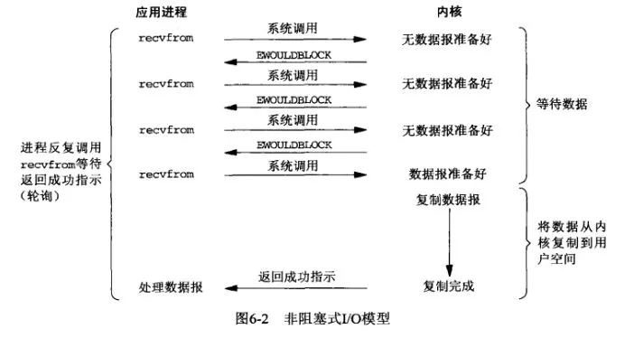
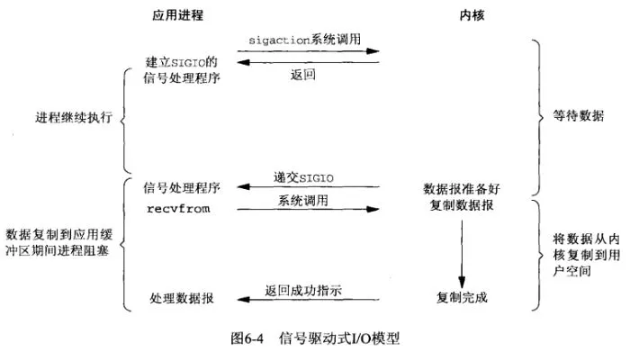

详细内容参见PDF书《Netty权威指南 第二版》

## 一、Linux的五种I/O模型

https://mp.weixin.qq.com/s?__biz=Mzg3MjA4MTExMw==&mid=2247484746&idx=1&sn=c0a7f9129d780786cabfcac0a8aa6bb7&source=41#wechat_redirect

https://blog.csdn.net/tianjing0805/article/details/75255802

http://www.yeolar.com/note/2012/12/18/l-async/#linux-aio

**Java中提供的IO有关的API，在文件处理的时候，其实依赖操作系统层面的IO操作实现的。**比如在Linux 2.6以后，Java中NIO和AIO都是通过epoll来实现的，而在Windows上，AIO是通过IOCP来实现的。

可以把Java中的BIO、NIO和AIO理解为是Java语言对操作系统的各种IO模型的封装。程序员在使用这些API的时候，不需要关心操作系统层面的知识，也不需要根据不同操作系统编写不同的代码。只需要使用Java的API就可以了。

拿一次磁盘文件读取为例，我们要读取的文件是存储在磁盘上的，我们的目的是把它读取到内存中。可以把这个步骤简化成把数据从硬件（硬盘）中读取到用户空间中。I/O密集型进程所执行的I/O操作比执行的处理操作更多。CPU密集型的进程所执行的处理操作比I/O操作更多。Linux 2.6的调度器实际上更加偏爱I/O密集型的进程，因为他们通常会发起一个I/O操作，然后进行阻塞，这意味着其他工作都可以在两者时间有效交错进行。

### 1、阻塞IO模型

阻塞 I/O 是最简单的 I/O 模型，一般表现为进程或线程等待某个条件，如果条件不满足，则一直等下去。条件满足，则进行下一步操作。



应用进程通过系统调用 `recvfrom` 接收数据，但由于内核还未准备好数据报，应用进程就会阻塞住，直到内核准备好数据报，`recvfrom` 完成数据报复制工作，应用进程才能结束阻塞状态。调用应用程序处于一种不再消费CPU而只是简单等待响应的状态。

当调用read系统掉用时，应用程序会阻塞并进行上下文切换，然后会出发读操作，当响应返回时（从我们正从读取的设备中返回），数据就被移动到用户空间的缓冲区中。然后应用程序就会解除阻塞（read调用返回）。

从应用程序的角度来说，read调用会延续很长时间。实际上，在内核执行读操作和其他工作时，应用程序的确会被阻塞。

### 2、非阻塞IO模型

应用进程与内核交互，目的未达到之前，不再一味的等着，而是直接返回。然后通过轮询的方式，不停的去问内核数据准备有没有准备好。如果某一次轮询发现数据已经准备好了，那就把数据拷贝到用户空间中。



应用进程通过 `recvfrom` 调用不停的去和内核交互，直到内核准备好数据。如果没有准备好，内核会返回`error`，应用进程在得到`error`后，过一段时间再发送`recvfrom`请求。在两次发送请求的时间段，进程可以先做别的事情。

非阻塞IO模型需要应用程序调用多次来等待操作完成。这可能效率不高，因为在很多情况下，当内核执行这个命令时，应用程序必须要进行忙碌等待，直到数据可用为止，或者试图执行其他工作。这个方法可以引入I/O操作的延时，因为数据在内核变为可用到用户调用read返回数据之间存在一定的间隔，这会导致整体数据吞吐量的降低。

### 3、信号驱动IO模型

应用进程在读取文件时通知内核，如果某个 socket 的某个事件发生时，请向我发一个信号。在收到信号后，信号对应的处理函数会进行后续处理。



应用进程预先向内核注册一个信号处理函数，然后用户进程返回，并且不阻塞，当内核数据准备就绪时会发送一个信号给进程，用户进程便在信号处理函数中开始把数据拷贝的用户空间中。

### 4、IO复用模型

IO复用模型，I/O multiplexing，这种方式也称为event driven I/O。Linux select/epoll的好处就在于单个process就可以同时处理多个网络连接的I/O。多个进程的IO可以注册到同一个管道上，这个管道会统一和内核进行交互。当管道中的某一个请求需要的数据准备好之后，进程再把对应的数据拷贝到用户空间中。它的基本原理就是select/epoll会不断轮询所负责的所有socket，当某个socket有数据到达了，就通知用户进程。


IO多路转接是多了一个`select`函数，多个进程的IO可以注册到同一个`select`上，当用户进程调用该`select`，`select`会监听所有注册好的IO，如果所有被监听的IO需要的数据都没有准备好时，`select`调用进程会阻塞。当任意一个IO所需的数据准备好之后，`select`调用就会返回，然后进程在通过`recvfrom`来进行数据拷贝。

**这里的IO复用模型，并没有向内核注册信号处理函数，所以，他并不是非阻塞的。**进程在发出`select`后，要等到`select`监听的所有IO操作中至少有一个需要的数据准备好，才会有返回，并且也需要再次发送请求去进行文件的拷贝。

应用程序会被像select()、poll()和epoll()等具有复用多个文件描述符的函数阻塞住，一直等到这个system call有结果返回了，再继续执行。

当用户进程调用了select：

- 整个进程会被block，与此同时kernel会“监视”所有select负责的socket，当任何一个socket中的数据准备好了，select就会返回。
- 用户进程再调用read操作，将数据从kernel拷贝到用户进程。这时和blocking  I/O的图其实并没有太大的不同，事实上，还更差一些，因为这里需要使用两个system call（select和recvfrom），而blocking I/O只调用了一个system call(recvfrom)。
- 在I/O multiplexing Model中，实际中，对于每一个socket，一般都设置成为non-blocking，但是，如上图所示，整个用户的process其实是一直被block的。只不过process是被select这个函数block，而不是被select I/O给block。

从IO操作的实际效果看，IO复用模型与阻塞IO模型是相同的，应用程序都是一直等到IO操作成功之后（数据已经被写入或读取），才开始后面的工作。不同点是，IO复用模型用一个select函数可以为多个描述符提供通知，提高了并发性。举个例子：假如有一万个并发的read请求，但是网络上仍然没有数据，此时这一万个read会同时各自阻塞，现在用select、poll、epoll这样的函数来专门负责阻塞同时监听这一万个请求的状态，一旦有数据到达了就负责通知，这样就将之前一万个的各自为战的等待与阻塞转为一个专门的函数来负责与管理。与此同时，IO复用模型和第二种非阻塞IO模型的区别在于：非阻塞IO模型是需要应用程序主动地循环去询问是否有操作数据可操作，而IO复用模型是通过像select和poll等这样的IO多路复用函数来同时检测多个事件句柄来告知应用程序是否可以有数据操作。

select调用的主要问题是它的效率不是非常高。

### 5、异步IO模型

**阻塞IO模型、非阻塞IO模型、IO复用模型和信号驱动IO模型都是同步的IO模型。原因是因为，无论以上那种模型，真正的数据拷贝过程，都是同步进行的。**

**信号驱动难道不是异步的么？** 信号驱动，内核是在数据准备好之后通知进程，然后进程再通过`recvfrom`操作进行数据拷贝。我们可以认为数据准备阶段是异步的，但是，数据拷贝操作是同步的。所以，整个IO过程也不能认为是异步的。

异步IO模型：应用进程把IO请求传给内核后，完全由内核去操作文件拷贝。内核完成相关操作后，会发信号告诉应用进程本次IO已经完成。在Linux环境下，aio.h头文件中定义的函数提供了对异步IO的支持。


用户进程发起`aio_read`操作之后，给内核传递描述符、缓冲区指针、缓冲区大小等，告诉内核当整个操作完成时，如何通知进程，然后就立刻去做其他事情了。当内核收到`aio_read`后，会立刻返回，然后内核开始等待数据准备，数据准备好以后，直接把数据拷贝到用户控件，然后再通知进程本次IO已经完成。

**五种IO模型对比**：


## 二、关于Linux零拷贝技术

https://www.jianshu.com/p/f3bea2f6c0b7

https://blog.csdn.net/CringKong/article/details/80274148

零拷贝机制原理分析之前，我们先来看下传统IO在数据拷贝的基本原理，从数据拷贝(I/O拷贝)的次数以及上下文切换的次数进行对比分析。

### 1、传统IO


1、JVM进程内发起read()系统调用，操作系统由用户态空间切换到内核空间（第一次上下文切换）

2、通过DMA引擎建立数据从磁盘拷贝到内核空间的输入的socket缓冲区中（第一次拷贝）

3、将内核态空间缓冲区的数据原封不动的拷贝到用户态空间的缓存区中（第二次拷贝），同时内核态空间切换到用户态空间（第二次上下文切换），read()系统调用结束

4、JVM进程内业务逻辑代码执行

5、JVM进程内发起write()系统调用

6、操作系统由用户态空间切换到内核态空间（第三次上下文切换），将用户态空间的缓存区数据原封不动的拷贝到内核态空间输出的socket缓存区中（第三次拷贝）

7、write()系统调用返回，操作系统由内核态空间切换到用户态空间（第四次上下文切换），通过DMA引擎将数据从内核态空间的socket缓冲区数据拷贝到协议引擎中（第四次拷贝）

传统IO方式，一共在用户态空间与内核空间之间发生了4次上下文切换，4次数据的拷贝过程，其中包括2次DMA拷贝和2次I/O拷贝（内核态和用户应用程序之间发生的拷贝），两次CPU从内存中进行数据的读写过程，这种拷贝过程相对来说是比较消耗系统资源的。内核空间缓冲区的一大用处是为了减少磁盘I/O操作，因为他会从磁盘中预读更多的数据到缓冲区中。而使用BufferedInputStream的用处是减少“系统调用”。

DMA：Direct Memory Access直接内存访问，DMA允许外设组件将I/O数据直接传送到主存储器中并且传输不需要CPU的参与，以此将CPU释放出来去完成其他的事情。

### 2、sendfile数据零拷贝

显然，传统IO中，用户态与内核态空间之间的复制是完全不必要的，因为用户空间仅仅起到了一种数据转存媒介的作用，除此之外没有做任何事情。Linux提供了sendfile()用来减少我们前面提到的数据拷贝和上下文切换的次数。


1、发起sendfile()系统调用，操作系统由用户态空间切换到内核态空间（第一次上下文切换）

2、通过DMA引擎将数据从磁盘拷贝到内核态空间的输入socket缓冲区中（第一次拷贝）

3、将数据从内核态空间拷贝到与之关联的socket缓冲区（第二次拷贝）

4、将socket缓冲区的数据拷贝到协议引擎中（第三次拷贝）

5、sendfile()系统调用结束，操作系统由用户态空间切换到内核空间（第二次上下文切换）

根据以上过程，一共有2次的上下文切换，3次I/O拷贝。我们看到从用户空间到内核空间并没有出现数据拷贝，依旧有一次CPU进行数据拷贝，从操作系统角度来看，这个就是零拷贝。内核空间出现了复制的原因：通常的硬件在通过DMA访问时期望的是连续内存空间。这个过程**不能对数据进行修改**，而只是单纯地进行数据的传输过程。

### 3、mmap内存映射方式I/O


这是使用的系统调用方法，这种方式的I/O原理就是将用户缓冲区（user buffer）的内存地址和内核缓冲区（kernel buffer）的地址做一个映射，也就是说系统在用户态可以直接读取并操作内核空间的数据。

1、mmap()系统调用首先会使用DMA的方式将磁盘数据读取到内核缓冲区，然后通过内存映射的方式，使用户缓冲区和内核读缓冲区的内存地址为同一地址，也就是说不需要CPU再将数据从内核读缓冲区复制到用户缓冲区。

2、当使用write()系统调用的时候，CPU将内核缓冲区（等同于用户缓冲区）的数据直接写入到网络发送缓冲区（socket buffer），然后通过DMA的方式将数据传入到网卡驱动程序中准备发送。

这种内存映射的方式减少了CPU的读写次数，但是用户态到内核态的切换（上下文切换）依旧有4次，这种方式可以让应用程序对数据进行相应的读写操作。使用mmap()读取文件时，只会发生一次从磁盘数据拷贝到OS文件系统缓冲区的操作。

（1）在什么场景下使用mmap()去访问文件会更高效？

- 对文件执行随机访问时，如果使用read()或write()，则意味着较低的cache命中率。这种情况下使用mmap()通常将更高效。
- 多个进程同时访问同一个文件时（无论是顺序访问还是随机访问），如果使用mmap()，那么操作系统缓冲区的文件内容可以在多个进程之间共享，从操作系统角度来看，使用mmap()可以大大节省内存。

（2）在什么场景下没有使用mmap()的必要？

- 访问小文件时，直接使用read()或write()将更加高效
- 单个进程对文件执行顺序访问时（sequential access），使用mmap()几乎不会带来性能上的提升。譬如说，使用read()顺序读取文件时，文件系统会使用read-ahead的方式提前将文件内容缓存到文件系统的缓冲区，因此使用read()将很大程度上可以命中缓存。

### 4、支持scatter-gather特性的sendfile数据零拷贝


这次相对sendfile数据零拷贝，减少了一次从内核空间到与之相关的socket缓冲区的数据拷贝。

1、发起sendfile()系统调用，操作系统由用户态空间切换到内核态空间（第一次上下文切换）

2、通过DMA引擎将数据从磁盘拷贝到内核态空间的输入的socket缓冲区中（第一次拷贝）

3、将描述符信息会拷贝到相应的socket缓冲区当中，该描述符包含了两方面的信息：a）kernel buffer的内存地址；b）kernel buffer的偏移量。

4、DMA gather copy根据socket缓冲区中描述符提供的位置和偏移量信息直接将内核空间缓冲区中的数据拷贝到协议引擎上（第二次拷贝），这样就避免了最后一次I/O数据拷贝。

5、sendfile()系统调用结束，操作系统由用户态空间切换到内核态空间（第二次上下文切换）

下面对这个图更进一步理解：


**CPU不再参与到数据的拷贝过程**，这样的过程需要硬件的支持才能实现。借助硬件的帮助，我们是可以办到的，之前是把页缓存的数据拷贝到socket缓存中，实际上，我们仅仅需要把缓冲区描述符传到socket缓冲区，再把数据长度传过去，这样DMA控制器直接将页缓存中的数据打包发送到网络中就可以 。

## 三、Reactor和Proactor

https://juejin.im/post/5cc1c3156fb9a0322b5bfe86

https://zhuanlan.zhihu.com/p/35065251

Linux系统中，为了安全考虑又分为了：用户态和内核态。

I/O操作得经历两个过程：1、读取存储设备数据到内核缓存，2、从内核缓存读数据到用户空间

1操作比2操作慢得多。针对I/O场景下说的阻塞I/O、非阻塞I/O指的就是1操作是否阻塞，也就是会立即返回一个状态值，还是会等待存储设备数据读取到内核缓存后再返回所需的数据。同步I/O、异步I/O指的就是2操作是否会阻塞。

在 [Douglas Schmidt](https://book.douban.com/search/Douglas Schmidt  等著)的大作《POSA2》中有关于事件处理模式的介绍，其中有四种事件处理模式:

> 1. **Reactor**　　
> 2. **Proactor**　　
> 3. **Asynchronous Completion Token**　　
> 4. **Acceptor-Connector**　　

### 1、Reactor

它是同步非阻塞模型，也称为Dispatcher模型。想想如果每一个连接过来我们都得建一个线程来处理这个连接，那连接一多线程不得爆满，那可能有人说上线程池，对线程池肯定是要上的。但这只能解决线程数的问题，但还有一个问题就是资源利用率的问题，当连接没断开的时候，当这个连接暂时没请求的时候你的线程是不是得阻塞着等着请求呀，那线程等于还是被人占用了，别的连接有请求的时候也用不到这个线程，资源的浪费啊，性能低啊。

那如何解决这个问题呢？

当然是等连接有请求的时候线程再上去处理。那这个事情得找个“人”来做，咱们业务线程就处理业务，就是得有个“人”来管理所有的连接，他发现哪个连接有请求了就分配业务线程来处理。

这就叫Reactor模型。上面说的那个"人"我们称为reactor,中文翻译时反应堆的意思，也就是他就是那个监视的人，如果有情况来了他就有所反应，分发任务给业务线程处理。

**Reactor是一种处理模式**，是处理并发I/O比较常见的一种模式，对于同步I/O，中心思想就是将所有要处理的IO事件注册到一个I/O多路复用器上，同时主线程/进程阻塞在多路复用器上；一旦有I/O事件到来或是文件准备就绪（文件描述符或socket 可读、写），多路复用器返回并将事先注册的相应I/O事件分发到对应的处理器中。

可以有单Reactor单线程，单Reactor多线程，多Reactor多线程。

#### （1）单Reactor单线程


select会一直监听着事件，事件来了之后给dispatch分发，如果建立请求的事件则分配的acceptor,由acceptor创建一个handler来处理后续的业务，如果不是建立请求的事件则分配个之前对应的handler来处理后续业务。

这个情况的优点就是简单。。。没有多线程共享资源争抢导致的问题。缺点就是就单线程，浪费了多CPU，并且同一时刻只有一个handler能处理，其他的得等着。听起来好像没啥用啊这样，是的绝大部分场景不适合，但是**redis**就是这样用的。因为它处理业务够快。所以这种适合在业务处理极快的情况下使用。

#### （2）单Reactor多线程


这个模式和上面的区别就在于具体业务实现不由handler处理的，handler只负责read数据，将数据给业务线程，然后业务线程处理完毕之后返回结果给handler，由handler send给客户端 。 这个模式的优点就是可以充分利用CPU,适合业务处理不快的情况。缺点就是多线程之间共享资源的争抢产生的问题，并且只有一个Reactor来监听并响应，当请求量太大时，一个Reactor可能会成为性能瓶颈。

```java
// java中示例
public class Reactor {
    public static void main(String[] args) throws IOException {
        Selector selector = Selector.open();
        ServerSocketChannel socketChannel = ServerSocketChannel.open();
        socketChannel.configureBlocking(false);
        socketChannel.bind(new InetSocketAddress(9999));
        socketChannel.register(selector, SelectionKey.OP_ACCEPT);
        while(true){
            if(selector.selectNow() < 0){
                continue;
            }
            Set<SelectionKey> keys = selector.selectedKeys();
            Iterator<SelectionKey> iterator = keys.iterator();
            while(iterator.hasNext()){
                SelectionKey key = iterator.next();
                iterator.remove();
                if(key.isAcceptable()){
                    ServerSocketChannel acceptSocketChannel = (ServerSocketChannel)key.channel();
                    SocketChannel channel = acceptSocketChannel.accept();
                    channel.configureBlocking(false);
                    System.out.printf("Accept request from %s%n",channel.getRemoteAddress());
                    SelectionKey readKey = channel.register(selector,SelectionKey.OP_READ);
                    readKey.attach(new Processor());
                } else if(key.isReadable()){
                    Processor processor = (Processor) key.attachment();
                    processor.process(key);
                }
            }
        }
    }
}

// 多线程处理数据
public class Processor {
    private static final ExecutorService service = Executors.newFixedThreadPool(16);

    public void process(SelectionKey selectionKey){
        service.submit(()->{
            ByteBuffer buffer = ByteBuffer.allocate(1024);
            SocketChannel socketChannel = (SocketChannel)selectionKey.channel();
            try {
                // -1 表示读到文件尾
                int count = socketChannel.read(buffer);
                if(count < 0){
                    socketChannel.close();
                    selectionKey.cancel();
                    System.out.printf("%s \t read end",socketChannel);
                    return;
                } else if(count == 0){
                    return;
                }
                System.out.printf("%s \t read message",new String(buffer.array()));
                return;
            } catch (IOException e) {
                e.printStackTrace();
            }
        });
    }
}
```

#### （3）多Reactor多线程


mainReactor主要用来接受连接，有连接来就给acceptor，acceptor将新的连接分配个某个subReactor，然后这个subReactor将其加入自己的监听列表，并创建一个handler来处理这个连接。之后就都由这个subReactor来select监听、响应这个连接的请求，然后dispatch给对应的handler来read，业务处理，send。mainReactor就不管啦。所以这种方案就等于主Reactor分流了，只有新的连接由主Reactor接受，老的连接都分给了subReactor来响应。

### 2、Proactor

它是异步非阻塞模型，中文翻译为前摄器，也可以称之为主动器。不必等待I/O数据准备好，就是内核缓存已经读数据到用户空间。这一切都由内核帮我们搞定，数据准备好之后就通知Proactor，然后Proactor就调用响应的Handler进行业务处理。相对于Reactor省去了遍历事件通知队列selector的代价。


由initiator创建handler和proactor并通过Asynchronous Operation Processor注册到内核，然后Asynchronous Operation Processor完成I/O会通知proactor，proactor再调用对应的handler处理业务。所以理论上Proactor的效率比Reactor高，但是Linux并没有真正的实现Proactor模型，而是epoll模拟出Proactor模型。

## 四、Java NIO BIO AIO

https://zhuanlan.zhihu.com/p/78869158

https://github.com/Snailclimb/JavaGuide/blob/master/docs/java/BIO-NIO-AIO.md

bio、nio和aio的区别、三种IO的用法与原理、netty

我们通常所说的BIO是相对于NIO来说的，BIO也就是Java开始之初推出的IO操作模块，BIO是BlockingIO的缩写，就是阻塞IO的意思。

### 1、同步与异步

同步就是一个任务的完成需要依赖另外一个任务时，只有等待被依赖的任务完成后，依赖的任务才能算完成，这是一种可靠的任务序列。要么成功都成功，失败都失败，两个任务的状态可以保持一致。

异步是不需要等待被依赖的任务完成，只是通知被依赖的任务要完成什么工作，依赖的任务也立即执行，只要自己完成了整个任务就算完成了。至于被依赖的任务最重是否真正完成，依赖它的任务无法确定，所以它是不可靠的任务序列。

### 2、阻塞与非阻塞

阻塞和非阻塞主要是从CPU的消耗上来说的，阻塞就是CPU停下来等待一个慢的操作完成，CPU才能接着完成其他的事。

非阻塞就是这么慢的操作在执行时CPU去干其他别的事情，等这个慢的操作完成时，CPU再接着完成后续的操作。虽然表面上看非阻塞的方式可以明显提高CPU的利用率，但是也带来了另外一种后果就是线程切换增加。增加的CPU使用时间能不能补偿系统的切换成本需要好好评估。

**同步阻塞**：最常用的一种用法，使用也是最简答的，但是I/O性能一般很差，CPU大部分在空闲状态。

**同步非阻塞**：提升I/O的常用手段，就是将I/O的阻塞改为非阻塞方式，尤其是在网络I/O是长连接，同时传输数据也不是很多的情况下，提升性能非常有效。这种方式通常能提升I/O性能，但是会增加CPU消耗，要考虑增加的I/O性能能不能补偿CPU的消耗，也就是系统的瓶颈是在I/O还是在CPU上。

**异步阻塞**：这种方式在分布式数据库中经常用到，例如在一个分布式数据库中写一条记录，通常会有一份是同步阻塞的记录，而还有两至三分是备份记录会写到其他机器上，这些备份记录通常都是采用异步阻塞的方式写I/O。异步阻塞对网络I/O能够提升效率，尤其像上面这种同时写多份相同数据的情况。

**异步非阻塞**：这种组合方式用起来比较复杂，只有一些非常复杂的分布式情况下使用，像集群之间的消息同步机制一般会用这种I/O组合方式。如Cassandra的Gossip通信机制就是采用异步非阻塞的方式。它适合同时要传多份相同的数据集到集群中不同机器，同时数据的传输量虽然不大，但是却非常频繁。这种网络I/O用这个方式性能能达到最高。

### 3、同步阻塞BIO

Blocking IO，同步阻塞IO模式，数据的读取写入必须阻塞在一个线程内等待其完成。BIO是传统的java.io包，它是基于流模型实现的，交互的方式是**同步、阻塞方式**，也就是说在读入输入流或者输出流时，在读写动作完成之前，线程会一直阻塞在那里，它们之间的调用是可靠的线性顺序。它的特点就是代码比较简单、直观；缺点就是IO的效率和扩展性很低，容易成为应用性能瓶颈。

#### （1）BIO中Socket通信

使用BIO通信（一请求一应答）模型图如下：


采用 **BIO 通信模型** 的服务端，通常由一个独立的 Acceptor 线程负责监听客户端的连接。我们一般通过在`while(true)` 循环中服务端会调用 `accept()` 方法等待接收客户端的连接的方式监听请求，请求一旦接收到一个连接请求，就可以建立通信套接字在这个通信套接字上进行读写操作，此时不能再接收其他客户端连接请求，只能等待同当前连接的客户端的操作执行完成， 不过可以通过多线程来支持多个客户端的连接，如上图所示。

如果要让 **BIO 通信模型** 能够同时处理多个客户端请求，就必须使用多线程（主要原因是`socket.accept()`、`socket.read()`、`socket.write()` 涉及的三个主要函数都是同步阻塞的），也就是说它在接收到客户端连接请求之后为每个客户端创建一个新的线程进行链路处理，处理完成之后，通过输出流返回应答给客户端，线程销毁。这就是典型的 **一请求一应答通信模型** 。我们可以设想一下如果这个连接不做任何事情的话就会造成不必要的线程开销，不过可以通过 **线程池机制** 改善，线程池还可以让线程的创建和回收成本相对较低。使用`FixedThreadPool` 可以有效的控制了线程的最大数量，保证了系统有限的资源的控制，实现了N(客户端请求数量):M(处理客户端请求的线程数量)的伪异步I/O模型（N 可以远远大于 M）。

```java
/**
 * 
 * @author 闪电侠
 * @date 2018年10月14日
 * @Description:客户端
 */
public class IOClient {

  public static void main(String[] args) {
    // TODO 创建多个线程，模拟多个客户端连接服务端
    new Thread(() -> {
      try {
        Socket socket = new Socket("127.0.0.1", 3333);
        while (true) {
          try {
            socket.getOutputStream().write((new Date() + ": hello world").getBytes());
            Thread.sleep(2000);
          } catch (Exception e) {
          }
        }
      } catch (IOException e) {
      }
    }).start();
  }
}

// 服务端
/**
 * @author 闪电侠
 * @date 2018年10月14日
 * @Description: 服务端
 */
public class IOServer {
  public static void main(String[] args) throws IOException {
    // TODO 服务端处理客户端连接请求
    ServerSocket serverSocket = new ServerSocket(3333);
    // 接收到客户端连接请求之后为每个客户端创建一个新的线程进行链路处理
    new Thread(() -> {
      while (true) {
        try {
          // 阻塞方法获取新的连接
          Socket socket = serverSocket.accept();

          // 每一个新的连接都创建一个线程，负责读取数据
          new Thread(() -> {
            try {
              int len;
              byte[] data = new byte[1024];
              InputStream inputStream = socket.getInputStream();
              // 按字节流方式读取数据
              while ((len = inputStream.read(data)) != -1) {
                System.out.println(new String(data, 0, len));
              }
            } catch (IOException e) {
            }
          }).start();
        } catch (IOException e) {
        }
      }
    }).start();
  }
}
```

在活动连接数不是特别高（小于单机1000）的情况下，这种模型是比较不错的，可以让每一个连接专注于自己的 I/O 并且编程模型简单，也不用过多考虑系统的过载、限流等问题。线程池本身就是一个天然的漏斗，可以缓冲一些系统处理不了的连接或请求。但是，当面对十万甚至百万级连接的时候，传统的 BIO 模型是无能为力的。因此，我们需要一种更高效的 I/O 处理模型来应对更高的并发量。

#### （2）BIO文件读写


### 4、多路复用、同步非阻塞NIO

NIO是Java1.4引入的java.nio包，提供了Channel、Selector、Buffer等新的抽象，可以构建**多路复用的、同步非阻塞IO**程序，同时提供了更接近操作系统底层高性能的数据操作方式。

NIO是一种同步非阻塞的I/O模型，在Java 1.4 中引入了 NIO 框架，对应 java.nio 包，提供了 Channel , Selector，Buffer等抽象。NIO中的N可以理解为Non-blocking，不单纯是New。它支持面向缓冲的，基于通道的I/O操作方法。 

#### （1）NIO的特性，NIO与IO区别

##### 1）Non-blocking IO非阻塞IO

**IO流是阻塞的，NIO不是阻塞的。**

Java NIO使我们可以进行非阻塞IO操作。比如说，单线程中从通道读取数据到buffer，同时可以继续做别的事情，当数据读取到buffer中后，线程再继续处理数据。写数据也是一样的。另外，非阻塞写也是如此。一个线程请求写入一些数据到某通道，但不需要等待它完全写入，这个线程同时可以去做别的事情。

Java IO的各种流是阻塞的。这意味着，当一个线程调用 `read()` 或 `write()` 时，该线程被阻塞，直到有一些数据被读取，或数据完全写入。该线程在此期间不能再干任何事情了

##### 2）Buffer（缓冲区）

**IO 面向流(Stream oriented)，而 NIO 面向缓冲区(Buffer oriented)。**

面向流的 I/O 系统一次一个字节地处理数据。一个输入流产生一个字节的数据，一个输出流消费一个字节的数据。面向块的 I/O 系统以块的形式处理数据。每一个操作都在一步中产生或者消费一个数据块。按块处理数据比按(流式的)字节处理数据要快得多。但是面向块的 I/O 缺少一些面向流的 I/O 所具有的优雅性和简单性。

Buffer是一个对象，它包含一些要写入或者读出的数据。在NIO类库中加入Buffer对象，体现了新库与原I/O的一个重要区别。在面向流的I/O中，可以将数据直接写入或者将数据直接读到Stream对象中。虽然Stream中也有Buffer开头的扩展类，但只是流的包装类，还是从流读到缓冲区，而NIO却是直接读到Buffer中进行操作。

在NIO库中，所有数据都是用缓冲区处理的。在读取数据时，它是直接读到缓冲区中的，在写入数据时，写入到缓冲区中。任何时候访问NIO中的数据，都是通过缓冲区进行操作。

最常用的缓冲区是ByteBuffer，一个ByteBuffer提供了一组功能用于操作byte数组。除了ByteBuffer，还有其他的一些缓冲区，事实上，每一种Java基本类型（除了Boolean类型）都对应一种缓冲区。ByteBuffer、CharBuffer、ShortBuffer、IntBuffer、LongBuffer、FloatBuffer、DoubleBuffer。


##### 3）Channel（通道）

NIO通过Channel（通道）进行读写。

通道是双向的，可读也可写，而流的读写是单向的。无论读写，通道只能和Buffer交互。因为Buffer，通道可以异步地读写。Channel可以分为两大类：用于**网络读写的SelectableChannel和用于文件操作的FileChannel**。

##### 4）Selector（选择器）

NIO有选择器，而IO没有。

选择器用于使用单个线程处理多个通道。因此，它需要较少的线程来处理这些通道。线程之间的切换对于操作系统来说是昂贵的。因此，为了提高系统效率，选择器是有用的。Selector会不断轮询注册在其上的Channel，如果某个Channel上面发生读或写时间，这个Channel就处于就绪状态，会被Selector轮询出来，然后通过SelectionKey可以获取就绪Channel的集合，进行后续的I/O操作。由于JDK使用了epoll()代替传统的select实现，所以它并没有最大连接句柄1024/2048的限制。这就意味着只需要一个线程负责Selector的轮询，就可以接入成千上万的客户端。


##### 5）NIO读数据和写数据方式

通常来说NIO中的所有IO都是从Channel（通道）开始的。

- 从通道进行数据读取：创建一个缓冲区，然后请求通道读取数据。
- 从通道进行数据写入：创建一个缓冲区，填充数据，并要求通道写入数据。


#### （2）NIO中SocketChannel通信

介于以上高并发的问题，NIO 的多路复用功能就显得意义非凡了。

NIO 是利用了单线程轮询事件的机制，通过高效地定位就绪的 Channel，来决定做什么，仅仅 select 阶段是阻塞的，可以有效避免大量客户端连接时，频繁线程切换带来的问题，应用的扩展能力有了非常大的提高。

NIO本身是基于事件驱动思想来完成的，其主要是想要解决BIO的大并发问题，NIO基于Reactor，当Socket有流可读或可写入socket时，操作系统会相应的通知应用程序进行处理，应用再将流读取到缓冲区或写入操作系统。也就是说，这个时候，已经不是一个连接就要对应一个处理线程了，而是有效的请求，对应一个线程，当连接没有数据时，是没有工作线程来处理的（**一个线程轮询处理若干个客户端**）。

NIO提供了与传统BIO模型中的 `Socket` 和 `ServerSocket` 相对应的 `SocketChannel` 和 `ServerSocketChannel` 两种不同的套接字通道实现,两种通道都支持阻塞和非阻塞两种模式。阻塞模式使用就像传统中的支持一样，比较简单，但是性能和可靠性都不好；非阻塞模式正好与之相反。对于低负载、低并发的应用程序，可以使用同步阻塞I/O来提升开发速率和更好的维护性；对于高负载、高并发的（网络）应用，应使用 NIO 的非阻塞模式来开发。

**Server：**

```java
import java.io.IOException;
import java.net.InetSocketAddress;
import java.nio.ByteBuffer;
import java.nio.channels.SelectionKey;
import java.nio.channels.Selector;
import java.nio.channels.ServerSocketChannel;
import java.nio.channels.SocketChannel;
import java.util.Iterator;
import java.util.Set;

public class MultiplexerTimeServer implements Runnable {
    private Selector selector;
    private ServerSocketChannel serverChannel;
    private volatile  boolean stop;

    public MultiplexerTimeServer(int port) {
        try {
            selector = Selector.open();
            serverChannel = ServerSocketChannel.open();
            serverChannel.configureBlocking(false);
            serverChannel.socket().bind(new InetSocketAddress(port));
            serverChannel.register(selector, SelectionKey.OP_ACCEPT);
            System.out.printf("监听端口：%d%n", port);
        } catch (IOException e) {
            e.printStackTrace();
            System.exit(1);
        }
    }
    
    public void stop(){
        this.stop = true;
    }
    
    @Override
    public void run() {
        while(!stop){
            try {
                int readyChannels = selector.select();
                if(readyChannels == 0){
                    continue;
                }
                Set<SelectionKey> selectedKeys = selector.selectedKeys();
                Iterator<SelectionKey> iterator = selectedKeys.iterator();
                SelectionKey key = null;
                while (iterator.hasNext()){
                    key = iterator.next();
                    handleInput(key);
                    iterator.remove();
                }
            } catch (IOException e) {
                e.printStackTrace();
            }
        }
        if(selector != null){
            try {
                selector.close();
            } catch (IOException e) {
                e.printStackTrace();
            }
        }
    }
    
    private void handleInput(SelectionKey key) throws IOException {
        if(key.isAcceptable()) {
            ServerSocketChannel ssc = (ServerSocketChannel) key.channel();
            SocketChannel sc = ssc.accept();
            sc.configureBlocking(false);
            sc.register(selector, SelectionKey.OP_READ);
            System.out.println(sc.getRemoteAddress() + " 连接成功");
        }
        if(key.isReadable()){
            SocketChannel sc = (SocketChannel)key.channel();
            ByteBuffer readBuffer = ByteBuffer.allocate(1024);
            int readBytes = sc.read(readBuffer);
            if(readBytes > 0){
                readBuffer.flip();
                System.out.println("Server读取的数据:" + new String(readBuffer.array(), 0, readBytes));
                String currentTime = "QUERY TIME ORDER".equalsIgnoreCase("QUERY TIME ORDER")?new java.util.Date(System.currentTimeMillis()).toString():"BAD ORDER";
                doWrite(sc,currentTime);
            } else if(readBytes < 0){
                key.cancel();
                sc.close();
            }
        }
    }
    
    private void doWrite(SocketChannel sc,String response) throws IOException {
        if(response != null && response.trim().length() > 0){
            byte[] bytes = response.getBytes();
            ByteBuffer writeBuffer = ByteBuffer.allocate(bytes.length);
            writeBuffer.put(bytes);
            writeBuffer.flip();//一定要flip()
            sc.write(writeBuffer);
            if(!writeBuffer.hasRemaining()){
                System.out.println("Server write complete.");
            }
        }
    }
}

```

**Client：**

```java
import java.io.IOException;
import java.net.InetSocketAddress;
import java.nio.ByteBuffer;
import java.nio.channels.SelectionKey;
import java.nio.channels.Selector;
import java.nio.channels.SocketChannel;
import java.util.Iterator;
import java.util.Set;

public class TimeClientHandle implements Runnable {
    private String host;
    private int port;
    private Selector selector;
    private SocketChannel socketChannel;
    private volatile boolean stop;

    public TimeClientHandle(String host, int port) throws IOException{
        this.host = host;
        this.port = port;
        socketChannel = SocketChannel.open();
        socketChannel.configureBlocking(false);
        selector = Selector.open();
        socketChannel.register(selector,SelectionKey.OP_CONNECT);
    }
    
    @Override
    public void run() {
        try {
            doConnect();
        } catch (IOException e) {
            e.printStackTrace();
        }
        while(true){
            try {
                int readyCHannels = selector.select();
                if(readyCHannels == 0){
                    continue;
                }
                Set<SelectionKey> selectedKeys = selector.selectedKeys();
                Iterator<SelectionKey> iterator = selectedKeys.iterator();
                SelectionKey key = null;
                while(iterator.hasNext()){
                    key = iterator.next();
                    handleInput(key);
                    iterator.remove();
                }
            } catch (IOException e) {
                e.printStackTrace();
            }

        }
    }
    private void handleInput(SelectionKey key) throws IOException {
        SocketChannel sc = (SocketChannel) key.channel();
        if(key.isConnectable()){
           if(sc.finishConnect()){
               sc.register(selector,SelectionKey.OP_READ);
               doWrite(sc);
           } else {
               System.exit(1);
           }
        }
        if(key.isReadable()){
            ByteBuffer readBuffer = ByteBuffer.allocate(1024);
            int readBytes = sc.read(readBuffer);
            if(readBytes > 0){
                readBuffer.flip();
                byte[] bytes = readBuffer.array();
                String body = new String(bytes,"UTF-8");
                System.out.printf("Now is %s%n",body);
            } else if(readBytes < 0){
                // 对端链路关闭
                key.channel();
                sc.close();
            } else{
                // 读到0字节，忽略
                ;
            }
        }
    }

    private void doConnect() throws IOException {
        // 如果直接连接成功，则注册到多路复用器上，发送请求消息，读应答
        boolean connect = socketChannel.connect(new InetSocketAddress(host,port));
        if(connect){
            socketChannel.register(selector,SelectionKey.OP_READ);
            doWrite(socketChannel);
        } else {
            socketChannel.register(selector,SelectionKey.OP_CONNECT);
        }
    }

    private void doWrite(SocketChannel sc) throws IOException {
        byte[] req = "QUERY TIME ORDER".getBytes();
        ByteBuffer writeBuffer = ByteBuffer.allocate(req.length);
        writeBuffer.put(req);
        // flip()函数非常有必要！！！！
        writeBuffer.flip();
        sc.write(writeBuffer);
        if(!writeBuffer.hasRemaining()){
            System.out.println("Send order to server succeed.");
        }
    }
}
```

**注意：**

- SocketChannel的connect()方法：当SocketChannel处于非阻塞模式，如果立即连接成功，则connect()返回true。如果不能连接成功，该方法返回false，程序过会儿必须调用finishConnect()方法来完成连接。当SocketChannel处于阻塞模式，如果立即连接成功，connect()返回true，如果不能立即连接成功，将进入阻塞状态，直到连接成功，或者出现I/O异常。
- SocketChannel的finishConnect()方法：试图完成连接远程服务器的操作。**在非阻塞模式下**，建立连接从调用SocketChannel的connect()方法开始到调用finishConnect()方法结束。如果finishConnect()方法顺利完成连接，或者在调用此方法之前连接已经建立，则finishConnect()方法立即返回true。如果连接操作还没完成，则立即返回false；如果连接操作中遇到异常而失败，则抛出相应I/O异常。**在阻塞模式下**，如果连接操作还没有完成，则会进入阻塞状态，直到连接完成。
- 注意一定要在该写flip()的时候写flip()!!!!!!!!!!!!!!!
- 客户端发起连接的操作是异步的，可以通过在多路复用器注册OP_CONNECT等待后续结果，不需要像之前的客户端那样被同步阻塞。
- SocketChannel的读写操作都是异步的，如果没有可读写的数据它不会同步等待，直接返回，这样I/O通信线程就可以处理其他的链路，不需要同步等待这个链路可用。
- 线程模型优化：由于JDK的Selector在Linux等主流操作系统上通过epoll实现，它没有连接句柄数的限制（只受限于操作系统的最大句柄数或者对单个进程的句柄限制），这意味着一个Selector线程可以同时处理成千上万个客户端连接，而且性能不会随着客户端的增加而线性下降。因此，它非常适合做高性能、高负载的网络服务器。

NIO存在以下问题：

- JDK的NIO底层由epoll实现，该实现饱受诟病的空轮训bug会导致cpu飙升100%
- 项目庞大之后，自行实现的NIO很容易出现各类BUG，维护成本高。
- Netty的出现很大程度上改善了JDK原生NIO所存在的一些让人难以忍受的问题。

#### （3）NIO中文件读写

### 5、异步非阻塞AIO

AIO是java1.7之后引入的包，是NIO的升级版本，提供了**异步非阻塞的IO**操作方式，所以人们叫它AIO（Asynchronous IO），异步IO是基于事件和回调机制实现的，也就是应用操作之后会直接返回，不会阻塞在那里，当后台处理完成，操作系统会通知相应的线程进行后续的操作。

NIO2.0的异步套接字是真正的异步非阻塞I/O，对应于UNIX网络编程中的时间驱动I/O（AIO）。它不需要通过多路复用器（Selector）对注册的通道进行轮询操作即可实现异步读写，从而简化了NIO的编程模型。

- 通过java.util.concurrent.Future类来表示异步操作的结果；
- 在执行异步操作的时候传入一个java.nio.channels。
- CompletionHandler接口的实现类作为操作完成的回调。

### （1）BIO、NIO、AIO的区别

#### ① BIO（同步、阻塞IO）


#### ② NIO（同步、非阻塞IO）

#### ③AIO（异步、非阻塞IO）


### （2）全面认识IO

传统的IO大致可以分为4种类型：

- InputStream、OutputStream基于字节操作的IO
- Writer、Reader基于字符操作的IO
- File基于磁盘操作的IO
- Socket基于网络操作的IO

java.net下提供的Socket很多时候人们也把它归为 同步阻塞IO，因为网络通讯同样是IO行为。

java.io下的类和接口很多，但大体都是InputStream、OutputStream、Writer、Reader的子集，所有掌握这4个类和File的使用，是用好IO的关键。

#### ①InputStream


使用示例：

```java
InputStream inputStream = new FileInputStream("D:\\log.txt");
byte[] bytes = new byte[inputStream.available()];
inputStream.read(bytes);
String str = new String(bytes, "utf-8");
System.out.println(str);
inputStream.close();
```

#### ②OutputStream


使用示例：

```Java
OutputStream outputStream = new FileOutputStream("D:\\log.txt",true); 
// 参数二，表示是否追加，true=追加
outputStream.write("你好，老王".getBytes("utf-8"));
outputStream.close();
```

#### ③Writer


```java
Writer writer = new FileWriter("D:\\log.txt",true);
// 参数二，是否追加文件，true=追加
writer.append("老王，你好");
writer.close();
```

#### ⑤Reader


```java
Reader reader = new FileReader(filePath);
BufferedReader bufferedReader = new BufferedReader(reader);
StringBuffer bf = new StringBuffer();
String str;
while ((str = bufferedReader.readLine()) != null) {
    bf.append(str + "\n");
}
bufferedReader.close();
reader.close();
System.out.println(bf.toString());
```

### （3）同步、异步、阻塞、非阻塞


### （4）优雅的文件读写

##### ①Java7之前文件的读写

```Java
// 添加文件
FileWriter fileWriter = new FileWriter(filePath, true);
fileWriter.write(Content);
fileWriter.close();

// 读取文件FileReader fileReader = new FileReader(filePath);
BufferedReader bufferedReader = new BufferedReader(fileReader);
StringBuffer bf = new StringBuffer();
String str;while ((str = bufferedReader.readLine()) != null) {
    bf.append(str + "\n");
}
bufferedReader.close();
fileReader.close();
System.out.println(bf.toString());
```

#### ②Java7引入了Files(java.nio)文件的读写

```Java
// 写入文件（追加方式：StandardOpenOption.APPEND）
Files.write(Paths.get(filePath), Content.getBytes(StandardCharsets.UTF_8), StandardOpenOption.APPEND);

// 读取文件
byte[] data = Files.readAllBytes(Paths.get(filePath));
System.out.println(new String(data, StandardCharsets.UTF_8));
```

读写文件都是一行代码搞定，没错这就是最优雅的文件操作。

Files 下还有很多有用的方法，比如创建多层文件夹，写法上也简单了：

```Java
// 创建多（单）层目录（如果不存在创建，存在不会报错）
new File("D://a//b").mkdirs();
```

### （5）Socket和NIO的多路复用

#### ① 传统的Socket实现（同步、阻塞IO）

```java
int port = 4343; //端口号
// Socket 服务器端（简单的发送信息）
Thread sThread = new Thread(new Runnable() {
    @Override
    public void run() {
        try {
            ServerSocket serverSocket = new ServerSocket(port);
            while (true) {
                // 等待连接
                Socket socket = serverSocket.accept();
                Thread sHandlerThread = new Thread(new Runnable() {
                    @Override
                    public void run() {
                        try (PrintWriter printWriter = new PrintWriter(socket.getOutputStream())) {
                            printWriter.println("hello world！");
                            printWriter.flush();
                        } catch (IOException e) {
                            e.printStackTrace();
                        }
                    }
                });
                sHandlerThread.start();
            }
        } catch (IOException e) {
            e.printStackTrace();
        }
    }
});
sThread.start();

// Socket 客户端（接收信息并打印）
try (Socket cSocket = new Socket(InetAddress.getLocalHost(), port)) {
    BufferedReader bufferedReader = new BufferedReader(new InputStreamReader(cSocket.getInputStream()));
    bufferedReader.lines().forEach(s -> System.out.println("客户端：" + s));} catch (UnknownHostException e) {
    e.printStackTrace();
} catch (IOException e) {
    e.printStackTrace();
}
```

- 调用 accept 方法，阻塞等待客户端连接；
- 利用 Socket 模拟了一个简单的客户端，只进行连接、读取和打印；

在 Java 中，线程的实现是比较重量级的，所以线程的启动或者销毁是很消耗服务器的资源的，即使使用线程池来实现，使用上述传统的 Socket 方式，当连接数极具上升也会带来性能瓶颈，原因是线程的上线文切换开销会在高并发的时候体现的很明显，并且以上操作方式还是同步阻塞式的编程，性能问题在高并发的时候就会体现的尤为明显。


#### ② NIO多路复用（同步，非阻塞IO）

介于以上高并发的问题，NIO 的多路复用功能就显得意义非凡了。

NIO 是利用了单线程轮询事件的机制，通过高效地定位就绪的 Channel，来决定做什么，仅仅 select 阶段是阻塞的，可以有效避免大量客户端连接时，频繁线程切换带来的问题，应用的扩展能力有了非常大的提高。


#### ③ AIO版Socket实现（异步，非阻塞IO）

## 五、Netty

### 1、Netty Reactor实现
