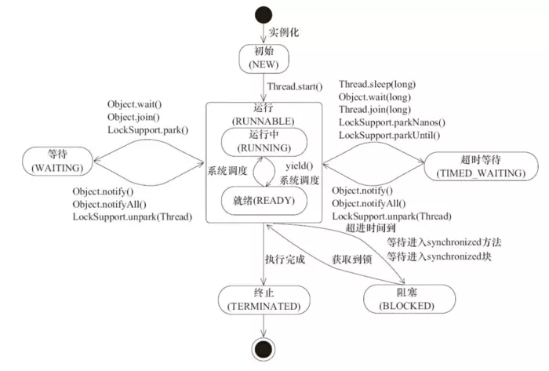

# Java并发编程

阻塞和非阻塞通常用来形容多线程间的相互影响，比如一个线程占有了临界区资源，那么其他线程需要这个资源就必须进行等待该资源的释放，会导致等待的线程挂起，这种情况就是阻塞，而非阻塞就恰好相反，它强调没有一个线程可以阻塞其他线程，所有的线程都会尝试地往前运行。

## 并发编程的优缺点

**优点：**

并发编程的形式可以将多核CPU的计算能力发挥到极致，性能得到提升。面对复杂业务模型，并行程序会比串行程序更适应业务需求，而并发编程更能吻合这种业务的拆分。

**缺点：**

频繁的上下文切换：时间片是CPU分配给各个线程的时间，因为时间非常短，所以CPU不断通过切换线程，让我们觉得多个线程是同时执行的，时间片一般是几十毫秒。而每次切换时，需要保存当前的状态起来，以便能够进行恢复先前状态，而这个切换时非常损耗性能，过于频繁反而无法发挥出多线程编程的优势。通常减少上下文切换可以采用无锁并发编程，CAS算法，使用最少的线程和使用协程。

- 无锁并发编程：可以参照concurrentHashMap锁分段的思想，不同的线程处理不同段的数据，这样在多线程竞争的条件下，可以减少上下文切换的时间。
- CAS算法，利用Atomic下使用CAS算法来更新数据，使用了乐观锁，可以有效的减少一部分不必要的锁竞争带来的上下文切换
- 使用最少线程：避免创建不需要的线程，比如任务很少，但是创建了很多的线程，这样会造成大量的线程都处于等待状态
- 协程：在单线程里实现多任务的调度，并在单线程里维持多个任务间的切换

由于上下文切换也是个相对比较耗时的操作，所以在"java并发编程的艺术"一书中有过一个实验，并发累加未必会比串行累加速度要快。 可以使用Lmbench3测量上下文切换的时长  vmstat测量上下文切换次数

线程安全：多线程编程中最难以把握的就是临界区线程安全问题，稍微不注意就会出现死锁的情况，一旦产生死锁就会造成系统功能不可用。

## 1、什么是线程，与进程的区别

（1）定义

进程是具有一定独立功能的程序关于某个数据集合上的一次运行活动，进程是系统进行资源分配和调度的一个独立单位.

线程是进程的执行单元，是CPU调度和分派的基本单位，它是比进程更小的能独立运行的基本单位。线程可以拥有自己的堆栈、自己的程序计数器和自己的局部变量，但不拥有系统资源，它可与父进程的其他的线程共享进程所拥有的全部资源。

（2）关系

一个线程可以创建和撤销另一个线程；

一个线程可以与同进程中的其他线程共享数据，但拥有自己的栈空间，拥有独立的执行序列；

同一个进程中的多个线程之间可以并发执行；

一个线程必须有一个父进程；

（3）区别

- 一个程序至少有一个进程,一个进程至少有一个线程.

- 线程的划分尺度小于进程，使得多线程程序的并发性高。

- 另外，进程在执行过程中拥有独立的内存单元，而多个线程共享内存，从而极大地提高了程序的运行效率。

- 线程在执行过程中与进程还是有区别的。每个独立的线程有一个程序运行的入口、顺序执行序列和程序的出口。但是线程不能够独立执行，必须依存在应用程序中，由应用程序提供多个线程执行控制。

- 从逻辑角度来看，多线程的意义在于一个应用程序中，有多个执行部分可以同时执行。但操作系统并没有将多个线程看做多个独立的应用，来实现进程的调度和管理以及资源分配。这就是进程和线程的重要区别。

（4）优缺点

线程和进程在使用上各有优缺点：线程执行开销小，但不利于资源的管理和保护；而进程正相反。同时，线程适合于在SMP机器上运行，而进程则可以跨机器迁移。

（5）Java中线程状态转换



线程创建之后调用start()方法开始运行

- 当调用wait()，join()，LockSupport.lock()方法线程会进入到**WAITING**状态。
- 同样的wait(long timeout)，sleep(long)，join(long)，LockSupport.parkNanos()，LockSupport.parkUtil()增加了超时等待的功能，也就是调用这些方法后线程会进入**TIMED_WAITING**状态，当超时等待时间到达后，线程会切换到Runable的状态。
- 另外当WAITING和TIMED _WAITING状态时可以通过Object.notify()，Object.notifyAll()方法使线程转换到Runable状态。
- 当线程出现资源竞争时，即等待获取锁的时候，线程会进入到**BLOCKED**阻塞状态，当线程获取锁时，线程进入到Runable状态。
- 线程运行结束后，线程进入到**TERMINATED**状态，状态转换可以说是线程的生命周期。另外需要注意的是：

- **当线程进入到synchronized方法或者synchronized代码块时，线程切换到的是BLOCKED状态，而使用java.util.concurrent.locks下lock进行加锁的时候线程切换的是WAITING或者TIMED_WAITING状态，因为lock会调用LockSupport的方法。**


## 2、线程中常见函数

Thread、Runnable、Callable、ReentrantLock、ReentrantReadWriteLock、Atomic*、Semaphore、CountDownLatch、、ConcurrentHashMap、Executors

### （1）线程创建方法

**继承Thread类创建线程类**

```Java
new MyFirstThread().start
使用继承Thread类的方法来创建线程类时，多个线程之间无法共享线程类的实例变量。
```

**实现Runnable接口创建线程类**

```Java
MyRunnableImp mri = new MyRunnableImp();
new Thread(mri,"Name").start();
new Thread(mri,"Name2").start();
程序所创建的Runnable对象只是线程的target，而多个线程可以共享同一个target，所以多个线程可以共享同一个线程类（实际上应该是线程的target类）的实例变量。Thread类的作用就是把run()方法包装成线程的执行体。
```

**使用Callable和FutureTask创建线程**

Callable接口提供了一个call()方法可以作为线程执行体，但call()方法比run()方法功能更强大。

- 创建Callable接口的实现类，并实现call()方法，该call方法将作为线程执行体，且该call方法有返回值，再创建Callable实现类的实例。从Java8开始，可以直接使用lambda表达式创建Callable对象。

- 使用FutureTask类来包装Callable对象，该FutureTask对象封装了该Callable对象的call()方法的返回值。

- 使用FutureTask对象作为Thread对象的target创建并启动新线程

- 调用FutureTask对象的get()方法来获得子线程执行结束后的返回值。

```Java
FutureTask<Integer> task = new FutureTask<Integer>((Callable<Integer>)()->{
	int i = 0;
	for(;i<100;i++){
		System.out.println(Thread.currentThread().getName() + "的循环变量i的值：" + i);
	}
	return i;
});
for(int i=0;i<100;i++){
	System.out.println(Thread.currentThread().getName() + "的循环变量i的值：" + i);
	if(i == 20){
		new Thread(task, "有返回值的线程").start();
	}
}
try {
	System.out.println(task.get() + " 是子线程的返回值");
} catch (Exception e) {
	e.printStackTrace();
}
```

在这段程序中，将看到主线程和call()方法所代表的线程交替执行的情形，程序最后还会输出call()方法的返回值，程序再最后调用了get()方法来返回call()方法的返回值——该方法将导致主线程被阻塞，直到call()方法结束并返回为止。

采用Runnable、Callable接口的方式创建多线程的优缺点：

- 线程类只是实现了Runnable接口或Callable接口，还可以继承其他类
- 在这种方式下，多个线程可以共享同一个target对象，

**常用函数：**

### （2）join()方法，状态变成WAITING

如果一个线程实例A执行了threadB.join()，其含义是：当前线程A会等待threadB线程终止之后threadA才会继续执行。Thread类除了提供join()方法外，另外还提供了超时等待的方法，如果线程threadB在等待的时间内还没有结束的话，threadA会在超时之后继续执行。可以看出来当前等待对象threadA会一直阻塞，直到被等待对象threadB结束后即isAlive()返回false的时候才会结束while循环，当threadB退出时会调用notifyAll()方法通知所有的等待线程。

```Java
// join方法源码
public final synchronized void join(long millis)
    throws InterruptedException {
    long base = System.currentTimeMillis();
    long now = 0;

    if (millis < 0) {
        throw new IllegalArgumentException("timeout value is negative");
    }

    if (millis == 0) {
        // isAlive()是一个native方法。
        while (isAlive()) {
            // 使用的是Object的wait方法。
            wait(0);
        }
    } else {
        while (isAlive()) {
            long delay = millis - now;
            if (delay <= 0) {
                break;
            }
            wait(delay);
            now = System.currentTimeMillis() - base;
        }
    }
}
```

### （3）wait()方法，状态转变为WAITING

它是一个native方法，当前线程必须获得了这个object的monitor。这个线程会释放掉对它的monitor的所有权并等待另外一个线程通过执行函数notify或者notifyAll函数，来通知、唤醒等待这个object的monitor的线程，它的使用方法是：

```java
synchronized (obj) {
     while (<condition does not hold>)
         obj.wait();
         ... // Perform action appropriate to condition
}
```

### （4）sleep()方法，状态转变为TIMED_WAITING

是Thread的native 静态方法，它是让当前线程按照指定的时间休眠，线程进入TIMED_WAITING状态，其休眠时间的精度决定于处理器的计时器和调度器。**需要注意的是如果当前线程获得了锁，只会让出CPU，并不会失去锁**。sleep方法经常拿来与Object.wait()方法进行比较，这也是面试经常被问的地方。sleep()和wait()的主要区别是：

- sleep()方法是Thread的静态方法，而wait是Object实例方法
- wait()方法必须要在同步方法或者同步块中调用，也就是必须已经获得对象锁。而sleep()方法没有这个限制，可以在任何地方使用。另外，wait()方法会释放占有的对象锁，使得该线程进入等待池中，等待下一次获取资源。而sleep()方法只是会让出CPU并不会释放掉对象锁。
- sleep()方法在休眠时间达到后如果再次获得cpu时间片就会继续执行，而wait()方法必须等待Object.notify/Object.notifyAll通知后，才会离开等待池，并且再次获得CPU时间片才回继续执行。

### （5）notify()和notifyAll()方法

一定要先获取到monitor才可以，否则会抛出异常。

唤醒单个等待object的monitor的线程，如果存在线程在等待，会选择其中一个唤醒，这个选择是随机的。只有获得了object的monitor的线程才可调用此方法。一个线程获得object的monitor的方式有三种
（1）通过执行一个synchronized声明的代码块
（2）通过执行一个synchronized的实例方法
（3）通过执行这个类的static的synchronized方法

https://juejin.im/entry/5a2bb783f265da43163cff74

wait()和notify()示例：

```java
public class ThreadTest {
    static final Object obj = new Object();  //对象锁
    // 在Thread1中
    synchronized (obj) {
        System.out.println("进入生产者线程");
        System.out.println("生产");
        try {
            TimeUnit.MILLISECONDS.sleep(2000);  //模拟生产过程
            flag = true;
            obj.notify();  //通知消费者
            TimeUnit.MILLISECONDS.sleep(1000);  //模拟其他耗时操作
            System.out.println("退出生产者线程");
        } catch (InterruptedException e) {
            e.printStackTrace();
        }
    }
    // 在Thread2中
    synchronized (obj) {
        System.out.println("进入消费者线程");
        System.out.println("wait flag 1:" + flag);
        while (!flag) {  //判断条件是否满足，若不满足则等待
            try {
                System.out.println("还没生产，进入等待");
                obj.wait();
                System.out.println("结束等待");
            } catch (InterruptedException e) {
                e.printStackTrace();
            }
        }
        System.out.println("wait flag 2:" + flag);
        System.out.println("消费");
        System.out.println("退出消费者线程");
    }
}
```

### （6）yield()方法

它是一个静态方法，一旦执行，它会使当前线程让出CPU，但是需要注意的是，让出的CPU并不是代表当前线程不再运行了，如果在下一次竞争中，又获得了CPU时间片当前线程依然会继续运行。另外，让出的时间片只会分配给当前线程相同优先级的线程。优先级高的线程相较于低优先级的线程优先获得处理器时间片，需要注意的是在不同JVM以及操作系统上，线程规划存在差异，一些操作系统甚至会忽略线程优先级的设定。sleep()方法与yield()方法同样都是当前线程交出处理器资源，而它们的不同是sleep()交出来的时间片其他线程都可以去竞争，也就是说都有机会获得当前线程让出的时间片。**而yield()方法只允许与当前线程具有相同优先级的线程能够获得释放出来的CPU时间片。**

### （7）interrupt()方法：中断线程

interrupt方法用于中断线程。调用该方法的线程的状态为将被置为"中断"状态。

注意：线程中断仅仅是置线程的中断状态位，不会停止线程。需要用户自己去监视线程的状态为并做处理。支持线程中断的方法（也就是线程中断后会抛出interruptedException的方法）就是在监视线程的中断状态，一旦线程的中断状态被置为“中断状态”，就会抛出中断异常。

```Java
public void interrupt() {
    if (this != Thread.currentThread())
        checkAccess();
    synchronized (blockerLock) {
        Interruptible b = blocker;
        if (b != null) {
            interrupt0();           // Just to set the interrupt flag
            b.interrupt(this);
            return;
        }
    }
    interrupt0();
}
```

### （8）isInterrupted()方法：仅返回线程的当前状态

表示获取当前线程的状态，不清除线程的中断状态。

```Java
// 这是一个native方法，代表是否清除状态位
// 如果这个参数为true，说明返回线程的状态位后，要清掉原来的状态位（恢复成原来情况）
// 这个参数为false，就是直接返回线程的状态位。
private native boolean isInterrupted(boolean ClearInterrupted);

public boolean isInterrupted() {
    return isInterrupted(false);
}
```

该方法就是直接调用当前线程的isInterrupted(**false**)的方法。

### （9）interrupted()方法：返回当前状态并清除中断状态

表示获取线程的当前状态并清除当前线程的中断状态。

```Java 
public static boolean interrupted() {
    return currentThread().isInterrupted(true);
}
```

```Java
System.out.println(Thread.currentThread().isInterrupted());
Thread.currentThread().interrupt(); // 设置当前线程的状态为阻塞状态，但并不阻塞线程
System.out.println(Thread.currentThread().isInterrupted());
System.out.println(Thread.currentThread().interrupted());
System.out.println(Thread.currentThread().interrupted());
System.out.println(Thread.currentThread().isInterrupted());
// 输出的结果为
// false 表示当前线程未中断
// true 表示当前线程状态为中断状态，不清除线程状态的中断状态
// true 表示在清除线程的状态之前为中断状态，随后清除线程的中断状态
// false 表示在清除线程的状态之前为未中断状态，随后清除线程的中断状态
// false 表示当前线程状态为未中断状态
```


### （14）线程异常的捕获——UncaughtExceptionHandler

在main线程中无法使用try-catch捕获线程中抛出的异常。线程和线程池中的线程都可以通过UncaughtExceptionHandler来进行捕获异常。

```Java
class MyUnchecckedExceptionhandler implements UncaughtExceptionHandler {
    @Override
    public void uncaughtException(Thread t, Throwable e) {
        System.out.println("捕获到异常：" + e);
    }
}

class HandlerThreadFactory implements ThreadFactory {
    @Override
    public Thread newThread(Runnable r) {
        System.out.println("创建一个新的线程");
        Thread t = new Thread(r);
        t.setUncaughtExceptionHandler(new MyUnchecckedExceptionhandler());
        System.out.println("eh121 = " + t.getUncaughtExceptionHandler());
        return t;
    }
}

public class ThreadExceptionTest {

    /**
     * @param args
     */
    public static void main(String[] args) {
        //下面有3中方式来执行线程。
        //第1种按照普通的方式。这是能捕获到异常
        Thread t = new Thread(new ExceptionThread2());
        t.setUncaughtExceptionHandler(new MyUnchecckedExceptionhandler());
        t.start();
        //第2种按照现成池，直接按照thread方式,此时不能捕获到异常，为什么呢？因为在下面代码中创建了一个线程，且设置了异常处理器，
        //但是呢，在我们线程池中会重设置新的Thread对象，而这个Thread对象没有设置任何异常处理器，换句话说，我们在线程池外对线程做的
        //任何操作都是没有用的
        ExecutorService exec1 = Executors.newCachedThreadPool();
        Runnable runnable = new ExceptionThread2();
        Thread t1 = new Thread(runnable);
        t1.setUncaughtExceptionHandler(new MyUnchecckedExceptionhandler());
        exec1.execute(runnable);
        
        //第3种情况一样的，也是走的线程池，但是呢是通过ThreadFactory方式，在ThreadFactory中会对线程做一些控制，可以设置异常处理器
        //此时是可以捕获异常的。
        ExecutorService exec = Executors.newCachedThreadPool(new HandlerThreadFactory());
        exec.execute(new ExceptionThread2());  
    }

}
```

## 3、线程安全

死锁、死锁如何排查、Java线程调度、线程安全和内存模型的关系

### （1）重排序对多线程的影响

现在让我们来看看，重排序是否会改变多线程程序的执行结果。请看下面的示例代码。


flag变量是个标记，用来标识变量a是否已被写入。这里假设有两个线程A和B，A首先执行 writer()方法，随后B线程接着执行reader()方法。线程B在执行操作4时，能否看到线程A在操作 1对共享变量a的写入呢？

答案是：不一定能看到。

由于操作1和操作2没有数据依赖关系，编译器和处理器可以对这两个操作重排序；同样， 操作3和操作4没有数据依赖关系，编译器和处理器也可以对这两个操作重排序。让我们先来 看看，当操作1和操作2重排序时，可能会产生什么效果？请看下面的程序执行时序图，如图38所示。


如图3-8所示，操作1和操作2做了重排序。程序执行时，线程A首先写标记变量flag，随后线 程B读这个变量。由于条件判断为真，线程B将读取变量a。此时，变量a还没有被线程A写入，在这里多线程程序的语义被重排序破坏了！

下面再让我们看看，当操作3和操作4重排序时会产生什么效果（借助这个重排序，可以顺 便说明控制依赖性）。下面是操作3和操作4重排序后，程序执行的时序图，如图3-9所示。


在程序中，操作3和操作4存在控制依赖关系。当代码中存在控制依赖性时，会影响指令序 列执行的并行度。为此，编译器和处理器会采用猜测（Speculation）执行来克服控制相关性对并 行度的影响。以处理器的猜测执行为例，执行线程B的处理器可以提前读取并计算a*a，然后把 计算结果临时保存到一个名为重排序缓冲（Reorder Buffer，ROB）的硬件缓存中。当操作3的条 件判断为真时，就把该计算结果写入变量i中。

从图3-9中我们可以看出，猜测执行实质上对操作3和4做了重排序。重排序在这里破坏了多线程程序的语义！

在单线程程序中，对存在控制依赖的操作重排序，不会改变执行结果（这也是as-if-serial语义允许对存在控制依赖的操作做重排序的原因）；但在多线程程序中，对存在控制依赖的操作重排序，可能会改变程序的执行结果。

## 4、原子性、有序性、可见性

### （1）原子性（synchronized）

是指一个操作是不可中断的，要么全部执行成功要么全部执行失败，有着“同生共死”的感觉。即使在多个线程一起执行的时候，一个操作一旦开始，就不会被其他线程多打扰。

```Java
int a = 10; //1
a++;//2
int b=a;//3
a=a+1;//4
```

上面这四个语句中只有第一个语句是原子操作，将10赋值给线程工作内存的变量a，而语句2，实际上包含三个操作：1.读取变量a的值，2.对a进行加一操作，3.将计算后的值再赋值给变量a，而这三个操作无法构成原子操作。语句3、4的分析同理可得两条语句不具备原子性。Java内存模型中定义了8种操作都是原子的，不可再分的。

- lock(锁定)：作用于主内存中的变量，它把一个变量标识为一个线程独占的状态。
- unlock(解锁)：作用于主内存中的变量，它把一个处于锁定状态的变量释放出来，释放后的变量才可以被其他线程锁定
- read(读取)：作用于主内存中的变量，它把一个变量的值从主内存传输到线程的工作内存中，以便后面的load动作使用。
- load(载入)：作用于工作内存中的变量，它把read操作从主内存中得到的变量值放入工作内存中的变量副本。
- use(使用)：作用于工作内存中的变量，它把工作内存中的一个变量值传递给执行引擎，每当虚拟机遇到一个需要使用到变量的值的字节码执行时将会执行这个操作。
- assign(赋值)：作用于工作内存中的变量，它把一个从执行引擎接收到的值赋给工作内存的变量，每当虚拟机遇到一个给变量赋值的字节码指令时执行这个操作。
- store(存储)：作用于工作内存的变量，它把工作内存中一个变量的值传送给主内存中以便随后的write操作使用。
- write(操作)：作用于主内存的变量，它把store操作从工作内存中得到的变量的值放入主内存的变量中。

**大致可以认为基本数据类型的访问和读写具备原子性。例外就是long和double的非原子协定。**

上面一共有8条原子操作，其中六条可以满足基本数据类型的访问读写具备原子性，还剩下lock和unlock两条原子操作。如果我们需要更大范围的原子性操作就可以使用lock和unlock原子操作。尽管JVM没有把lock和unlock开放给我们使用，但JVM以更高层次的指令monitorenter和monitorexit指令开放给我们使用，即**synchronized满足原子性**。

**关于long和double的原子性判断：**

有下面一段程序：

```Java
public class LongAtomTest implements Runnable {

    private static long field = 0;
    private volatile long value;

    public long getValue() {
        return value;
    }
    public void setValue(long value) {
        this.value = value;
    }

    public LongAtomTest(long value) {
        this.setValue(value);
    }

    @Override
    public void run() {
        int i = 0;
        while (i < 100000) {
            i++;
            LongAtomTest.field = this.getValue();
            if ((LongAtomTest.field == 1L || LongAtomTest.field == -1L) && i == 1) {
                System.out.println(Thread.currentThread().getName()+"获取volatile值正确：" + LongAtomTest.field);
            }
            long temp = LongAtomTest.field;
            if (temp != 1L && temp != -1L) {
                System.out.println(Thread.currentThread().getName()+"出现错误：" + temp);
                return;
            }
        }
        System.out.println(Thread.currentThread().getName()+"正确");
    }

    public static void main(String[] args) throws InterruptedException {
        String arch = System.getProperty("sun.arch.data.model");
        System.out.println(arch+"-bit");
        LongAtomTest t1 = new LongAtomTest(1);
        LongAtomTest t2 = new LongAtomTest(-1);
        Thread T1 = new Thread(t1);
        Thread T2 = new Thread(t2);
        T1.start();
        T2.start();
        T1.join();
        T2.join();
    }
}
```

java中基本类型中，long和double的长度都是8个字节，32位（4字节）处理器对其读写操作无法一次完成，那么，JVM，long和double是原子性的吗？

上述程序在**32位JVM**中的运行结果为（多次运行结果不同，非volatile修饰的long值可能获取成功，可能获取失败）：

```Java
32-bit
Thread-0获取volatile修饰long值正确：1
Thread-1获取volatile修饰long值正确：-1
Thread-0获取非volatile修饰long值出现错误： field=-1 temp=-4294967295
Thread-1正确

再执行一次的可能输出结果：
32-bit
Thread-0获取volatile修饰long值正确：1
Thread-1获取volatile修饰long值正确：-1
Thread-0获取非volatile修饰long值出现错误： field=-4294967295 temp=-4294967295
Thread-1获取非volatile修饰long值出现错误： field=-4294967295 temp=-4294967295
```

在64位JVM中的运行结果为（多次运行结果相同）：

```Java
64-bit
Thread-0获取volatile修饰long值正确：1
Thread-1获取volatile修饰long值正确：-1
Thread-0正确
Thread-1正确
```

如果对long写入和读取操作是原子性的，那么temp的值只能为1或者-1。

**对于32位操作系统来说，单次次操作能处理的最长长度为32bit，而long类型8字节64bit，所以对long的读写都要两条指令才能完成（即每次读写64bit中的32bit）。如果JVM要保证long和double读写的原子性，势必要做额外的处理。从程序得到的结果来看，32位的HotSpot没有把long和double的读写实现为原子操作。在64bit的虚拟机下，long的处理是原子性的。**

**对于volatile，有如下例子：**

```Java
public class VolatileExample {
    private static volatile int counter = 0;

    public static void main(String[] args) {
        for (int i = 0; i < 10; i++) {
            Thread thread = new Thread(new Runnable() {
                @Override
                public void run() {
                    for (int i = 0; i < 10000; i++)
                        counter++;
                }
            });
            thread.start();
        }
        try {
            Thread.sleep(1000);
        } catch (InterruptedException e) {
            e.printStackTrace();
        }
        System.out.println(counter);
    }
}
```

多次运行的结果都小于100000，问题在于**volatile并不能保证原子性**，对于counter++不是一个原子操作，如果线程A读取counter到工作内存后，其他线程对这个值已经做了自增操作后，那么线程A的这个值自然而然就是一个过期的值，最终的结果必然小于100000。如果要让volatile保证原子性，必须符合以下两条规则：

- 运算结果并不依赖于变量的当前值，或者能够确保只有一个线程修改变量的值。
- 变量不需要与其他的状态变量共同参与约束

### （2）有序性（synchronized，volatile）

synchronized语义表示锁在同一时刻只能由一个线程进行获取，当锁被占用后，其他线程只能等待。因此，synchronized语义就要求线程在访问读写共享变量时只能“串行”执行，因此synchronized具有有序性。

volatile包含禁止指令重排的语义，其具有有序性。在单例模式的实现上有一种双重检验锁定的方式（Double-checked Locking），代码如下：

```Java
public class Singleton {
    private Singleton() { }
    private volatile static Singleton instance;
    public Singleton getInstance(){
        if(instance==null){
            synchronized (Singleton.class){
                if(instance==null){
                    instance = new Singleton();
                }
            }
        }
        return instance;
    }
}
```

为何要加上volatile？我们先来分析一下volatile的情况，有问题的语句是这条：

> instance = new Singleton();

这条语句实际上包含了三个操作：1.分配对象的内存空间；2.初始化对象；3.设置instance指向刚分配的内存地址，但是由于存在重排的问题，可能有以下的执行顺序：


如果没有2和3的重排，线程B进行判断if(instance == null)时就会为true，而实际上这个instance并没有初始化成功，显而易见对线程B来说之后的操作就会是错的。而用volatile修饰的话，就可以禁止2和3操作重排，从而避免这种情况。

### （3）可见性（synchronized、volatile）

可见性是只当一个线程修改了共享变量后，其他线程能够立即得知这个修改。通过之前对[synchronzed](https://juejin.im/post/5ae6dc04f265da0ba351d3ff)内存语义进行了分析，当线程获取锁时会从主内存中获取共享变量的最新值，释放锁的时候会将共享变量同步到主内存中。从而，**synchronized具有可见性**。同样的在[volatile分析中](https://juejin.im/post/5ae9b41b518825670b33e6c4)，会通过在指令中添加**lock指令**，以实现内存可见性。因此, **volatile具有可见性**。


## 5、volatile关键字

有部分内容参见“Java内存模型（Java Memory Model，JMM）”。happens-before、编译器指令重排和CPU指令重排。

### （1）CPU高速缓存和JMM内存模型

处理器和内存之间加入了高速缓存，L0、L1、L3缓存等


简化后的模型如下图：

https://juejin.im/post/5dbfa0aa51882538ce1a4ebc


将运算需要使用到的数据复制到缓存中，让运算能够快速进行。当运算完成之后，再将缓存中的结果写入主内存，这样运算器就不用等待主内存的读写操作了。每个处理器都有自己的高速缓存，同时又共同操作同一块主内存，当多个处理器同时操作主内存时，可能导致数据不一致，因此需要“缓存一致性协议”来保障。比如，MSI、MESI等。

Java内存模型即Java Memory Model，简称JMM。用来屏蔽掉各种硬件和操作系统的内存访问差异，以实现让Java程序在各平台下都能够达到一致的内存访问效果。JMM定义了线程和主内存之间的抽象关系：**线程之间的共享变量存储在主内存**（main memory）中，**每个线程都有一个私有的本地内存**（local memory），**本地内存中存储了该线程以读/写共享变量的副本**。本地内存是JMM的一个抽象概念，并不真实存在。它涵盖了缓存，写缓冲区，寄存器以及其他的硬件和编译器优化。


主内存：主要存储的是Java实例对象，所有线程创建的实例对象都存放在主内存中，不管该实例对象是成员变量还是方法中的本地变量(也称局部变量)，当然也包括了共享的类信息、常量、静态变量。共享数据区域，多条线程对同一个变量进行访问可能会出现线程安全问题。

工作内存：主要存储当前方法的所有本地变量信息(工作内存中存储着主内存中的变量副本拷贝)，每个线程只能访问自己的工作内存，即线程中的本地变量对其它线程是不可见的，就算是两个线程执行的是同一段代码，它们也会各自在自己的工作内存中创建属于当前线程的本地变量，当然也包括了字节码行号指示器、相关Native方法的信息。由于工作内存是每个线程的私有数据，线程间无法相互访问工作内存，因此存储在工作内存的数据不存在线程安全问题。

### （2）多CPU的嗅探机制

处理器可以通过嗅探总线上传播的数据来感知其他处理器的缓存及系统内存和自己缓存的数据是否一致（**缓存一致性原则**），如果检测到共享变量被修改，那么会将自己的缓存行置为无效，下次再读的时候会重新从系统内存中加载，保证了读取的值是最新的，是**可见的**。

在多处理器系统中，每个处理器都有自己的高速缓存，而它们又共享同一主内存（Main Memory）。基于高速缓存的存储交互很好地解决了处理器与内存的速度矛盾，但是也引入了新的问题：缓存一致性（Cache Coherence）。当多个处理器的运算任务都涉及同一块主内存区域时，将可能导致各自的缓存数据不一致的情况，如果真的发生这种情况，那同步回到主内存时以谁的缓存数据为准呢？为了解决一致性的问题，需要各个处理器访问缓存时都遵循一些协议，在读写时要根据协议来进行操作，这类协议有MSI、MESI（IllinoisProtocol）、MOSI、Synapse、Firefly及DragonProtocol，等等。

缓存一致性协议：

https://www.infoq.cn/article/cache-coherency-primer

https://blog.csdn.net/reliveIT/article/details/50450136

MESI是四种缓存段状态的首字母缩写，任何多核系统中的缓存段都处于这四种状态之一：

- 失效（Invalid）缓存段，要么已经不在缓存中，要么它的内容已经过时。为了达到缓存的目的，这种状态的段将会被忽略。一旦缓存段被标记为失效，那效果就等同于它从来没被加载到缓存中。
- 共享（Shared）缓存段，它是和主内存内容保持一致的一份拷贝，在这种状态下的缓存段只能被读取，不能被写入。多组缓存可以同时拥有针对同一内存地址的共享缓存段，这就是名称的由来。
- 独占（Exclusive）缓存段，和 S 状态一样，也是和主内存内容保持一致的一份拷贝。区别在于，如果一个处理器持有了某个 E 状态的缓存段，那其他处理器就不能同时持有它，所以叫“独占”。这意味着，如果其他处理器原本也持有同一缓存段，那么它会马上变成“失效”状态。
- 已修改（Modified）缓存段，属于脏段，它们已经被所属的处理器修改了。如果一个段处于已修改状态，那么它在其他处理器缓存中的拷贝马上会变成失效状态，这个规律和 E 状态一样。此外，已修改缓存段如果被丢弃或标记为失效，那么先要把它的内容回写到内存中——这和回写模式下常规的脏段处理方式一样。

### （3）volatile实现原理（Lock前缀的指令）

在生成汇编代码时会在volatile修饰的共享变量进行**写操作的时候会多出Lock前缀的指令**。Lock前缀指令在多核处理器下主要有两个方面的影响：

- 将当前处理器缓存行的数据写回系统内存
- 这个写回内存的操作会使得其他CPU里缓存了该内存地址的数据无效
- 作用于主内存中的变量，它把一个变量标识为一个线程独占的状态

为了提高处理速度，处理器不直接和内存进行通信，而是先将系统内存的数据读到内部缓存（L1、L2或其他）后再进行操作，但操作完不知道何时会写到内存。如果对声明了volatile进行写操作，JVM就会向处理器发送一条Lock前缀的指令，将这个变量所在缓存行的数据写会到系统内存。但是，就算写回到内存，如果其他处理器缓存的值还是旧的，再执行计算操作就会有问题。所以，**在多处理器下，为了保证各个处理器的缓存是一致的，就会实现缓存一致性协议，每个处理器通过嗅探在总线上传播的数据来检查自己缓存的值是不是过期了，当处理器发现自己缓存行对应的内存地址被修改，就会将当前处理器的缓存行设置成无效状态，当处理器发现这个数据进行行修改操作的时候，会重新从系统内存中把数据读到处理器缓存里。**因此，有如下结论：

- Lock前缀的指令会引起处理器缓存写回内存；
- 一个处理器的缓存回写到内存会导致其他处理器的缓存失效
- 当处理器发现本地缓存失效后，就会从内存中重读该变量数据，即可获得当前最新值。

这样对volatile变量通过这样的机制就使得每个线程都能获得该变量的最新值。

### （4）volatile的happens-before关系

经过上面的分析，我们已经知道了volatile变量可以通过**缓存一致性协议**保证每个线程都能获得最新值，即满足数据的“可见性”。我们可以将并发分析的切入点分为**“两个核心，三大性质”**。两大核心：JMM内存模型（主内存和工作内存）以及happens-before；三大性质：原子性、可见性、有序性。

在happens-before规则中，有一条是“**volatile变量原则：对一个volatile域的写，happens-before于任意后续对这个volatile域的读**”，对volatile变量的修改，后续的读操作会迅速感知，即可见，例如：

```Java
// 变量不使用volatile修饰，线程不会结束
public class VolatileTest extends Thread {
    private static boolean flag = false;

    public void run() {
        while (!flag) ;
    }

    public static void main(String[] args) throws Exception {
        new VolatileTest().start();
        Thread.sleep(2000);// 这句话很重要
        flag = true;
    }
}

// 变量使用volatile修饰，线程会结束
public class VolatileTest extends Thread {
    private static volatile boolean flag = false;

    public void run() {
        while (!flag) ;
    }

    public static void main(String[] args) throws Exception {
        new VolatileTest().start();
        Thread.sleep(2000);
        flag = true;
    }
}
```

### （5）volatile的内存语义

volatile写的内存语义：当写一个volatile变量时，JMM会把该线程对应的本地内存中的共享变量值刷新到主内存。

volatile读的内存语义：当读一个volatile变量时，JMM会把该线程对应的本地内存置为无效，线程接下来将从主内存中读取共享变量。

对volatile写和volatile读的内存语义做个总结。

- 线程A写一个volatile变量，实际上是线程A向接下来将要读这个volatile变量的某个线程发出了（其共享变量所做修改的）消息。
- 线程B读一个volatile变量，实际上是线程B接收了之前某个线程发出的（在写这个volatile变量之前对共享变量所做修改的）消息。
- 线程A写一个volatile变量，随后线程B读这个volatile变量，这个过程实质上是线程A通过主内存向线程B发送消息。


### （6）volatile的内存语义实现（四种屏障）

为了性能优化，JMM在不改变正确语义的前提下，会允许编译器和处理器对指令序列进行重排序，那如果想阻止重排序要怎么办了？答案是添加内存屏障。

JMM内存屏障分为以下四类：


Java编译器会在生成指令序列时在适当的位置会插入内存屏障指令来禁止特定类型的树立起重排序。为了实现volatile的内存语义，JMM会限制特定类型的编译器和处理器重排序，JMM会针对编译器制定volatile重排序规则表：


举例来说，第三行最后一个单元格的意思是：在程序中，当第一个操作为普通变量的读或写时，如果第二个操作为volatile写，则编译器不能重排序这两个操作。

从表中可以看出：

- 当第二个操作为volatile写时，不管第一个是什么操作，都不能重排序。这个规则确保volatile写之前不会被编译器重排序到volatile写之后。
- 当第一个操作是volatile读时，不管第二个是什么，都不能重排序。这个规则确保volatile读之后的操作不会被编译器重排序到volatile读之前。
- 当第一个操作是volatile写，第二个操作是volatile读时，不能重排序。

为了实现volatile的内存语义，编译器在生成字节码时，会在指令序列中插入内存屏障来禁止特定类型的处理器重排序。对于编译器来说，发现一个最优布置来最小化插入屏障的总数几乎不可能。为此，JMM采取保守策略，下面是基于保守策略的JMM内存屏障插入策略。

- 在每个volatile写操作的**前面**插入一个StoreStore屏障。
- 在每个volatile写操作的**后面**插入一个StoreLoad屏障。
- 在每个volatile读操作的**后面**插入一个LoadLoad屏障。
- 在每个volatile读操作的**后面**插入一个LoadStore屏障。

上述内存屏障插入策略非常保守，但它可以保证在任意处理器平台，任意的程序中都能得到正确的volatile内存语义。

下面是保守策略下，volatile写插入内存屏障后生成的指令序列示意图：


StoreStore屏障保证在volatile写之前，其前面的所有普通写操作都已经对任意处理器可见了。这是因为StoreStore屏障将保证上面的所有的普通写在volatile写之前已经刷新到主内存。

volatile写后面的StoreLoad屏障的作用是避免volatile写与后面可能有的volatile读/写操作重新排序。因为编译器常常无法准确判断在一个volatile写的后面是否需要插入一个StoreLoad屏障（比如，一个volatile写之后方法立即return）。为了保证能正确实现volatile的内存语义，JMM采取了保守策略：在每个volatile写的后面，或者在每个volatile读的前面插入一个StoreLoad屏障。从整体执行效率的角度考虑，JMM最终选择了在每个volatile写的后面插入一个StoreLoad屏障。因为volatile写-读内存语义的常见使用模式是：一个线程写volatile变量，多个线程读同一个volatile变量。当读线程的数量大大超过写线程时，选择在volatile写之后插入StoreLoad屏障将带来可观的执行效率的提升。从这里可以看到JMM在实现上的一个特点：首先确保正确性，然后再去追求执行效率。

在保守策略下，volatile读插入内存屏障后生成的指令序列示意图：


LoadLoad屏障用来禁止处理器把上面的volatile读与下面的普通读重排序。LoadStore屏障用来禁止处理器把上面的volatile读与下面的普通写重排序。

上述volatile写和volatile读的内存屏障插入策略非常保守。在实际执行时，只要不改变volatile写-读的内存语义，编译器可以根据具体情况省略不必要的屏障。


注意，最后的StoreLoad屏障不能省略。因为第二个volatile写之后，方法立即return。此时编译器可能无法准确断定后面是否会有volatile读或写，为了安全起见，编译器通常会在这里插入一个StoreLoad屏障。

### （7）volatile补充说明

“volatile是轻量级的同步方式”这种说法是错误的，它只是轻量级的线程操作可见方式，并非同步方式。？？？这一句话需要考量？？？

volatile不能保证原子性，只对volatile的读/写具有原子性。如果是一写多读的并发场景，使用volatile修饰变量则非常合适。volatile一写多读最典型的应用是CopyOnWriteArrayList。它在修改数据时会把整个集合的数据全部复制出来，对写操作加锁，修改完成后，再用setArrray()把array指向新的集合。使用volatile可以使读线程尽快感知array的修改，不进行指令重排，操作后即对其他线程可见。

在实际业务中，如果不确定共享变量是否会被多个线程并发写，保险的做法是使用同步代码块来实现线程同步。另外，因为所有的操作都需要同步给内存变量，所以volatile一定会使线程的执行速度变慢，故要审慎定义和使用volatile属性。

被volatile修饰的变量能够保证每个线程能够获取该变量的最新值，从而避免出现数据脏读的现象。

volatile变量自身具有下列特性：

- 原子性：对任意单个volatile变量的读/写具有原子性，但类似于volatile对++这种复合操作不具有原子性。
- 有序性：volatile的内存语义实现中通过加入内存屏障，阻止指令重排。

- 可见性：对一个volatile变量的读，总是能看到（任意线程）对这个volatile变量最后的写入。

synchronized是阻塞式同步，在线程竞争激烈的情况下会升级为重量级锁。而volatile就可以说是Java虚拟机提供的最轻量级的同步机制。Java内存模型告诉我们，各个线程会将共享变量从主内存拷贝到工作内存，然后执行引擎会基于工作内存中的数据进行操作处理。线程在工作内存进行操作后何时会写到主内存中？这个时机对普通变量是没有规定的，而**针对volatile修饰的变量给Java虚拟机特殊的约定，线程对volatile变量的修改会立刻被其他线程所感知，即不会出现数据脏读的现象，从而保证数据的“可见性”**。

## 6、synchronized

有部分内容参见“JMM内存模型”。

https://juejin.im/post/5b7903b96fb9a019eb43ae03

Java关键字synchronized就具有使每个线程依次排队操作共享变量的功能。很显然，这种同步机制效率很低，但synchronized是其他并发容器实现的基础，对它的理解会大大提升对并发编程的感觉。

synchronized可以使用在代码块和方法中，根据synchronized用的位置可以有这些使用场景：


如果锁的是类对象的话，尽管new多个实例对象，但他们仍然是属于同一个类依然会被锁住，即线程之间保证同步关系。synchronized锁住的对象不同，影响的范围也会存在差别。

- 对于同步方法，锁是当前实例对象

  ```Java
  public synchronized void test1() {
      i++;
  }
  ```

- 对于静态同步方法，锁是当前类的Class对象

  ```java
  public static synchronized void test2() {
      i++;
  }
  ```

- 对于同步代码块，锁是synchronized关键字括号内的对象

  ```Java
  public void test2() {
      synchronized(this){
          i++;
      }
  }
  ```

### （1）Java对象头

在同步的时候是获取对象的monitor，即获取到对象的锁。那么对象的锁怎么理解？无非就是类似对对象的一个标志，这个标志就是存放在Java对象的对象头。在JVM中，对象在内存中的布局分为3块：对象头、实例数据和对齐填充。实例数据它存储着对象真正的有效信息（程序代码中定义的各种类型的字段内容），无论是从父类继承来的字段还是子类中定义的。然后是对齐填充，它并没有什么特殊的含义，仅仅只是起占位符的作用，原因是因为JVM要求对象的起始地址必须是8个字节的整数倍（对象的大小必须是8个字节的整数倍）。而对象头已经是8的整数倍了，如果实例数据没有对齐就需要对齐填充来补全。

synchronized使用的锁都放在对象头里，JVM中使用2个字节宽来存储对象头（如果对象是数组则分配3个字宽，多的一个字宽用于存储数组的长度）。而对象头包含两部分信息，分别为Mark Word和类型指针。Mark Word主要用于存储对象自身的运行时数据，例如对象的hashCode、GC分代年龄、锁状态标志、线程持有的锁、偏向线程的ID、偏向时间戳等。而类型指针用于标识JVM通过这个指针来确定这个对象是哪个类的实例。

由于对象需要存储的运行时数据过多，Mark Word被设计成一个非固定的数据结构以便在极小的空间内存储更多的信息。Java SE 1.6中，锁一共有4种状态，基本从低到高依次是：无锁状态、偏向锁状态、轻量级锁状态和重量级锁状态，这几个状态会随着竞争情况逐渐升级。**锁可以升级但不可能降级，意味着偏向锁升级成轻量级锁后不能降级成偏向锁**。这种锁升级却不能降级的策略，目的是为了提高获得锁和释放锁的效率。在不同的状态下，Mark Word会存储不同的内容，32位JVM Mark Word默认存储结构为。


synchronized 代码块是由一对 **monitorenter/moniterexit** 字节码指令实现， monitor 是其同步实现的基础， Java SE1.6 为了改善性能， 使得 JVM 会根据竞争情况， 使用如下 3 种不同的锁机制：

- 偏向锁（Biased Lock ）
- 轻量级锁（ Lightweight Lock）
- 重量级锁（Heavyweight Lock）

当标志位位10，指针指向monitor对象的起始地址，而每一个对象都存在着monitor与之关联。在Hot Spot中，monitor是由ObjectMonitor类来实现的。

```java
ObjectMonitor() {
    _header       = NULL;//markOop对象头
    _count        = 0;
    _waiters      = 0,//等待线程数
    _recursions   = 0;//重入次数
    _object       = NULL;//监视器锁寄生的对象。锁不是平白出现的，而是寄托存储于对象中。
    _owner        = NULL;//指向获得ObjectMonitor对象的线程或基础锁
    _WaitSet      = NULL;//处于wait状态的线程，会被加入到waitSet；
    _WaitSetLock  = 0;
    _Responsible  = NULL;
    _succ         = NULL;
    _cxq          = NULL;
    FreeNext      = NULL;
    _EntryList    = NULL;//处于等待锁block状态的线程，会被加入到entryList；
    _SpinFreq     = 0;
    _SpinClock    = 0;
    OwnerIsThread = 0;
    _previous_owner_tid = 0;//监视器前一个拥有者线程的ID
}
```


其中有两个队列\_EntryList和\_WaitSet，它们用来保存ObjectMonitor对象列表，\_owner指向持有ObjectMonitor对象的线程。当多个线程访问同步代码时，线程会进入\_EntryList区，当线程获取对象的monitor后（对于线程获得锁的优先级，还有待考究），进入\_owner区并且将\_owner指向获得锁的线程（monitor对象被线程持有），\_count++，其他线程则继续在\_EntryList区等待。若线程调用wait方法，则该线程进入\_WaitSet区等待被唤醒。线程执行完释放monitor锁并且对ObjectMonitor中的值进行复位。

Wait Set保存的是成功获取synchronized之后调用wait方法进入等待的线程集合，Entry Set是尝试首次获取monitor的线程集合。当一个线程释放监视器时，**在入口区和等待区的等待线程都会去竞争监视器**，如果入口区的线程赢了，会从2号门进入；如果等待区的线程赢了会从4号门进入。**只有通过3号门才能进入等待区，在等待区中的线程只有通过4号门才能退出等待区**，也就是说一个线程只有在持有监视器时才能执行wait操作，处于等待的线程只有再次获得监视器才能退出等待状态。

### （2）synchronized是如何实现的

```Java
public class SynchronizedDemo {
    public static void main(String[] args) {
        synchronized (SynchronizedDemo.class) {
        }
        method();
    }

    private synchronized static void method() {
    }
}
```

上面的代码中用了一个同步代码块，锁住的是类对象，并且还有一个同步静态方法，锁住的依然是该类的类对象。编译后，切换到SynchronizedDemo.class的同级目录之后，然后用javap -v SynchronizedDemo.class查看字节码文件：


如图，上面用黄色高亮的部分就是需要注意的部分了，这也是添synchronized关键字之后独有的**。执行同步代码块后首先执行monitorenter指令，退出的时候monitorexit指令。通过分析之后可以看出，使用synchronized进行同步，其关键就是必须要对对象的监视器monitor进行获取，当线程获取monitor后才能继续往下执行，否则就只能等待。**而这个获取过程是互斥的，即同一时刻只能有一个线程能够获取到monitor。上面的demo中在执行同步代码之后紧接着再会去执行一个静态同步方法，而这个方法锁的对象依然就是这个类对象，那么这个正在执行的线程还需要获取该锁吗？答案是不必要，从上图可以看出，执行静态方法的时候只有一条monitorexit指令，并没有monitorenter获取锁的指令。**这就是锁的重入性**，即在同一锁程中，线程不需要再次获取同一把锁。**synchronized先天具有重入性**。对每个对象拥有一个计数器，当线程获取该对象锁后，计数器就会加一，释放锁后就会将计数器减一。任意一个对象都拥有自己的监视器，当这个对象由同步块或者这个对象的同步方法调用时，执行方法的线程必须先获取该对象的监视器才能进入同步块和同步方法，如果没有获取到监视器的线程将会被阻塞在同步块和同步方法的入口处，进入到BLOCKED状态，当Object的监视器占有者释放后，在同步队列中的线程就会有机会重新获得该监视器。


### （3）synchronized和lock之间关系

| 类别     | synchronized                                                 | Lock                                                         |
| :------- | :----------------------------------------------------------- | :----------------------------------------------------------- |
| 存在层次 | Java的关键字，在jvm层面上                                    | 是一个类                                                     |
| 锁的释放 | 1、以获取锁的线程执行完同步代码，释放锁 2、线程执行发生异常，jvm会让线程释放锁 | 在finally中必须释放锁，不然容易造成线程死锁                  |
| 锁的获取 | 假设A线程获得锁，B线程等待。如果A线程阻塞，B线程会一直等待。可重入。 | 分情况而定，Lock有多个锁获取的方式，具体下面会说道，大致就是可以尝试获得锁，线程可以不用一直等待 |
| 锁状态   | 无法判断                                                     | 可以判断                                                     |
| 锁类型   | 可重入 、不可中断、非公平                                    | 可重入、可中断、可公平和非公平                               |
| 性能     | 少量同步                                                     | 大量同步                                                     |

### （4）单例模式

http://chen-tao.github.io/2016/12/30/about-java-singleton/

**饿汉模式**，使用static 和 final修饰变量，在第一次加载类到内存中时就会初始化。这种写法如果完美的话，就没必要在啰嗦那么多双检锁的问题了。缺点是它不是一种懒加载模式（lazy initialization），单例会在加载类后一开始就被初始化，即使客户端没有调用 getInstance()方法。饿汉式的创建方式在一些场景中将无法使用：譬如 Singleton 实例的创建是依赖参数或者配置文件的，在 getInstance() 之前必须调用某个方法设置参数给它，那样这种单例写法就无法使用了。

```Java
public class Singleton{
    // 类加载时就初始化
    private static final Singleton instance = new Singleton();
    private Singleton(){}
    public static Singleton getInstance(){
        return instance;
    }
}
```

**懒汉模式，双重检验锁定（double checked locking pattern）**，使用volatile修饰变量和synchronized修饰类，注意此时需要**将instance设置为volatile**，防止指令重排。

```Java
public class Singleton{
    private Singleton(){}
    // volatile修饰变量
    private volatile static Singleton instance;
    public static Singleton getInstance(){
        if(instance==null){
            synchronized (Singleton.class){
                if(instance==null){
                    instance = new Singleton();
                }
            }
        }
        return instance;
    }
}
```

instance = new Singleton()这一句是非原子操作，事实上在JVM中这句话大概做了下面3件事情：

1. 给instance分配内存
2. 调用Singleton的构造函数来初始化成员变量
3. 将instance对象指向分配的内存空间（这一步执行完instance就为非null）

但是在 JVM 的即时编译器中存在指令重排序的优化。如果不讲instance生命为volatile，上面的第二步和第三步的顺序是不能保证的，最终的执行顺序可能是 1-2-3 也可能是 1-3-2。如果是后者，则在 3 执行完毕、2 未执行之前，被线程二抢占了，这时 instance 已经是非 null 了（但却没有初始化），所以线程二会直接返回 instance，然后使用，然后顺理成章地报错。synchronized本身就具有可见性，在释放锁时，会将共享变量的值刷新到主存中，所以给instance添加volatile的作用就是禁止指令重排。

**懒汉模式**，是用synchronized锁定方法，这种方式不够高效。

```java
private static final Singleton instance;
private Singleton(){}

public static synchronized Singleton getInstance() {
    
    if (instance == null) {
        instance = new Singleton();
    }
    return instance;
}
```

**懒汉模式**，使用静态内部类，这种方法也是《Effective Java》上所推荐的，由于 SingletonHolder 是私有的，除了 getInstance() 之外没有办法访问它，因此它是懒汉式的；同时读取实例的时候不会进行同步，没有性能缺陷；也不依赖 JDK 版本。。

```Java
public class Singleton {  
    private static class SingletonHolder {  
        private static final Singleton INSTANCE = new Singleton();  
    }  
    private Singleton (){}  
    public static final Singleton getInstance() {  
        return SingletonHolder.INSTANCE; 
    }  
}
```

### （5）synchronized的happens-before关系

监视器锁规则：对同一个监视器的解锁，happens-before于对该监视器的加锁。

```Java
public class MonitorDemo {
    private int a = 0;
    public synchronized void writer() {     // 1
        a++;                                // 2
    }                                       // 3
    public synchronized void reader() {    // 4
        int i = a;                         // 5
    }                                      // 6
}
```


图中的每一个箭头连接的两个节点就代表之间的happens-before关系，黑色的是通过顺序规则推导出来，红色的为监视器锁规则推导而出：线程A释放锁happens-before线程B加锁，蓝色的则是通过程序顺序规则和监视器锁规则推测出来happens-before关系，通过传递性规则进一步推导的happens-before关系。

根据happens-before的定义中的一条:如果A happens-before B，则A的执行结果对B可见，并且A的执行顺序先于B。线程A先对共享变量A进行加一，由2 happens-before 5关系可知线程A的执行结果对线程B可见即线程B所读取到的a的值为1。

### （6）锁获取和锁释放的内存语义


从上图可以看出，线程A首先会从主内存中读取共享变量a=0的值，然后将该变量拷贝到自己的本地内存，进行加一操作后，再将该值刷新到主内存，整个过程即为“**线程A加锁->执行临界区代码->释放锁**”对一个的内存语义。


线程B获取锁的时候会进行上述相同的操作过程。从整体上来看，线程A的执行结果（a=1）对线程B是可见的，实现原理为：**释放锁的时候会将值刷新到主内存中，其他线程获取锁时会强制从主内存中获取最新的值**。另外也验证了2 happens-before 5，2的执行结果对5是可见的。

横向上看，就像线程A通过主内存中的共享变量和线程B进行通信，A告诉B我们两的共享数据现在为1啦，这种线程间的通信机制正好吻合Java的内存模型的共享内存的并发模型结构。

### （7）偏向锁

Java SE1.6中为了减少获取锁和释放锁带来的性能的消耗而引入的偏向锁和轻量级锁。锁可以升级，但是不能降级。

HotSpot的作者经过研究发现，大多数情况下，锁不仅不存在多线程竞争，而且总是由同一线程多次获得，为了让线程获得锁的代价更低而引入了偏向锁。当一个线程访问同步块并获取锁时，会在对象头和栈帧中的锁记录里存储偏向的线程ID，以后该线程在进入和退出同步块时不需要进行CAS操作来加锁和解锁，只需要简单测试一下对象头的Mark Word里是否存储着指向当前线程的偏向锁。如果测试成功，表示线程已经获得了锁。如果测试失败，则需要再测试一下Mark Word中偏向锁的标志是否设置成1（表示当前是偏向锁）：如果没有设置，则使用CAS竞争锁；如果设置了，尝试使用CAS将对象头的偏向锁指向当前线程。

偏向锁，顾名思义，它会偏向于第一个访问锁的线程，如果在运行过程中，同步锁只有一个线程访问，不存在多线程争用的情况，则线程是不需要触发同步的，这种情况下，就会给线程加一个偏向锁。 如果在运行过程中，遇到了其他线程抢占锁，则持有偏向锁的线程会被挂起，JVM会消除它身上的偏向锁，将锁恢复到标准的轻量级锁。

> 它通过消除资源无竞争情况下的同步原语，进一步提高了程序的运行性能。

#### 1）偏向锁的获取

当一个线程访问同步块并获取锁时，会在对象头和栈帧中的锁记录里存储偏向的线程ID，以后该线程在进入和退出同步块时不需要进行CAS操作来加锁和解锁。只需要简单地测试一下对象头的Mark Word是否存储着指向当前线程的偏向锁。如果测试成功，表示线程已经获得了锁。如果测试失败，则需要再测试一下Mark Word中偏向锁的标识是否设置成1（表示当前是偏向锁）：如果没有设置，则使用CAS竞争锁；如果设置了，则尝试使用CAS将对象头的偏向锁指向当前线程。


#### 2）偏向锁的撤销

偏向锁使用了一种**等到竞争出现才释放锁**的机制，所以当其他线程尝试竞争偏向锁时，持有偏向锁的线程才会释放锁。偏向锁的撤销，需要等待全局安全点（在这个时间点上没有正在执行的字节码）。它会首先暂时拥有偏向锁的线程，然后检查持有偏向锁的线程是否或者，如果线程处于不活动状态，则将对象头设置成无锁状态；如果线程仍然或者，拥有偏向锁的栈会被执行，遍历偏向对象的锁记录，栈中的锁记录和对象头的Mark Word要么重新偏向于其他线程，要么恢复到无锁或者标记对象不合适作为偏向锁，最后唤醒暂停的线程。


如何关闭偏向锁？偏向锁在Java 6和Java 7里是默认启用的，但他在应用程序启动几秒钟之后才激活，如果有必要可以使用JVM参数来关闭延迟：-XX:BiasedLockingStartupDelay=0。如果你确定应用程序里所有的锁通常情况下处于竞争状态，可以通过JVM参数关闭偏向锁：-XX:-UseBiasedLocking=false，那么程序默认会进入轻量级锁状态。

### （8）轻量级锁

1）加锁：线程在执行同步块之前，JVM会现在当前线程的栈帧中创建存储锁记录的空间，并将对象头中的Mark Word复制到锁记录中，官方称为Displaced Mark Word。然后线程尝试使用CAS将对象中的Mark Word替换为指向锁记录的指针。如果成功，当前线程获得锁，如果失败，表示其他线程竞争锁，当前线程编尝试使用自旋来获取锁。

2）解锁：轻量级解锁时，会使用原子的CAS操作将Displaced Mark Word替换回到对象头，如果成功，则表示没有竞争发生。如果失败，表示当前锁存在竞争，锁就会膨胀成重量级锁。下图是两个线程同时争夺锁，导致锁膨胀的流程图。


自旋会消耗CPU，为了避免无用的自旋（比如获得锁的线程被阻塞住了），一旦锁升级成重量级锁，就不会再恢复到轻量级锁状态。当锁处于这个状态下，其他线程视图获取锁时，都会被阻塞住，当持有锁的线程释放锁之后会缓刑这些线程，被唤醒的线程就会进行新一轮的夺锁之争。


### 

## 7、锁

CAS、乐观锁与悲观锁、数据库相关锁机制、分布式锁、偏向锁、轻量级锁、重量级锁、monitor、锁优化、锁消除、锁粗化、自旋锁、可重入锁、阻塞锁、死锁

### （1）Lock

Lock是一个接口。


上图是concurrent包的目录结构。其中包含两个子包：atomic以及lock，另外在concurrent下的阻塞队列以及executors，这些就是concurrent包中的精华。而这些类的实现主要是依赖于volatile以及CAS。从整体上看，concurrent包的整体实现图如下图：


锁是用来控制多个线程访问共享资源的方式，一般来说，一个锁能够防止多个线程同时访问共享资源（但是有些锁可以允许多个线程并发的访问共享资源，比如读写锁）。在Lock接口出现之前，Java程序是靠synchronized关键字实现锁功能的，而Java SE 5之后，并发包中新增了Lock接口以及相关实现类来实现锁功能，**它提供了与synchronized关键字类似的同步功能，只是在使用时需要显式地获取和释放锁**。但却拥有了锁获取与释放的可操作性、可中断的获取所以及超时锁等多种synchronized关键字所不具备的同步特性。通常显示使用lock的形式如下：

```Java
Lock lock = new ReentrantLock();
lock.lock();
try{...}
finally{lock.unlock();}
```

**synchronized同步块执行完成或者遇到异常时锁会自动释放，而lock必须调用unlock()方法释放锁，因此在finally块中释放锁。**

Lock接口提供的synchronized关键字不具备的主要特性：

| 特性               | 描述                                                         |
| ------------------ | ------------------------------------------------------------ |
| 尝试非阻塞地获取锁 | 当线程尝试获取锁，如果这一时刻锁没有被其他线程获取到，则成功获取并持有锁。 |
| 能被中断地获取锁   | 与synchronized不同，获取到锁的线程能够响应中断，当获取到锁的线程被中断时，中断异常会被抛出，同时锁会被释放 |
| 超时获取锁         | 在指定的时间之前获取锁，如果截止时间到了依旧无法获取锁，则返回。 |

**Lock接口API：**

| 方法名称                                                     | 描述                                                         |
| ------------------------------------------------------------ | ------------------------------------------------------------ |
| void lock()                                                  | 获取锁，调用该方法当前线程将会获取锁，当锁获得后，从该方法返回 |
| void lockInterruptibly() throws InterruptedException         | 可中断地获取锁，和lock()方法的不同之处在于该方法会响应中断，即在锁的获取中可以中断该线程。 |
| boolean tryLock()                                            | 尝试非阻塞的获取锁，调用该方法后立刻返回，如果能够获取则返回true，否则返回false |
| boolean tryLock(long time, TimeUnit unit)throws InterruptedException | 超时的获取锁，当前线程在以下三种情况下会返回：1）当前线程在超时时间内获得了锁；2）当前线程在超时时间内被中断；3）超时时间结束，返回false。 |
| void unlock()                                                | 释放锁                                                       |
| Condition newCondition()                                     | 获取等待通知组件，该组件和当前的锁绑定，当前线程只有获得了锁，才能调用该方法的wait()方法，而调用后，当前线程将释放锁。 |

```Java
void lock();// 获取锁
void lockInterruptibly() throws InterruptedException;// 获得锁的过程能够响应中断
boolean tryLock();// 非阻塞式响应中断能立即返回，获取所返回true，反之返回false
boolean tryLock(long time, TimeUnit unit)throws InterruptedException;// 超时获取锁，在超时内或者未中断的情况下能够获取锁
Condition newCondition();// 获取与lock绑定的等待通知组件，当前线程必须获得了锁才能进行等待，进行等待时会先释放锁，当再次获取锁时才能从等待中返回
```

### （2）CAS（CMPXCHG指令）

实现线程安全有两种方法：互斥同步和非阻塞同步。互斥同步在编程上采用synchronized关键字来进行同步，但是由于互斥同步在多线程并发的情况下存在线程阻塞、唤醒以及用户态和内核态之间的切换引起的性能问题。从处理方式上来说，互斥同步属于一种**悲观锁策略**，即假设每一次执行临界区代码都会产生冲突，所以当线程获取到锁的时候同时也会阻塞其他线程获得该锁。而CAS操作（又称为无锁操作）是一种**乐观锁策略**，它假设所有线程访问公共资源的时候不会出现冲突，既然不会出现冲突自然而然就不会阻塞其他线程的操作。因此线程就不会出现阻塞停顿的状态。那么，如果出现冲突了怎么办？无锁操作是使用CAS（compare and swap）又叫做比较交换来鉴别线程是否出现冲突，出现冲突就重试当前操作直到没有冲突为止。

> 乐观锁：主要应用在写比较少的场景

#### 1）CAS操作过程

CAS比较交换的过程可以通俗的理解为CAS (V, O, N)，包含三个值分别为：V 内存地址存放的实际值；O 预期的值（旧值）；N 更新的新值。当多个线程使用CAS操作一个变量时，只有一个线程会成功，并成功更新，其余会失败。失败的线程会重新尝试，当然可以选择挂起线程。

- 当V==O时，旧值和内存中实际的值相同表明没有其他线程更改过，即该旧值O就是目前来说最新的值，可以将新值N赋值给V。

- 当V!=O时，表明该值已经被其他线程改过了，旧值O不是最新版本的值，所以不能将新值N赋给V，返回V即可。

**CAS是一种系统原语，属于操作系统用语范畴，由若干条指令完成，用于完成某个功能的一个过程，并且原语的执行必须是连续的，执行过程不允许被中断，也就是说CAS是一条CPU的原子指令，不会造成所谓的数据不一致问题。**

**CAS的实现需要硬件指令集的支撑，在JDK1.5后虚拟机才可以使用处理器提供的CMPXCHG指令实现。**

元老级的Synchronized(未优化前)最主要的问题是：在存在线程竞争的情况下会出现线程阻塞和唤醒锁带来的性能问题，因为这是一种互斥同步（阻塞同步）。而CAS并不是武断的将线程挂起，当CAS操作失败后会进行一定的尝试，而非进行耗时的挂起唤醒的操作，因此也叫做非阻塞同步。这是两者主要的区别。

#### 2）CAS应用场景

在J.U.C包中利用CAS实现类有很多，可以说是支撑起整个concurrency包的实现，在Lock实现中会有CAS改变state变量，在atomic包中的实现类也几乎都是用CAS实现，关于这些具体的实现场景在之后会详细聊聊，现在有个印象就好了。

#### 3）CAS的问题

- ABA问题：因为CAS会检查旧值有没有变化，这里存在这样一个问题。比如旧值A变成了B，然后再变成了A，刚好在做CAS时检查发现旧值没有发生改变依然是A，但实际上的确发生了变化。解决方案可以沿袭数据库中常用的乐观锁方式，添加一个版本号就可以解决。原来的变化路径A->B->A就变成了1A->2B->3C。在jdk1.5之后的atomic包中提供了AtomicStampedReference来解决ABA问题。
- 自旋时间过长：使用CAS时非阻塞同步，也就是说不会将线程挂起，会自旋（无非就是一个死循环）进行下一次尝试，如果这里自旋时间过长对性能是很大的消耗。如果JVM能支持处理器提供的pause指令，那么在效率上会有一定的提升。
- 只能保证一个共享变量的原子操作：当一个共享变量执行操作是CAS能保证其原子性，如果对多个共享进行操作，CAS就不能保证其原子性。有一个解决方案是利用对象整合多个共享变量，即一个类中的成员变量就是这几个共享变量。然后将这个对象做CAS操作就可以保证其原子性。atomic中提供了AtomicReference来保证引用对象之间的原子性。

> ⚠️ 思考：ThreadPoolExecutor 为何会使用一个变量 ctl 来表达线程池的状态和worker数量？

### （3）AQS（Abstract Queued Synchronizer，队列同步器）

**同步器是用来构建锁和其他同步组件的基础框架**，它的实现主要依赖一个int成员变量来表示同步状态以及通过一个FIFO队列构成等待队列。它的子类必须重写AQS的几个protected修饰的用来改变同步状态的方法，其他方法主要是实现了排队和阻塞机制。状态的更新使用getState、setState以及compareAndState这三个方法，它们能够保证状态的改变是安全的。子类推荐被定义为自定义同步组件的静态内部类，同步器自身没有实现任何同步接口，它仅仅是定义了若干同步状态的获取和释放方法来供自定义同步组件使用，同步器既可以支持独占式地获取同步状态，也可以支持共享式地获取同步状态，这样就可以方便实现不同类型的同步组件（ReentrantLock、ReentrantReadWriteLock和CountDownLatch等）。

同步器是实现锁（也可以是任意同步组件）的关键，在锁的实现中聚合同步器，利用同步器实现锁的语义。锁面向使用者，它定义了使用者与锁交互的接口，隐藏了实现细节；同步器是面向锁的实现者，它简化了锁的实现方式，屏蔽了同步状态的管理、线程的队列、等待和唤醒等底层操作。

#### 1）AQS的模板方法设计模式

AQS的设计是使用**模板方法设计模式**，它将一些方法开放给子类进行重写，而同步器给同步组件所提供模板方法又会重新调用被子类所重写的方法。举个例子，AQS中需要重写的方法tryAcquire:

```Java
protected boolean tryAcquire(int arg){
    throw new UnsupportedOperationException();
}
```

ReentrantLock中NonfairSync（ReentrantLock的一个静态内部类，继承了Sync，Sync继承了AQS）会重写该方法为：

```Java
protected final boolean tryAcquire(int acquires) {
    return nonfairTryAcquire(acquires);
}
```

而AQS中的模板方法acquire()：

```Java
 public final void acquire(int arg) {
        if (!tryAcquire(arg) &&acquireQueued(addWaiter(Node.EXCLUSIVE),arg))
	selfInterrupt();
}
```

tryAcquire()中会调用compareAndSetState()方法，在后者中使用CAS操作。

会调用tryAcquire方法，而此时当继承AQS的NonfairSync调用模板方法acquire时就会调用已经被NonfairSync重写的tryAcquire方法。这就是使用AQS的方式。可以归纳总结为以下几点：

- 同步组件（这里不仅仅值锁，还包括CountDownLatch等）的实现依赖于同步器AQS，在同步组件实现中，使用AQS的方式推荐被定义继承AQS的静态内部类；
- AQS采用模板方法进行设计，AQS的protected修饰的方法需要由继承AQS的子类进行重写实现，当调用AQS的子类的方法时就会调用被重写的方法；
- AQS负责同步状态的管理、线程的排队、等待和唤醒等底层操作，而Lock等同步组件主要专注于实现同步语义；
- 在重写AQS的方式时，使用AQS提供的getState()、setState()、compareAndState()方法进行修改同步状态

AQS可重写的方法如下图：


在实现同步组件是AQS提供的模板方法如下图：


AQS提供的模板方法可以分为3类：

- 独占式获取和释放同步状态；
- 共享式获取和释放同步状态
- 查询同步队列中等待线程情况

在新建一个同步组件时需要把握的两个关键点是：

- 实现同步组件时推荐定义继承AQS的静态内存类，并重写需要的protected修饰的方法；
- 同步组件语义的实现依赖于AQS的模板方法，而AQS模板方法又依赖于被AQS的子类所重写的方法

**AQS的核心也包括了这些方面：同步队列、独占式锁的获取和释放、共享锁的获取和释放以及可中断锁、超时等待锁获取这些特性的实现，而这些实际上则是AQS提供出来的模板方法。**

#### 2）AQS中的关键属性

AbstractQueuedSynchronizer和AbstractQueuedLongSynchronizer的差别在于state值一个是int，一个是long，AQS的继承关系如下：

```java
public abstract class AbstractQueuedSynchronizer
    extends AbstractOwnableSynchronizer
    implements java.io.Serializable 

// AbstractOwnableSynchronizer结构如下：
/**
 * AbstractOwnableSynchronizer 是一个只能被一个线程排他拥有的同步者
 * 此类是创建lock与同步所有权相关概念的基础类，此类自身并不管理或使用这些信息
 * 但是，其子类和工具类可能被用于  辅助控制监控权限和提供诊断
 * @since 1.6
 * @author Doug Lea
 */
public abstract class AbstractOwnableSynchronizer
    implements java.io.Serializable {

    /** Use serial ID even though all fields transient. */
    private static final long serialVersionUID = 3737899427754241961L;

    /**
     * Empty constructor for use by subclasses.
     */
    protected AbstractOwnableSynchronizer() { }

    /**
     * The current owner of exclusive mode synchronization.
     * ？？？为何不设置成volatile呢，这样子不是不可见吗？？？
     */
    private transient Thread exclusiveOwnerThread;

    /**
     * 设置当前拥有独占访问权限的线程。
     * null 参数指示没有线程拥有访问权限。
     * 此方法不会强制实施任何同步或 volatile字段访问。
     * @param thread 需要设置的所有者线程
     */
    protected final void setExclusiveOwnerThread(Thread thread) {
        exclusiveOwnerThread = thread;
    }

    /**
     * 返回上一次设置的线程，或者null ，此方法不提供同步或者volatile修饰功能
     * @return the owner thread
     */
    protected final Thread getExclusiveOwnerThread() {
        return exclusiveOwnerThread;
    }
}
```

AQS中包含的属性及其含义：

- exclusiveOwnerThread：AQS中存储的已经获得锁的线程，来自AbstractOwnableSynchronizer。

- state：表示状态，在不同的用途中含义不同。在共享锁中，tryReleaseShared中修改state需要使用CAS操作。在独占锁中，tryRelease中修改state不需要使用CAS操作。

  | 类                     | 含义                                   |
  | ---------------------- | -------------------------------------- |
  | ReentrantLock          | 计数锁重入                             |
  | ReentrantReadWriteLock | 高16位表示读锁获取数量，低16位记录写锁 |
  | CountDownLatch         | 表示需要等待的线程数量（共享锁）       |

- head和tail是AQS中的静态类Node的实例，分别用来描述队列头和队列尾

同步队列是一个由双向链表构成的双向队列，它是用来存储等待获取锁的线程，其结构如下图：


- 入队和出队对应着锁的获取和释放两个操作：获取锁失败进行入队操作，获取锁成功进行出队操作。
- 队列中的Node对应的线程状态通过LockSupport.park()方法进入waiting状态

当共享资源被某个线程占有，其他请求该资源的线程将会阻塞，从而进入同步队列，AQS中的同步队列则是通过链式方式进行实现。在AQS有一个静态内部类Node，其中有这样一些属性：

| 静态内部类Node的属性 | 含义                |
| ----------------------- | ----------------------- |
| volatile int waitStatus | 节点状态                |
| volatile Node prev      | 当前节点/线程的前驱节点 |
| volatile Node next      | 当前节点/线程的后继节点 |
| volatile Thread thread  | 加入同步队列的线程引用  |
| Node nextWaiter         | 队列中的下一个节点      |

同步队列中节点的waitStatus状态有以下这些：

| 节点状态  | 含义 |
| ------------------ | ------------------------------------------------------------ |
| int CANCELLED = 1  | 节点从同步队列中取消，线程超时或被中断。 |
| int SIGNAL = -1    | 后继节点的线程处于等待状态，如果当前节点释放同步状态会通知后继节点，使得后继节点的线程能够运行 |
| int CONDITION = -2 | 当前节点进入等待队列中                                       |
| int PROPAGATE = -3 | 表示下一次共享式同步状态获取将会无条件传播下去               |
| int INITIAL = 0    | 初始化状态                                                   |

#### 3）独占锁

##### ① 获取独占锁acquire()

**获取锁成功后，获取锁的Node将会移动到队列头部位置，所以释放锁的时候也是将头部从队列中断开。**

调用lock()方法是获取独占锁，获取失败就将当前线程加入同步队列，成功则线程执行，而lock()方法实际上会调用AQS的acquire()方法，源码如下：

```Java
public final void acquire(int arg) {
    // 先看同步状态是否获取成功，如果成功则方法结束返回
    // 若失败则先调用addWriter()方法再调用acquireQueued()方法，此处会进入waiting状态
    if (!tryAcquire(arg) && acquireQueued(addWaiter(Node.EXCLUSIVE), arg))
        selfInterrupt();
}
```

如果tryAcquire()方法获取锁失败，则后面的方法才会被执行，同时tryAcquire函数在AQS中并未进行实现，最终是在AQS的实现类中实现的。

acquire(int arg)根据当前获得同步状态成功与否做了两件事情：1.成功，则方法结束返回，2.失败，则先调用addWaiter()然后再调用acquireQueued()方法。

```Java
/* 
* 按照给定的模式创建node并将该node加入到队列中去
* 状态有：Node.EXCLUSIVE用来执行，Node.SHARED用来共享
*/
private Node addWaiter(Node mode) {
    // 1.将当前线程构建成Node类型
    Node node = new Node(Thread.currentThread(), mode);
    // Try the fast path of enq; backup to full enq on failure
    Node pred = tail;
    if (pred != null) {
        // 2.将当前节点尾的方式插入同步队列中
        node.prev = pred;
        // 进行一次CAS操作的尝试，可能成功，可能失败
        if (compareAndSetTail(pred, node)) {
            pred.next = node;
            return node;
        }
    }
    // 当前队列尾节点尾null或前一步CAS操作失败
    enq(node);
    return node;
}
/**
* 进入这一函数有两个条件，当前线程中tail为空即队列为空，或者前一步CAS操作失败。
*/
private Node enq(final Node node) {
    // 自旋过程，直至成功
    for (;;) {
        Node t = tail;
        if (t == null) { // Must initialize
            if (compareAndSetHead(new Node()))
                tail = head;
        } else {
            node.prev = t;
            // CAS操作设置尾部节点
            if (compareAndSetTail(t, node)) {
                t.next = node;
                return t;
            }
        }
    }
}
```

程序的逻辑主要有两个部分：

1. 当前队尾节点不为null，尝试采用尾插入（compareAndSetTail()方法）的方式入队。
2. 当前同步队列的尾节点为null或前一步CAS操作失败，调用方法enq()插入

compareAndSetTail()是一个CAS操作，通常来说如果CAS操作失败会继续自旋（死循环）进行重试。因此经过我们这样的分析，enq()方法可能承担两个任务：

1. 处理当前同步队列尾节点为null时进行入队操作；
2. 如果CAS尾插入节点失败后负责自旋进行尝试。

enq()函数执行结束后，线程已经成功加入到同步队列中了。到enq()函数执行结束之后，线程依旧未停止。在同步队列中的节点（线程）会做什么事情来保证自己能够有机会获得独占锁？

```Java
final boolean acquireQueued(final Node node, int arg) {
    boolean failed = true;
    try {
        boolean interrupted = false;
        // for循环就是一个自旋的过程
        for (;;) {
            // 1.获得当前节点的先驱节点
            final Node p = node.predecessor();
            // 2.当前节点能否获取独占锁
            // 2.1如果当前节点的的先驱节点是头节点并且成功获取同步状态，即可以获得独占式锁
            if (p == head && tryAcquire(arg)) {
                // 队列投指针指向当前节点，移除头结点
                setHead(node);
                p.next = null; // 断开连接方便GC
                failed = false;
                return interrupted;
            }
            // 2.2获取锁失败，线程进入等待状态等待获取独占式锁
            // parkAndCheckInterrupt方法中采用LockSupport.park(this)将当前线程设置为waiting状态，阻塞住，如果失败还是会有自旋的过程。
            if (shouldParkAfterFailedAcquire(p, node) && parkAndCheckInterrupt())
                interrupted = true;
        }
    } finally {
        if (failed)
            cancelAcquire(node);
    }
}

// 尝试获取pred节点的状态，如果不为Node.SIGNAL，则尝试设置成Node.SIGNAL。
private static boolean shouldParkAfterFailedAcquire(Node pred, Node node) {
    int ws = pred.waitStatus;
    if (ws == Node.SIGNAL)
        //如果已经告诉前驱拿完号后通知自己一下，那就可以安心休息了
        /*
         * This node has already set status asking a release
         * to signal it, so it can safely park.
         */
        return true;
    if (ws > 0) {
        /*
         * Predecessor was cancelled. Skip over predecessors and
         * indicate retry.
         */
        /*
        * 如果前驱放弃了，那就一直往前找，直到找到最近一个正常等待的状态，并排在它的后边。
        * 注意：那些放弃的结点，由于被自己“加塞”到它们前边，它们相当于形成一个无引用链，稍后就会
        * 被GC回收！
        */
        do {
            node.prev = pred = pred.prev;
        } while (pred.waitStatus > 0);
        pred.next = node;
    } else {
        /*
         * waitStatus must be 0 or PROPAGATE.  Indicate that we
         * need a signal, but don't park yet.  Caller will need to
         * retry to make sure it cannot acquire before parking.
         */
        // 如果前驱正常，那就把前驱的状态设置成SIGNAL，告诉它拿完号后通知自己一下。
        // 有可能失败，人家说不定刚刚释放完呢！
        compareAndSetWaitStatus(pred, ws, Node.SIGNAL);
    }
    return false;
}
```

整体来看这是一个有一个自旋的过程（for(;;)），代码首先获取当前节点的先驱节点，如果先驱节点是头节点并且成功获得同步状态的时候，当前节点所指向的线程能够获取锁。反之，获取锁失败进入等待状态。

**获取锁成功，出队操作**，逻辑为：

```Java
setHead(node);
p.next = null; // help GC
failed = false;
return interrupted;
```

shouldParkAfterFailedAcquire()的主要逻辑是使用compareAndSetWaitStatus使用CAS将节点状态由INITIAL设置成SIGNAL，表示当前的直接前驱在未来的某个时刻将唤醒当前线程。当compareAndSetWaitStatus设置失败则说明shouldParkAfterFailedAcquire方法返回false，然后会在acquireQueued()方法中for(;;)死循环中继续重试，直至compareAndSetWaitStatus设置节点状态为SIGNAL时shouldParkAfterFailedAcquire返回true时才会执行方法parkAndCheckInterrupt()方法，该方法源码为：

```Java
private final boolean parkAndCheckInterrupt() {
    LockSupport.park(this);// 调用park()使线程进入waiting状态
    return Thread.interrupted();// 如果被唤醒，查看自己是不是被中断的。
}
```

该方法的关键是会调用LockSupport.park(this)方法，该方法是用来阻塞当前线程的。因此到这里就应该清楚了，acquireQueued()是自旋过程中主要完成了两件事情：

- 如果当前节点的前驱节点是头结点，并且能够获得同步状态的话，当前线程能够获得锁，该方法执行结束退出
- 获取锁失败的话，先将节点状态设置成SIGNAL，然后调用LockSupport.park方法使得当前线程阻塞。


##### ② 独占锁的释放（release()方法）

```Java
public final boolean release(int arg) {
    if (tryRelease(arg)) {
        Node h = head;
        if (h != null && h.waitStatus != 0)
            unparkSuccessor(h);// 唤醒直接后继
        return true;
    }
    return false;
}
```

如果同步状态释放成功（tryRelease返回true）则会执行if块中的代码，当head指向的头节点不为null，并且该节点的状态值不为0的话才会执行unparkSuccessor()方法。

```Java
private void unparkSuccessor(Node node) {
    /*
     * If status is negative (i.e., possibly needing signal) try
     * to clear in anticipation of signalling.  It is OK if this
     * fails or if status is changed by waiting thread.
     */
    // 状态>=0的时候只有两种，分别是从同步队列中取消(1)和初始化状态（0）
    int ws = node.waitStatus;
    if (ws < 0)
        compareAndSetWaitStatus(node, ws, 0);
    /*
     * Thread to unpark is held in successor, which is normally
     * just the next node.  But if cancelled or apparently null,
     * traverse backwards from tail to find the actual
     * non-cancelled successor.
     */
    Node s = node.next;
    // 从后往前找找到第一个状态<=0的线程
    if (s == null || s.waitStatus > 0) {
        s = null;
        for (Node t = tail; t != null && t != node; t = t.prev)
            // 一直往前找找到队列中最前面的未被放弃的线程
            if (t.waitStatus <= 0)
                s = t;
    }
    // 唤醒的是后继waitStatus <= 0的节点。
    if (s != null)
        LockSupport.unpark(s.thread);
}
```

当后继节点的时候调用LockSupport.unpark()方法，该方法会唤醒该节点的后继节点所包装的线程。因此，每一次锁释放后就会唤醒队列中该节点的后继节点所引用的线程，从而进一步验证锁的获得过程是一个FIFO的过程。

总结如下：

- 线程获取锁失败，线程被封装成Node进行入队操作，核心方法在于addWaiter()和enq()，同时enq()完成对同步队列的头节点初始化工作以及CAS操作失败的重试；
- 线程获取锁时一个自旋的过程，当且仅当 当前节点的前驱节点是头节点并且成功获得同步状态时，节点出队即该节点引用的线程获得锁，否则，当不满足条件时就会调用LockSupport.park()方法使得线程阻塞；
- 释放锁的时候会唤醒后继节点；

在同步状态时，AQS维护一个同步队列，获取同步状态失败的线程会加入到队列中进行自旋；移除队列（或停止自旋）的条件是前驱节点是头结点并且成功获得了同步状态。在释放同步状态时，同步器会调用unparkSuccessor()方法唤醒后继节点。

##### ③ 可中断式获取锁（acquireInterruptibly方法）

lock相对于synchronized有一些更方便的特性，比如能响应中断以及超时等待等特性。可响应中断锁可调用方法lock.lockInterruptibly()；而该方法其底层会调用acquireInterruptibly()方法，源码为：

```Java
public final void acquireInterruptibly(int arg) throws InterruptedException {
    if (Thread.interrupted())
        throw new InterruptedException();
    if (!tryAcquire(arg))
        // 线程获取锁失败
        doAcquireInterruptibly(arg);
}

private void doAcquireInterruptibly(int arg) throws InterruptedException {
    // addWaiter将线程包装成节点插入到同步队列中，线程未进入WAITING状态
    final Node node = addWaiter(Node.EXCLUSIVE);
    boolean failed = true;
    try {
        for (;;) {
            final Node p = node.predecessor();
            // 当前node的直接前驱是head，同时它成功获取到锁
            if (p == head && tryAcquire(arg)) {
                setHead(node);
                p.next = null; // help GC
                failed = false;
                return;
            }
            // shouldParkAfterFailedAcquire设置前驱节点p的waitStatus为Node.SIGNAL
            if (shouldParkAfterFailedAcquire(p, node) &&
                parkAndCheckInterrupt())
                // parkAndCheckInterrupt会返回线程的interrupt状态
                throw new InterruptedException();
        }
    } finally {
        if (failed)
            cancelAcquire(node);
    }
}
```

问题：抛出异常之后，如何才能继续让后续线程获得锁呢？

##### ④ 超时等待式获取（tryAcquireNanos()方法）

通过调用lock.tryLock(timeout,TimeUnit)方式达到超时等待获取锁的效果，该方法在三种情况下才回返回：

- 在超时时间内，当前线程成功获取了锁
- 当前线程在超时时间内被中断
- 超时时间结束，仍未获得锁返回false

```Java
public final boolean tryAcquireNanos(int arg, long nanosTimeout) throws InterruptedException {
    if (Thread.interrupted())
        throw new InterruptedException();
    // 尝试获取锁，如果失败则执行doAcquireNanos
    return tryAcquire(arg) ||
        doAcquireNanos(arg, nanosTimeout);
}

private boolean doAcquireNanos(int arg, long nanosTimeout) throws InterruptedException {
    if (nanosTimeout <= 0L)
        return false;
    // 1.根据超时时间和当前时间计算出截止时间
    final long deadline = System.nanoTime() + nanosTimeout;
    // 节点加入同步队列，此时线程仍未进入WAITING状态。
    final Node node = addWaiter(Node.EXCLUSIVE);
    boolean failed = true;
    try {
        for (;;) {
            final Node p = node.predecessor();
            if (p == head && tryAcquire(arg)) {
                // 2.当前线程获得锁出队列
                setHead(node);
                p.next = null; // help GC
                failed = false;
                return true;
            }
            // 3.1重新计算超时时间
            nanosTimeout = deadline - System.nanoTime();
            // 3.2已经超时返回false
            if (nanosTimeout <= 0L)
                return false;
            // 3.3线程阻塞等待
            if (shouldParkAfterFailedAcquire(p, node) &&
                //spinForTimeoutThreshold是用来应对超时时间很短的线程，过短则不用park。
                nanosTimeout > spinForTimeoutThreshold) 
                LockSupport.parkNanos(this, nanosTimeout);
            // 3.4 interrupted返回中断状态，如果线程被中断，则抛出被中断异常
            if (Thread.interrupted())
                throw new InterruptedException();
        }
    } finally {
        if (failed)
            cancelAcquire(node);
    }
}
```


LockSupport.parkNanos使得当前线程阻塞，同时在3.4步增加了对中断的检测，若检测出被中断直接抛出被中断异常。

#### 4）共享锁

##### ①共享锁的获取（acquireShared()方法）

可以参考ReentrantReadWriteLock部分内容。

```Java
public final void acquireShared(int arg) {
    if (tryAcquireShared(arg) < 0)
        doAcquireShared(arg);
}
```

在该方法中，会首先调用tryAcquireShared方法，tryAcquireShared返回值是一个int，当返回值大于等于0的时候方法结束，说明成功获得锁，否则，表明获取同步状态失败，即所引用的线程获取锁失败，会执行doAcquireShared方法。下面tryAcquireShared方法是ReentrantReadWriteLock中的一段源码：

```Java
// ReentrantReadWriteLock是读共享，写独占
protected final int tryAcquireShared(int unused) {
    Thread current = Thread.currentThread();
    int c = getState();
    // exclusiveCount(c)获取到的是count中表示的获取数量
    if (exclusiveCount(c) != 0 &&
        getExclusiveOwnerThread() != current)
        return -1;
    int r = sharedCount(c);
    if (!readerShouldBlock() &&  // readerShouldBlock的作用是什么呢？
        r < MAX_COUNT &&  // 当前已有的最多共享线程数量还够
        compareAndSetState(c, c + SHARED_UNIT)) { // 一次CAS尝试
        if (r == 0) {
            firstReader = current; // firstReader是第一个获得read lock的线程
            firstReaderHoldCount = 1;
        } else if (firstReader == current) {
            firstReaderHoldCount++;
        } else {
            HoldCounter rh = cachedHoldCounter;// 用于计数线程的重入次数
            if (rh == null || rh.tid != getThreadId(current))// 为何要用getThreadId
                cachedHoldCounter = rh = readHolds.get();
            else if (rh.count == 0)
                readHolds.set(rh);
            rh.count++;
        }
        return 1;
    }
    return fullTryAcquireShared(current);
}
```

```Java
// 方法需要细看
private void doAcquireShared(int arg) {
    // 将Thread加入到等待队列中，线程未进入WAITING状态，设置节点模式为SHARED
    final Node node = addWaiter(Node.SHARED);
    boolean failed = true;
    try {
        boolean interrupted = false;
        for (;;) {
            final Node p = node.predecessor();// 直接前驱
            if (p == head) {
                int r = tryAcquireShared(arg);
                if (r >= 0) {
                    // 当前节点的先驱节点是头节点并且成功获取了同步状态
                    setHeadAndPropagate(node, r);
                    p.next = null;  // help GC
                    if (interrupted)
                        selfInterrupt();
                    failed = false;
                    return;
                }
            }
            if (shouldParkAfterFailedAcquire(p, node) &&
                parkAndCheckInterrupt())
                interrupted = true;
        }
    } finally {
        if (failed)
            cancelAcquire(node);
    }
}
```

逻辑几乎和独占式锁的获取一模一样，这里的自旋过程中能够退出的条件**是当前节点的前驱节点是头结点并且tryAcquireShared(arg)返回值大于等于0即能成功获得同步状态**。

##### ②共享锁的释放（releaseShared()方法）

共享锁的释放在AQS中会调用方法releaseShared：

```Java
public final boolean releaseShared(int arg) {
    if (tryReleaseShared(arg)) {
        doReleaseShared();
        return true;
    }
    return false;
}
```

当成功释放同步状态之后即tryReleaseShared会执行doReleaseShared方法：

```Java
private void doReleaseShared() {
    for (;;) {
        Node h = head;
        if (h != null && h != tail) {
            int ws = h.waitStatus;
            if (ws == Node.SIGNAL) {
                if (!compareAndSetWaitStatus(h, Node.SIGNAL, 0))
                    continue;          // loop to recheck cases
                unparkSuccessor(h);
            }
            else if (ws == 0 &&
                     !compareAndSetWaitStatus(h, 0, Node.PROPAGATE))
                continue;                // loop on failed CAS
        }
        if (h == head)                   // loop if head changed
            break;
    }
}
```

这段方法与独占锁释放过程有点不同，在共享式锁的释放过程中，对于能够支持多个线程同时访问的并发组件，必须保证多个线程能够安全的释放同步状态，这里采用CAS保证，当CAS操作失败continue，在下一次循环中进行重试。

##### ③可中断、超时等待

可中断（acquireSharedInterruptibly()方法），超时等待（tryAcquireSharedNanos()方法）。关于可中断锁以及超时等待的特性其实现和独占式锁可中断获取锁以及超时等待的实现几乎一致，具体的就不再说了，如果理解了上面的内容对这部分的理解也是水到渠成的。

**可中断的意思是线程对应的节点的状态被设置为CANCELLED，在从AQS队列中唤醒的过程中将被跳过。**


### （4）ReentrantLock

ReentrantLock重入锁，是实现Lock接口的一个类，也是在实际编程中使用频率很高的一个锁，支持重入性，表示能够对共享资源重复加锁，即当前线程获取该锁再次获取不会被阻塞。在Java关键字synchronized隐式支持重入性，synchronized通过获取自增，释放自减的方式实现重入。与此同时，ReentrantLock还支持公平锁和非公平锁两种方式。那么，要想完完全全的弄懂ReentrantLock的话，主要也就是ReentrantLock同步语义的学习：1. 重入性的实现原理；2. 公平锁和非公平锁，默认是非公平锁。**两种锁有什么差别呢？**

#### 1）构造函数

```java
// 不指定参数构建的是非公平锁
public ReentrantLock() {
    sync = new NonfairSync();
}

public ReentrantLock(boolean fair) {
    sync = fair ? new FairSync() : new NonfairSync();
}
```

#### 2）关键属性及含义

state: 继承自AQS，用来存储成功获取锁的线程数量，同时它也保存了exclusiveOwnerThread的重入次数。

Sync类：

```java
abstract static class Sync extends AbstractQueuedSynchronizer {
    // 在子类中进行实现这个方法
    abstract void lock();
    
    final boolean nonfairTryAcquire(int acquires) {
        final Thread current = Thread.currentThread(); // 获取当前线程
        int c = getState(); // AQS state
        if (c == 0) {
            if (compareAndSetState(0, acquires)) {// 体现了非公平，CAS操作尝试获取锁
                setExclusiveOwnerThread(current);// 如果CAS操作获取锁成功，则将exclusiveOwnerThread设置为当前线程。
                return true;
            }
        }
        else if (current == getExclusiveOwnerThread()) {
            int nextc = c + acquires;// 表示当前线程重入获取锁
            if (nextc < 0) // overflow
                throw new Error("Maximum lock count exceeded");
            setState(nextc);// 不需要CAS操作修改AQS state值
            return true;
        }
        return false;
    }
    protected final boolean tryRelease(int releases) {
        int c = getState() - releases;
        if (Thread.currentThread() != getExclusiveOwnerThread()) // 只能是exclusiveOwnerThread线程才能释放锁
            throw new IllegalMonitorStateException();
        boolean free = false;
        if (c == 0) {
            free = true;
            setExclusiveOwnerThread(null);
        }
        setState(c);// 所以要求调用多少次获取锁，就需要调用多少次释放锁！！！
        return free;
    }
}
```

NonfairSync类：

```java
static final class NonfairSync extends Sync {
    private static final long serialVersionUID = 7316153563782823691L;

    /**
         * Performs lock.  Try immediate barge, backing up to normal
         * acquire on failure.
         */
    final void lock() {
        if (compareAndSetState(0, 1))// 此处体现了非公平，没有按照先来后到的顺序获取锁。
            setExclusiveOwnerThread(Thread.currentThread());
        else
            acquire(1);
    }

    protected final boolean tryAcquire(int acquires) {
        return nonfairTryAcquire(acquires);
    }
}
```

FairSync类：

```java
static final class FairSync extends Sync {
    private static final long serialVersionUID = -3000897897090466540L;

    final void lock() {
        acquire(1);
    }

    /**
     * Fair version of tryAcquire.  Don't grant access unless
     * recursive call or no waiters or is first.
     */
    protected final boolean tryAcquire(int acquires) {
        final Thread current = Thread.currentThread();
        int c = getState();
        if (c == 0) {
            if (!hasQueuedPredecessors() &&
                compareAndSetState(0, acquires)) {
                setExclusiveOwnerThread(current);
                return true;
            }
        }
        else if (current == getExclusiveOwnerThread()) {
            int nextc = c + acquires;
            if (nextc < 0)
                throw new Error("Maximum lock count exceeded");
            setState(nextc);
            return true;
        }
        return false;
    }
}
```


#### 3）重入性的实现原理

要想支持重入性，就要解决两个问题：**1. 在线程获取锁的时候，如果已经获取锁的线程是当前线程的话则直接再次获取成功；2. 由于锁会被获取n次，那么只有锁在被释放同样的n次之后，该锁才算是完全释放成功。**通过这篇文章，我们知道，同步组件主要是通过重写AQS的几个protected方法来表达自己的同步语义。针对第一个问题，我们来看看ReentrantLock是怎样实现的，以非公平锁为例，判断当前线程能否获得锁为例，核心方法为nonfairTryAcquire：

```Java
final boolean nonfairTryAcquire(int acquires) {
    final Thread current = Thread.currentThread();
    int c = getState();
    if (c == 0) {
        if (compareAndSetState(0, acquires)) {
            // 如果该锁没有被任何线程占用，该锁能被当前线程获取
            setExclusiveOwnerThread(current);
            return true;
        }
    }
    else if (current == getExclusiveOwnerThread()) {
        // 表示占有锁的线程就是当前的这个线程
        int nextc = c + acquires;
        // 修改state的状态
        if (nextc < 0) // overflow
            throw new Error("Maximum lock count exceeded");
        setState(nextc);
        return true;
    }
    return false;
}
```

为了支持重入性，在第二步增加了处理逻辑，如果该锁已经被线程所占有了，会继续检查占有线程是否为当前线程，如果是的话，同步状态加1返回true，表示可以再次获取成功。每次重新获取都会对同步状态进行加一的操作，那么释放的时候处理思路是怎样的了？（依然还是以非公平锁为例）核心方法为tryRelease：

```Java
protected final boolean tryRelease(int releases) {
    int c = getState() - releases;
    if (Thread.currentThread() != getExclusiveOwnerThread())
        throw new IllegalMonitorStateException();
    boolean free = false;
    if (c == 0) {
        free = true;
        setExclusiveOwnerThread(null);
    }
    setState(c);
    return free;
}
```

需要注意的是，重入锁的释放必须得等到同步状态为0时锁才算成功释放，否则锁仍未释放。如果锁被获取n次，释放了n-1次，该锁未完全释放返回false，只有被释放n次才算成功释放，返回true。到现在我们可以理清ReentrantLock重入性的实现了，也就是理解了同步语义的第一条。

#### 4）公平锁和非公平锁

ReentrantLock支持两种锁：**公平锁**和**非公平锁**。**何谓公平性，是针对获取锁而言的，如果一个锁是公平的，那么锁的获取顺序就应该符合请求上的绝对时间顺序，满足FIFO**。

- 公平锁：如果在绝对时间上，先对锁进行获取的请求一定先被满足。保证请求时间上的绝对顺序；需要频繁地进行上下文切换
- 非公平锁：反之是不公平的。可能造成“饥饿”现象；会降低一定的上下文切换，降低性能开销。

公平锁能减少“饥饿”的发生概率，等待越久的请求越是能够得到优先满足。ReentrantLock的构造方法无参时是构造非公平锁，减少了一部分上下文切换，保证了系统更大的吞吐量，源码为：

```Java
public ReentrantLock() {
    sync = new NonfairSync();
}
```

另外还提供了另外一种方式，可传入一个boolean值，true时为公平锁，false时为非公平锁，源码为：

```Java
public ReentrantLock(boolean fair) {
    sync = fair ? new FairSync() : new NonfairSync();
}
```

在上面非公平锁获取时（nonfairTryAcquire方法）只是简单的获取了一下当前状态做了一些逻辑处理，并没有考虑到当前同步队列中线程等待的情况。我们来看看公平锁的处理逻辑是怎样的，核心方法为：

```Java
protected final boolean tryAcquire(int acquires) {
    final Thread current = Thread.currentThread();
    int c = getState();
    if (c == 0) {
        if (!hasQueuedPredecessors() &&
            compareAndSetState(0, acquires)) {
            setExclusiveOwnerThread(current);
            return true;
        }
    }
    else if (current == getExclusiveOwnerThread()) {
        int nextc = c + acquires;
        if (nextc < 0)
            throw new Error("Maximum lock count exceeded");
        setState(nextc);
        return true;
    }
    return false;
}
```

这段代码的逻辑与nonfairTryAcquire基本上一直，唯一的不同在于增加了hasQueuedPredecessors的逻辑判断，方法名就可知道该方法用来判断当前节点在同步队列中是否有前驱节点的判断，如果有前驱节点说明有线程比当前线程更早的请求资源，根据公平性，当前线程请求资源失败。如果当前节点没有前驱节点的话，再才有做后面的逻辑判断的必要性。公平锁每次都是从同步队列中的第一个节点获取到锁，而非公平性锁则不一定，有可能刚释放锁的线程能再次获取到锁。

### （5）ReentrantReadWriteLock 详解

读共享，写独占。支持重入和锁降级，默认是非公平锁，在读取时能否写，在写时能否读。

构造方法源码为：

```Java
public ReentrantReadWriteLock() {
    this(false);
}

public ReentrantReadWriteLock(boolean fair) {
    sync = fair ? new FairSync() : new NonfairSync();
    readerLock = new ReadLock(this);
    writerLock = new WriteLock(this);
}
```

[图解ReentrantReadWriteLock实现分析]: https://segmentfault.com/a/1190000015768003

主要分析JCU包中读写锁接口(`ReadWriteLock`)的重要实现类`ReentrantReadWriteLock`。主要实现**读共享，写互斥功能**，对比单纯的互斥锁在共享资源使用场景为**频繁读取及少量修改**的情况下可以较好的提高性能。

#### ① 示例

```Java
class RWDictionary {
    private final Map<String, Data> m = new TreeMap<String, Data>();
    private final ReentrantReadWriteLock rwl = new ReentrantReadWriteLock();
    private final Lock r = rwl.readLock();
    private final Lock w = rwl.writeLock();

    public Data get(String key) {
      r.lock();
      try { return m.get(key); }
      finally { r.unlock(); }
    }
    public String[] allKeys() {
      r.lock();
      try { return m.keySet().toArray(); }
      finally { r.unlock(); }
    }
    public Data put(String key, Data value) {
      w.lock();
      try { return m.put(key, value); }
      finally { w.unlock(); }
    }
    public void clear() {
      w.lock();
      try { m.clear(); }
      finally { w.unlock(); }
    }
}
```

与普通重入锁使用的主要区别在于需要使用不同的锁对象引用读写锁，并且在读写时分别调用对应的锁。

#### ② 图解重要函数及对象关系

读写锁需要关注的重点函数为获取读锁及写锁的函数，对于读锁及写锁对象则主要关注加锁和解锁函数，这几个函数及对象关系如下图：


从图中可见读写锁的加锁解锁操作最终都是调用ReentrantReadWriteLock类的内部类Sync提供的方法。Sync对象通过继承AbstractQueuedSynchronizer进行实现，故后续分析主要基于Sync类进行。

ReentrantReadWriteLock类中重要类：

Sync、NonfairSync、FairSync、ReadLock、WriteLock

#### ③ 读写锁Sync结构分析

Sync继承于AbstractQueuedSynchronizer，其中主要功能均在AbstractQueuedSynchronizer中完成，其中最重要功能为控制线程获取锁失败后转换为等待状态及在满足一定条件后唤醒等待状态的线程。先对AbstractQueuedSynchronizer进行观察。AbstractQueuedSynchronizer图解：为了更好理解AbstractQueuedSynchronizer的运行机制，可以首先研究其内部数据结构，如下图：


图中展示AQS类较为重要的数据结构

- int类型变量state用于记录锁的状态
- 继承自AbstractOwnableSynchronizer类的Thread类型变量exclusiveOwnerThread用于指向当前排他的获取锁的线程
- AbstractQueuedSynchronizer.Node类型的变量head及tail。
- Node对象表示当前等待锁的节点，Node中thread变量指向等待的线程，waitStatus表示当前等待节点状态，mode为节点类型。多个节点之间使用prev及next组成双向链表，参考CLH锁队列的方式进行锁的获取，但其中与CLH队列的重要区别在于CLH队列中后续节点需要自旋轮询前节点状态以确定前置节点是否已经释放锁，期间不释放CPU资源，而AQS中Node节点指向的线程在获取锁失败后调用LockSupport.park函数使其进入阻塞状态，让出CPU资源，故在前置节点释放锁时需要调用unparkSuccessor函数唤醒后继节点。 

根据以上说明可得知此上图图主要表现当前thread0线程获取了锁，thread1线程正在等待。

#### ④ 读写锁Sync对于AQS使用

读写锁中Sync类是继承于AQS，并且主要使用上文介绍的数据结构中的state及waitStatus变量进行实现。 
实现读写锁与实现普通互斥锁的主要区别在于需要分别记录读锁状态及写锁状态，并且等待队列中需要区别处理两种加锁操作。 
Sync使用state变量同时记录读锁与写锁状态，将int类型的state变量分为高16位与低16位，高16位记录读锁状态，低16位记录写锁状态，如下图所示：


Sync使用不同的mode描述等待队列中的节点以区分读锁等待节点和写锁等待节点。mode取值包括SHARED及EXCLUSIVE两种，分别代表当前等待节点为读锁和写锁。

#### ⑤ 在ReentrantReadWriteLock中包含的位操作运算及其含义

在>>、<<、>>>位运算符中，操作数是左边的数，右边的操作数为需要位移的位数，都是补码位移。

```Java
// 表示的是进行 向左位移和向右位移的位数，
static final int SHARED_SHIFT   = 16;
// 用来增加一条读锁的，它的值是65536，state+SHARED_SHIFT的结果是state的高16位增加了1
static final int SHARED_UNIT    = (1 << SHARED_SHIFT);
// 针对读锁：同时获取读锁的线程的最大数量（16位能表示的最大的数）
static final int MAX_COUNT      = (1 << SHARED_SHIFT) - 1;
// 针对写锁：掩码，通过与state进行按位与（&）就能够获得有多少写线程（大于1表示写线程的重入）
static final int EXCLUSIVE_MASK = (1 << SHARED_SHIFT) - 1;

/** Returns the number of shared holds represented in count  */
// 返回获得读锁的线程的数量，注意是无符号右移
static int sharedCount(int c)    { return c >>> SHARED_SHIFT; }
/** Returns the number of exclusive holds represented in count  */
// 返回获得写锁的线程的数量
static int exclusiveCount(int c) { return c & EXCLUSIVE_MASK; }
```

#### ⑥ 读写锁Sync代码过程分析

##### 1）写加锁

通过对于重要函数关系的分析，写锁加锁最终调用Sync类的acquire函数（继承自AQS）

```Java
public final void acquire(int arg) {
    if (!tryAcquire(arg) &&
        acquireQueued(addWaiter(Node.EXCLUSIVE), arg))
        selfInterrupt();
}
```

无锁状态AQS内部数据状态如下图：


其中state变量为0，表示高位低位均为0，没有任何锁，且等待节点的首尾均指向空（此处特指head节点没有初始化时），锁的所有者线程也为空。

**第一种状态转换：无锁状态 -> 成功获取写锁**

在无锁状态进行加锁操作，线程调用acquire 函数，首先使用tryAcquire函数判断锁是否可获取成功，由于当前是无锁状态必然成功获取锁（如果多个线程同时进入此函数，则有且只有一个线程可调用compareAndSetState成功，其他线程转入获取锁失败的流程）。获取锁成功后AQS状态为：


有锁状态：在加写锁时如果当前AQS已经是有锁状态，则需要进一步处理。有锁状态主要分为已有写锁和已有读锁状态，并且根据最终当前线程是否可直接获取锁分为两种情况：

- 非重入：如果满足以下两个条件之一，当前线程必须加入等待队列（暂不考虑非公平锁抢占情况） 
  a. 已有读锁；
  b. 有写锁且获取写锁的线程不为当前请求锁的线程。
- 重入：有写锁且当前获取写锁的线程与当前请求锁的线程为同一线程，则直接获取锁并将写锁状态值加1。

**第二种状态转换：写锁 -> 写锁重入状态（state的状态值修改了）**。如图，head为null：


**第三种状态转换：写锁 -> 写锁非重入等待**。状态如图，head指向的thread=null，且waitStatus=-1，所以才会出现下面有两个节点的情况：


**在非重入状态，当前线程创建等待节点追加到等待队列队尾，如果当前头结点为空，则需要创建一个默认的头结点。 之后再当前获取锁的线程释放锁后，会唤醒等待中的节点，即为thread1。如果当前等待队列存在多个等待节点，由于thread1等待节点为EXCLUSIVE模式，则只会唤醒当前一个节点，不会传播唤醒信号。**

##### 2）读锁加锁

通过对于重要函数关系的分析，写锁加锁最终调用Sync类的acquireShared函数（继承自AQS）：

```Java
public final void acquireShared(int arg) {
    if (tryAcquireShared(arg) < 0)
        doAcquireShared(arg);
}
```

无锁状态：无所状态AQS内部数据状态图与写加锁是无锁状态一致：


**第一种状态转换：无锁状态 -> 成功获取读锁**

在无锁状态进行加锁操作，线程调用acquireShared 函数，首先使用tryAcquireShared函数判断共享锁是否可获取成功，由于当前为无锁状态则获取锁一定成功（如果同时多个线程在读锁进行竞争，则只有一个线程能够直接获取读锁，其他线程需要进入fullTryAcquireShared函数继续进行锁的获取，该函数在后文说明）。当前线程获取读锁成功后，AQS内部结构如图所示：


其中有两个新的变量：firstReader及firstReaderHoldCount。firstReader指向在无锁状态下第一个获取读锁的线程，firstReaderHoldCount记录第一个获取读锁的线程持有当前锁的计数（主要用于重入）。

有锁状态：无锁状态获取读锁比较简单，在有锁状态则需要分情况讨论。

- 需要分当前被持有的锁是读锁还是写锁，
- 每种情况需要区分等待队列中是否有等待节点。

**已有读锁且等待队列为空**，此状态比较简单，图示如：


此时线程申请读锁，首先调用readerShouldBlock函数进行判断，该函数根据当前锁是否为公平锁判断规则稍有不同。

- 如果为非公平锁，则只需要当前第一个等待节点不是写锁就可以尝试获取锁（考虑第一点为写锁主要为了方式写锁“饿死”）；
- 如果是公平锁则只要有等待节点且当前锁不为重入就需要等待。 

当前情况的前提是等待队列为空的情况，故readerShouldBlock函数一定返回false，则当前线程使用CAS对读锁计数进行增加（同上文，如果同时多个线程在读锁进行竞争，则只有一个线程能够直接获取读锁，其他线程需要进入fullTryAcquireShared函数继续进行锁的获取）。 
在成功对读锁计数器进行增加后，当前线程需要继续对当前线程持有读锁的计数进行增加。此时分为两种情况：

- 当前线程是第一个获取读锁的线程，此时由于第一个获取读锁的线程已经通过firstReader及firstReaderHoldCount两个变量进行存储，则仅仅需要将firstReaderHoldCount加1即可;
- 当前线程不是第一个获取读锁的线程，则需要使用readHolds进行存储，readHolds是ThreadLocal的子类，通过readHolds可获取当前线程对应的HoldCounter类的对象，该对象保存了当前线程获取读锁的计数。考虑程序的局部性原理，又使用cachedHoldCounter缓存最近使用的HoldCounter类的对象，如在一段时间内只有一个线程请求读锁则可加速对读锁获取的计数。

**第二种状态装换：已有读锁 -> 第一个读锁线程重入**。如图：


**第三种状态转换：已有读锁（等待队列为空） -> 非首节点获取读锁：**

非首节点获取读锁：


根据上图所示，thread0为首节点，thread1线程继续申请读锁，获取成功后使用ThreadLocal链接的方式进行存储计数对象，并且由于其为最近获取读锁的线程，则cachedHoldCounter对象设置指向thread1对应的计数对象。ThreadLocal中的Entry使用的是WeakReference，所以在发生一次GC时，是会将WeakReference进行回收。

**第四种状态转换：已有读锁（等待队列不为空） -> 获取锁：**

在当前锁已经被读锁获取，且等待队列不为空的情况下 ，可知等待队列的头结点一定为写锁获取等待，**这是由于在读写锁实现过程中，如果某线程获取了读锁，则会唤醒当前等到节点之后的所有等待模式为SHARED的节点，直到队尾或遇到EXCLUSIVE模式的等待节点**（具体实现函数为setHeadAndPropagate后续还会遇到）。所以可以确定当前为读锁状态其有等待节点情况下，首节点一定是写锁等待。此时head对应的thread=null，waitStatus=-1，如图所示：


上图展示当前thread0与thread1线程获取读锁，thread0为首个获取读锁的节点，并且thread2线程在等待获取写锁。 在上图显示的状态下，无论公平锁还是非公平锁的实现，新的读锁加锁一定会进行排队，添加等待节点在写锁等待节点之后，这样可以防止写操作的饿死。申请读锁后的状态如图所示：


如图所示，在当前锁被为读锁且有等待队列情况下，thread3及thread4线程申请读锁，则被封装为等待节点追加到当前等待队列后，节点模式为SHARED，线程使用LockSupport.park函数进入阻塞状态，让出CPU资源，直到前驱的等待节点完成锁的获取和释放后进行唤醒。

**第五种状态转换：已有写锁 -> 非重入获取锁（读锁或写锁）**

**备注**：如果线程已经获取了写锁，若该进程重入再获取读锁是能成功的，称为锁降级。

当前线程申请读锁时发现写锁已经被获取，则无论等待队列是否为空，线程一定会需要加入等待队列（注意在非公平锁实现且前序没有写锁申请的等待，线程有机会抢占获取锁而不进入等待队列）。写锁被获取的情况下，AQS状态为如下状态：


在两种情况下，读锁获取都会进入等待队列等待前序节点唤醒，这里不再赘述。

#### ⑦ 读等待节点被唤醒

读写锁与单纯的排他锁主要区别在于读锁的共享性，在读写锁实现中保证读锁能够共享的其中一个机制就在于，**如果一个读锁等待节点被唤醒后其会继续唤醒排在当前唤醒节点之后的SHARED模式等待节点**。查看源码：

```Java
protected final int tryAcquireShared(int unused) {
    Thread current = Thread.currentThread();
    // 获得状态，状态中包含两个部分：获得读锁的线程数量（16位）+获得写锁的线程数量（16位）
    int c = getState();
    if (exclusiveCount(c) != 0 &&
        getExclusiveOwnerThread() != current)
        // exclusiveCount(c) != 0 ，已经有写锁了且当前线程不是获得写锁的线程
        return -1;
    int r = sharedCount(c);
    if (!readerShouldBlock() &&
        r < MAX_COUNT &&
        compareAndSetState(c, c + SHARED_UNIT)) {
        // compareAndSetState(c, c + SHARED_UNIT)表示的是增加一个读锁
        if (r == 0) {
            // 表示当前没有获取读锁的线程
            firstReader = current;
            firstReaderHoldCount = 1;
        } else if (firstReader == current) {
            // 表示第一个进来的锁重入
            firstReaderHoldCount++;
        } else {
            // 不是第一个进来的读锁
            HoldCounter rh = cachedHoldCounter;
            if (rh == null || rh.tid != getThreadId(current))
                cachedHoldCounter = rh = readHolds.get();
            else if (rh.count == 0)
                readHolds.set(rh);
            rh.count++;
        }
        return 1;
    }
    return fullTryAcquireShared(current);
}
```

```Java
// tryAcquireShared函数的返回值小于0就会走下面这一步
private void doAcquireShared(int arg) {
    // 将节点加入队列中，节点模式为Node.SHARED，线程未进入WAITING状态
    final Node node = addWaiter(Node.SHARED);
    boolean failed = true;
    try {
        boolean interrupted = false;
        for (;;) {// 自旋的过程
            final Node p = node.predecessor();
            if (p == head) {
                // 表示线程获取锁成功
                int r = tryAcquireShared(arg);
                if (r >= 0) {
                    // 表示获取锁成功后，在满足条件下唤醒后续节点
                    setHeadAndPropagate(node, r);
                    p.next = null; // help GC
                    if (interrupted)
                        selfInterrupt();
                    failed = false;
                    return;
                }
            }
            // 表示当前线程未获取到锁，需要进入WAITING状态
            if (shouldParkAfterFailedAcquire(p, node) &&
                parkAndCheckInterrupt()) // parkAndCheckInterrupt线程进入WAITING状态，当其他地方调用了LockSupport.unpark()唤醒当前线程，返回线程的中断状态并清除中断状态。
                interrupted = true;
        }
    } finally {
        if (failed)
            cancelAcquire(node);
    }
}
```

```Java
private void setHeadAndPropagate(Node node, int propagate) {
    Node h = head; // Record old head for check below
    setHead(node);
    if (propagate > 0 || h == null || h.waitStatus < 0 ||
        (h = head) == null || h.waitStatus < 0) {
        Node s = node.next;
        if (s == null || s.isShared())
            doReleaseShared();// 此处的效果是不停唤醒后续SHARED的节点
    }
}
```

在满足传播条件情况下，获取读锁后继续唤醒后续节点，所以如果当前锁是读锁状态则等待节点第一个节点一定是写锁等待节点。

#### ⑧ 锁降级（获取写锁->获取读锁->写锁释放->读锁释放）

锁降级算是获取读锁的特例，就是当前线程在成功获取写锁的情况下，再调取读锁加锁。如：在t0线程已经获取写锁的情况下，再调取读锁加锁函数则可以直接获取读锁，但此时其他线程仍然无法获取读锁或写锁，在t0线程释放写锁后，如果有节点等待则会唤醒后续节点，后续节点可见的状态为目前有t0线程获取了读锁。 

锁降级有什么应用场景呢？引用读写锁中使用示例代码：

```Java
class CachedData {
   Object data;
   volatile boolean cacheValid;
   final ReentrantReadWriteLock rwl = new ReentrantReadWriteLock();

   void processCachedData() {
     rwl.readLock().lock();
     if (!cacheValid) {
       // Must release read lock before acquiring write lock
       rwl.readLock().unlock();
       rwl.writeLock().lock();
       try {
         // Recheck state because another thread might have
         // acquired write lock and changed state before we did.
         if (!cacheValid) {
           data = ...
           cacheValid = true;
         }
         // Downgrade by acquiring read lock before releasing write lock
         rwl.readLock().lock();
       } finally {
         rwl.writeLock().unlock(); // Unlock write, still hold read
       }
     }

     try {
       use(data);
     } finally {
       rwl.readLock().unlock();
     }
   }
 }
```

因此针对以上情况提供了锁的降级功能，可以在完成数据修改后尽快读取最新的值，且能够减少写锁占用时间。 

最后注意，读写锁不支持锁升级，即获取读锁、读数据、获取写锁、释放读锁、释放写锁这个过程，因为读锁为共享锁，如同时有多个线程获取了读锁后有一个线程进行锁升级获取了写锁，这会造成同时有读锁（其他线程）和写锁的情况，造成其他线程可能无法感知新修改的数据（此为逻辑性错误），并且在JAVA读写锁实现上由于当前线程获取了读锁，再次请求写锁时必然会阻塞而导致后续释放读锁的方法无法执行，这会造成死锁（此为功能性错误）。

#### ⑨ 写锁释放过程

了解了加锁过程后解锁过程就非常简单，每次调用解锁方法都会减少重入计数次数，直到减为0则唤醒后续第一个等待节点，如唤醒的后续节点为读等待节点，则后续节点会继续传播唤醒状态。

```Java
public final boolean release(int arg) {
    if (tryRelease(arg)) {
        Node h = head;
        if (h != null && h.waitStatus != 0)
            unparkSuccessor(h);
        return true;
    }
    return false;
}
```

```Java
protected final boolean tryRelease(int releases) {
    if (!isHeldExclusively())
        throw new IllegalMonitorStateException();
    int nextc = getState() - releases;
    boolean free = exclusiveCount(nextc) == 0;
    if (free)
        setExclusiveOwnerThread(null);
    setState(nextc);
    return free;
}
```

```Java
private void unparkSuccessor(Node node) {
    int ws = node.waitStatus;
    // 唤醒当前节点node的直接后继
    if (ws < 0)
        compareAndSetWaitStatus(node, ws, 0);
    Node s = node.next;
    if (s == null || s.waitStatus > 0) {
        // s == null表示node没有后继节点，waitStatus>0表示后继节点从队列中取消了
        s = null;
        // 从尾部朝前面查找第一个waitStatus<=0的节点
        for (Node t = tail; t != null && t != node; t = t.prev)
            if (t.waitStatus <= 0)
                s = t;
    }
    if (s != null)
        // 唤醒s.thread节点
        LockSupport.unpark(s.thread);
}
```

#### ⑩ 读锁释放过程

读锁释放过比写锁稍微复杂，因为是共享锁，所以可能会有多个线程同时获取读锁，故在解锁时需要做两件事：

- 获取当前线程对应的重入计数，并进行减1，此处天生为线程安全的，不需要特殊处理；

- 当前读锁获取次数减1，此处由于可能存在多线程竞争，故使用自旋`CAS`进行设置。

完成以上两步后，如读状态为0，则唤醒后续等待节点。

```Java
public final boolean releaseShared(int arg) {
    if (tryReleaseShared(arg)) {
        doReleaseShared();// 需要所有读锁都释放之后才可以调用doReleaseShared
        return true;
    }
    return false;
}
```

```Java
protected final boolean tryReleaseShared(int unused) {
    Thread current = Thread.currentThread();
    if (firstReader == current) {
        // assert firstReaderHoldCount > 0;
        if (firstReaderHoldCount == 1)
            firstReader = null;
        else
            firstReaderHoldCount--;
    } else {
        HoldCounter rh = cachedHoldCounter;
        if (rh == null || rh.tid != getThreadId(current))
            rh = readHolds.get();
        int count = rh.count;
        if (count <= 1) {
            readHolds.remove();
            if (count <= 0)
                throw unmatchedUnlockException();
        }
        --rh.count;
    }
    for (;;) {
        int c = getState();
        int nextc = c - SHARED_UNIT;
        if (compareAndSetState(c, nextc))
            // Releasing the read lock has no effect on readers,
            // but it may allow waiting writers to proceed if
            // both read and write locks are now free.
            return nextc == 0;
    }
}
```

```Java
private void doReleaseShared() {
    for (;;) {
        Node h = head;
        if (h != null && h != tail) {
            int ws = h.waitStatus;
            if (ws == Node.SIGNAL) {
                if (!compareAndSetWaitStatus(h, Node.SIGNAL, 0))
                    continue;            // loop to recheck cases
                unparkSuccessor(h);
            }
            else if (ws == 0 &&
                     !compareAndSetWaitStatus(h, 0, Node.PROPAGATE))
                continue;                // loop on failed CAS
        }
        if (h == head)                   // loop if head changed
            break;
    }
}
```

**乐观锁：**假设所有线程访问公共资源的时候不会出现冲突，既然不会出现冲突自然而然不会阻塞其他线程的操作，如果出现冲突，使用CAS操作来鉴别是否发生冲突，当出现冲突重试当前操作直到没有冲突为止。

**悲观锁：**假设每一次执行临界区代码都会发生冲突，所以当线程获取锁的时候同时也会阻塞其他线程获取该锁。

### （6）Condition的await和signal等待/通知机制

任何一个java对象都天然继承于Object类，在线程间实现通信的往往会应用到Object的几个方法，比如wait(),wait(long timeout),wait(long timeout, int nanos)与notify(),notifyAll()几个方法实现等待/通知机制。同样的， 在java Lock体系下依然会有同样的方法实现等待/通知机制。从整体上来看**Object的wait和notify/notifyAll是与对象监视器配合完成线程间的等待/通知机制，而Condition与Lock配合完成等待通知机制，前者是java底层级别的，后者是语言级别的，具有更高的可控制性和扩展性。**两者除了在使用方式上不同外，在功能特性上还是有很多的不同：

- Condition能够支持不响应中断，而通过使用Object方式不支持；

- Condition能够支持多个等待队列（new 多个Condition对象），而Object方式只能支持一个；

- Condition能够支持超时时间的设置，而Object不支持

参照Object的wait和notify/notifyAll方法，Condition也提供了同样的方法：

针对Object的wait方法：

- void await() throws InterruptedException:当前线程进入等待状态，如果其他线程调用condition的signal或者signalAll方法并且当前线程获取Lock从await方法返回，如果在等待状态中被中断会抛出被中断异常； **最终会调用LockSupport.park(this)**。
- long awaitNanos(long nanosTimeout)：当前线程进入等待状态直到被通知，中断或者超时； 
- boolean await(long time, TimeUnit unit)throws InterruptedException：同第二种，支持自定义时间单位 
- boolean awaitUntil(Date deadline) throws InterruptedException：当前线程进入等待状态直到被通知，中断或者到了某个时间。

针对Object的notify/notifyAll方法：

- void signal()：唤醒一个等待在condition上的线程，将该线程从等待队列中转移到同步队列中，如果在同步队列中能够竞争到Lock则可以从等待方法中返回。 
- void signalAll()：与1的区别在于能够唤醒所有等待在condition上的线程

**AQS同步队列中的节点会随着锁的释放而不断被唤醒，而Condition等待队列中的节点必须在Condition调用signal()或signalAll()方法之后才会被加入到同步队列中，随后才会被唤醒。**

#### ① 等待队列（单向队列）

> Condition中等待队列和AQS中同步队列的比较：
>
> 1. 等待队列从头节点开始，所有节点都是由等待线程构成的；而同步队列头结点对应的Thread为null
> 2. 等待队列为单向队列，同步队列为双向队列

在AQS中没有显式的声明一个同步队列，而是使用Node的prev和next来获得整个同步队列的。

ConditionObject是AQS的一个内部类，condition对象是通过lock.newCondition()方式创建。前面我们说过，condition是要和lock配合使用的也就是condition和Lock是绑定在一起的，而lock的实现原理又依赖于AQS，自然而然ConditionObject作为AQS的一个内部类无可厚非。**我们知道在锁机制的实现上，AQS内部维护了一个同步队列，如果是独占式锁的话，所有获取锁失败的线程的尾插入到同步队列，同样的，condition内部也是使用同样的方式，内部维护了一个 等待队列，所有调用condition.await方法的线程会加入到等待队列中，并且线程状态转换为等待状态。**另外注意到ConditionObject中有两个成员变量：

```Java
/** First node of condition queue. */
private transient Node firstWaiter;
/** Last node of condition queue. */
private transient Node lastWaiter;
```

这样我们就可以看出来ConditionObject通过持有等待队列的头尾指针来管理等待队列。主要注意的是Node类复用了在AQS中的Node类。Node类有这样一个属性：

```Java
Node nextWaiter;
```

进一步说明，**等待队列是一个单向队列**，而在之前说AQS时知道同步队列是一个双向队列。

同时还有一点需要注意的是：我们可以多次调用lock.newCondition()方法创建多个condition对象，也就是一个lock可以持有多个等待队列。**而在之前利用Object的方式实际上是指在对象Object对象监视器上只能拥有一个同步队列和一个等待队列，而并发包中的Lock拥有一个同步队列和多个等待队列。**示意图如下：


#### ② await与signal/signalAll实现原理

当调用condition.await()方法后会使得当前获取lock的线程进入到等待队列，如果该线程能够从await()方法返回的话一定是该线程获取了与condition相关联的lock。接下来，我们还是从源码的角度去看，只有熟悉了源码的逻辑我们的理解才是最深的。await()方法源码为：

**如果当前线程占有锁，在await()方法执行之后，线程会释放掉该线程占用的锁（包括重入锁），同时加入到等待队列中，先释放锁再获取锁。**

在await()方法中有如下几个步骤：

1.将当前线程包装成Node，尾插入到等待队列中

2.释放当前线程所占用的lock，在释放的过程中会唤醒同步队列中的下一个节点

3.当前线程进入等待状态，直到有别的线程unpark

4.自旋等待获取到同步状态（即获取到lock）

5.处理被中断的情况

```Java
public final void await() throws InterruptedException {
    if (Thread.interrupted())
        throw new InterruptedException();
    // 1.将当前线程包装成Node，尾插入到等待队列中
    Node node = addConditionWaiter();
    // 2.释放当前线程所占用的lock，在释放的过程中会唤醒同步队列中的下一个节点
    int savedState = fullyRelease(node);
    int interruptMode = 0;
    while (!isOnSyncQueue(node)) {
        // 3.当前线程进入等待状态
        LockSupport.park(this);
        if ((interruptMode = checkInterruptWhileWaiting(node)) != 0)
            break;
    }
    // 4.自旋等待获取到同步状态（即获取到lock），可能会阻塞住。
    if (acquireQueued(node, savedState) && interruptMode != THROW_IE)
        interruptMode = REINTERRUPT;
    if (node.nextWaiter != null) // clean up if cancelled
        unlinkCancelledWaiters();
    // 5. 处理被中断的情况
    if (interruptMode != 0)
        reportInterruptAfterWait(interruptMode);
}
```

代码的主要逻辑请看注释，我们都知道当当前线程调用condition.await()方法后，会使得当前线程释放lock然后加入到等待队列中，直至被signal/signalAll后会使得当前线程从等待队列中移至到同步队列中去，直到获得了lock后才会从await方法返回，或者在等待时被中断会做中断处理。那么关于这个实现过程我们会有这样几个问题：1. 是怎样将当前线程添加到等待队列中去的？2.释放锁的过程？3.怎样才能从await方法退出？而这段代码的逻辑就是告诉我们这三个问题的答案。具体请看注释，在第1步中调用addConditionWaiter将当前线程添加到等待队列中，该方法源码为：

```Java
private Node addConditionWaiter() {
    Node t = lastWaiter;
    // If lastWaiter is cancelled, clean out.
    if (t != null && t.waitStatus != Node.CONDITION) {
        unlinkCancelledWaiters();
        t = lastWaiter;
    }
    // 将当前线程包装成Node
    Node node = new Node(Thread.currentThread(), Node.CONDITION);
    if (t == null)
        firstWaiter = node;
    else
        // 尾插入
        t.nextWaiter = node;
    lastWaiter = node;
    return node;
}
```

这段代码就很容易理解了，将当前节点包装成Node，如果等待队列的firstWaiter为null的话（等待队列为空队列），则将firstWaiter指向当前的Node,否则，更新lastWaiter(尾节点)即可。就是**通过尾插入的方式将当前线程封装的Node插入到等待队列中即可**，同时可以看出等待队列是一个**不带头结点的链式队列**，之前我们学习AQS时知道同步队列**是一个带头结点的链式队列**，这是两者的一个区别。**将当前节点插入到等待对列之后，会使当前线程释放lock**，由fullyRelease方法实现，fullyRelease源码为：

```Java
final int fullyRelease(Node node) {
    boolean failed = true;
    try {
        int savedState = getState();
        if (release(savedState)) {
            // 成功释放同步状态
            failed = false;
            return savedState;
        } else {
            // 释放同步状态失败抛出异常
            throw new IllegalMonitorStateException();
        }
    } finally {
        if (failed)
            node.waitStatus = Node.CANCELLED;
    }
}
```

**调用AQS的模板方法release方法释放AQS的同步状态并且唤醒在同步队列中头结点的后继节点引用的线程**，如果释放成功则正常返回，若失败的话就抛出异常。到目前为止，这两段代码已经解决了前面的两个问题的答案了，还剩下第三个问题，怎样从await方法退出？现在回过头再来看await方法有这样一段逻辑：

```Java
while (!isOnSyncQueue(node)) {
    // 3.当前线程进入等待状态
    LockSupport.park(this);
    if ((interruptMode = checkInterruptWhileWaiting(node)) != 0)
        break;
}
```

很显然，当线程第一次调用condition.await()方法时，会进入到这个while()循环中，然后通过LockSupport.park(this)方法使得当前线程进入等待状态，那么要想退出这个await方法第一个前提条件自然而然的是要先退出这个while循环，出口就只剩下两个地方：**1. 逻辑走到break退出while循环；2. while循环中的逻辑判断为false**。再看代码出现第1种情况的条件是当前等待的线程被中断后代码会走到break退出，第二种情况是当前节点被移动到了同步队列中（即另外线程调用的condition的signal或者signalAll方法），while中逻辑判断为false后结束while循环。

总结下，就是**当前线程被中断或者调用condition.signal/condition.signalAll方法当前节点移动到了同步队列后** ，这是当前线程退出await方法的前提条件。当退出while循环后就会调用acquireQueued(node, savedState)，这个方法在介绍AQS的底层实现时说过了，若感兴趣的话可以去看这篇文章，该方法的作用是在自旋过程中线程不断尝试获取同步状态，直至成功（线程获取到lock）。这样也说明了退出await方法必须是已经获得了condition引用（关联）的lock。到目前为止，开头的三个问题我们通过阅读源码的方式已经完全找到了答案，也对await方法的理解加深。await方法示意图如下图：


如图，**调用condition.await方法的线程必须是已经获得了lock**，也就是当前线程是同步队列中的头节点。调用该方法后会使得当前线程所封装的Node尾插入到等待队列中。

超时机制支持：condition还额外支持了超时机制，使用者可调用方法awaitNanos,awaitUtil。这两个方法的实现原理，基本上与AQS中的tryAcquire方法如出一辙

不响应中断的支持：要想不响应中断可以调用condition.awaitUninterruptibly()方法，该方法的源码为：

```Java
public final void awaitUninterruptibly() {
    Node node = addConditionWaiter();
    int savedState = fullyRelease(node);
    boolean interrupted = false;
    while (!isOnSyncQueue(node)) {
        LockSupport.park(this);
        if (Thread.interrupted())
            interrupted = true;
    }
    if (acquireQueued(node, savedState) || interrupted)
        selfInterrupt();
}
```

这段方法与上面的await方法基本一致，只不过减少了对中断的处理，并省略了reportInterruptAfterWait方法抛被中断的异常。

#### ③ signal/signalAll实现原理

**调用condition的signal或者signalAll方法可以将等待队列中等待时间最长的节点移动到同步队列中**，使得该节点能够有机会获得lock。按照等待队列是先进先出（FIFO）的，所以等待队列的头节点必然会是等待时间最长的节点，也就是每次调用condition的signal方法是将头节点移动到同步队列中。我们来通过看源码的方式来看这样的猜想是不是对的，signal方法源码为：

```Java
public final void signal() {
    // 先检查当前线程是否获得了lock
    if (!isHeldExclusively())
        throw new IllegalMonitorStateException();
    // 获取等待队列中的第一个节点
    Node first = firstWaiter;
    if (first != null)
        doSignal(first);
}

private void doSignal(Node first) {
    do {
        if ( (firstWaiter = first.nextWaiter) == null)
            lastWaiter = null;
        // 将头节点从等待队列中移除
        first.nextWaiter = null;
    } while (!transferForSignal(first) &&
             (first = firstWaiter) != null);
}

final boolean transferForSignal(Node node) {
    // 尝试 修改节点的状态为0
    if (!compareAndSetWaitStatus(node, Node.CONDITION, 0))
        return false;
    // 节点状态修改成功，将节点加入到同步队列中
    Node p = enq(node);
    int ws = p.waitStatus;
    if (ws > 0 || !compareAndSetWaitStatus(p, ws, Node.SIGNAL))
        LockSupport.unpark(node.thread);
    return true;
}
```

调用condition的signal的前提条件是当前线程已经获取了lock，该方法会使得等待队列中的头节点即等待时间最长的那个节点移入到同步队列，而移入到同步队列后才有机会使得等待线程被唤醒，即从await方法中的LockSupport.park(this)方法中返回，从而才有机会使得调用await方法的线程成功退出。


```Java
public final void signalAll() {
    if (!isHeldExclusively())
        throw new IllegalMonitorStateException();
    Node first = firstWaiter;
    if (first != null)
        doSignalAll(first);
}

private void doSignalAll(Node first) {
    lastWaiter = firstWaiter = null;
    do {
        Node next = first.nextWaiter;
        first.nextWaiter = null;
        transferForSignal(first);
        first = next;
    } while (first != null);
}
```

该方法只不过时间等待队列中的每一个节点都移入到同步队列中，即“通知”当前调用condition.await()方法的每一个线程。


线程awaitThread先通过lock.lock()方法获取锁成功后调用了condition.await方法进入等待队列，而另一个线程signalThread通过lock.lock()方法获取锁成功后调用了condition.signal或者signalAll方法，使得线程awaitThread能够有机会移入到同步队列中，当其他线程释放lock后使得线程awaitThread能够有机会获取lock，从而使得线程awaitThread能够从await方法中退出执行后续操作。如果awaitThread获取lock失败会直接进入到同步队列。

### 8.死锁

死锁是这样一种情形：多个线程同时被阻塞，它们中的一个或者全部都在等待某个资源被释放。由于线程被无限期地阻塞，因此程序不可能正常终止。

Java 死锁产生的四个必要条件：

- 1、互斥使用，即当资源被一个线程使用(占有)时，别的线程不能使用
- 2、不可抢占，资源请求者不能强制从资源占有者手中夺取资源，资源只能由资源占有者主动释放。
- 3、请求和保持，即当资源请求者在请求其他的资源的同时保持对原有资源的占有。
- 4、循环等待，即存在一个等待队列：P1占有P2的资源，P2占有P3的资源，P3占有P1的资源。这样就形成了一个等待环路。

！！！！！！写一个死锁程序

### 9、AQS的常见应用类

### （1）Semaphore（acquire/release）

> 自己备注：
>
> - 用户控制资源并发访问，acquire()获取资源，release()释放资源
> - 当窗口信号量为1时，就是典型的互斥锁
> - 可以做流量控制，如数据库连接池连接最大只有10个
> - 实现方式是使用AQS的共享锁（Shared）

Semaphore可以理解为信号量，用于控制资源能够被并发访问的线程数量，以保证多个线程能够合理的使用特定资源。Semaphore就相当于一个许可证，线程需要先通过acquire方法获取该许可证，该线程才能继续往下执行，否则只能在该方法处阻塞等待。当执行完业务功能后，需要通过release()方法将许可证归还，以便其他线程能够获得许可证继续执行。

Semaphore可以用于做流量控制，特别是公共资源有限的应用场景，比如数据库连接。假如有多个线程读取数据后，需要将数据保存在数据库中，而可用的最大数据库连接只有10个，这时候就需要使用Semaphore来控制能够并发访问到数据库连接资源的线程个数最多只有10个。在限制资源使用的应用场景下，Semaphore是特别合适的。

下面来看下Semaphore的主要方法：

```Java
//获取许可，如果无法获取到，则阻塞等待直至能够获取为止
void acquire() throws InterruptedException 

//同acquire方法功能基本一样，只不过该方法可以一次获取多个许可
void acquire(int permits) throws InterruptedException

//释放许可
void release()

//释放指定个数的许可
void release(int permits)

//尝试获取许可，如果能够获取成功则立即返回true，否则，则返回false
boolean tryAcquire()

//与tryAcquire方法一致，只不过这里可以指定获取多个许可
boolean tryAcquire(int permits)

//尝试获取许可，如果能够立即获取到或者在指定时间内能够获取到，则返回true，否则返回false
boolean tryAcquire(long timeout, TimeUnit unit) throws InterruptedException

//与上一个方法一致，只不过这里能够获取多个许可
boolean tryAcquire(int permits, long timeout, TimeUnit unit)

//返回当前可用的许可证个数
int availablePermits()

//返回正在等待获取许可证的线程数
int getQueueLength()

//是否有线程正在等待获取许可证
boolean hasQueuedThreads()

//获取所有正在等待许可的线程集合
Collection<Thread> getQueuedThreads()
```

另外，在Semaphore的构造方法中还支持指定是够具有公平性，默认的是非公平性，这样也是为了保证吞吐量。

**举例：**

下面用一个简单的例子来说明Semaphore的具体使用。我们来模拟这样一样场景。有一天，班主任需要班上10个同学到讲台上来填写一个表格，但是老师只准备了5支笔，因此，只能保证同时只有5个同学能够拿到笔并填写表格，没有获取到笔的同学只能够等前面的同学用完之后，才能拿到笔去填写表格。该示例代码如下：

```Java
public class SemaphoreDemo {
	 //表示老师只有5支笔
    private static Semaphore semaphore = new Semaphore(5);
    public static void main(String[] args) {

        //表示10个学生
        ExecutorService service = Executors.newFixedThreadPool(10);
        for (int i = 0; i < 10; i++) {
            service.execute(() -> {
                try {
                    System.out.println(Thread.currentThread().getName() + "  同学准备获取笔......");
                    semaphore.acquire();
                    System.out.println(Thread.currentThread().getName() + "  同学获取到笔");
                    System.out.println(Thread.currentThread().getName() + "  填写表格ing.....");
                    TimeUnit.SECONDS.sleep(3);
                    semaphore.release();
                    System.out.println(Thread.currentThread().getName() + "  填写完表格，归还了笔！！！！！！");
                } catch (InterruptedException e) {
                    e.printStackTrace();
                }
            });
        }
        service.shutdown();
    }
}
```

根据输出结果进行分析，Semaphore允许的最大许可数为5，也就是允许的最大并发执行的线程个数为5，可以看出，前5个线程（前5个学生）先获取到笔，然后填写表格，而6-10这5个线程，由于获取不到许可，只能阻塞等待。当线程`pool-1-thread-4`释放了许可之后，`pool-1-thread-9`就可以获取到许可，继续往下执行。对其他线程的执行过程，也是同样的道理。从这个例子就可以看出，**Semaphore用来做特殊资源的并发访问控制是相当合适的，如果有业务场景需要进行流量控制，可以优先考虑Semaphore。**

### （2）CountDownLatch一个线程等待其余线程

> 自己备注：
>
> - CountDownLatch是一个同步工具类，协调多个线程之间的同步或者线程之间的通信
> - 实现方式是使用AQS和共享锁实现，初始化时设置总数量n，最终会将这个总数量设置到status上
> - 基本思路是：假设已经有n个线程获得共享锁，因此调用countDown()方法就是一个释放共享锁的过程，同时该线程不会因为调用countDown()方法阻塞
> - 在线程调用await()方法时会有两种状态：
>   - status=0，则表示共享锁已经全部释放，当前线程不用继续等待
>   - status!=0，表示还有线程未调用countDown方法，因此将当前线程作为节点加入到AQS同步队列中，节点mode设置为Node.SHARED，加入队列的方式为“CAS操作设置队尾”，当前线程阻塞。

CountDownLatch是一个同步工具类，用来协调多个线程之间的同步，或者说起到线程之间的通信（而不是用作互斥的作用）。CountDownLatch能够使一个线程在等待另外一些线程完成各自工作之后，再继续执行。其实现方式是使用一个计数器。计数器初始值为线程的数量。

当每一个线程完成自己任务后，通过调用CountDownLatch实例的countDown()方法，使计数器的值就会减一。当计数器的值为0时，表示所有的线程都已经完成了任务，然后在CountDownLatch上等待的线程（通过调用实例的await()方法阻塞当前进程）就可以恢复执行任务。

CountDownLatch的用法：

- CountDownLatch典型用法1：某一线程在开始运行前等待n个线程执行完毕。将CountDownLatch的计数器初始化为n， new CountDownLatch(n) ，每当一个任务线程执行完毕，就调用ountdownlatch.countDown()实现对计数器减1。当计数器的值变为0时，在CountDownLatch上 await() 的线程就会被唤醒。一个典型应用场景就是启动一个服务时，主线程需要等待多个组件加载完毕，之后再继续执行。
- CountDownLatch典型用法2：实现多个线程开始执行任务的最大并行性。注意是并行性，不是并发，强调的是多个线程在某一时刻同时开始执行。类似于赛跑，将多个线程放到起点，等待发令枪响，然后同时开跑。做法是初始化一个共享的CountDownLatch(1)，将其计数器初始化为1，多个线程在开始执行任务前首先 coundownlatch.await()，当主线程调用 countDown() 时，计数器变为0，多个线程同时被唤醒。

CountDownLatch的实现，是使用一个**内部类AQS（队列同步器）的共享锁**来实现的。具体思路是：

- 初始化时设置初始参数count，表示需要等待多少个线程，最终是设置AQS中state的值。
- 各个线程在执行countDown方法时，通过CAS自旋修改state的值，实现state-1操作。
- 在线程等待其他线程执行结束，即执行CountDownLatch的await方法时，如果当前state!=0，表示还有线程未执行countDown方法，则通过addWaiter进入AQS的等待队列，并使用LockSupport.park(this)阻塞当前线程。
- 等待中的线程唤醒是在countDown方法中进行的，当它发现state=0的时候就唤醒等待队列中的head的直接后继，执行countDown的线程不会被阻塞。

```Java
public class CountDownLatch {
    /**
     * Synchronization control For CountDownLatch.
     * Uses AQS state to represent count.
     */
    private static final class Sync extends AbstractQueuedSynchronizer {
        private static final long serialVersionUID = 4982264981922014374L;

        Sync(int count) {
            setState(count);
        }

        int getCount() {
            return getState();
        }

        // 表示如果当前state==0时，线程就不再阻塞
        protected int tryAcquireShared(int acquires) {
            return (getState() == 0) ? 1 : -1;
        }

        protected boolean tryReleaseShared(int releases) {
            // Decrement count; signal when transition to zero
            for (;;) {
                int c = getState();
                if (c == 0)
                    return false;
                int nextc = c-1;
                if (compareAndSetState(c, nextc))
                    return nextc == 0;
            }
        }
    }

    private final Sync sync;

    public CountDownLatch(int count) {
        if (count < 0) throw new IllegalArgumentException("count < 0");
        this.sync = new Sync(count);
    }

    /**
    * 如果直到执行await方法时，state != 0，就说明还有线程没有执行countDown方法，
    * 当前线程就会加入到AQS等待队列中，并执行LockSupport.park(this)将当前线程阻塞
    */
    public void await() throws InterruptedException {
        sync.acquireSharedInterruptibly(1);
    }
    
    public boolean await(long timeout, TimeUnit unit)
        throws InterruptedException {
        return sync.tryAcquireSharedNanos(1, unit.toNanos(timeout));
    }
	/**
	* 当countDown执行之后state = 0了，就唤醒直接后继等待节点。每次释放一个
	*/
    public void countDown() {
        sync.releaseShared(1);
    }
    
    public long getCount() {
        return sync.getCount();
    }

    public String toString() {
        return super.toString() + "[Count = " + sync.getCount() + "]";
    }
}

.....
public final void acquireSharedInterruptibly(int arg)
    throws InterruptedException {
    if (Thread.interrupted())
        throw new InterruptedException();
    if (tryAcquireShared(arg) < 0)
        doAcquireSharedInterruptibly(arg);
}
// 在执行await方法时会调用AQS的这个方法
private void doAcquireSharedInterruptibly(int arg)
    throws InterruptedException {
    // 将当前节点加入到AQS同步队列中
    final Node node = addWaiter(Node.SHARED);
    boolean failed = true;
    try {
        for (;;) {
            final Node p = node.predecessor();
            if (p == head) {
                int r = tryAcquireShared(arg);
                if (r >= 0) {
                    setHeadAndPropagate(node, r);
                    p.next = null; // help GC
                    failed = false;
                    return;
                }
            }
            if (shouldParkAfterFailedAcquire(p, node) &&
                parkAndCheckInterrupt())
                throw new InterruptedException();
        }
    } finally {
        if (failed)
            cancelAcquire(node);
    }
}
// AQS中的方法，将节点加入队列
private Node addWaiter(Node mode) {
    Node node = new Node(Thread.currentThread(), mode);
    // Try the fast path of enq; backup to full enq on failure
    Node pred = tail;
    if (pred != null) {
        node.prev = pred;
        if (compareAndSetTail(pred, node)) {
            pred.next = node;
            return node;
        }
    }
    enq(node);
    return node;
}
......
public final boolean releaseShared(int arg) {
    // 在CountDownLatch中tryReleaseShared方法具体实现就是将 status - 1
    if (tryReleaseShared(arg)) {
        doReleaseShared();
        return true;
    }
    return false;
}

private void doReleaseShared() {
    for (;;) {
        Node h = head;
        if (h != null && h != tail) {
            int ws = h.waitStatus;
            if (ws == Node.SIGNAL) {
                if (!compareAndSetWaitStatus(h, Node.SIGNAL, 0))
                    continue;            // loop to recheck cases
                // 唤醒后继节点
                unparkSuccessor(h);
            }
            else if (ws == 0 &&
                     !compareAndSetWaitStatus(h, 0, Node.PROPAGATE))
                continue;                // loop on failed CAS
        }
        if (h == head)                   // loop if head changed
            break;
    }
}
```

CountDownLatch的不足：

CountDownLatch是一次性的，计数器的值只能在构造方法中初始化一次，之后没有任何机制再次对其设置值，当CountDownLatch使用完毕后，它不能再次被使用。

```Java 
public class CountDownLatchTest {

	public static void main(String[] args) {
        final CountDownLatch latch = new CountDownLatch(5);
        for(int i=0;i<5;i++) {
            Thread childThread= new Thread(new Runnable() {
                @Override
                public void run() {
                    try {
                        Thread.sleep(1000);
                    } catch (InterruptedException e) {
                        e.printStackTrace();
                    }
                    System.out.println("子线程被执行");
                    latch.countDown();
                }
            });
            childThread.start();
        }
        try {
			latch.await();//阻塞当前线程直到latch中的state值等于0
	        System.out.println("主线程被执行");
		} catch (InterruptedException e) {
			e.printStackTrace();
		}
	}

}
```

### （3）CyclicBarrier线程之间的相互等待

> - CyclicBarrier是N个线程之间相互等待，在任何一个线程完成之前，每个线程会等待剩下的N-1个线程执行完毕，所有线程都必须等待。每个线程调用await方法告诉CyclicBarrier我已经到达屏障，然后当前线程阻塞。
> - 调用await()方法的线程会阻塞，直到所有的n个线程均到达屏障。当第n个线程调用await()方法时，会调用trip.signalAll()（trip是Condition的一个实例），通知将线程加入到AQS队列中执行。
> - 内部使用的是ReentrantLock作为锁

CyclicBarrier是N个线程之间相互等待，任何一个线程完成之前，即每个线程会等待剩下的N-1个线程执行完毕，所有线程都必须等待。**每个线程调用await方法告诉CyclicBarrier我已经到达了屏障，然后当前线程被阻塞。**

CountDownLatch是一个（或多个）线程等待另外N个线程完成某个事情之后才会继续执行。

countDownLatch只能使用一次，而CyclicBarrier方法可以使用reset()方法重置，所以CyclicBarrier方法可以能处理更为复杂的业务场景。

因此，为了实现主线程等待其他N个线程执行结束才继续执行的方法是：CyclicBarrier初始化参数为N+1，表示的是当包括main线程在内的所有线程到达屏障，即都执行了await方法以后才会继续执行。

核心方法dowait()的整个流程为：


内部使用ReentrantLock进行实现，

```Java
public class CyclicBarrier {

    private static class Generation {
        boolean broken = false;
    }

    /** The lock for guarding barrier entry */
    private final ReentrantLock lock = new ReentrantLock();
    /** Condition to wait on until tripped */
    private final Condition trip = lock.newCondition();
    /** The number of parties */
    private final int parties;
    /* The command to run when tripped */
    private final Runnable barrierCommand;
    /** The current generation */
    private Generation generation = new Generation();

    private int count;

    private void nextGeneration() {
        // signal completion of last generation
        trip.signalAll();
        // set up next generation
        count = parties;
        generation = new Generation();
    }

    private void breakBarrier() {
        generation.broken = true;
        count = parties;
        trip.signalAll();
    }

    private int dowait(boolean timed, long nanos)
        throws InterruptedException, BrokenBarrierException,
               TimeoutException {
        final ReentrantLock lock = this.lock;
        lock.lock();
        try {
            final Generation g = generation;

            if (g.broken)
                throw new BrokenBarrierException();

            if (Thread.interrupted()) {
                breakBarrier();
                throw new InterruptedException();
            }

            int index = --count;// 此处count不是volatile变量。
            if (index == 0) {  // tripped
                boolean ranAction = false;
                try {
                    final Runnable command = barrierCommand;
                    if (command != null)
                        command.run();
                    ranAction = true;
                    nextGeneration();
                    return 0;
                } finally {
                    if (!ranAction)
                        breakBarrier();
                }
            }

            // loop until tripped, broken, interrupted, or timed out
            for (;;) {
                try {
                    if (!timed)
                        trip.await();
                    else if (nanos > 0L)
                        nanos = trip.awaitNanos(nanos);
                } catch (InterruptedException ie) {
                    if (g == generation && ! g.broken) {
                        breakBarrier();
                        throw ie;
                    } else {
                        // We're about to finish waiting even if we had not
                        // been interrupted, so this interrupt is deemed to
                        // "belong" to subsequent execution.
                        Thread.currentThread().interrupt();
                    }
                }

                if (g.broken)
                    throw new BrokenBarrierException();

                if (g != generation)
                    return index;

                if (timed && nanos <= 0L) {
                    breakBarrier();
                    throw new TimeoutException();
                }
            }
        } finally {
            lock.unlock();
        }
    }

    public CyclicBarrier(int parties, Runnable barrierAction) {
        if (parties <= 0) throw new IllegalArgumentException();
        this.parties = parties;
        this.count = parties;
        this.barrierCommand = barrierAction;
    }

    public CyclicBarrier(int parties) {
        this(parties, null);
    }

    public int getParties() {
        return parties;
    }

    public int await() throws InterruptedException, BrokenBarrierException {
        try {
            return dowait(false, 0L);
        } catch (TimeoutException toe) {
            throw new Error(toe); // cannot happen
        }
    }

    public int await(long timeout, TimeUnit unit)
        throws InterruptedException,
               BrokenBarrierException,
               TimeoutException {
        return dowait(true, unit.toNanos(timeout));
    }

    public boolean isBroken() {
        final ReentrantLock lock = this.lock;
        lock.lock();
        try {
            return generation.broken;
        } finally {
            lock.unlock();
        }
    }

    public void reset() {
        final ReentrantLock lock = this.lock;
        lock.lock();
        try {
            breakBarrier();   // break the current generation
            nextGeneration(); // start a new generation
        } finally {
            lock.unlock();
        }
    }
    
    public int getNumberWaiting() {
        final ReentrantLock lock = this.lock;
        lock.lock();
        try {
            return parties - count;
        } finally {
            lock.unlock();
        }
    }
}
```

下面是一个使用示例：

```Java
public class CyclicBarrierTest {

	public static void main(String[] args) throws InterruptedException, BrokenBarrierException {
        final CyclicBarrier barrier = new CyclicBarrier(5);
        for(int i=0;i<4;i++) {
            Thread childThread= new Thread(new Runnable() {
                @Override
                public void run() {
                    try {
                        Thread.sleep(1000);
                    } catch (InterruptedException e) {
                        e.printStackTrace();
                    }
                    System.out.println("子线程被执行");
                    try {// 在线程执行完流程之后调用await方法等待其余线程执行结束
                        barrier.await();
                    } catch (InterruptedException e) {
                        e.printStackTrace();
                    } catch (BrokenBarrierException e) {
                        e.printStackTrace();
                    }
                }
            });
            childThread.start();
        }
        barrier.await();//阻塞当前线程直到latch中的值
        System.out.println("主线程被执行");
	}
}
```

### （4）线程间交换数据的工具--Exchanger

Exchanger是一个用于线程间协作的工具类，用于两个线程间能够交换。它提供了一个交换的同步点，在这个同步点两个线程能够交换数据。具体交换数据是通过exchange方法来实现的，如果一个线程先执行exchange方法，那么它会同步等待另一个线程也执行exchange方法，这个时候两个线程就都达到了同步点，两个线程就可以交换数据。

Exchanger除了一个无参的构造方法外，主要方法也很简单：

```Java
//当一个线程执行该方法的时候，会等待另一个线程也执行该方法，因此两个线程就都达到了同步点
//将数据交换给另一个线程，同时返回获取的数据
V exchange(V x) throws InterruptedException

//同上一个方法功能基本一样，只不过这个方法同步等待的时候，增加了超时时间
V exchange(V x, long timeout, TimeUnit unit)
    throws InterruptedException, TimeoutException 
```

Exchanger理解起来很容易，这里用一个简单的例子来看下它的具体使用。我们来模拟这样一个情景，在青春洋溢的中学时代，下课期间，男生经常会给走廊里为自己喜欢的女孩子送情书，相信大家都做过这样的事情吧 ：)。男孩会先到女孩教室门口，然后等女孩出来，教室那里就是一个同步点，然后彼此交换信物，也就是彼此交换了数据。现在，就来模拟这个情景。

```Java
public class ExchangerDemo {
    private static Exchanger<String> exchanger = new Exchanger();

    public static void main(String[] args) {

        //代表男生和女生
        ExecutorService service = Executors.newFixedThreadPool(2);

        service.execute(() -> {
            try {
                //男生对女生说的话
                String girl = exchanger.exchange("我其实暗恋你很久了......");
                System.out.println("女孩儿说：" + girl);
            } catch (InterruptedException e) {
                e.printStackTrace();
            }
        });
        service.execute(() -> {
            try {
                System.out.println("女生慢慢的从教室你走出来......");
                TimeUnit.SECONDS.sleep(3);
                //男生对女生说的话
                String boy = exchanger.exchange("我也很喜欢你......");
                System.out.println("男孩儿说：" + boy);
            } catch (InterruptedException e) {
                e.printStackTrace();
            }
        });

    }
}

输出结果：

女生慢慢的从教室你走出来......
男孩儿说：我其实暗恋你很久了......
女孩儿说：我也很喜欢你......
```

这个例子很简单，也很能说明Exchanger的基本使用。当两个线程都到达调用exchange方法的同步点的时候，两个线程就能交换彼此的数据。

### 9、线程池

自己设计线程池、submit() 和 execute()

#### （1）为什么要用线程池

线程使应用能够更加充分合理地协调利用CPU、内存、网络、I/O等系统资源。线程的创建需要开辟虚拟机栈、本地方法栈、程序计数器等线程私有的内存空间。在线程销毁时需要回收这些系统资源。频繁地创建和销毁线程会浪费大量的系统资源，增加并发编程风险。另外，在服务器负载过大的时候，如何让新的线程等待或者友好地拒绝服务？这些都是线程本身无法解决的。所以需要通过线程池协调多个线程，并实现类似主次线程隔离、定时执行、周期执行等任务。线程池的作用包括：

- 利用线程池管理并复用线程、控制最大并发数等
- 实现任务线程队列缓存策略和拒绝机制
- 实现某些与时间相关的功能，如定时执行、周期执行等
- 隔离线程环境。比如，交易服务和搜索服务在同一台服务器上，分别开启两个线程池，交易线程的资源消耗明显要大；因此，通过配置独立的线程池，将较慢的交易服务与搜索服务隔离开，避免各服务线程相互影响。

#### （2）线程池工作原理

当一个并发任务提交给线程池，线程池分配线程去执行任务的过程如下图所示：


从图可以看出，线程池执行所提交的任务过程主要有这样几个阶段：

- 第1步：先判断线程池中核心线程池所有的线程是否都在执行任务。如果不是，则新创建一个线程执行刚提交的任务，否则，核心线程池中所有的线程都在执行任务，则进入第2步；
- 第2步：判断当前阻塞队列是否已满，如果未满，则将提交的任务放置在阻塞队列中；否则，则进入第3步；
- 第3步：判断线程池中所有的线程是否都在执行任务，如果没有，则创建一个新的线程来执行任务，否则，则交给饱和策略进行处理

#### （3）线程池的创建

创建线程池主要是ThreadPoolExecutor类来完成，ThreadPoolExecutor的有许多重载的构造方法，通过参数最多的构造方法来理解创建线程池有哪些需要配置的参数。ThreadPoolExecutor的构造方法为：

```Java
public ThreadPoolExecutor(int corePoolSize,
                          int maximumPoolSize,
                          long keepAliveTime,
                          TimeUnit unit,
                          BlockingQueue<Runnable> workQueue) {
    this(corePoolSize, maximumPoolSize, keepAliveTime, unit, workQueue,
         Executors.defaultThreadFactory(), defaultHandler);
}

public ThreadPoolExecutor(int corePoolSize,
                          int maximumPoolSize,
                          long keepAliveTime,
                          TimeUnit unit,
                          BlockingQueue<Runnable> workQueue,
                          ThreadFactory threadFactory,
                          RejectedExecutionHandler handler) {
    if (corePoolSize < 0 ||
        maximumPoolSize <= 0 ||
        maximumPoolSize < corePoolSize ||
        keepAliveTime < 0)
        throw new IllegalArgumentException();
    if (workQueue == null || threadFactory == null || handler == null)
        throw new NullPointerException();
	…………
}
```
##### 1）参数进行说明

- corePoolSize：表示核心线程池的大小。当提交一个任务时，如果当前核心线程池的线程个数没有达到corePoolSize，则会创建新的线程来执行所提交的任务，即使当前核心线程池有空闲的线程。如果当前核心线程池的线程个数已经达到了corePoolSize，则不再重新创建线程。如果调用了prestartCoreThread()或者 prestartAllCoreThreads()，线程池创建的时候所有的核心线程都会被创建并且启动。**$corePoolSize = 0$表示人物执行完之后，没有任何请求进入时销毁线程池线程，$corePoolSize > 0$表示即使本人物执行完毕，核心线程也不会被销毁。这个值的设置非常关键，设置过大会浪费资源，设置过小会导致线程频繁地创建或销毁。**
- maximumPoolSize：表示线程池能创建线程的最大个数。如果当阻塞队列已满时，并且当前线程池线程个数没有超过maximumPoolSize的话，就会创建新的线程来执行任务。$maximumPoolSize \ge corePoolSize$，相等表示的是固定大小线程池
- keepAliveTime：空闲线程存活时间。如果当前线程池的线程个数已经超过了corePoolSize，并且线程空闲时间超过了keepAliveTime的话，就会将这些空闲线程销毁，这样可以尽可能降低系统资源消耗。
- unit：时间单位。为keepAliveTime指定时间单位。
- workQueue：阻塞队列。用于保存任务的阻塞队列，关于阻塞队列可以看这篇文章。可以使用ArrayBlockingQueue, LinkedBlockingQueue, SynchronousQueue, PriorityBlockingQueue。
- threadFactory：创建线程的工程类。可以通过指定线程工厂为每个创建出来的线程设置更有意义的名字，如果出现并发问题，也方便查找问题原因。
- handler：饱和策略。当线程池的阻塞队列已满和指定的线程都已经开启，说明当前线程池已经处于饱和状态了，那么就需要采用一种策略来处理这种情况。采用的策略有这几种（下面是ThreadPoolExecutor中提供的四个公开的内部静态类）：
  - AbortPolicy（默认）： 丢弃任务并抛出RejectedExecutionException异常；在哪里捕获？
  - DiscardPolicy：不处理直接丢弃掉任务；这是不推荐的做法；
  - CallerRunsPolicy：调用任务的run()方法绕过线程池直接执行；
  - DiscardOldestPolicy：丢弃掉阻塞队列中存放时间最久的任务，执行当前任务

像某年双十一没有处理好访问流量过载时的拒绝策略，导致内部测试页面被展示出来，使用户手足无措。友好的拒绝策略可以使如下三种：

- 保存到数据库进行削峰填谷。在空闲时再提取出来执行。
- 转向某个提示页面
- 打印日志

```java
// 自定义拒绝策略
class UserRejectHandler implements RejectedExecutionHandler{
	@Override
	public void rejectedExecution(Runnable r, ThreadPoolExecutor executor) {
		System.out.println("task rejected:" + executor.toString());
	}
}
```

##### 2）线程池执行逻辑

通过ThreadPoolExecutor创建线程池后，提交任务后执行过程是怎样的，下面来通过源码来看一看。execute方法源码如下：

```Java
// ctl记录的是线程池的运行状态和有效线程数
private final AtomicInteger ctl = new AtomicInteger(ctlOf(RUNNING, 0));

public void execute(Runnable command) {
    if (command == null)
        throw new NullPointerException();
    /*
     * Proceed in 3 steps:
     *
     * 1. If fewer than corePoolSize threads are running, try to
     * start a new thread with the given command as its first
     * task.  The call to addWorker atomically checks runState and
     * workerCount, and so prevents false alarms that would add
     * threads when it shouldn't, by returning false.
     *
     * 2. If a task can be successfully queued, then we still need
     * to double-check whether we should have added a thread
     * (because existing ones died since last checking) or that
     * the pool shut down since entry into this method. So we
     * recheck state and if necessary roll back the enqueuing if
     * stopped, or start a new thread if there are none.
     *
     * 3. If we cannot queue task, then we try to add a new
     * thread.  If it fails, we know we are shut down or saturated
     * and so reject the task.
     */
    int c = ctl.get();
    // 如果线程池的线程个数少于corePoolSize则创建新线程执行当前任务
    if (workerCountOf(c) < corePoolSize) {
        if (addWorker(command, true))
            return;
        c = ctl.get();
    }
    if (isRunning(c) && workQueue.offer(command)) {
        // 当前线程池处于运行状态且向阻塞队列中添加成功，后面需要双重检验
        int recheck = ctl.get();
        // 可能存在的情况是在调用isRunning函数之后，线程池被shutdown了。
        if (! isRunning(recheck) && remove(command))
            // 非运行状态
            reject(command);
        else if (workerCountOf(recheck) == 0)
            addWorker(null, false);
    }
    // 如果添加成功
    else if (!addWorker(command, false))
        // 表示队列已满，使用拒绝策略
        reject(command);
}

// 通过CAS操作将ctl的值进行+1操作
private boolean compareAndIncrementWorkerCount(int expect) {
    return ctl.compareAndSet(expect, expect + 1);
}

// 线程要能成功加入到线程池中的条件是：
// 1.线程池的状态为RUNNING状态，
// 2.阻塞队列为空或者已满
// 当core的值为true的时候，表示的是将当前线程加入到核心线程池中，否则就加入到核心线程池以外的线程池中
private boolean addWorker(Runnable firstTask, boolean core) {
    // 循环CAS操作，将线程池中的线程数+1
	// retry类似于goto语句，不是关键字
    retry:
    for (;;) {
        int c = ctl.get();
        int rs = runStateOf(c);

        // Check if queue empty only if necessary.
        // rs >= SHUTDOWN表示当前不处于RUNNING状态，RUNNING状态值为负数。
        if (rs >= SHUTDOWN &&
            ! (rs == SHUTDOWN && firstTask == null && ! workQueue.isEmpty()))
            return false;

        // 表示保证rs表示的状态为RUNNING
        for (;;) {
            // 获取线程池中线程数量
            int wc = workerCountOf(c);
            // 超过了能够支持的最大worker数量或者是 wc >= (core ? corePoolSize : maximumPoolSize)
            if (wc >= CAPACITY ||
                wc >= (core ? corePoolSize : maximumPoolSize))
                return false;
            // 使用CAS操作对ctl值进行+1操作（即增加worker的数量）
            if (compareAndIncrementWorkerCount(c))
                // 对ctl进行+1操作成功，表示退出retry标记的循环，即退出整个循环
                break retry;
            // 对ctl进行+1操作失败，重新读取ctl的值
            c = ctl.get();  // Re-read ctl
            // 判断表示当前线程池的状态的状态是否发生改变，如果改变，则需要重新读取线程池的状态
            // 如果没有变，则使用CAS循环对ctl值进行修改
            if (runStateOf(c) != rs)
                // 从标记的循环继续执行，是继续执行！！不是重新执行！！
                continue retry;
            // else CAS failed due to workerCount change; retry inner loop
        }
    }

    boolean workerStarted = false;
    boolean workerAdded = false;
    Worker w = null;
    try {
        w = new Worker(firstTask);
        final Thread t = w.thread;
        if (t != null) {
            final ReentrantLock mainLock = this.mainLock;// 此处为何不直接lock而是先获取ReentrantLock呢？？
            mainLock.lock();
            try {
                // Recheck while holding lock.
                // Back out on ThreadFactory failure or if
                // shut down before lock acquired.
                int rs = runStateOf(ctl.get());

                if (rs < SHUTDOWN ||
                    (rs == SHUTDOWN && firstTask == null)) {
                    if (t.isAlive()) // precheck that t is startable
                        throw new IllegalThreadStateException();
                    workers.add(w);
                    int s = workers.size();
                    if (s > largestPoolSize)
                        largestPoolSize = s;
                    workerAdded = true;
                }
            } finally {
                mainLock.unlock();
            }
            if (workerAdded) {
                t.start();
                workerStarted = true;
            }
        }
    } finally {
        if (! workerStarted)
            addWorkerFailed(w);
    }
    return workerStarted;
}
```
execute方法执行逻辑有这样几种情况：

- 1.如果当前运行的线程少于corePoolSize，则会创建新的线程来执行新的任务；
- 2.如果运行的线程个数等于或者大于corePoolSize，则会将提交的任务存放到阻塞队列workQueue中；
- 3.如果当前workQueue队列已满的话，则会创建新的线程来执行任务；
- 4.如果线程个数已经超过了maximumPoolSize，则会使用饱和策略RejectedExecutionHandler来进行处理。


需要注意的是，线程池的设计思想就是使用了核心线程池corePoolSize，阻塞队列workQueue和线程池maximumPoolSize，这样的缓存策略来处理任务，实际上这样的设计思想在需要框架中都会使用。

#### （4）线程池的关闭

详细流程看OneNote笔记：java->线程池->ThreadPoolExecutor。

线程池的几种状态：

- int RUNNING = -1 << COUNT_BITS;  // 111000.......，该状态下的线程池接受新任务，并处理队列中的任务；线程池创建完毕就处于这种状态，也是正常状态。
- int SHUTDOWN   =  0 << COUNT_BITS; // 000000.......，此时无法添加worker，不再接受新任务，但处理队列中的任务；线程池调用shutdown()之后的状态。
- int STOP       =  1 << COUNT_BITS; //  001000.......，线程池不再接受新任务，也不处理队列中的任务，并中断正在执行的worker，w.thread.interrupt()；线程池调用shutdownNow()之后的状态。
- int TIDYING    =  2 << COUNT_BITS;//  010000.......，线程池所有任务已经终止，workerCount为0；过渡到清理状态的线程将调用terminated()钩子方法。
- int TERMINATED =  3 << COUNT_BITS;//  011000.......，terminated()方法结束后的线程池状态。

关闭线程池，可以通过shutdown和shutdownNow这两个方法。它们的原理都是遍历线程池中所有的线程，然后依次中断线程。shutdown和shutdownNow还是有不一样的地方：

- shutdownNow首先将线程池的状态设置为STOP，然后尝试停止所有的正在执行和未执行任务的线程，并返回等待执行任务的列表；
- shutdown只是将线程池的状态设置为SHUTDOWN状态，然后中断所有没有正在执行任务的线程

可以看出shutdown方法会将正在执行的任务继续执行完，而shutdownNow会直接中断正在执行的任务。调用了这两个方法的任意一个，isShutdown方法都会返回true，当所有的线程都关闭成功，才表示线程池成功关闭，这时调用isTerminated方法才会返回true。

```Java
public void shutdown() {
    final ReentrantLock mainLock = this.mainLock;
    mainLock.lock();
    try {
        checkShutdownAccess();// 这个函数中有一个了解清楚什么是Java安全管理器
        advanceRunState(SHUTDOWN);
        // 中断闲置workers，对于非限制的worker它是已经获得了worker的锁了
        interruptIdleWorkers();
        // 在调用shutdown时执行运行状态转换之后的任何进一步清理。这里没有操作，但由scheduledthreadpoolExecutor用于取消延迟的任务。
        onShutdown(); // hook for ScheduledThreadPoolExecutor
    } finally {
        mainLock.unlock();
    }
    // 将状态变成TERMINATED
    tryTerminate();
}

public List<Runnable> shutdownNow() {
    List<Runnable> tasks;
    final ReentrantLock mainLock = this.mainLock;
    mainLock.lock();
    try {
        checkShutdownAccess();
        // 将状态设置为STOP状态
        advanceRunState(STOP);
        // 中断所有worker
        interruptWorkers();
        // 将阻塞队列中的线程转储到tasks中
        tasks = drainQueue();
    } finally {
        mainLock.unlock();
    }
    tryTerminate();
    return tasks;
}
```

#### （5）如何合理配置线程池参数

要想合理的配置线程池，就必须首先分析任务特性，可以从以下几个角度来进行分析：
- 任务的性质：CPU密集型任务，IO密集型任务和混合型任务。
- 任务的优先级：高，中和低。
- 任务的执行时间：长，中和短。
- 任务的依赖性：是否依赖其他系统资源，如数据库连接。

任务性质不同的任务可以用不同规模的线程池分开处理。
- CPU密集型任务配置尽可能少的线程数量，如配置Ncpu+1个线程的线程池。
- IO密集型任务则由于需要等待IO操作，线程并不是一直在执行任务，则配置尽可能多的线程，如2xNcpu。
- 混合型的任务，如果可以拆分，则将其拆分成一个CPU密集型任务和一个IO密集型任务，只要这两个任务执行的时间相差不是太大，那么分解后执行的吞吐率要高于串行执行的吞吐率，如果这两个任务执行时间相差太大，则没必要进行分解。

> **CPU密集型（CPU-bound）**
> CPU密集型也叫计算密集型，指的是系统的硬盘、内存性能相对CPU要好很多，此时，系统运作大部分的状况是CPU Loading 100%，CPU要读/写I/O(硬盘/内存)，I/O在很短的时间就可以完成，而CPU还有许多运算要处理，CPU Loading很高。
>
> 在多重程序系统中，大部份时间用来做计算、逻辑判断等CPU动作的程序称之CPU bound。例如一个计算圆周率至小数点一千位以下的程序，在执行的过程当中绝大部份时间用在三角函数和开根号的计算，便是属于CPU bound的程序。
>
> CPU bound的程序一般而言CPU占用率相当高。这可能是因为任务本身不太需要访问I/O设备，也可能是因为程序是多线程实现因此屏蔽掉了等待I/O的时间。
>
> **IO密集型（I/O bound）**
> IO密集型指的是系统的CPU性能相对硬盘、内存要好很多，此时，系统运作，大部分的状况是CPU在等I/O (硬盘/内存) 的读/写操作，此时CPU Loading并不高。
>
> I/O bound的程序一般在达到性能极限时，CPU占用率仍然较低。这可能是因为任务本身需要大量I/O操作，而pipeline做得不是很好，没有充分利用处理器能力。

我们可以通过Runtime.getRuntime().availableProcessors()方法获得当前设备的CPU个数。

优先级不同的任务可以使用优先级队列PriorityBlockingQueue来处理。它可以让优先级高的任务先得到执行，需要注意的是如果一直有优先级高的任务提交到队列里，那么优先级低的任务可能永远不能执行。
执行时间不同的任务可以交给不同规模的线程池来处理，或者也可以使用优先级队列，让执行时间短的任务先执行。
依赖数据库连接池的任务，因为线程提交SQL后需要等待数据库返回结果，如果等待的时间越长CPU空闲时间就越长，那么线程数应该设置越大，这样才能更好的利用CPU。
并且，阻塞队列最好是使用有界队列，如果采用无界队列的话，一旦任务积压在阻塞队列中的话就会占用过多的内存资源，甚至会使得系统崩溃。

#### （6）ThreadPoolExecutor详解

参考地址：<http://www.ideabuffer.cn/2017/04/04/%E6%B7%B1%E5%85%A5%E7%90%86%E8%A7%A3Java%E7%BA%BF%E7%A8%8B%E6%B1%A0%EF%BC%9AThreadPoolExecutor/>

线程池的类图：


##### 1）Executor框架接口：
Executor框架是一个根据一组执行策略调用，调度，执行和控制的异步任务的框架，目的是提供一种将”任务提交”与”任务如何运行”分离开来的机制。
J.U.C中有三个Executor接口：

- Executor：一个运行新任务的简单接口；

- ExecutorService：扩展了Executor接口。添加了一些用来管理执行器生命周期和任务生命周期的方法；
- ScheduledExecutorService：扩展了ExecutorService。支持Future和定期执行任务。

###### ①Executor接口

```Java
public interface Executor {
    void execute(Runnable command);
}
```

Executor接口只有一个execute方法，用来替代通常创建或启动线程的方法。例如，使用Thread来创建并启动线程的代码如下：

```Java
Thread t = new Thread();
t.start();
```

使用Executor来启动线程执行任务的代码如下：

```Java
Thread t = new Thread();
executor.execute(t);
```

对于不同的Executor实现，execute()方法可能是创建一个新线程并立即启动，也有可能是使用已有的工作线程来运行传入的任务，也可能是根据设置线程池的容量或者阻塞队列的容量来决定是否要将传入的线程放入阻塞队列中或者拒绝接收传入的线程。

###### ②ExecutorService接口

ExecutorService接口继承自Executor接口，提供了管理终止的方法，以及可为跟踪一个或多个异步任务执行状况而生成 Future 的方法。增加了shutDown()，shutDownNow()，invokeAll()，invokeAny()和submit()等方法。如果需要支持即时关闭，也就是shutDownNow()方法，则任务需要正确处理中断。

###### ③ScheduledExecutorService接口

ScheduledExecutorService扩展ExecutorService接口并增加了schedule方法。调用schedule方法可以在指定的延时后执行一个Runnable或者Callable任务。ScheduledExecutorService接口还定义了按照指定时间间隔定期执行任务的scheduleAtFixedRate()方法和scheduleWithFixedDelay()方法。

##### 2）变量和方法

###### ① AtomicInteger ctl

ThreadPoolExecutor中有一个控制状态的属性叫ctl，它是一个AtomicInteger类型的变量，它包含两个概念：

- runState：表明当前线程池的状态，是否处于Running，Shutdown，Stop，Tidying，Terminate五种状态。

- workerCount：表明当前有效的线程数

为了把这两种状态放到一个int值中保存，代码中限定了workerCount的值是2^29-1，因为还有五种状态需要表示，需要3位才能表示五种状态，所以会有29位来表示workerCount，而剩下的3位来表示当前线程池的状态。

```Java
// 初始值为1110..(29个0)，表示目前没有worker，状态为RUNNING状态
private final AtomicInteger ctl = new AtomicInteger(ctlOf(RUNNING, 0));
// 表示的是用来计数workerCount的位数
private static final int COUNT_BITS = Integer.SIZE - 3;
// 表示的是用来获取workCount的操作方法，组成为0001...(29个1)
// ~CAPACITY得到的是1110..(29个1)可以用来求线程池的状态
private static final int CAPACITY   = (1 << COUNT_BITS) - 1;

// runState is stored in the high-order bits
// -1的补码是32个1，最终结果为1110...(29个0)，表示的是集中状态的值
// 五种状态表示的值的大小关系：TERMINATED>TIDYING>STOP>SHUTDOWN>RUNNING
// RUNNING: 接受新任务并处理排队的任务
// SHUTDOWN:不接受新任务，但处理排队的任务
// STOP:    不接受新任务，不处理排队的任务和中断正在进行的任务
// TIDYING:所有任务都已终止，WorkerCount为零，线程转换到状态整理将运行terminated（）hook方法
// TERMINATED：terminated() 已完成
private static final int RUNNING    = -1 << COUNT_BITS;// 11100..
private static final int SHUTDOWN   =  0 << COUNT_BITS;// 00000..
private static final int STOP       =  1 << COUNT_BITS;// 00100..
private static final int TIDYING    =  2 << COUNT_BITS;// 01000..
private static final int TERMINATED =  3 << COUNT_BITS;// 01100..

// Packing and unpacking ctl
private static int runStateOf(int c)     { return c & ~CAPACITY; }//获取线程池的状态
private static int workerCountOf(int c)  { return c & CAPACITY; }//获取worker的数量
private static int ctlOf(int rs, int wc) { return rs | wc; }
```

下面再介绍下线程池的运行状态. 线程池一共有五种状态, 分别是:

- RUNNING ：能接受新提交的任务，并且也能处理阻塞队列中的任务；
- SHUTDOWN：关闭状态，不再接受新提交的任务，**但却可以继续处理阻塞队列中已保存的任务**。在线程池处于 RUNNING 状态时，调用 shutdown()方法会使线程池进入到该状态。（finalize() 方法在执行过程中也会调用shutdown()方法进入该状态）；
- STOP：不能接受新任务，也不处理队列中的任务，会中断正在处理任务的线程。在线程池处于 RUNNING 或 SHUTDOWN 状态时，调用 shutdownNow() 方法会使线程池进入到该状态；
- TIDYING：如果所有的任务都已终止了，workerCount (有效线程数) 为0，线程池进入该状态后会调用 terminated() 方法进入TERMINATED 状态。
- TERMINATED：在terminated() 方法执行完后进入该状态，默认terminated()方法中什么也没有做。
  进入TERMINATED的条件如下：
  - 线程池不是RUNNING状态；
  - 线程池状态不是TIDYING状态或TERMINATED状态；
  - 如果线程池状态是SHUTDOWN并且workerQueue为空；
  - workerCount为0；
  - 设置TIDYING状态成功。


###### ②ThreadPoolExecutor构造方法

```Java
public ThreadPoolExecutor(int corePoolSize,
                          int maximumPoolSize,
                          long keepAliveTime,
                          TimeUnit unit,
                          BlockingQueue<Runnable> workQueue,
                          ThreadFactory threadFactory,
                          RejectedExecutionHandler handler) {
    if (corePoolSize < 0 ||
        maximumPoolSize <= 0 ||
        maximumPoolSize < corePoolSize ||
        keepAliveTime < 0)
        throw new IllegalArgumentException();
    if (workQueue == null || threadFactory == null || handler == null)
        throw new NullPointerException();
    this.corePoolSize = corePoolSize;
    this.maximumPoolSize = maximumPoolSize;
    this.workQueue = workQueue;
    this.keepAliveTime = unit.toNanos(keepAliveTime);
    this.threadFactory = threadFactory;
    this.handler = handler;
}
```

构造方法中的字段含义如下：

- corePoolSize：核心线程数量，当有新任务在execute()方法提交时，会执行以下判断：

  - 如果运行的线程少于 corePoolSize，则创建新线程来处理任务，即使线程池中的其他线程是空闲的；
  - 如果线程池中的线程数量大于等于 corePoolSize 且小于 maximumPoolSize，则只有当workQueue满时才创建新的线程去处理任务；
  - 如果设置的corePoolSize 和 maximumPoolSize相同，则创建的线程池的大小是固定的，这时如果有新任务提交，若workQueue未满，则将请求放入workQueue中，等待有空闲的线程去从workQueue中取任务并处理；
  - 如果运行的线程数量大于等于maximumPoolSize，这时如果workQueue已经满了，则通过handler所指定的策略来处理任务；
    所以，任务提交时，判断的顺序为 corePoolSize –> workQueue –> maximumPoolSize。

- maximumPoolSize：最大线程数量；

- workQueue：等待队列，当任务提交时，如果线程池中的线程数量大于等于corePoolSize的时候，把该任务封装成一个Worker对象放入等待队列；

- workQueue：保存等待执行的任务的阻塞队列，当提交一个新的任务到线程池以后, 线程池会根据当前线程池中正在运行着的线程的数量来决定对该任务的处理方式，主要有以下几种处理方式:

  - 直接切换：这种方式常用的队列是SynchronousQueue，但现在还没有研究过该队列，这里暂时还没法介绍；
  - 使用无界队列：一般使用基于链表的阻塞队列LinkedBlockingQueue。如果使用这种方式，那么线程池中能够创建的最大线程数就是corePoolSize，而maximumPoolSize就不会起作用了（后面也会说到）。当线程池中所有的核心线程都是RUNNING状态时，这时一个新的任务提交就会放入等待队列中。
  - 使用有界队列：一般使用ArrayBlockingQueue。使用该方式可以将线程池的最大线程数量限制为maximumPoolSize，这样能够降低资源的消耗，但同时这种方式也使得线程池对线程的调度变得更困难，因为线程池和队列的容量都是有限的值，所以要想使线程池处理任务的吞吐率达到一个相对合理的范围，又想使线程调度相对简单，并且还要尽可能的降低线程池对资源的消耗，就需要合理的设置这两个数量。
    - 如果要想降低系统资源的消耗（包括CPU的使用率，操作系统资源的消耗，上下文环境切换的开销等）, 可以设置较大的队列容量和较小的线程池容量, 但这样也会降低线程处理任务的吞吐量。
    - 如果提交的任务经常发生阻塞，那么可以考虑通过调用 setMaximumPoolSize() 方法来重新设定线程池的容量。
    - 如果队列的容量设置的较小，通常需要将线程池的容量设置大一点，这样CPU的使用率会相对的高一些。但如果线程池的容量设置的过大，则在提交的任务数量太多的情况下，并发量会增加，那么线程之间的调度就是一个要考虑的问题，因为这样反而有可能降低处理任务的吞吐量。

- keepAliveTime：线程池维护线程所允许的空闲时间。当线程池中的线程数量大于corePoolSize的时候，如果这时没有新的任务提交，核心线程外的线程不会立即销毁，而是会等待，直到等待的时间超过了keepAliveTime；

- threadFactory：它是ThreadFactory类型的变量，用来创建新线程。默认使用Executors.defaultThreadFactory() 来创建线程。使用默认的ThreadFactory来创建线程时，会使新创建的线程具有相同的NORM_PRIORITY优先级并且是非守护线程，同时也设置了线程的名称。

- handler：它是RejectedExecutionHandler类型的变量，表示线程池的饱和策略。如果阻塞队列满了并且没有空闲的线程，这时如果继续提交任务，就需要采取一种策略处理该任务。线程池提供了4种策略：

  - AbortPolicy：直接抛出异常，这是默认策略；
  - CallerRunsPolicy：用调用者所在的线程来执行任务；
  - DiscardOldestPolicy：丢弃阻塞队列中靠最前的任务，并执行当前任务；
  - DiscardPolicy：直接丢弃任务；

###### ③execute方法

```Java
public void execute(Runnable command) {
    if (command == null)
        throw new NullPointerException();
    int c = ctl.get();
    //如果线程池的线程个数少于corePoolSize则创建新线程执行当前任务
    if (workerCountOf(c) < corePoolSize) {
        if (addWorker(command, true))
            return;
        c = ctl.get();
    }
    // 当前线程池是运行状态并且任务添加到队列成功
    if (isRunning(c) && workQueue.offer(command)) {
        int recheck = ctl.get();
        if (! isRunning(recheck) && remove(command))
            reject(command);
       /* 获取线程池中的有效线程数，如果数量是0，则执行addWorker方法。
        * 这里传入的参数表示：
        * 1.第一个参数为null，表示在线程池中创建一个线程，但不去启动
        * 2.第二个参数为false，将线程池的有限线程数量的上限设置为maximumPoolSize，添加线程时根据maximumPoolSize来判断；
        * 如果判断workerCount大于0，则直接返回，在workQueue中新增的command会在将来的某个时刻被执行。
        */
        else if (workerCountOf(recheck) == 0)
            addWorker(null, false);
    }
    /*
     * 如果执行到这里，有两种情况：
     * 1. 线程池已经不是RUNNING状态；
     * 2. 线程池是RUNNING状态，但workerCount >= corePoolSize并且workQueue已满。
     * 这时，再次调用addWorker方法，但第二个参数传入为false，将线程池的有限线程数量的上限设置为maximumPoolSize；
     * 如果失败则拒绝该任务
     */
    else if (!addWorker(command, false))
        reject(command);
}
```

简单来说，在执行execute()方法时如果状态一直是RUNNING时，的执行过程如下：

1. 如果`workerCount < corePoolSize`，则创建并启动一个线程来执行新提交的任务；
2. 如果`workerCount >= corePoolSize`，且线程池内的阻塞队列未满，则将任务添加到该阻塞队列中；
3. 如果`workerCount >= corePoolSize && workerCount < maximumPoolSize`，且线程池内的阻塞队列已满，则创建并启动一个线程来执行新提交的任务；
4. 如果`workerCount >= maximumPoolSize`，并且线程池内的阻塞队列已满, 则根据拒绝策略来处理该任务, 默认的处理方式是直接抛异常。

这里要注意一下`addWorker(null, false);`，也就是创建一个线程，但并没有传入任务，因为任务已经被添加到workQueue中了，所以worker在执行的时候，会直接从workQueue中获取任务。所以，在`workerCountOf(recheck) == 0`时执行`addWorker(null, false);`也是为了保证线程池在RUNNING状态下必须要有一个线程来执行任务。

execute方法执行流程如下：


###### ④addWorker方法

addWorker方法的主要工作是在线程池中创建一个新的线程并执行，firstTask参数 用于指定新增的线程执行的第一个任务，core参数为true表示在新增线程时会判断当前活动线程数是否少于corePoolSize，false表示新增线程前需要判断当前活动线程数是否少于maximumPoolSize，代码如下：

```Java
private boolean addWorker(Runnable firstTask, boolean core) {
    retry:
    for (;;) {
        int c = ctl.get();
        // 获取运行状态
        int rs = runStateOf(c);
        /*
         * 这个if判断
         * 如果rs >= SHUTDOWN，则表示此时不再接收新任务；
         * 接着判断以下3个条件，只要有1个不满足，则返回false：
         * 1. rs == SHUTDOWN，这时表示关闭状态，不再接受新提交的任务，但却可以继续处理阻塞队列中已保存的任务
         * 2. firsTask为空
         * 3. 阻塞队列不为空
         * 
         * 首先考虑rs == SHUTDOWN的情况
         * 这种情况下不会接受新提交的任务，所以在firstTask不为空的时候会返回false；
         * 然后，如果firstTask为空，并且workQueue也为空，则返回false，
         * 因为队列中已经没有任务了，不需要再添加线程了
         */
        // Check if queue empty only if necessary.
        if (rs >= SHUTDOWN &&
            ! (rs == SHUTDOWN &&
               firstTask == null &&
               ! workQueue.isEmpty()))
            return false;
        for (;;) {
            // 获取线程数
            int wc = workerCountOf(c);
            // 如果wc超过CAPACITY，也就是ctl的低29位的最大值（二进制是29个1），返回false；
            // 这里的core是addWorker方法的第二个参数，如果为true表示根据corePoolSize来比较，
            // 如果为false则根据maximumPoolSize来比较。
            if (wc >= CAPACITY ||
                wc >= (core ? corePoolSize : maximumPoolSize))
                return false;
            // 尝试增加workerCount，如果成功，则跳出第一个for循环
            if (compareAndIncrementWorkerCount(c))
                break retry;
            // 如果增加workerCount失败，则重新获取ctl的值
            c = ctl.get();  // Re-read ctl
            // 如果当前的运行状态不等于rs，说明状态已被改变，返回第一个for循环继续执行
            if (runStateOf(c) != rs)
                continue retry;
            // else CAS failed due to workerCount change; retry inner loop
        }
    }
    boolean workerStarted = false;
    boolean workerAdded = false;
    Worker w = null;
    try {
        // 根据firstTask来创建Worker对象
        w = new Worker(firstTask);
        // 每一个Worker对象都会创建一个线程
        final Thread t = w.thread;
        if (t != null) {
            final ReentrantLock mainLock = this.mainLock;
            mainLock.lock();
            try {
                // Recheck while holding lock.
                // Back out on ThreadFactory failure or if
                // shut down before lock acquired.
                int rs = runStateOf(ctl.get());
                // rs < SHUTDOWN表示是RUNNING状态；
                // 如果rs是RUNNING状态或者rs是SHUTDOWN状态并且firstTask为null，向线程池中添加线程。
                // 因为在SHUTDOWN时不会在添加新的任务，但还是会执行workQueue中的任务
                if (rs < SHUTDOWN ||
                    (rs == SHUTDOWN && firstTask == null)) {
                    if (t.isAlive()) // precheck that t is startable
                        throw new IllegalThreadStateException();
                    // workers是一个HashSet
                    workers.add(w);
                    int s = workers.size();
                    // largestPoolSize记录着线程池中出现过的最大线程数量
                    if (s > largestPoolSize)
                        largestPoolSize = s;
                    workerAdded = true;
                }
            } finally {
                mainLock.unlock();
            }
            if (workerAdded) {
                // 启动线程
                t.start();
                workerStarted = true;
            }
        }
    } finally {
        if (! workerStarted)
            addWorkerFailed(w);
    }
    return workerStarted;
}
```

注意一下这里的`t.start()`这个语句，启动时会调用Worker类中的run方法，Worker本身实现了Runnable接口，所以一个Worker类型的对象也是一个线程。

###### ⑤Worker类

线程池中的每一个线程被封装成一个Worker对象，ThreadPool维护的其实就是一组Worker对象，看一下Worker的定义：

```Java
private final class Worker
        extends AbstractQueuedSynchronizer
        implements Runnable
{
    /**
     * This class will never be serialized, but we provide a
     * serialVersionUID to suppress a javac warning.
     */
    private static final long serialVersionUID = 6138294804551838833L;
    /** Thread this worker is running in.  Null if factory fails. */
    final Thread thread;
    /** Initial task to run.  Possibly null. */
    Runnable firstTask;
    /** Per-thread task counter */
    volatile long completedTasks;
    /**
     * Creates with given first task and thread from ThreadFactory.
     * @param firstTask the first task (null if none)
     */
    Worker(Runnable firstTask) {
        setState(-1); // inhibit interrupts until runWorker
        this.firstTask = firstTask;
        this.thread = getThreadFactory().newThread(this);//!!!这是一个关键点！！！
    }
    /** Delegates main run loop to outer runWorker  */
    public void run() {
        runWorker(this);
    }
    // Lock methods
    //
    // The value 0 represents the unlocked state.
    // The value 1 represents the locked state.
    protected boolean isHeldExclusively() {
        return getState() != 0;
    }
    protected boolean tryAcquire(int unused) {
    	// 不能重入
        if (compareAndSetState(0, 1)) {
            setExclusiveOwnerThread(Thread.currentThread());
            return true;
        }
        return false;
    }
    protected boolean tryRelease(int unused) {
        setExclusiveOwnerThread(null);
        setState(0);
        return true;
    }
    public void lock()        { acquire(1); }
    public boolean tryLock()  { return tryAcquire(1); }
    public void unlock()      { release(1); }
    public boolean isLocked() { return isHeldExclusively(); }
    void interruptIfStarted() {
        Thread t;
        if (getState() >= 0 && (t = thread) != null && !t.isInterrupted()) {
            try {
                t.interrupt();
            } catch (SecurityException ignore) {
            }
        }
    }
}
```

Worker类继承了AQS，并实现了Runnable接口，注意其中的firstTask和thread属性：firstTask用它来保存第一次传入的任务；thread是在调用构造方法时通过ThreadFactory来创建的线程，是用来处理任务的线程。

在调用构造方法时，需要把任务传入，这里通过`getThreadFactory().newThread(this);`来新建一个线程，newThread方法传入的参数是this，因为Worker本身继承了Runnable接口，也就是一个线程，所以一个Worker对象在启动的时候会调用Worker类中的run方法。

Worker继承了AQS，使用AQS来实现独占锁的功能。为什么不使用ReentrantLock来实现呢？可以看到tryAcquire方法，它是不允许重入的，而ReentrantLock是允许重入的：

- lock方法一旦获取了独占锁，表示当前线程正在执行任务中；
- 如果正在执行任务，则不应该中断线程；
- 如果该线程现在不是独占锁的状态，也就是空闲的状态，说明它没有在处理任务，这时可以对该线程进行中断；
- 线程池在执行shutdown方法或tryTerminate方法时会调用interruptIdleWorkers方法来中断空闲的线程，interruptIdleWorkers方法会使用tryLock方法来判断线程池中的线程是否是空闲状态；
- 之所以设置为不可重入，是因为我们不希望任务在调用像setCorePoolSize这样的线程池控制方法时重新获取锁。如果使用ReentrantLock，它是可重入的，这样如果在任务中调用了如setCorePoolSize这类线程池控制的方法，会中断正在运行的线程。

所以，Worker继承自AQS，用于判断线程是否空闲以及是否可以被中断。

此外，在构造方法中执行了`setState(-1);`，把state变量设置为-1，为什么这么做呢？是因为AQS中默认的state是0，如果刚创建了一个Worker对象，还没有执行任务时，这时就不应该被中断，看一下tryAquire方法：

```Java
protected boolean tryAcquire(int unused) {
    if (compareAndSetState(0, 1)) {
        setExclusiveOwnerThread(Thread.currentThread());
        return true;
    }
    return false;
}
```

tryAcquire方法是根据state是否是0来判断的，所以，`setState(-1);`将state设置为-1是为了禁止在执行任务前对线程进行中断。正因为如此，在runWorker方法中会先调用Worker对象的unlock方法将state设置为0。

###### ⑤runWorker方法从阻塞队列中取线程

在Worker类中的run方法调用了runWorker方法来执行任务，runWorker方法的代码如下：

这里说明一下第一个if判断，目的是：

- 如果线程池正在停止，那么要保证当前线程是中断状态；
- 如果不是的话，则要保证当前线程不是中断状态；

```java
final void runWorker(Worker w) {
    Thread wt = Thread.currentThread();
    // 获取第一个任务
    Runnable task = w.firstTask;
    w.firstTask = null;
    // 允许中断，将状态值修改成了0，所以能够中断
    w.unlock(); // allow interrupts，为何要提前unlock？
    // 是否因为异常退出循环
    boolean completedAbruptly = true;
    try {
        // 如果task为空，则通过getTask来获取任务
        while (task != null || (task = getTask()) != null) {
            w.lock();
            // If pool is stopping, ensure thread is interrupted;
            // if not, ensure thread is not interrupted.  This
            // requires a recheck in second case to deal with
            // shutdownNow race while clearing interrupt
            if ((runStateAtLeast(ctl.get(), STOP) ||
                 (Thread.interrupted() &&
                  runStateAtLeast(ctl.get(), STOP))) &&
                !wt.isInterrupted())
                wt.interrupt();
            try {
                beforeExecute(wt, task);
                Throwable thrown = null;
                try {
                    task.run();
                } catch (RuntimeException x) {
                    thrown = x; throw x;
                } catch (Error x) {
                    thrown = x; throw x;
                } catch (Throwable x) {
                    thrown = x; throw new Error(x);
                } finally {
                    afterExecute(task, thrown);
                }
            } finally {
                task = null;
                w.completedTasks++;
                w.unlock();
            }
        }
        completedAbruptly = false;
    } finally {
        processWorkerExit(w, completedAbruptly);
    }
}
/**
* 可以重载这个函数，实现在运行worker之前记录日志或者重新初始化ThreadLocal变量值。
* 在使用过程中最好加上运行super.beforeExecute()函数
*/
protected void beforeExecute(Thread t, Runnable r) { }
/**
* class ExtendedExecutor extends ThreadPoolExecutor {
*   // ...
*   protected void afterExecute(Runnable r, Throwable t) {
*     super.afterExecute(r, t);
*     if (t == null && r instanceof Future<?>) {
*       try {
*         Object result = ((Future<?>) r).get();
*       } catch (CancellationException ce) {
*           t = ce;
*       } catch (ExecutionException ee) {
*           t = ee.getCause();
*       } catch (InterruptedException ie) {
*           Thread.currentThread().interrupt(); // ignore/reset
*       }
*     }
*     if (t != null)
*       System.out.println(t);
*   }
* }}
*/
protected void afterExecute(Runnable r, Throwable t) { }

private Runnable getTask() {
    boolean timedOut = false; // Did the last poll() time out?

    for (;;) {
        int c = ctl.get();
        int rs = runStateOf(c);

        // Check if queue empty only if necessary.
        if (rs >= SHUTDOWN && (rs >= STOP || workQueue.isEmpty())) {
            decrementWorkerCount();
            return null;
        }

        int wc = workerCountOf(c);

        // Are workers subject to culling?
        boolean timed = allowCoreThreadTimeOut || wc > corePoolSize;

        if ((wc > maximumPoolSize || (timed && timedOut))
            && (wc > 1 || workQueue.isEmpty())) {
            if (compareAndDecrementWorkerCount(c))
                return null;
            continue;
        }

        try {
            // 通过阻塞队列的dequeue()方法获取待执行线程
            Runnable r = timed ?
              workQueue.poll(keepAliveTime, TimeUnit.NANOSECONDS):workQueue.take();
            if (r != null)
                return r;
            timedOut = true;
        } catch (InterruptedException retry) {
            timedOut = false;
        }
    }
}
```

这里要考虑在执行该if语句期间可能也执行了shutdownNow方法，shutdownNow方法会把状态设置为STOP，回顾一下STOP状态：

>不能接受新任务，也不处理队列中的任务，会中断正在处理任务的线程。在线程池处于 RUNNING 或 SHUTDOWN 状态时，调用 shutdownNow() 方法会使线程池进入到该状态。

STOP状态要中断线程池中的所有线程，而这里使用`Thread.interrupted()`来判断是否中断是为了确保在RUNNING或者SHUTDOWN状态时线程是非中断状态的，因为Thread.interrupted()方法会复位中断的状态。

总结一下runWorker方法的执行过程：

- while循环不断地通过getTask()方法获取任务；
- getTask()方法从**阻塞队列**中取任务；
- 如果线程池正在停止，那么要保证当前线程是中断状态，否则要保证当前线程不是中断状态；
- 调用task.run()执行任务；
- 如果task为null则跳出循环，执行processWorkerExit()方法；
- runWorker方法执行完毕，也代表着Worker中的run方法执行完毕，销毁线程。
- 这里的beforeExecute方法和afterExecute方法在ThreadPoolExecutor类中是空的，留给子类来实现。

completedAbruptly变量来表示在执行任务过程中是否出现了异常，在processWorkerExit方法中会对该变量的值进行判断。

###### ⑥getTask方法

getTask方法用来从阻塞队列中取任务，代码如下：

```Java
private Runnable getTask() {
    // timeOut变量的值表示上次从阻塞队列中取任务时是否超时
    boolean timedOut = false; // Did the last poll() time out?
    for (;;) {
        int c = ctl.get();
        int rs = runStateOf(c);
        // Check if queue empty only if necessary.
        /*
         * 如果线程池状态rs >= SHUTDOWN，也就是非RUNNING状态，再进行以下判断：
         * 1. rs >= STOP，线程池是否正在stop；
         * 2. 阻塞队列是否为空。
         * 如果以上条件满足，则将workerCount减1并返回null。
         * 因为如果当前线程池状态的值是SHUTDOWN或以上时，不允许再向阻塞队列中添加任务。
         */
        if (rs >= SHUTDOWN && (rs >= STOP || workQueue.isEmpty())) {
            decrementWorkerCount();
            return null;
        }
        int wc = workerCountOf(c);
        // Are workers subject to culling?
        // timed变量用于判断是否需要进行超时控制。
        // allowCoreThreadTimeOut默认是false，也就是核心线程不允许进行超时；
        // wc > corePoolSize，表示当前线程池中的线程数量大于核心线程数量；
        // 对于超过核心线程数量的这些线程，需要进行超时控制
        boolean timed = allowCoreThreadTimeOut || wc > corePoolSize;
        
        /*
         * wc > maximumPoolSize的情况是因为可能在此方法执行阶段同时执行了setMaximumPoolSize方法；
         * timed && timedOut 如果为true，表示当前操作需要进行超时控制，并且上次从阻塞队列中获取任务发生了超时
         * 接下来判断，如果有效线程数量大于1，或者阻塞队列是空的，那么尝试将workerCount减1；
         * 如果减1失败，则返回重试。
         * 如果wc == 1时，也就说明当前线程是线程池中唯一的一个线程了。
         */
        if ((wc > maximumPoolSize || (timed && timedOut))
            && (wc > 1 || workQueue.isEmpty())) {
            if (compareAndDecrementWorkerCount(c))
                return null;
            continue;
        }
        try {
            /*
             * 根据timed来判断，如果为true，则通过阻塞队列的poll方法进行超时控制，如果在keepAliveTime时间内没有获取到任务，则返回null；
             * 否则通过take方法，如果这时队列为空，则take方法会阻塞直到队列不为空。
             * 
             */
            Runnable r = timed ?
                workQueue.poll(keepAliveTime, TimeUnit.NANOSECONDS) :
                workQueue.take();
            if (r != null)
                return r;
            // 如果 r == null，说明已经超时，timedOut设置为true
            timedOut = true;
        } catch (InterruptedException retry) {
            // 如果获取任务时当前线程发生了中断，则设置timedOut为false并返回循环重试
            timedOut = false;
        }
    }
}
```

这里重要的地方是第二个if判断，目的是控制线程池的有效线程数量。由上文中的分析可以知道，在执行execute方法时，如果当前线程池的线程数量超过了corePoolSize且小于maximumPoolSize，并且workQueue已满时，则可以增加工作线程，但这时如果超时没有获取到任务，也就是timedOut为true的情况，说明workQueue已经为空了，也就说明了当前线程池中不需要那么多线程来执行任务了，**可以把多于corePoolSize数量的线程销毁掉，保持线程数量在corePoolSize即可。**

什么时候会销毁？当然是runWorker方法执行完之后，也就是Worker中的run方法执行完，由JVM自动回收。

getTask方法返回null时，在runWorker方法中会跳出while循环，然后会执行processWorkerExit方法。

###### ⑦processWorkerExit方法

```Java
private void processWorkerExit(Worker w, boolean completedAbruptly) {
    // 如果completedAbruptly值为true，则说明线程执行时出现了异常，需要将workerCount减1；
    // 如果线程执行时没有出现异常，说明在getTask()方法中已经已经对workerCount进行了减1操作，这里就不必再减了。  
    if (completedAbruptly) // If abrupt, then workerCount wasn't adjusted
        decrementWorkerCount();

    final ReentrantLock mainLock = this.mainLock;
    mainLock.lock();
    try {
        //统计完成的任务数
        completedTaskCount += w.completedTasks;
        // 从workers中移除，也就表示着从线程池中移除了一个工作线程
        workers.remove(w);
    } finally {
        mainLock.unlock();
    }

    // 根据线程池状态进行判断是否结束线程池
    tryTerminate();

    int c = ctl.get();
    /*
     * 当线程池是RUNNING或SHUTDOWN状态时，如果worker是异常结束，那么会直接addWorker；
     * 如果allowCoreThreadTimeOut=true，并且等待队列有任务，至少保留一个worker；
     * 如果allowCoreThreadTimeOut=false，workerCount不少于corePoolSize。
     */
    if (runStateLessThan(c, STOP)) {
        if (!completedAbruptly) {
            int min = allowCoreThreadTimeOut ? 0 : corePoolSize;
            if (min == 0 && ! workQueue.isEmpty())
                min = 1;
            if (workerCountOf(c) >= min)
                return; // replacement not needed
        }
        addWorker(null, false);
    }
}
```

至此，processWorkerExit执行完之后，工作线程被销毁，以上就是整个工作线程的生命周期，从execute方法开始，Worker使用ThreadFactory创建新的工作线程，runWorker通过getTask获取任务，然后执行任务，如果getTask返回null，进入processWorkerExit方法，整个线程结束，如图所示：


###### ⑧tryTerminate方法

tryTerminate方法根据线程池状态进行判断是否结束线程池，代码如下：

```Java
final void tryTerminate() {
    for (;;) {
        int c = ctl.get();
        /*
         * 当前线程池的状态为以下几种情况时，直接返回：
         * 1. RUNNING，因为还在运行中，不能停止；
         * 2. TIDYING或TERMINATED，因为线程池中已经没有正在运行的线程了；
         * 3. SHUTDOWN并且等待队列非空，这时要执行完workQueue中的task；
         */
        if (isRunning(c) ||
            runStateAtLeast(c, TIDYING) ||
            (runStateOf(c) == SHUTDOWN && ! workQueue.isEmpty()))
            return;
        // 如果线程数量不为0，则中断一个空闲的工作线程，并返回
        if (workerCountOf(c) != 0) { // Eligible to terminate
            interruptIdleWorkers(ONLY_ONE);
            return;
        }
        final ReentrantLock mainLock = this.mainLock;
        mainLock.lock();
        try {
            // 这里尝试设置状态为TIDYING，如果设置成功，则调用terminated方法
            if (ctl.compareAndSet(c, ctlOf(TIDYING, 0))) {
                try {
                    // terminated方法默认什么都不做，留给子类实现
                    terminated();
                } finally {
                    // 设置状态为TERMINATED
                    ctl.set(ctlOf(TERMINATED, 0));
                    termination.signalAll();
                }
                return;
            }
        } finally {
            mainLock.unlock();
        }
        // else retry on failed CAS
    }
}
```

`interruptIdleWorkers(ONLY_ONE);`的作用是因为在getTask方法中执行`workQueue.take()`时，如果不执行中断会一直阻塞。在下面介绍的shutdown方法中，会中断所有空闲的工作线程，如果在执行shutdown时工作线程没有空闲，然后又去调用了getTask方法，这时如果workQueue中没有任务了，调用`workQueue.take()`时就会一直阻塞。所以每次在工作线程结束时调用tryTerminate方法来尝试中断一个空闲工作线程，避免在队列为空时取任务一直阻塞的情况。

###### ⑨shutdown方法

shutdown方法要将线程池切换到SHUTDOWN状态，并调用interruptIdleWorkers方法请求中断所有空闲的worker，最后调用tryTerminate尝试结束线程池。

```Java
public void shutdown() {
    final ReentrantLock mainLock = this.mainLock;
    mainLock.lock();
    try {
        // 安全策略判断
        checkShutdownAccess();
        // 切换状态为SHUTDOWN
        advanceRunState(SHUTDOWN);
        // 中断空闲线程
        interruptIdleWorkers();
        onShutdown(); // hook for ScheduledThreadPoolExecutor
    } finally {
        mainLock.unlock();
    }
    // 尝试结束线程池
    tryTerminate();
}
```

这里思考一个问题：在runWorker方法中，执行任务时对Worker对象w进行了lock操作，为什么要在执行任务的时候对每个工作线程都加锁呢？

下面仔细分析一下：

- 在getTask方法中，如果这时线程池的状态是SHUTDOWN并且workQueue为空，那么就应该返回null来结束这个工作线程，而使线程池进入SHUTDOWN状态需要调用shutdown方法；
- shutdown方法会调用interruptIdleWorkers来中断空闲的线程，interruptIdleWorkers持有mainLock，会遍历workers来逐个判断工作线程是否空闲。但getTask方法中没有mainLock；
- 在getTask中，如果判断当前线程池状态是RUNNING，并且阻塞队列为空，那么会调用workQueue.take()进行阻塞；
- 如果在判断当前线程池状态是RUNNING后，这时调用了shutdown方法把状态改为了SHUTDOWN，这时如果不进行中断，那么当前的工作线程在调用了workQueue.take()后会一直阻塞而不会被销毁，因为在SHUTDOWN状态下不允许再有新的任务添加到workQueue中，这样一来线程池永远都关闭不了了；
- 由上可知，shutdown方法与getTask方法（从队列中获取任务时）存在竞态条件；
- 解决这一问题就需要用到线程的中断，也就是为什么要用interruptIdleWorkers方法。在调用workQueue.take()时，如果发现当前线程在执行之前或者执行期间是中断状态，则会抛出InterruptedException，解除阻塞的状态；
- 但是要中断工作线程，还要判断工作线程是否是空闲的，如果工作线程正在处理任务，就不应该发生中断；
- 所以Worker继承自AQS，在工作线程处理任务时会进行lock，interruptIdleWorkers在进行中断时会使用tryLock来判断该工作线程是否正在处理任务，如果tryLock返回true，说明该工作线程当前未执行任务，这时才可以被中断。

下面就来分析一下interruptIdleWorkers方法。

###### ⑩interruptIdleWorkers方法

```Java
private void interruptIdleWorkers() {
    interruptIdleWorkers(false);
}
private void interruptIdleWorkers(boolean onlyOne) {
    final ReentrantLock mainLock = this.mainLock;
    mainLock.lock();
    try {
        for (Worker w : workers) {
            Thread t = w.thread;
            if (!t.isInterrupted() && w.tryLock()) {
                try {
                    t.interrupt();
                } catch (SecurityException ignore) {
                } finally {
                    w.unlock();
                }
            }
            if (onlyOne)
                break;
        }
    } finally {
        mainLock.unlock();
    }
}
```

interruptIdleWorkers遍历workers中所有的工作线程，若线程没有被中断tryLock成功，就中断该线程。
为什么需要持有mainLock？因为workers是HashSet类型的，不能保证线程安全。

###### ⑪shutdownNow方法

```Java
public List<Runnable> shutdownNow() {
    List<Runnable> tasks;
    final ReentrantLock mainLock = this.mainLock;
    mainLock.lock();
    try {
        checkShutdownAccess();
        advanceRunState(STOP);
        // 中断所有工作线程，无论是否空闲
        interruptWorkers();
        // 取出队列中没有被执行的任务
        tasks = drainQueue();
    } finally {
        mainLock.unlock();
    }
    tryTerminate();
    return tasks;
}
```

shutdownNow方法与shutdown方法类似，不同的地方在于：

- 设置状态为STOP；
- 中断所有工作线程，无论是否是空闲的；
- 取出阻塞队列中没有被执行的任务并返回。

shutdownNow方法执行完之后调用tryTerminate方法，该方法在上文已经分析过了，目的就是使线程池的状态设置为TERMINATED。

###### ⑪workers变量

workers是一个HashSet变量，是用来存储线程池中的worker的。

```java
private final HashSet<Worker> workers = new HashSet<Worker>();
// 在addworker函数中进行workers.add操作
```

在线程池ThreadPoolExecutor中只有一个地方进行了add操作。

##### 3）线程池的监控

通过线程池提供的参数进行监控。线程池里有一些属性在监控线程池的时候可以使用

- getTaskCount：线程池已经执行的和未执行的任务总数；
- getCompletedTaskCount：线程池已完成的任务数量，该值小于等于taskCount；
- getLargestPoolSize：线程池曾经创建过的最大线程数量。通过这个数据可以知道线程池是否满过，也就是达到了maximumPoolSize；
- getPoolSize：线程池当前的线程数量；
- getActiveCount：当前线程池中正在执行任务的线程数量。

通过这些方法，可以对线程池进行监控，在ThreadPoolExecutor类中提供了几个空方法，如beforeExecute方法，afterExecute方法和terminated方法，可以扩展这些方法在执行前或执行后增加一些新的操作，例如统计线程池的执行任务的时间等，可以继承自ThreadPoolExecutor来进行扩展。

#### （7）submit()和execute()方法的区别

- execute()方法无返回值；submit()有返回值，返回值类型为Future<?>，比如说我有很多个做validation的task，我希望所有的task执行完，然后每个task告诉我它的执行结果，是成功还是失败，如果是失败，原因是什么。
- execute()参数只能是Runnable；submit()方法重载，有(Callable<T> task)、(Runnable task, T result)和(Runnable task)三种
- submit()方便异常处理

#### （8）Executors创建线程池

##### ①FixedThreadPool

```Java
// 核心线程池数量=线程池总数
public static ExecutorService newFixedThreadPool(int nThreads) {
    return new ThreadPoolExecutor(nThreads, nThreads,
                                  0L, TimeUnit.MILLISECONDS,
                                  new LinkedBlockingQueue<Runnable>());
}
public static ExecutorService newFixedThreadPool(int nThreads, ThreadFactory threadFactory) {
    return new ThreadPoolExecutor(nThreads, nThreads,
                                  0L, TimeUnit.MILLISECONDS,
                                  new LinkedBlockingQueue<Runnable>(),
                                  threadFactory);
}
```

##### ②SignalThreadPool

```java
// 单一线程的线程池

```
##### ③CachedThreadPool

核心线程数量为0，非核心线程存活时间为60s，

```Java
// 使用的阻塞队列是 SynchronousQueue
// 创建线程数量自动扩容, 自动销毁的线程池
public static ExecutorService newCachedThreadPool() {
    return new ThreadPoolExecutor(0, Integer.MAX_VALUE,
                                  60L, TimeUnit.SECONDS,
                                  new SynchronousQueue<Runnable>());
}
public static ExecutorService newCachedThreadPool(ThreadFactory threadFactory) {
    return new ThreadPoolExecutor(0, Integer.MAX_VALUE,
                                  60L, TimeUnit.SECONDS,
                                  new SynchronousQueue<Runnable>(),
                                  threadFactory);
}
```

##### ④ScheduledThreadPool


CachedThreadPool及SingleThreadExecutor的对象在不显式调用shutdown函数（或shutdownNow函数），且其对象引用消失的情况下，可以被GC回收；FixedThreadPool对象在不显式调用shutdown函数（或shutdownNow函数），且其对象引用消失的情况下不会被GC回收，**会出现内存泄露。**


- 


### 10.ThreadLocal

在多线程编程中通常解决线程安全的问题我们会利用synchronzed或者lock控制线程对临界区资源的同步顺序从而解决线程安全的问题，但是这种加锁的方式会让未获取到锁的线程进行阻塞等待，很显然这种方式的时间效率并不是很好。**线程安全问题的核心在于多个线程会对同一个临界区共享资源进行操作**，那么，如果每个线程都使用自己的“共享资源”，各自使用各自的，又互相不影响到彼此即让多个线程间达到隔离的状态，这样就不会出现线程安全的问题。事实上，这就是一种“**空间换时间**”的方案，每个线程都会都拥有自己的“共享资源”无疑内存会大很多，但是由于不需要同步也就减少了线程可能存在的阻塞等待的情况从而提高的时间效率。

ThreadLocal并不在java.util.concurrent包中而在java.lang包中。**ThreadLocal这个类名可以顾名思义的进行理解，表示线程的“本地变量”，即每个线程都拥有该变量副本，达到人手一份的效果，各用各的这样就可以避免共享资源的竞争**。

ThreadLocal并不能代替同步机制，两者面向的问题领域不同。同步机制是为了同步多个线程对相同资源的并发访问，是多个线程之间进行通信的有效方式；而ThreadLocal是为了隔离多个线程的数据共享，从根本上避免多个线程之间对共享资源（变量）的竞争，也就不需要对多个线程进行同步了。通常建议：如果多个线程之间需要共享资源，以达到线程之间的通信功能，就是用同步机制；如果仅仅需要隔离多个线程之间的共享冲突，则可以使用ThreadLocal。

#### （1）ThreadLocal实现原理

##### 1）void set(T value)

set方法设置在当前线程中threadLocal变量的值，set的时候是以当前ThreadLocal为键，以ThreadLocal需要保存的变量副本为value，存到线程的threadLocals中。

```Java
public void set(T value) {
    //1.获取当前线程实例对象
    Thread t = Thread.currentThread();
    //2.通过当前线程实例获取到ThreadLocalMap对象
    ThreadLocalMap map = getMap(t);
    if (map != null)
        //3.如果Map不为null,则以当前threadLocl实例为key,值为value进行存入
        map.set(this, value);
    else
        //4.如果map对象为空，则新建ThreadLocalMap并存入value
        createMap(t, value);
}
```

ThreadLocalMap通过getMap(t)方法进行获取，该方法直接返回的就是当前线程对象t的一个成员变量threadLocals：

```Java
ThreadLocalMap getMap(Thread t) {
    return t.threadLocals;
}

/* ThreadLocal values pertaining to this thread. This map is maintained
 * by the ThreadLocal class. */
ThreadLocal.ThreadLocalMap threadLocals = null;
```
也就是说**ThreadLocalMap的引用是作为Thread的一个成员变量，被Thread进行维护的**。回过头再看set方法，当map为null时，会通过createMap(t, value)方法：

```Java
void createMap(Thread t, T firstValue) {
    t.threadLocals = new ThreadLocalMap(this, firstValue);
}
```
该方法就是**new一个ThreadLocalMap实例对象，然后同样以当前threadLocal实例作为key,值为value存放到threadLocalMap中，然后将当前线程对象的threadLocals赋值为threadLocalMap**。

现在来对set方法进行总结一下： **通过当前线程对象thread获取该thread所维护的threadLocalMap,若threadLocalMap不为null,则以threadLocal实例为key,值为value的键值对存入threadLocalMap,若threadLocalMap为null的话，就新建threadLocalMap然后在以threadLocal为键，值为value的键值对存入即可。**

##### 2）T get()

get方法是获取当前线程中threadLocal变量的值。

```Java
/**
 * Returns the value in the current thread's copy of this
 * thread-local variable.  If the variable has no value for the
 * current thread, it is first initialized to the value returned
 * by an invocation of the {@link #initialValue} method.
 *
 * @return the current thread's value of this thread-local
 */
public T get() {
    // 1.获取当前线程的实例对象
    Thread t = Thread.currentThread();
    // 2.获取当前线程的ThreadLocalMap
    ThreadLocalMap map = getMap(t);
    if (map != null) {
        // 3.获取当前线程中threadLocal实例为key的值的entry
        ThreadLocalMap.Entry e = map.getEntry(this);
        if (e != null) {
            // 4.如果entity不为null的话，就返回相应的值。
            @SuppressWarnings("unchecked")
            T result = (T)e.value;
            return result;
        }
    }
    // 5.若map为null或者entry为null的话通过该方法初始化，并返回该方法返回的value
    return setInitialValue();
}
```
看下setInitialValue主要做了些什么事情?

```Java
private T setInitialValue() {
    T value = initialValue();
    Thread t = Thread.currentThread();
    ThreadLocalMap map = getMap(t);
    if (map != null)
        map.set(this, value);
    else
        createMap(t, value);
    return value;
}

protected T initialValue() {
    return null;
}
```
initialValue方法是protected修饰的也就是说继承ThreadLocal的子类可重写该方法，实现赋值为其他的初始值。通过当前线程thread实例获取到它所维护的threadLocalMap，然后以当前threadLocal实例为key获取该map中的键值对（Entry），若Entry不为null则返回Entry的value。如果获取threadLocalMap为null或者Entry为null的话，就以当前threadLocal为Key，value为null存入map后，并返回null。

##### 3）remove方法

```Java
 public void remove() {
     ThreadLocalMap m = getMap(Thread.currentThread());
     if (m != null)
         m.remove(this);
 }
```
删除数据当然是从map中删除数据，先获取与当前线程相关联的threadLocalMap然后从map中删除该threadLocal实例为key的键值对即可。

#### （2）ThreadLocalMap详解

- ThreadLocalMap使用开放地址法来解决hash冲突，HashMap使用链接地址发解决Hash冲突
- Entry数据结构使用的是弱引用，会造成内存泄漏（Key被回收，但是value还没被回收），当ThreadLocal被回收的时候，就会在线程Thread中就会出现内存泄漏
- 扩容阈值为2/3

##### 1）Entry数据结构（弱引用，内存泄漏）

ThreadLocalMap是threadLocal一个静态内部类，和大多数容器一样内部维护了一个数组，同样的threadLocalMap内部维护了一个Entry类型的table数组。它的长度是2的幂次方。

```Java
/**
 * The table, resized as necessary.
 * table.length MUST always be a power of two.
 */
private Entry[] table;

static class Entry extends WeakReference<ThreadLocal<?>> {
    /** The value associated with this ThreadLocal. */
    Object value;

    Entry(ThreadLocal<?> k, Object v) {
        super(k);
        value = v;
    }
}

/*
 对于一个线程Thread，它的属性中包含了一个ThreadLocal.ThreadLocalMap的实例，
 也就是说一个线程有可以有很多歌ThreadLocal的实例
*/
ThreadLocal.ThreadLocalMap threadLocals = null;
```

Entry是一个以ThreadLocal为key，Object为value的键值对，另外需要注意的是这里的**threadLocal是弱引用，因为Entry继承了WeakReference，在Entry的构造方法中，调用了super(k)方法就会将threadLocal实例包装成一个WeakReferenece。**到这里我们可以用一个图来理解下thread，threadLocal，threadLocalMap，Entry之间的关系：


注意上图中的实线表示强引用，虚线表示弱引用。如图所示，每个线程实例中可以通过threadLocals获取到threadLocalMap，而threadLocalMap实际上就是一个以threadLocal实例为key，任意对象为value的Entry数组。当我们为threadLocal变量赋值，实际上就是以当前threadLocal实例为key，值为value的Entry往这个threadLocalMap中存放。

**Entry中的key是弱引用，当threadLocal外部强引用被置为null(threadLocalInstance=null),那么系统 GC 的时候，根据可达性分析，这个threadLocal实例就没有任何一条链路能够引用到它，这个ThreadLocal势必会被回收，这样一来，ThreadLocalMap中就会出现key为null的Entry，就没有办法访问这些key为null的Entry的value，如果当前线程再迟迟不结束的话，这些key为null的Entry的value就会一直存在一条强引用链：Thread Ref -> Thread -> ThreaLocalMap -> Entry -> value永远无法回收，造成内存泄漏。**

当然，如果当前thread运行结束，threadLocal，threadLocalMap，Entry没有引用链可达，在垃圾回收的时候都会被系统进行回收。在实际开发中，会使用线程池去维护线程的创建和复用，比如固定大小的线程池，线程为了复用是不会主动结束的，所以，threadLocal的内存泄漏问题，是应该值得我们思考和注意的问题。

- 强引用：是指在程序中普遍存在的，类似“Object obj = new Object()”这类的引用，只要强引用还在，垃圾收集器永远不会回收掉被引用的对象。
- 软引用：用来描述一些还有用，但并非必须的对象。对于软引用关联着的对象，在系统将要发生内存溢出异常之前，将会把这些对象列进回收范围之中并进行第二次回收。如果这次回收还是没有足够内存，才会抛出内存溢出异常。SoftReference类实现软引用。软引用一般用于在同一服务器内缓存中间结果。**如果命中缓存，则提取结果，否则重新计算或获取。但是软引用肯定不是用来缓存高频数据的，万一服务器重启或者软引用出发大规模回收，所有的访问将直接指向数据库，导致数据库的压力时大时小，甚至崩溃。**
- 弱引用：也是用来描述非必须对象的，但是它的强度要比软引用更弱一些，被弱引用关联的对象只能生存到下一次垃圾收集发生之前。当垃圾收集器工作时，无论当前内存是否足够，都会回收掉被弱引用关联的对象。WeakReference类来实现弱引用。
- 虚引用：也称幽灵引用或幻影引用，它是最弱的一种引用关系。一个对象是否有虚引用的存在，完全不会对其生存时间构成影响，也无法通过虚引用来取得一个对象实例。为这个对象设置虚引用关联的唯一目的就是希望能在这个对象被收集器回收时收到一个系统通知。PhantomReference类来实现虚引用。


##### 2）set方法

散列相关知识：

散列表：理想情况下，散列表就是一个包含关键字的固定大小的数组，通过使用散列函数，将关键字映射到数组的不同位置。


理想情况下，哈希函数可以将关键字均匀发的分散到数组的不同位置，不会出现两个关键字散列值相同（假设关键字数量小于数组的大小）的情况。但是在实际使用中，经常会出现多个关键字散列值相同的情况（被映射到数组的同一个位置），我们将这种情况称为散列冲突。为了解决散列冲突，主要采用下面两种方式：分离链表发（separate chaining）和开放定址法（open addressing）。

- 分离链表法：分离链表法使用链表解决冲突，将散列值相同的元素都保存到一个链表中。当查询的时候，首先找到元素所在的链表，然后遍历链表查找对应的元素，典型实现为hashMap，concurrentHashMap的拉链法。下面是一个示意图：

  

- 开放定址法：开放定址法不会创建链表，当关键字散列到的数组单元已经被另外一个关键字占用的时候，就会尝试在数组中寻找其他的单元，直到找到一个空的单元。探测数组空单元的方式有很多，这里介绍一种最简单的 -- 线性探测法。线性探测法就是从冲突的数组单元开始，依次往后搜索空单元，如果到数组尾部，再从头开始搜索（环形查找）。如下图所示：

  

**ThreadLocalMap 中使用开放地址法来处理散列冲突**，而 HashMap 中使用的分离链表法。之所以采用不同的方式主要是因为：在 ThreadLocalMap 中的散列值分散的十分均匀，很少会出现冲突。并且 ThreadLocalMap 经常需要清除无用的对象，使用纯数组更加方便。

set方法源码为：

```Java
private void set(ThreadLocal<?> key, Object value) {

    // We don't use a fast path as with get() because it is at
    // least as common to use set() to create new entries as
    // it is to replace existing ones, in which case, a fast
    // path would fail more often than not.

    Entry[] tab = table;
    int len = tab.length;
    // 根据threadLocal的hashCode确定Entry应该存放的位置
    int i = key.threadLocalHashCode & (len-1);
	// 采用开放定址法，hash冲突的时候使用线性探测
    for (Entry e = tab[i];
        e != null;
        e = tab[i = nextIndex(i, len)]) {
        ThreadLocal<?> k = e.get();
		// 覆盖旧Entry
        if (k == key) {
            e.value = value;
            return;
        }
		// 当key为null时，说明threadLocal强引用已经被释放掉，那么就无法再通过这个key获取threadLocalMap中对应的entry，这里就存在内存泄漏的可能性。
        if (k == null) {
            // 用当前插入的值替换掉这个key为null的“脏”entry
            replaceStaleEntry(key, value, i);
            return;
        }
    }
	// 新建entry并插入table中i处
    tab[i] = new Entry(key, value);
    int sz = ++size;
    // 插入之后再清除一些key为null的“脏”entry，如果大于阈值就需要扩容
    if (!cleanSomeSlots(i, sz) && sz >= threshold)
        rehash();
}
```
threadLocal的hashCode计算方法：

```Java
private static int nextHashCode() {
    return nextHashCode.getAndAdd(HASH_INCREMENT);
}

private static final int HASH_INCREMENT = 0x61c88647;

private static AtomicInteger nextHashCode = new AtomicInteger();
```
从源码中我们可以清楚的看到threadLocal实例的hashCode是通过nextHashCode()方法实现的，该方法实际上总是用一个AtomicInteger加上0x61c88647来实现的。0x61c88647（魔数）这个数是有特殊意义的，它能够保证hash表的每个散列桶能够均匀的分布，而 0x61c88647 这个就比较神奇了，它可以使 hashcode 均匀的分布在大小为 2 的 N 次方的数组里。，这是`Fibonacci Hashing`，关于更多介绍可以看[这篇文章的threadLocal散列值部分](https://link.juejin.im?target=https%3A%2F%2Fwww.cnblogs.com%2Fzhangjk1993%2Farchive%2F2017%2F03%2F29%2F6641745.html)。也正是能够均匀分布，所以threadLocal选择使用开放地址法来解决hash冲突的问题。

**如何确定新值插入到数组中的位置：**

int i = key.threadLocalHashCode & (len-1)。

怎么样解决hash冲突：源码中通过`nextIndex(i, len)`方法解决hash冲突的问题，该方法为`((i + 1 < len) ? i + 1 : 0);`，也就是不断往后线性探测，当到哈希表末尾的时候再从0开始，成环形。

**怎样解决“脏”Entry：**

在分析threadLocal,threadLocalMap以及Entry的关系的时候，我们已经知道使用threadLocal有可能存在内存泄漏（对象创建出来后，在之后的逻辑一直没有使用该对象，但是垃圾回收器无法回收这个部分的内存），在源码中针对这种key为null的Entry称之为“stale entry”，直译为不新鲜的entry，我把它理解为“脏entry”，自然而然，Josh Bloch and Doug Lea大师考虑到了这种情况,在set方法的for循环中寻找和当前Key相同的可覆盖entry的过程中通过**replaceStaleEntry**方法解决脏entry的问题。如果当前table[i]为null的话，直接插入新entry后也会通过**cleanSomeSlots**来解决脏entry的问题

**如何扩容（threshold的确定）：**

也几乎和大多数容器一样，threadLocalMap会有扩容机制。ThreadLocalMap中的部分源码：

```Java
private static final int INITIAL_CAPACITY = 16;

ThreadLocalMap(ThreadLocal<?> firstKey, Object firstValue) {
    table = new Entry[INITIAL_CAPACITY];
    int i = firstKey.threadLocalHashCode & (INITIAL_CAPACITY - 1);
    table[i] = new Entry(firstKey, firstValue);
    size = 1;
    setThreshold(INITIAL_CAPACITY);
}

private void setThreshold(int len) {
    threshold = len * 2 / 3;
}
```

根据源码可知，在第一次为threadLocal进行赋值的时候会创建初始大小为16的threadLocalMap,并且通过setThreshold方法设置threshold，其值为当前哈希数组长度乘以（2/3），也就是说加载因子为2/3(加载因子是衡量哈希表密集程度的一个参数，如果加载因子越大的话，说明哈希表被装载的越多，出现hash冲突的可能性越大，反之，则被装载的越少，出现hash冲突的可能性越小。同时如果过小，很显然内存使用率不高，该值取值应该考虑到内存使用率和hash冲突概率的一个平衡，如hashMap,concurrentHashMap的加载因子都为0.75)。这里threadLocalMap初始大小为16，加载因子为2/3，所以哈希表可用大小为：16*2/3=10，即哈希表可用容量为10。

如何扩容：

```Java
/**
* Double the capacity of the table.
*/
private void resize() {
    Entry[] oldTab = table;
    int oldLen = oldTab.length;
    // 新数组为原数组的2倍
    int newLen = oldLen * 2;
    Entry[] newTab = new Entry[newLen];
    int count = 0;

    for (int j = 0; j < oldLen; ++j) {
        Entry e = oldTab[j];
        if (e != null) {
            ThreadLocal<?> k = e.get();
            // 遍历过程中如果遇到脏entry的话直接令value为null,有助于value能够被回收
            if (k == null) {
                e.value = null; // Help the GC
            } else {
                // 重新确定entry在新数组的位置，然后进行插入
                int h = k.threadLocalHashCode & (newLen - 1);
                while (newTab[h] != null)
                    h = nextIndex(h, newLen);
                newTab[h] = e;
                count++;
            }
        }
    }
	// 设置新哈希表的threshHold和size属性
    setThreshold(newLen);
    size = count;
    table = newTab;
}
```
**在扩容的过程中针对脏entry的话会令value为null，以便能够被垃圾回收器能够回收，解决隐藏的内存泄漏的问题**。

##### 3）getEntry方法

方法源码如下，若能当前定位的entry的key和查找的key相同的话就直接返回这个entry，否则的话就是在set的时候存在hash冲突的情况，需要通过getEntryAfterMiss做进一步处理。

```Java
private Entry getEntry(ThreadLocal<?> key) {
    int i = key.threadLocalHashCode & (table.length - 1);
    Entry e = table[i];
    if (e != null && e.get() == key)
        return e;
    else
        return getEntryAfterMiss(key, i, e);
}
```
getEntryAfterMiss方法为：

```Java
private Entry getEntryAfterMiss(ThreadLocal<?> key, int i, Entry e) {
    Entry[] tab = table;
    int len = tab.length;

    while (e != null) {
        ThreadLocal<?> k = e.get();
        if (k == key)
            // 找到和查询的key相同的entry则返回
            return e;
        if (k == null)
            // 解决脏entry的问题
            expungeStaleEntry(i);
        else
            // 继续向后环形查找
            i = nextIndex(i, len);
        e = tab[i];
    }
    return null;
}
```
这个方法同样很好理解，通过nextIndex往后环形查找，如果找到和查询的key相同的entry的话就直接返回，如果在查找过程中遇到脏entry的话使用expungeStaleEntry方法进行处理。到目前为止**，为了解决潜在的内存泄漏的问题，在set，resize,getEntry这些地方都会对这些脏entry进行处理，可见为了尽可能解决这个问题几乎无时无刻都在做出努力。**

##### 4）remove方法

```Java
private void remove(ThreadLocal<?> key) {
    Entry[] tab = table;
    int len = tab.length;
    int i = key.threadLocalHashCode & (len-1);
    for (Entry e = tab[i];
         e != null;
         e = tab[i = nextIndex(i, len)]) {
        if (e.get() == key) {
            e.clear();
            expungeStaleEntry(i);
            return;
        }
    }
}
```

该方法逻辑很简单，通过往后环形查找到与指定key相同的entry后，先通过clear方法将key置为null后，使其转换为一个脏entry，然后调用expungeStaleEntry方法将其value置为null，以便垃圾回收时能够清理，同时将table[i]置为null。

####  （3）ThreadLocal使用场景

ThreadLocal 不是用来解决共享对象的多线程访问问题的，数据实质上是放在每个thread实例引用的threadLocalMap,也就是说每个不同的线程都拥有专属于自己的数据容器（threadLocalMap），彼此不影响。因此threadLocal只适用于 共享对象会造成线程安全 的业务场景。比如hibernate中通过**threadLocal管理Session就是一个典型的案例，不同的请求线程（用户）拥有自己的session，若将session共享出去被多线程访问**，必然会带来线程安全问题。

下面，我们自己来写一个例子，SimpleDateFormat.parse方法会有线程安全的问题，我们可以尝试使用threadLocal包装SimpleDateFormat，将该实例不被多线程共享即可。

```Java
public class ThreadLocalDemo {
    private static ThreadLocal<SimpleDateFormat> sdf = new ThreadLocal<>();

    public static void main(String[] args) {
        ExecutorService executorService = Executors.newFixedThreadPool(10);
        for (int i = 0; i < 100; i++) {
            executorService.submit(new DateUtil("2019-11-25 09:00:" + i % 60));
        }
    }

    static class DateUtil implements Runnable {
        private String date;

        public DateUtil(String date) {
            this.date = date;
        }

        @Override
        public void run() {
            if (sdf.get() == null) {
                sdf.set(new SimpleDateFormat("yyyy-MM-dd HH:mm:ss"));
            } else {
                try {
                    Date date = sdf.get().parse(this.date);
                    System.out.println(date);
                } catch (ParseException e) {
                    e.printStackTrace();
                }
            }
        }
    }
}
```

- 如果当前线程不持有SimpleDateformat对象实例，那么就新建一个并把它设置到当前线程中，如果已经持有，就直接使用。另外，从if (sdf.get() == null){....}else{.....}可以看出为每一个线程分配一个SimpleDateformat对象实例是从应用层面（业务代码逻辑）去保证的。
- 在上面我们说过threadLocal有可能存在内存泄漏，在使用完之后，最好使用remove方法将这个变量移除，就像在使用数据库连接一样，及时关闭连接。

```Java
/**
 * 实现各个线程获取某个类的单例，线程与线程之间生成的单例不同
 * */
public class ThreadLocalTest {
	public static void main(String[] args) {
		Runnable r1 = new Runnable(){
			@Override
			public void run() {
				MyData instance = MyData.getInstance();
				int d = new Random().nextInt();
				instance.setAge(d);
				instance.setName("namge:"+d);
				new A().get();
			}
		};
		Thread t1 = new Thread(r1);
		Thread t2 = new Thread(r1);
		t1.start();
		t2.start();
	}
	
	static class A{
		public void get(){
			MyData instance = MyData.getInstance();
			System.out.println(instance.getName()+" , age:"+instance.getAge());
		}
	}
}
class MyData{
	private String name;
	private int age;
	private MyData(){}
	// ThreadLocal是和每个线程相关的
	private static ThreadLocal<MyData> instances = new ThreadLocal<MyData>();
	public static MyData getInstance(){
		MyData instance = instances.get();
		if(instance == null){
			instance = new MyData();
			instances.set(instance);
		}
		return instance;
	}
	// setter和getter方法
	public String getName() {
		return name;
	}
	public void setName(String name) {
		this.name = name;
	}
	public int getAge() {
		return age;
	}
	public void setAge(int age) {
		this.age = age;
	}
}
```

### 12.写代码来解决生产者消费者问题

生产者-消费者模式是一个十分经典的多线程并发协作的模式，弄懂生产者-消费者问题能够让我们对并发编程的理解加深。所谓生产者-消费者问题，实际上主要是包含了两类线程，一种是生产者线程用于生产数据，另一种是消费者线程用于消费数据，为了解耦生产者和消费者的关系，通常会采用共享的数据区域，就像是一个仓库，生产者生产数据之后直接放置在共享数据区中，并不需要关心消费者的行为；而消费者只需要从共享数据区中去获取数据，就不再需要关心生产者的行为。但是，这个共享数据区域中应该具备这样的线程间并发协作的功能：

- 如果共享数据区已满的话，阻塞生产者继续生产数据放置入内；
- 如果共享数据区为空的话，阻塞消费者继续消费数据；

在实现生产者消费者问题时，可以采用三种方式：

- 使用Object的wait/notify的消息通知机制；

- 使用Lock的Condition的await/signal的消息通知机制；

- 使用BlockingQueue实现。本文主要将这三种实现方式进行总结归纳。

  <https://juejin.im/post/5aeec675f265da0b7c072c56#heading-0>

#### （1）wait/notify的消息通知机制

Java 中，可以通过配合调用 Object 对象的 wait() 方法和 notify()方法或 notifyAll() 方法来实现线程间的通信。在线程中调用 wait() 方法，将阻塞当前线程，直至等到其他线程调用了调用 notify() 方法或 notifyAll() 方法进行通知之后，当前线程才能从wait()方法出返回，继续执行下面的操作。

- wait：该方法用来将当前线程置入休眠状态，直到接到通知或被中断为止。在调用 wait()之前，线程必须要获得该对象的对象监视器锁，即只能在同步方法或同步块中调用 wait()方法。调用wait()方法之后，当前线程会释放锁。如果调用wait()方法时，线程并未获取到锁的话，则会抛出IllegalMonitorStateException异常，这是以个RuntimeException。如果再次获取到锁的话，当前线程才能从wait()方法处成功返回。
- notify：该方法也要在同步方法或同步块中调用，即在调用前，线程也必须要获得该对象的对象级别锁，如果调用 notify()时没有持有适当的锁，也会抛出 IllegalMonitorStateException。
  该方法任意从WAITTING状态的线程中挑选一个进行通知，使得调用wait()方法的线程从等待队列移入到同步队列中，等待有机会再一次获取到锁，从而使得调用wait()方法的线程能够从wait()方法处退出。调用notify后，当前线程不会马上释放该对象锁，要等到程序退出同步块后，当前线程才会释放锁。
- notifyAll：该方法与 notify ()方法的工作方式相同，重要的一点差异是：
  notifyAll 使所有原来在该对象上 wait 的线程统统退出WAITTING状态，使得他们全部从等待队列中移入到同步队列中去，等待下一次能够有机会获取到对象监视器锁。

#### （2）使用Lock中Condition的await/signalAll实现生产者-消费者

参照Object的wait和notify/notifyAll方法，Condition也提供了同样的方法：

> 针对wait方法

- void await() throws InterruptedException：当前线程进入等待状态，如果其他线程调用condition的signal或者signalAll方法并且当前线程获取Lock从await方法返回，如果在等待状态中被中断会抛出被中断异常；
- long awaitNanos(long nanosTimeout)：当前线程进入等待状态直到被通知，中断或者超时；
- boolean await(long time, TimeUnit unit)throws InterruptedException：同第二种，支持自定义时间单位
- boolean awaitUntil(Date deadline) throws InterruptedException：当前线程进入等待状态直到被通知，中断或者到了某个时间

> 针对notify方法

- void signal()：唤醒一个等待在condition上的线程，将该线程从等待队列中转移到同步队列中，如果在同步队列中能够竞争到Lock则可以从等待方法中返回。
- void signalAll()：与1的区别在于能够唤醒所有等待在condition上的线程

```Java
package multiThread;

import java.util.LinkedList;
import java.util.List;
import java.util.Random;
import java.util.concurrent.ExecutorService;
import java.util.concurrent.Executors;
import java.util.concurrent.locks.Condition;
import java.util.concurrent.locks.Lock;
import java.util.concurrent.locks.ReentrantLock;

public class ProductorConsumer {

	private static ReentrantLock lock = new ReentrantLock();
	private static Condition full = lock.newCondition();
	private static Condition empty = lock.newCondition();
	
	public static void main(String[] args) {
	    LinkedList linkedList = new LinkedList();
	    ExecutorService service = Executors.newFixedThreadPool(15);
	    for (int i = 0; i < 5; i++) {
	        service.submit(new Productor(linkedList, 8, lock));
	    }
	    for (int i = 0; i < 10; i++) {
	        service.submit(new Consumer(linkedList, lock));
	    }
	
	}

	static class Productor implements Runnable {
	
	    private List<Integer> list;
	    private int maxLength;
	    private Lock lock;
	
	    public Productor(List list, int maxLength, Lock lock) {
	        this.list = list;
	        this.maxLength = maxLength;
	        this.lock = lock;
	    }
	
	    @Override
	    public void run() {
	        while (true) {
	            lock.lock();
	            try {
	                while (list.size() == maxLength) {
	                    System.out.println("生产者" + Thread.currentThread().getName() + "  list以达到最大容量，进行wait");
	                    full.await();
	                    System.out.println("生产者" + Thread.currentThread().getName() + "  退出wait");
	                }
	                Random random = new Random();
	                int i = random.nextInt();
	                System.out.println("生产者" + Thread.currentThread().getName() + " 生产数据" + i);
	                list.add(i);
	                empty.signalAll();
	            } catch (InterruptedException e) {
	                e.printStackTrace();
	            } finally {
	                lock.unlock();
	            }
	        }
	    }
	}

	static class Consumer implements Runnable {
	
	    private List<Integer> list;
	    private Lock lock;
	
	    public Consumer(List list, Lock lock) {
	        this.list = list;
	        this.lock = lock;
	    }
	
	    @Override
	    public void run() {
	        while (true) {
	            lock.lock();
	            try {
	                while (list.isEmpty()) {
	                    System.out.println("消费者" + Thread.currentThread().getName() + "  list为空，进行wait");
	                    empty.await();
	                    System.out.println("消费者" + Thread.currentThread().getName() + "  退出wait");
	                }
	                Integer element = list.remove(0);
	                System.out.println("消费者" + Thread.currentThread().getName() + "  消费数据：" + element);
	                full.signalAll();
	            } catch (InterruptedException e) {
	                e.printStackTrace();
	            } finally {
	                lock.unlock();
	            }
	        }
	    }
	}

}
```

#### （3）使用BlockingQueue实现生产者-消费者

由于BlockingQueue内部实现就附加了两个阻塞操作。即当队列已满时，阻塞向队列中插入数据的线程，直至队列中未满；当队列为空时，阻塞从队列中获取数据的线程，直至队列非空时为止。关于BlockingQueue更多细节可以看这篇文章。可以利用BlockingQueue实现生产者-消费者为题，阻塞队列完全可以充当共享数据区域，就可以很好的完成生产者和消费者线程之间的协作。

```Java
public class ProductorConsumerBlockingQueue {
    private static LinkedBlockingQueue<Integer> queue = new LinkedBlockingQueue<>();

    public static void main(String[] args) {
        ExecutorService service = Executors.newFixedThreadPool(15);
        for (int i = 0; i < 5; i++) {
            service.submit(new Productor(queue));
        }
        for (int i = 0; i < 10; i++) {
            service.submit(new Consumer(queue));
        }
    }
    
    static class Productor implements Runnable {
        private BlockingQueue queue;
        public Productor(BlockingQueue queue) {
            this.queue = queue;
        }

        @Override
        public void run() {
            try {
                while (true) {
                    Random random = new Random();
                    int i = random.nextInt();
                    System.out.println("生产者" + Thread.currentThread().getName() + "生产数据" + i);
                    queue.put(i);
                }
            } catch (InterruptedException e) {
                e.printStackTrace();
            }
        }
    }

    static class Consumer implements Runnable {
        private BlockingQueue queue;

        public Consumer(BlockingQueue queue) {
            this.queue = queue;
        }

        @Override
        public void run() {
            try {
                while (true) {
                    Integer element = (Integer) queue.take();
                    System.out.println("消费者" + Thread.currentThread().getName() + "正在消费数据" + element);
                }
            } catch (InterruptedException e) {
                e.printStackTrace();
            }
        }
    }
}
```

可以看出，使用BlockingQueue来实现生产者-消费者很简洁，这正是利用了BlockingQueue插入和获取数据附加阻塞操作的特性。

### 14.守护线程

守护线程和非守护线程的区别以及用法

**守护线程Daemon：**

守护线程是一种特殊的线程，就和它的名字一样，它是系统的守护者，在后台默默地守护一些系统服务，比如垃圾回收线程，JIT线程就可以理解守护线程。与之对应的就是用户线程，用户线程就可以认为是系统的工作线程，它会完成整个系统的业务操作。用户线程完全结束后就意味着这个系统的业务任务全部结束了，因此系统就没有对象需要守护了，守护线程自然而然就会退。当一个Java应用只有守护线程的时候，虚拟机就会自然退出。

```Java
public class DaemonDemo {
    public static void main(String[] args) {
        Thread daemonThread = new Thread(new Runnable() {
            @Override
            public void run() {
                while (true) {
                    try {
                        System.out.println("i am alive");
                        Thread.sleep(500);
                    } catch (InterruptedException e) {
                        e.printStackTrace();
                    } finally {
                        System.out.println("finally block");
                    }
                }
            }
        });
        daemonThread.setDaemon(true);
        daemonThread.start();
        //确保main线程结束前能给daemonThread能够分到时间片
        try {
            Thread.sleep(800);
        } catch (InterruptedException e) {
            e.printStackTrace();
        }
    }
}
```

输出结果为：

```Java
i am alive
finally block
i am alive
```

上面的例子中daemonThread的run方法是一个while死循环，会一直打印，但是在main线程结束后，daemonThread就会退出所以不会出现死循环的情况。main线程先sleep 800ms保证daemonThread能够拥有一次时间片的机会，也就是说可以正常执行一次打印“i am alive”操作和一次finally块中“finally block”操作。紧接着main线程结束后，daemonThread退出，这个时候只打印了“i am alive”并没有finally块中的。**因此，这里需要注意的是守护线程在退出的时候并不会执行finally块中的代码，所以释放资源等操作不要放在finally块中执行，这种操作是不安全的。**另外在设置守护线程的时候要先执行setDaemon，在执行start方法，否则会报异常，但是该线程还是会执行，只不过当做正常的用户线程执行。

### 15.并发容器

参见

[Java并发编程-并发容器]: C:\Users\17646\Desktop\简历内容\Java并发编程-并发容器.md


### 16.原子操作类

在并发编程中很容易出现并发安全的问题，有一个很简单的例子就是多线程更新变量i=1,比如多个线程执行i++操作，就有可能获取不到正确的值，而这个问题，最常用的方法是通过Synchronized进行控制来达到线程安全的目的（关于synchronized可以看这篇文章）。但是由于synchronized是采用的是悲观锁策略，并不是特别高效的一种解决方案。实际上，在J.U.C下的atomic包提供了一系列的操作简单，性能高效，并能保证线程安全的类去更新基本类型变量，数组元素，引用类型以及更新对象中的字段类型。atomic包下的这些类都是采用的是乐观锁策略去原子更新数据，在java中则是使用CAS操作具体实现。

#### （1）回顾CAS操作

> 什么是CAS?

使用锁时，线程获取锁是一种悲观锁策略，即假设每一次执行临界区代码都会产生冲突，所以当前线程获取到锁的时候同时也会阻塞其他线程获取该锁。而CAS操作（又称为无锁操作）是一种乐观锁策略，它假设所有线程访问共享资源的时候不会出现冲突，既然不会出现冲突自然而然就不会阻塞其他线程的操作。因此，线程就不会出现阻塞停顿的状态。那么，如果出现冲突了怎么办？无锁操作是使用CAS(compare and swap)又叫做比较交换来鉴别线程是否出现冲突，出现冲突就重试当前操作直到没有冲突为止。

> CAS的操作过程

CAS比较交换的过程可以通俗的理解为CAS(V,O,N)，包含三个值分别为：V 内存地址存放的实际值；O 预期的值（旧值）；N 更新的新值。当V和O相同时，也就是说旧值和内存中实际的值相同表明该值没有被其他线程更改过，即该旧值O就是目前来说最新的值了，自然而然可以将新值N赋值给V。反之，V和O不相同，表明该值已经被其他线程改过了则该旧值O不是最新版本的值了，所以不能将新值N赋给V，返回V即可。当多个线程使用CAS操作一个变量是，只有一个线程会成功，并成功更新，其余会失败。失败的线程会重新尝试，当然也可以选择挂起线程

CAS的实现需要硬件指令集的支撑，在JDK1.5后虚拟机才可以使用处理器提供的CMPXCHG指令实现。

> Synchronized VS CAS

元老级的Synchronized(未优化前)最主要的问题是：在存在线程竞争的情况下会出现线程阻塞和唤醒锁带来的性能问题，因为这是一种互斥同步（阻塞同步）。而CAS并不是武断的间线程挂起，当CAS操作失败后会进行一定的尝试，而非进行耗时的挂起唤醒的操作，因此也叫做非阻塞同步。这是两者主要的区别。

> CAS的问题

- ABA问题。因为CAS会检查旧值有没有变化，这里存在这样一个有意思的问题。比如一个旧值A变为了成B，然后再变成A，刚好在做CAS时检查发现旧值并没有变化依然为A，但是实际上的确发生了变化。解决方案可以沿袭数据库中常用的乐观锁方式，添加一个版本号可以解决。原来的变化路径A->B->A就变成了1A->2B->3C。
- 自旋时间过长。使用CAS时非阻塞同步，也就是说不会将线程挂起，会自旋（无非就是一个死循环）进行下一次尝试，如果这里自旋时间过长对性能是很大的消耗。如果JVM能支持处理器提供的pause指令，那么在效率上会有一定的提升。

#### （2）原子更新基本类型

atomic包提高原子更新基本类型的工具类，主要有这些：

- AtomicBoolean：以原子更新的方式更新boolean；
- AtomicInteger：以原子更新的方式更新Integer;
- AtomicLong：以原子更新的方式更新Long；
- LongAdder：JDK8推荐使用LongAdder类，它比AtomicLong性能更好，有效减少了乐观锁的重试次数

这几个类的用法基本一致，这里以AtomicInteger为例总结常用的方法

- addAndGet(int delta) ：以原子方式将输入的数值与实例中原本的值相加，并返回最后的结果；
- incrementAndGet() ：以原子的方式将实例中的原值进行加1操作，并返回最终相加后的结果；
- getAndSet(int newValue)：将实例中的值更新为新值，并返回旧值；
- getAndIncrement()：以原子的方式将实例中的原值加1，返回的是自增前的旧值；

AtomicInteger源码：

```Java
// Unsafe类可以用来在任意内存地址位置处读写数据，对普通用户来说是比较危险的
private static final Unsafe unsafe = Unsafe.getUnsafe();
private static final long valueOffset;

static {
    try {
        // 获得偏移地址
        valueOffset = unsafe.objectFieldOffset
            (AtomicInteger.class.getDeclaredField("value"));
    } catch (Exception ex) { throw new Error(ex); }
}

private volatile int value;
// 新建
public AtomicInteger(int initialValue) {
    value = initialValue;
}
public AtomicInteger() {
}
// +1操作
public final int getAndIncrement() {
    return unsafe.getAndAddInt(this, valueOffset, 1);
}
// -1操作
public final int getAndDecrement() {
    return unsafe.getAndAddInt(this, valueOffset, -1);
}
// +delta操作
public final int getAndAdd(int delta) {
    return unsafe.getAndAddInt(this, valueOffset, delta);
}
```

还有一些方法，可以查看API，不再赘述。为了能够弄懂AtomicInteger的实现原理，以getAndIncrement方法为例，来看下源码：

```Java
// 返回旧值
public final int getAndIncrement() {
    return unsafe.getAndAddInt(this, valueOffset, 1);
}
// 返回+1之后的新值
public final int incrementAndGet() {
    return unsafe.getAndAddInt(this, valueOffset, 1) + 1;
}
```

可以看出，该方法实际上是调用了unsafe实例的getAndAddInt方法，unsafe实例的获取时通过UnSafe类的静态方法getUnsafe获取：

```Java
private static final Unsafe unsafe = Unsafe.getUnsafe();
```

Unsafe类在sun.misc包下，Unsafer类提供了一些底层操作，atomic包下的原子操作类的也主要是通过Unsafe类提供的compareAndSwapInt，compareAndSwapLong等一系列提供CAS操作的方法来进行实现。下面用一个简单的例子来说明AtomicInteger的用法：

```Java
public class AtomicDemo {
    private static AtomicInteger atomicInteger = new AtomicInteger(1);

    public static void main(String[] args) {
        System.out.println(atomicInteger.getAndIncrement());
        System.out.println(atomicInteger.get());
    }
}
输出结果：
1
2
```

例子很简单，就是新建了一个atomicInteger对象，而atomicInteger的构造方法也就是传入一个基本类型数据即可，对其进行了封装。对基本变量的操作比如自增，自减，相加，更新等操作，atomicInteger也提供了相应的方法进行这些操作。但是，因为atomicInteger借助了UnSafe提供的CAS操作能够保证数据更新的时候是线程安全的，并且由于CAS是采用乐观锁策略，因此，这种数据更新的方法也具有高效性。

AtomicLong的实现原理和AtomicInteger一致，只不过一个针对的是long变量，一个针对的是int变量。而boolean变量的更新类AtomicBoolean类是怎样实现更新的呢?核心方法是compareAndSett方法，其源码如下：

```Java
public final boolean compareAndSet(boolean expect, boolean update) {
    int e = expect ? 1 : 0;
    int u = update ? 1 : 0;
    return unsafe.compareAndSwapInt(this, valueOffset, e, u);
}
```

可以看出，compareAndSet方法的实际上也是先转换成0,1的整型变量，然后是通过针对int型变量的原子更新方法compareAndSwapInt来实现的。可以看出atomic包中只提供了对boolean,int ,long这三种基本类型的原子更新的方法，参考对boolean更新的方式，原子更新char,doule,float也可以采用类似的思路进行实现。

#### （3）原子更新数组类型

atomic包下提供能原子更新数组中元素的类有：

- AtomicIntegerArray：原子更新整型数组中的元素；
- AtomicLongArray：原子更新长整型数组中的元素；
- AtomicReferenceArray：原子更新引用类型数组中的元素

这几个类的用法一致，就以AtomicIntegerArray来总结下常用的方法：

- addAndGet(int i, int delta)：以原子更新的方式将数组中索引为i的元素与输入值相加；
- getAndIncrement(int i)：以原子更新的方式将数组中索引为i的元素自增加1；
- compareAndSet(int i, int expect, int update)：将数组中索引为i的位置的元素进行更新

可以看出，AtomicIntegerArray与AtomicInteger的方法基本一致，只不过在AtomicIntegerArray的方法中会多一个指定数组索引位i。下面举一个简单的例子：

```Java
public class AtomicDemo {
    //    private static AtomicInteger atomicInteger = new AtomicInteger(1);
    private static int[] value = new int[]{1, 2, 3};
    private static AtomicIntegerArray integerArray = new AtomicIntegerArray(value);

    public static void main(String[] args) {
        //对数组中索引为1的位置的元素加5
        int result = integerArray.getAndAdd(1, 5);
        System.out.println(integerArray.get(1));
        System.out.println(result);
    }
}
输出结果：
7
2
```

通过getAndAdd方法将位置为1的元素加5，从结果可以看出索引为1的元素变成了7，该方法返回的也是相加之前的数为2。

#### （4）原子更新引用类型

如果需要原子更新引用类型变量的话，为了保证线程安全，atomic也提供了相关的类：

- AtomicReference：原子更新引用类型；
- AtomicReferenceFieldUpdater：原子更新引用类型里的字段；
- AtomicMarkableReference：原子更新带有标记位的引用类型；

这几个类的使用方法也是基本一样的，以AtomicReference为例，来说明这些类的基本用法。下面是一个demo

```Java
public class AtomicDemo {

    private static AtomicReference<User> reference = new AtomicReference<>();

    public static void main(String[] args) {
        User user1 = new User("a", 1);
        reference.set(user1);
        User user2 = new User("b",2);
        User user = reference.getAndSet(user2);
        System.out.println(user);
        System.out.println(reference.get());
    }

    static class User {
        private String userName;
        private int age;

        public User(String userName, int age) {
            this.userName = userName;
            this.age = age;
        }

        @Override
        public String toString() {
            return "User{" +
                    "userName='" + userName + '\'' +
                    ", age=" + age +
                    '}';
        }
    }
}

输出结果：
User{userName='a', age=1}
User{userName='b', age=2}
```

首先将对象User1用AtomicReference进行封装，然后调用getAndSet方法，从结果可以看出，该方法会原子更新引用的user对象，变为User{userName='b', age=2}，返回的是原来的user对象User{userName='a', age=1}。

#### （5）原子更新字段类型

如果需要更新对象的某个字段，并在多线程的情况下，能够保证线程安全，atomic同样也提供了相应的原子操作类：

- AtomicIntegeFieldUpdater：原子更新整型字段类；
- AtomicLongFieldUpdater：原子更新长整型字段类；
- AtomicStampedReference：原子更新引用类型，这种更新方式会带有版本号。而为什么在更新的时候会带有版本号，是为了解决CAS的ABA问题；

要想使用原子更新字段需要两步操作：

- 原子更新字段类都是抽象类，只能通过静态方法newUpdater来创建一个更新器，并且需要设置想要更新的类和属性；
- 更新类的属性必须使用public volatile进行修饰；

这几个类提供的方法基本一致，以AtomicIntegerFieldUpdater为例来看看具体的使用：

```Java
public class AtomicDemo {

    private static AtomicIntegerFieldUpdater updater = AtomicIntegerFieldUpdater.newUpdater(User.class,"age");
    public static void main(String[] args) {
        User user = new User("a", 1);
        int oldValue = updater.getAndAdd(user, 5);
        System.out.println(oldValue);
        System.out.println(updater.get(user));
    }

    static class User {
        private String userName;
        public volatile int age;

        public User(String userName, int age) {
            this.userName = userName;
            this.age = age;
        }

        @Override
        public String toString() {
            return "User{" +
                    "userName='" + userName + '\'' +
                    ", age=" + age +
                    '}';
        }
    }
} 

输出结果：
1
6
```

从示例中可以看出，创建AtomicIntegerFieldUpdater是通过它提供的静态方法进行创建，getAndAdd方法会将指定的字段加上输入的值，并且返回相加之前的值。user对象中age字段原值为1，加5之后，可以看出user对象中的age字段的值已经变成了6。


### 17.线程之间的通信

#### （1）使用volatile和synchronized关键字

#### （2）等待通知机制

#### （3）管道输入/输出流

管道输入/输出流和普通的文件输入/输出流或者网络输入/输出流不同之处在于，它主要用于线程之间的数据传输，而传输的媒介为内存。

管道输入/输出流主要包括了如下4种具体实现：PipedOutputStream、PipedInputStream、 PipedReader和PipedWriter，前两种面向字节，而后两种面向字符。

下面的例子中，创建了printThread，它用来接受main线程的输入，任何 main线程的输入均通过PipedWriter写入，而printThread在另一端通过PipedReader将内容读出并打印。


对于Piped类型的流，必须先要进行绑定，也就是调用connect()方法，如果没有将输入/输出流绑定起来，对于该流的访问将会抛出异常。

#### （4）Thread.join()

#### （5）ThreadLocal

### 18.Fork/Join框架

Fork/Join框架是Java 7提供的一个用于并行执行任务的框架，是一个把大任务分割成若干个小任务，最终汇总每个小任务结果后得到大任务结果的框架。

我们再通过Fork和Join这两个单词来理解一下Fork/Join框架。Fork就是把一个大任务切分 为若干子任务并行的执行，Join就是合并这些子任务的执行结果，最后得到这个大任务的结 果。比如计算1+2+…+10000，可以分割成10个子任务，每个子任务分别对1000个数进行求和， 最终汇总这10个子任务的结果。Fork/Join的运行流程如图6-6所示。


#### （1）工作窃取法

工作窃取（work-stealing）算法是指某个线程从其他队列里窃取任务来执行。那么，为什么需要使用工作窃取算法呢？假如我们需要做一个比较大的任务，可以把这个任务分割为若干互不依赖的子任务，为了减少线程间的竞争，把这些子任务分别放到不同的队列里，并为每个队列创建一个单独的线程来执行队列里的任务，线程和队列一一对应。比如A线程负责处理A队列里的任务。但是，有的线程会先把自己队列里的任务干完，而其他线程对应的队列里还有任务等待处理。干完活的线程与其等着，不如去帮其他线程干活，于是它就去其他线程的队列里窃取一个任务来执行。而在这时它们会访问同一个队列，所以为了减少窃取任务线程和被窃取任务线程之间的竞争，通常会使用双端队列，被窃取任务线程永远从双端队列的头部拿任务执行，而窃取任务的线程永远从双端队列的尾部拿任务执行。


工作窃取算法的优点：充分利用线程进行并行计算，减少了线程间的竞争。

工作窃取算法的缺点：在某些情况下还是存在竞争，比如双端队列里只有一个任务时。并且该算法会消耗了更多的系统资源，比如创建多个线程和多个双端队列。

#### （2）Fork/Join框架的设计

步骤一：分割任务。首先我们需要有一个fork类来把大任务分割成子任务，有可能子任务还是很大，所以还需要不停地分割，直到分割出的子任务足够小。

步骤二：执行任务并合并结果。。分割的子任务分别放在双端队列里，然后几个启动线程分别从双端队列里获取任务执行。子任务执行完的结果都统一放在一个队列里，启动一个线程从队列里拿数据，然后合并这些数据。

Fork/Join使用两个类来完成以上两件事情。

①ForkJoinTask：我们要使用ForkJoin框架，必须首先创建一个ForkJoin任务。它提供在任务中执行fork()和join()操作的机制。通常情况下，我们不需要直接继承ForkJoinTask类，只需要继 承它的子类，Fork/Join框架提供了以下两个子类。

- RecursiveAction：用于没有返回结果的任务。

- RecursiveTask：用于有返回结果的任务。

②ForkJoinPool：ForkJoinTask需要通过ForkJoinPool来执行。

任务分割出的子任务会添加到当前工作线程所维护的双端队列中，进入队列的头部。当一个工作线程的队列里暂时没有任务时，它会随机从其他工作线程的队列的尾部获取一个任务。

#### （3）使用Fork/Join框架

让我们通过一个简单的需求来使用Fork/Join框架，需求是：计算1+2+3+4的结果。

使用Fork/Join框架首先要考虑到的是如何分割任务，如果希望每个子任务最多执行两个数的相加，那么我们设置分割的阈值是2，由于是4个数字相加，所以Fork/Join框架会把这个任 务fork成两个子任务，子任务一负责计算1+2，子任务二负责计算3+4，然后再join两个子任务的结果。因为是有结果的任务，所以必须继承RecursiveTask，实现代码如下。

```Java
import java.util.concurrent.ExecutionException; 
import java.util.concurrent.ForkJoinPool; 
import java.util.concurrent.Future; 
import java.util.concurrent.RecursiveTask; 

public class CountTask extends RecursiveTask<Integer> {
    private static final int THRESHOLD = 2;　　// 阈值
    private int start;
    private int end;
    public CountTask(int start, int end) {
        this.start = start;
        this.end = end;
    }
    @Override
    protected Integer compute() {
        int sum = 0;                // 如果任务足够小就计算任务
        boolean canCompute = (end - start) <= THRESHOLD;
        if (canCompute) {
            for (int i = start; i <= end; i++) {
                sum += i;                        
            }
        } else {
            // 如果任务大于阈值，就分裂成两个子任务计算
            int middle = (start + end) / 2;
            CountTask leftTask = new CountTask(start, middle);
            CountTask rightTask = new CountTask(middle + 1, end);  // 执行子任务 
            leftTask.fork();
            rightTask.fork();                        // 等待子任务执行完，并得到其结果
            int leftResult=leftTask.join();
            int rightResult=rightTask.join();
            // 合并子任务
            sum = leftResult  + rightResult;
        }
        return sum;
    }

    public static void main(String[] args) {
        ForkJoinPool forkJoinPool = new ForkJoinPool();      // 生成一个计算任务，负责计算1+2+3+4
        CountTask task = new CountTask(1, 4);                // 执行一个任务
        Future<Integer> result = forkJoinPool.submit(task);
        try {
            System.out.println(result.get());
        } 
        catch (InterruptedException e) {} 
        catch (ExecutionException e) {}
    }
}
```

通过这个例子，我们进一步了解ForkJoinTask，ForkJoinTask与一般任务的主要区别在于它 要实现compute方法，在这个方法里，首先需要判断任务是否足够小，如果足够小就直接执行任务。如果不足够小，就必须分割成两个子任务，每个子任务在调用fork方法时，又会进入compute方法，看看当前子任务是否需要继续分割成子任务，如果不需要继续分割，则执行当 前子任务并返回结果。使用join方法会等待子任务执行完并得到其结果。

#### （4）Fork/Join框架的异常处理

ForkJoinTask在执行的时候可能会抛出异常，但是我们没办法在主线程里直接捕获异常，所以ForkJoinTask提供了isCompletedAbnormally()方法来检查任务是否已经抛出异常或已经被 取消了，并且可以通过ForkJoinTask的getException方法获取异常。使用如下代码。

```Java
if(task.isCompletedAbnormally()){
    System.out.println(task.getException());
}
```

getException方法返回Throwable对象，如果任务被取消了则返回CancellationException。如 果任务没有完成或者没有抛出异常则返回null。

#### （5）Fork/Join框架的实现原理

ForkJoinPool由ForkJoinTask数组和ForkJoinWorkerThread数组组成，ForkJoinTask数组负责将存放程序提交给ForkJoinPool的任务，而ForkJoinWorkerThread数组负责执行这些任务。

**ForkJoinTask的fork方法实现原理：**

当我们调用ForkJoinTask的fork方法时，程序会调用ForkJoinWorkerThread的pushTask方法异步地执行这个任务，然后立即返回结果。代码如下。


pushTask方法把当前任务存放在ForkJoinTask数组队列里。然后再调用ForkJoinPool的 signalWork()方法唤醒或创建一个工作线程来执行任务。代码如下。


**ForkJoinTask的join方法实现原理：**

Join方法的主要作用是阻塞当前线程并等待获取结果。让我们一起看看ForkJoinTask的join方法的实现，代码如下。


首先，它调用了doJoin()方法，通过doJoin()方法得到当前任务的状态来判断返回什么结果，任务状态有4种：已完成（NORMAL）、被取消（CANCELLED）、信号（SIGNAL）和出现异常 （EXCEPTIONAL）。

- 如果任务状态是已完成，则直接返回任务结果。

- 如果任务状态是被取消，则直接抛出CancellationException。
- 如果任务状态是抛出异常，则直接抛出对应的异常。

让我们再来分析一下doJoin()方法的实现代码。


在doJoin()方法里，首先通过查看任务的状态，看任务是否已经执行完成，如果执行完成，则直接返回任务状态；如果没有执行完，则从任务数组里取出任务并执行。如果任务顺利执行 完成，则设置任务状态为NORMAL，如果出现异常，则记录异常，并将任务状态设置为 EXCEPTIONAL

### 19.试题

#### （1）java程序，主进程需要等待多个子进程结束之后再执行后续的代码，有哪些方案可以实现？

其实思路就是需要让主进程处于阻塞状态，等待子进程执行结束。

**a.join方法**

使用Thread的join()等待所有的子线程执行完毕，主线程在执行，thread.join()把指定的线程加入到当前线程，可以将两个交替执行的线程合并为顺序执行的线程。比如在线程B中调用了线程A的join()方法，直到线程A执行完毕后，才会继续执行线程B。**个人理解：意思就是说可以叠加join()的效果。**

```Java
import java.util.Vector;

public class Test {
    public static void main(String[] args) throws InterruptedException {
        Vector<Thread> vector = new Vector<>();
        for(int i=0;i<5;i++) {
            Thread childThread= new Thread(new Runnable() {
                @Override
                public void run() {
                    try {
                        Thread.sleep(1000);
                    } catch (InterruptedException e) {
                        // TODO Auto-generated catch block
                        e.printStackTrace();
                    }
                    System.out.println("子线程被执行");
                }
            });
            vector.add(childThread);
            childThread.start();
        }
        for(Thread thread : vector) {
            thread.join();
        }
        System.out.println("主线程被执行");
    }
```

输出结果为：

```Java
子线程被执行
子线程被执行
子线程被执行
子线程被执行
子线程被执行
主线程被执行
```

**b.等待多线程完成的CountDownLatch**

CountDownLatch是一个同步工具类，用来协调多个线程之间的同步，或者说起到线程之间的通信（而不是用作互斥的作用）。CountDownLatch能够使一个线程在等待另外一些线程完成各自工作之后，再继续执行。其实现方式是使用一个计数器。计数器初始值为线程的数量。

当每一个线程完成自己任务后，通过调用CountDownLatch实例的countDown()方法，使计数器的值就会减一。当计数器的值为0时，表示所有的线程都已经完成了任务，然后在CountDownLatch上等待的线程（通过调用实例的await()方法阻塞当前进程）就可以恢复执行任务。

CountDownLatch的用法：

- CountDownLatch典型用法1：某一线程在开始运行前等待n个线程执行完毕。将CountDownLatch的计数器初始化为n new CountDownLatch(n) ，每当一个任务线程执行完毕，就调用ountdownlatch.countDown()实现对计数器减1。当计数器的值变为0时，在CountDownLatch上 await() 的线程就会被唤醒。一个典型应用场景就是启动一个服务时，主线程需要等待多个组件加载完毕，之后再继续执行。

- CountDownLatch典型用法2：实现多个线程开始执行任务的最大并行性。注意是并行性，不是并发，强调的是多个线程在某一时刻同时开始执行。类似于赛跑，将多个线程放到起点，等待发令枪响，然后同时开跑。做法是初始化一个共享的CountDownLatch(1)，将其计数器初始化为1，多个线程在开始执行任务前首先 coundownlatch.await()，当主线程调用 countDown() 时，计数器变为0，多个线程同时被唤醒。

CountDownLatch的不足：

CountDownLatch是一次性的，计数器的值只能在构造方法中初始化一次，之后没有任何机制再次对其设置值，当CountDownLatch使用完毕后，它不能再次被使用。

```Java
import java.util.Vector;
import java.util.concurrent.CountDownLatch;

public class Test2 {
    public static void main(String[] args) throws InterruptedException {
        final CountDownLatch latch = new CountDownLatch(5);
        for(int i=0;i<5;i++) {
            Thread childThread= new Thread(new Runnable() {

                @Override
                public void run() {
                    // TODO Auto-generated method stub
                    try {
                        Thread.sleep(1000);
                    } catch (InterruptedException e) {
                        // TODO Auto-generated catch block
                        e.printStackTrace();
                    }
                    System.out.println("子线程被执行");
                    latch.countDown();
                }

            });

            childThread.start();

        }
        latch.await();//阻塞当前线程直到latch中的值
        System.out.println("主线程被执行");
    }

}
```

输出结果为：

```Java
子线程被执行
子线程被执行
子线程被执行
子线程被执行
子线程被执行
主线程被执行
```

**c.同步屏障CyclicBarrier**

这里必须注意，CyclicBarrier是控制一组线程的同步，初始化的参数：**5的含义是包括主线程在内有5个线程**，所以只能有四个子线程，这与CountDownLatch是不一样的。CyclicBarrier是当调用实例的await()方法的线程数量达到设定的值的时候，再继续执行后续程序。

countDownLatch和cyclicBarrier有什么区别呢，他们的区别：countDownLatch只能使用一次，而CyclicBarrier方法可以使用reset()方法重置，所以CyclicBarrier方法可以能处理更为复杂的业务场景。

我曾经在网上看到一个关于countDownLatch和cyclicBarrier的形象比喻，就是在百米赛跑的比赛中若使用 countDownLatch的话冲过终点线一个人就给评委发送一个人的成绩，10个人比赛发送10次，如果用CyclicBarrier，则只在最后一个人冲过终点线的时候发送所有人的数据，仅仅发送一次，这就是区别。

```Java
package interview;

import java.util.concurrent.BrokenBarrierException;
import java.util.concurrent.CyclicBarrier;

public class Test3 {
    public static void main(String[] args) throws InterruptedException, BrokenBarrierException {
        final CyclicBarrier barrier = new CyclicBarrier(5);
        for(int i=0;i<4;i++) {
            Thread childThread= new Thread(new Runnable() {

                @Override
                public void run() {
                    // TODO Auto-generated method stub
                    try {
                        Thread.sleep(1000);
                    } catch (InterruptedException e) {
                        // TODO Auto-generated catch block
                        e.printStackTrace();
                    }
                    System.out.println("子线程被执行");
                    try {
                        barrier.await();
                    } catch (InterruptedException e) {
                        // TODO Auto-generated catch block
                        e.printStackTrace();
                    } catch (BrokenBarrierException e) {
                        // TODO Auto-generated catch block
                        e.printStackTrace();
                    }
                }

            });

            childThread.start();

        }
        barrier.await();//阻塞当前线程直到latch中的值
        System.out.println("主线程被执行");
    }
}
```

输出结果：

```Java
子线程被执行
子线程被执行
子线程被执行
子线程被执行
主线程被执行
```

**d.使用yield方法（注意此种方法经过亲自试验证明并不可靠！）**

```Java
public class Test4 {
    public static void main(String[] args) throws InterruptedException {
        for(int i=0;i<5;i++) {
            Thread childThread= new Thread(new Runnable() {
                @Override
                public void run() {
                    // TODO Auto-generated method stub
                    try {
                        Thread.sleep(1000);
                    } catch (InterruptedException e) {
                        // TODO Auto-generated catch block
                        e.printStackTrace();
                    }
                    System.out.println("子线程被执行");
                }
            });
            childThread.start();
        }
        while (Thread.activeCount() > 2) {  //保证前面的线程都执行完
            Thread.yield();
        }
        System.out.println("主线程被执行");
    }
}
```

输出结果：

```Java
子线程被执行
子线程被执行
子线程被执行
子线程被执行
主线程被执行
子线程被执行
```

为何yield方法会出现这样的问题？

使当前线程从执行状态（运行状态）变为可执行态（就绪状态）。cpu会从众多的可执行态里选择，也就是说，当前也就是刚刚的那个线程还是有可能会被再次执行到的，并不是说一定会执行其他线程而该线程在下一次中不会执行到了。

Java线程中有一个Thread.yield( )方法，很多人翻译成线程让步。顾名思义，就是说当一个线程使用了这个方法之后，它就会把自己CPU执行的时间让掉，让自己或者其它的线程运行。

打个比方：现在有很多人在排队上厕所，好不容易轮到这个人上厕所了，突然这个人说：“我要和大家来个竞赛，看谁先抢到厕所！”，然后所有的人在同一起跑线冲向厕所，有可能是别人抢到了，也有可能他自己有抢到了。我们还知道线程有个优先级的问题，那么手里有优先权的这些人就一定能抢到厕所的位置吗? 不一定的，他们只是概率上大些，也有可能没特权的抢到了。

yield的本质是把当前线程重新置入抢CPU时间的”队列”(队列只是说所有线程都在一个起跑线上.并非真正意义上的队列)。

**e.FutureTask可用于闭锁，类似于CountDownLatch的作用**

```Java
import java.util.concurrent.Callable;
import java.util.concurrent.ExecutionException;
import java.util.concurrent.FutureTask;

public class Test5 {
     public static void main(String[] args) {
        MyThread td = new MyThread();

        //1.执行 Callable 方式，需要 FutureTask 实现类的支持，用于接收运算结果。
        FutureTask<Integer> result1 = new FutureTask<>(td);
        new Thread(result1).start();
        FutureTask<Integer> result2 = new FutureTask<>(td);
        new Thread(result2).start();
        FutureTask<Integer> result3 = new FutureTask<>(td);
        new Thread(result3).start();

        Integer sum;
        try {
                sum = result1.get();
                sum = result2.get();
                sum = result3.get();
                //这里获取三个sum值只是为了同步，并没有实际意义
                System.out.println(sum);
        } catch (InterruptedException e) {
                // TODO Auto-generated catch block
                e.printStackTrace();
        } catch (ExecutionException e) {
                // TODO Auto-generated catch block
                e.printStackTrace();
        }  //FutureTask 可用于 闭锁 类似于CountDownLatch的作用，在所有的线程没有执行完成之后这里是不会执行的
        System.out.println("主线程被执行");
        }
    }

    class MyThread implements Callable<Integer> {
        @Override
        public Integer call() throws Exception {
            int sum = 0;
            Thread.sleep(1000);
            for (int i = 0; i <= 10; i++) {
                sum += i;
            }
            System.out.println("子线程被执行");
            return sum;
        }
}
```

**f.使用callable+future**

Callable+Future最终也是以Callable+FutureTask的形式实现的。 
在这种方式中调用了： Future future = executor.submit(task);

```Java
import java.util.concurrent.Callable;
import java.util.concurrent.ExecutionException;
import java.util.concurrent.ExecutorService;
import java.util.concurrent.Executors;
import java.util.concurrent.Future;

public class Test6 {
    public static void main(String[] args) throws InterruptedException, ExecutionException { 
        ExecutorService executor = Executors.newCachedThreadPool(); 
        Task task = new Task(); 
        Future<Integer> future1 = executor.submit(task); 
        Future<Integer> future2 = executor.submit(task);
        //获取线程执行结果，用来同步
        Integer result1 = future1.get();
        Integer result2 = future2.get();

        System.out.println("主线程执行");
        executor.shutdown();
        } 
}
class Task implements Callable<Integer>{ 
        @Override public Integer call() throws Exception { 
            int sum = 0; 
            //do something; 
            System.out.println("子线程被执行");
            return sum; 
            }
}
```

输出结果：

```Java
子线程被执行
子线程被执行
主线程执行
```

#### 补充：

1）CountDownLatch和CyclicBarrier都能够实现线程之间的等待，只不过它们侧重点不同：

CountDownLatch一般用于某个线程A等待若干个其他线程执行完任务之后，它才执行；

而CyclicBarrier一般用于一组线程互相等待至某个状态，然后这一组线程再同时执行；

另外，CountDownLatch是不能够重用的，而CyclicBarrier是可以重用的。

2）Semaphore其实和锁有点类似，它一般用于控制对某组资源的访问权限。

CountDownLatch类实际上是使用计数器的方式去控制的，不难想象当我们初始化CountDownLatch的时候传入了一个int变量这个时候在类的内部初始化一个int的变量，每当我们调用countDownt()方法的时候就使得这个变量的值减1，而对于await()方法则去判断这个int的变量的值是否为0，是则表示所有的操作都已经完成，否则继续等待。
实际上如果了解AQS的话应该很容易想到可以使用AQS的共享式获取同步状态的方式来完成这个功能。而CountDownLatch实际上也就是这么做的。


