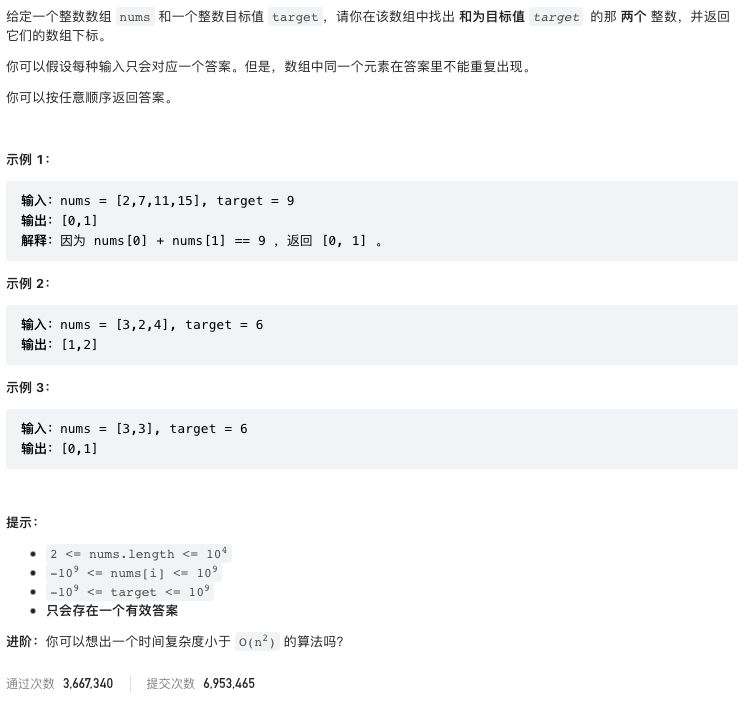
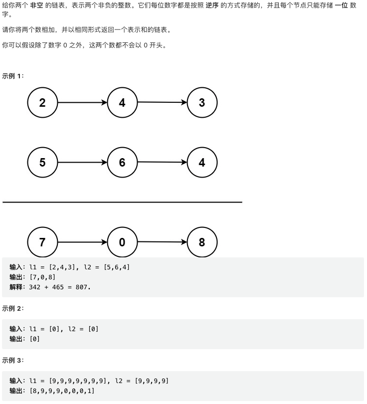

# LeetCode 100题

### DAY 08-04

#### 两数之和



```java

    public static int[] twoSum(int[] nums, int target) {
        Map<Integer, Integer> map = new HashMap<>();
        for (int i = 0; i < nums.length; i++) {
            if (map.containsKey(target - nums[i])) {
                int[] result = new int[2];
                result[0] = map.get(target - nums[i]);
                result[1] = i;
                return result;
            }
            map.put(nums[i], i);
        }
        return null;
    }
```

#### 两数相加



```java
    public ListNode addTwoNumbers(ListNode l1, ListNode l2) {
        ListNode head = null, tail = null;
        int carry = 0;
        while (l1 != null || l2 != null) {
            int n1 = l1 != null ? l1.val : 0;
            int n2 = l2 != null ? l2.val : 0;
            int sum = n1 + n2 + carry;
            if (head == null) {
                head = tail = new ListNode(sum % 10);
            } else {
                tail.next = new ListNode(sum % 10);
                tail = tail.next;
            }
            carry = sum / 10;
            if (l1 != null) {
                l1 = l1.next;
            }
            if (l2 != null) {
                l2 = l2.next;
            }
        }
        if (carry > 0) {
            tail.next = new ListNode(carry);
        }
        return head;
    }
```

