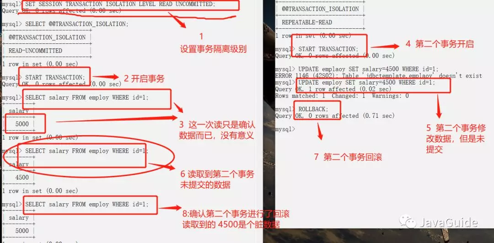
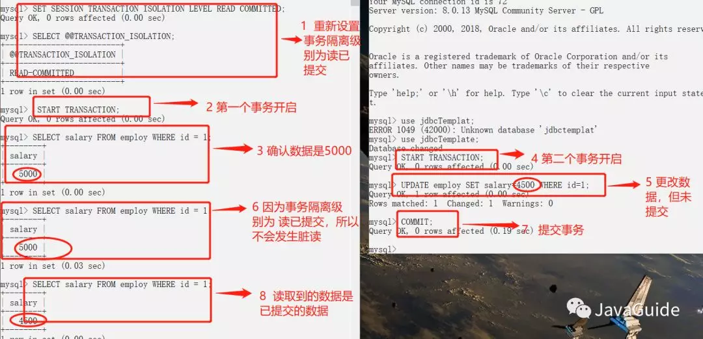
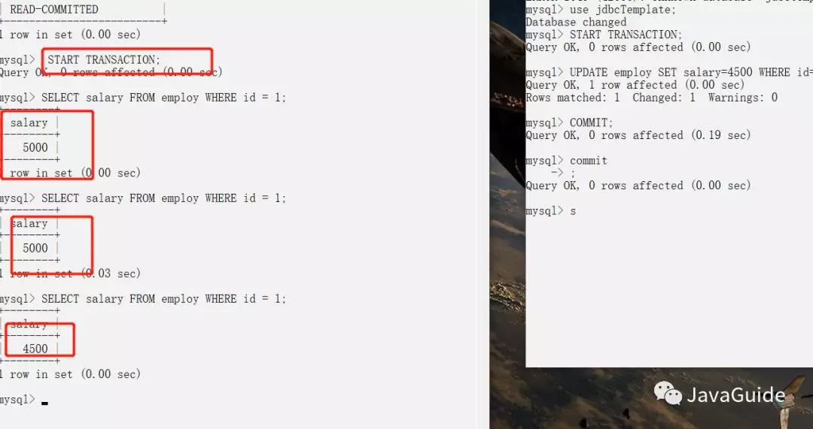
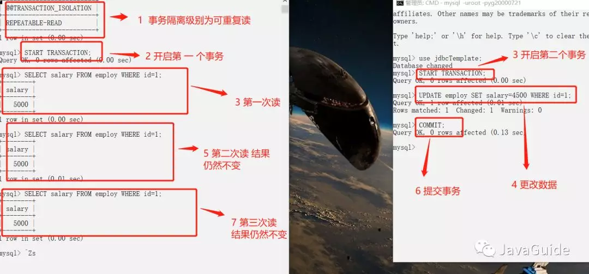
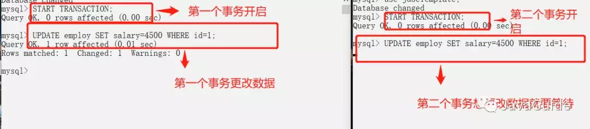

## 一、事务隔离级别

### 1.什么是事务?

事务是逻辑上的一组操作，要么都执行，要么都不执行。

事务最经典也经常被拿出来说例子就是转账了。假如小明要给小红转账1000元，这个转账会涉及到两个关键操作就是：将小明的余额减少1000元，将小红的余额增加1000元。万一在这两个操作之间突然出现错误比如银行系统崩溃，导致小明余额减少而小红的余额没有增加，这样就不对了。事务就是保证这两个关键操作要么都成功，要么都要失败。

### 2.事物的特性(ACID)


**原子性：** 事务是最小的执行单位，不允许分割。事务的原子性确保动作要么全部完成，要么完全不起作用；

**一致性：** 执行事务前后，数据保持一致；

**隔离性：** 并发访问数据库时，一个用户的事务不被其他事务所干扰，各并发事务之间数据库是独立的；

**持久性:** 一个事务被提交之后。它对数据库中数据的改变是持久的，即使数据库发生故障也不应该对其有任何影响。

### 3.并发事务带来的问题

在典型的应用程序中，多个事务并发运行，经常会操作相同的数据来完成各自的任务（多个用户对统一数据进行操作）。并发虽然是必须的，但可能会导致以下的问题。

- **脏读（Dirty read）:** 当一个事务正在访问数据并且对数据进行了修改，而这种修改还没有提交到数据库中，这时另外一个事务也访问了这个数据，然后使用了这个数据。因为这个数据是还没有提交的数据，那么另外一个事务读到的这个数据是“脏数据”，依据“脏数据”所做的操作可能是不正确的。

- **丢失修改（Lost to modify）:** 指在一个事务读取一个数据时，另外一个事务也访问了该数据，那么在第一个事务中修改了这个数据后，第二个事务也修改了这个数据。这样第一个事务内的修改结果就被丢失，因此称为丢失修改。 例如：事务1读取某表中的数据A=20，事务2也读取A=20，事务1修改A=A-1，事务2也修改A=A-1，最终结果A=19，事务1的修改被丢失。

- **不可重复读（Unrepeatableread）:** 指在一个事务内多次读同一数据。在这个事务还没有结束时，另一个事务也访问该数据。那么，在第一个事务中的两次读数据之间，由于第二个事务的修改导致第一个事务两次读取的数据可能不太一样。这就发生了在一个事务内两次读到的数据是不一样的情况，因此称为不可重复读。
- **幻读（Phantom read）:** 幻读与不可重复读类似。它发生在一个事务（T1）读取了几行数据，接着另一个并发事务（T2）插入了一些数据时。在随后的查询中，第一个事务（T1）就会发现多了一些原本不存在的记录，就好像发生了幻觉一样，所以称为幻读。

幻读：

指的是在一个事务A中执行了一个当前读操作，而另外一个事务B在事务A的影响区间内insert了一条记录，这时事务A再执行一个当前读操作时，出现了幻行。这和不可重复读的主要区别就在与事务A中一个是快照读，一个当前读；并且事务B中一个是任何的dml操作，一个只是insert。比如在A中select * from test where id<10 lock in share mode结果集为（1,2,3），这时在B中对test表插入了一条记录4，这时在A中重新查询结果集就是(1,2,3,4），和事务A在第一次查询出来的结果集不一致，这里的4就是幻行。

由于可重读的隔离级别下，默认采用Next-Key Locks，就是Record lock和gap lock的结合，即除了锁住记录本身，还要再锁住索引之间的间隙，所以这个gap lock机制默认打开，并不会产生幻行，那么我们要演示幻行的话，要么将隔离级别改为read-commited(会产生幻读)，要么在REPEATABLE-READ模式下禁用掉gap lock(不禁用gap lock,不会产生幻读)。

**不可重复度和幻读区别：**

不可重复读的重点是修改，幻读的重点在于新增或者删除。

例1（同样的条件, 你读取过的数据, 再次读取出来发现值不一样了 ）：事务1中的A先生读取自己的工资为 1000的操作还没完成，事务2中的B先生就修改了A的工资为2000，导 致A再读自己的工资时工资变为 2000；这就是不可重复读。

例2（同样的条件, 第1次和第2次读出来的记录数不一样 ）：假某工资单表中工资大于3000的有4人，事务1读取了所有工资大于3000的人，共查到4条记录，这时事务2 又插入了一条工资大于3000的记录，事务1再次读取时查到的记录就变为了5条，这样就导致了幻读。

### 4.事务隔离级别

**SQL 标准定义了四个隔离级别：**

- **READ-UNCOMMITTED(读取未提交)：** 最低的隔离级别，允许读取尚未提交的数据变更，**可能会导致脏读、幻读或不可重复读**
- **READ-COMMITTED(读取已提交):** 允许读取并发事务已经提交的数据，**可以阻止脏读，但是幻读或不可重复读仍有可能发生**
- **REPEATABLE-READ（可重读）:** 对同一字段的多次读取结果都是一致的，除非数据是被本身事务自己所修改，**可以阻止脏读和不可重复读，但幻读仍有可能发生。**
- **SERIALIZABLE(可串行化):** 最高的隔离级别，完全服从ACID的隔离级别。所有的事务依次逐个执行，这样事务之间就完全不可能产生干扰，也就是说，**该级别可以防止脏读、不可重复读以及幻读**。

MySQL InnoDB 存储引擎的默认支持的隔离级别是 **REPEATABLE-READ（可重读）**。我们可以通过`SELECT @@tx_isolation;`命令来查看

```sql
mysql> SELECT @@tx_isolation;
+-----------------+
| @@tx_isolation  |
+-----------------+
| REPEATABLE-READ |
+-----------------+
```

这里需要注意的是：与 SQL 标准不同的地方在于InnoDB 存储引擎在 **REPEATABLE-READ（可重读）**事务隔离级别下使用的是Next-Key Lock 锁算法，因此可以避免幻读的产生，这与其他数据库系统(如 SQL Server)是不同的。所以说InnoDB 存储引擎的默认支持的隔离级别是 **REPEATABLE-READ（可重读）** 已经可以完全保证事务的隔离性要求，即达到了 SQL标准的**SERIALIZABLE(可串行化)**隔离级别。

因为隔离级别越低，事务请求的锁越少，所以大部分数据库系统的隔离级别都是**READ-COMMITTED(读取提交内容):**，但是你要知道的是InnoDB 存储引擎默认使用 **REPEATABLE-READ（可重读）**并不会有任何性能损失。

InnoDB 存储引擎在 **分布式事务** 的情况下一般会用到**SERIALIZABLE(可串行化)**隔离级别。

### 5.实际情况演示

MySQL 命令行的默认配置中事务都是自动提交的，即执行SQL语句后就会马上执行 COMMIT 操作。如果要显式地开启一个事务需要使用命令：`START TARNSACTION`。

我们可以通过下面的命令来设置隔离级别。

```sql
SET [SESSION|GLOBAL] TRANSACTION ISOLATION LEVEL [READ UNCOMMITTED|READ COMMITTED|REPEATABLE READ|SERIALIZABLE]
```

我们再来看一下我们在下面实际操作中使用到的一些并发控制语句:

- `START TARNSACTION` |`BEGIN`:显式地开启一个事务。
- `COMMIT`:提交事务，使得对数据库做的所有修改成为永久性。
- `ROLLBACK` 回滚会结束用户的事务，并撤销正在进行的所有未提交的修改。

在下面我会使用 2 个命令行 MySQL ，模拟多线程（多事务）。

#### 脏读(读未提交)



#### 避免脏读(读已提交)



#### 不可重复读

还是刚才上面的读已提交的图，虽然避免了读未提交，但是却出现了，一个事务还没有结束，就发生了 不可重复读问题。



#### 可重复读



#### 防止幻读(可重复读)



一个事务对数据库进行操作，这种操作的范围是数据库的全部行，然后第二个事务也在对这个数据库操作，这种操作可以是插入一行记录或删除一行记录，那么第一个是事务就会觉得自己出现了幻觉，怎么还有没有处理的记录呢? 或者 怎么多处理了一行记录呢?

幻读和不可重复读有些相似之处 ，但是不可重复读的重点是修改，幻读的重点在于新增或者删除。

## 二、MySQL存储引擎

show engines;命令查看MySQL中的存储引擎。

### 1.InnoDB

mysql5.5及以后版本默认存储引擎。

（1） **innodb存储引擎的mysql表提供了事务**，回滚以及系统崩溃修复能力和多版本迸发控制的事务的安全。

（2）innodb支持自增长列（auto_increment）,自增长列的值不能为空，如果在使用的时候为空的话怎会进行自动存现有的值开始增值，如果有但是比现在的还大，则就保存这个值。

（3）**innodb存储引擎支持外键（foreign key）** ,外键所在的表称为子表而所依赖的表称为父表。

（4）innodb存储引擎最重要的是支持事务，以及事务相关联功能。

（5）**innodb存储引擎支持mvcc的行级锁**。

（6）**innodb存储引擎索引使用的是B+Tree**

（7）不支持Hash

mvcc类似于java中的读锁具体介绍可以看这篇文章：http://blog.csdn.net/chosen0ne/article/details/18093187

### 2.MyISAM

1、**MyISAM   这种存储引擎不支持事务，不支持行级锁，只支持并发插入的表锁，主要用于高负载的select**。

2、MyISAM   类型的表支持三种不同的存储结构：静态型、动态型、压缩型。

（1）静态型：就是定义的表列的大小是固定（即不含有：xblob、xtext、varchar等长度可变的数据类型），这样mysql就会自动使用静态myisam格式。使用静态格式的表的性能比较高，因为在维护和访问的时候以预定格式存储数据时需要的开销很低。但是这高性能是有空间换来的，因为在定义的时候是固定的，所以不管列中的值有多大，都会以最大值为准，占据了整个空间。

（2）动态型：如果列（即使只有一列）定义为动态的（xblob, xtext, varchar等数据类型），这时myisam就自动使用动态型，虽然动态型的表占用了比静态型表较少的空间，但带来了性能的降低，因为如果某个字段的内容发生改变则其位置很可能需要移动，这样就会导致碎片的产生。随着数据变化的怎多，碎片就会增加，数据访问性能就会相应的降低。

对于因为碎片的原因而降低数据访问性，有两种解决办法：

- 尽可能使用静态数据类型
- 经常使用optimize   table语句，他会整理表的碎片，恢复由于表的更新和删除导致的空间丢失。
  (如果存储引擎不支持 optimize  table    则可以转储并重新加载数据，这样也可以减少碎片)

（3）压缩型：如果在这个数据库中创建的是在整个生命周期内只读的表，则这种情况就是用myisam的压缩型表来减少空间的占用。

3、MyISAM也是使用B+tree索引但是和Innodb的在具体实现上有些不同。

**4、支持FULL-TEXT和B+tree，不支持Hash索引**

### 3.MEMORY

（1）memory存储引擎相比前面的一些存储引擎，有点不一样，其使用存储在内存中的数据来创建表，而且所有的数据也都存储在内存中。

（2）每个基于memory存储引擎的表实际对应一个磁盘文件，该文件的文件名和表名是相同的，类型为.frm。该文件只存储表的结构，而其数据文件，都是存储在内存中，这样有利于对数据的快速处理，提高整个表的处理能力。

（3）memory存储引擎默认使用哈希（HASH）索引，其速度比使用B-+Tree型要快，如果读者希望使用B树型，则在创建的时候可以引用。

（4）memory存储引擎文件数据都存储在内存中，如果mysqld进程发生异常，重启或关闭机器这些数据都会消失。所以memory存储引擎中的表的生命周期很短，一般只使用一次。

（5）**不支持事务，支持表级锁，支持HASH索引，不支持FULL-TEXT索引**


## 三、分布式

### 1.分布式CAP理论

CAP由[Eric Brewer](https://en.wikipedia.org/wiki/Eric_Brewer_(scientist))在2000年PODC会议上提出，是Eric Brewer在Inktomi期间研发搜索引擎、分布式web缓存时得出的关于数据一致性(consistency)、服务可用性(availability)、分区容错性(partition-tolerance)的猜想：

分布式系统的CAP理论：理论首先把分布式系统中的三个特性进行了如下归纳：

- 一致性（C）：在分布式系统中的所有数据备份，在同一时刻是否同样的值。（等同于所有节点访问同一份最新的数据副本）
- 可用性（A）：在集群中一部分节点故障后，集群整体是否还能响应客户端的读写请求。（对数据更新具备高可用性）
- 分区容忍性（P）：以实际效果而言，分区相当于对通信的时限要求。系统如果不能在时限内达成数据一致性，就意味着发生了分区的情况，必须就当前操作在C和A之间做出选择。

## 四、MySQL索引

用来加快查询的技术很多，其中最重要的是索引。通常索引能够快速提高查询速度。如果不适用索引，MYSQL必须从第一条记录开始然后读完整个表直到找出相关的行。表越大，花费的时间越多。但也不全是这样。本文讨论索引是什么以及如何使用索引来改善性能，以及索引可能降低性能的情况。

### 1.索引的本质

数据库查询是数据库的最主要功能之一。我们都希望查询数据的速度能尽可能的快，因此数据库系统的设计者会从查询算法的角度进行优化。最基本的查询算法当然是顺序查找（linear search），这种复杂度为O(n)的算法在数据量很大时显然是糟糕的，好在计算机科学的发展提供了很多更优秀的查找算法，例如二分查找（binary search）、二叉树查找（binary tree search）等。如果稍微分析一下会发现，每种查找算法都只能应用于特定的数据结构之上，例如二分查找要求被检索数据有序，而二叉树查找只能应用于二叉查找树上，但是数据本身的组织结构不可能完全满足各种数据结构（例如，理论上不可能同时将两列都按顺序进行组织），所以，**在数据之外，数据库系统还维护着满足特定查找算法的数据结构，这些数据结构以某种方式引用（指向）数据，这样就可以在这些数据结构上实现高级查找算法。这种数据结构，就是索引。**

### 2.B-Tree

为了描述B-Tree，首先定义一条数据记录为一个二元组[key, data]，key为记录的键值，对于不同数据记录，key是互不相同的；data为数据记录除key外的数据。那么B-Tree是满足下列条件的数据结构：

- d为大于1的一个正整数，称为B-Tree的度。
- h为一个正整数，称为B-Tree的高度。
- 每个非叶子节点由n-1个key和n个指针组成，其中d<=n<=2d。
- 每个叶子节点最少包含一个key和两个指针，最多包含2d-1个key和2d个指针，叶节点的指针均为null 。
- 所有叶节点具有相同的深度，等于树高h。
- key和指针互相间隔，节点两端是指针。
- 一个节点中的key从左到右非递减排列。
- 所有节点组成树结构。
- 每个指针要么为null，要么指向另外一个节点。
- 如果某个指针在节点node最左边且不为null，则其指向节点的所有key小于v(key1)v(key1)，其中v(key1)v(key1)为node的第一个key的值。
- 如果某个指针在节点node最右边且不为null，则其指向节点的所有key大于v(keym)v(keym)，其中v(keym)v(keym)为node的最后一个key的值。
- 如果某个指针在节点node的左右相邻key分别是keyikeyi和keyi+1keyi+1且不为null，则其指向节点的所有key小于v(keyi+1)v(keyi+1)且大于v(keyi)v(keyi)。

图2是一个d=2的B-Tree示意图。


### 3.B+Tree

B-Tree有许多变种，其中最常见的是B+Tree，例如MySQL就普遍使用B+Tree实现其索引结构。

与B-Tree相比，B+Tree有以下不同点：

每个节点的指针上限为2d而不是2d+1。

内节点不存储data，只存储key；叶子节点不存储指针。


**为什么使用B-Tree（B+Tree）**

上文说过，红黑树等数据结构也可以用来实现索引，但是文件系统及数据库系统普遍采用B-/+Tree作为索引结构，这一节将结合计算机组成原理相关知识讨论B-/+Tree作为索引的理论基础。

一般来说，索引本身也很大，不可能全部存储在内存中，因此索引往往以索引文件的形式存储的磁盘上。这样的话，索引查找过程中就要产生磁盘I/O消耗，相对于内存存取，I/O存取的消耗要高几个数量级，所以评价一个数据结构作为索引的优劣最重要的指标就是在查找过程中磁盘I/O操作次数的渐进复杂度。换句话说，索引的结构组织要尽量减少查找过程中磁盘I/O的存取次数。下面先介绍内存和磁盘存取原理，然后再结合这些原理分析B-/+Tree作为索引的效率。

### 4.索引的存储分类

索引是在MYSQL的存储引擎层中实现的，而不是在服务层实现的。所以每种存储引擎的索引都不一定完全相同，也不是所有的存储引擎都支持所有的索引类型。MYSQL目前提供了一下4种索引。

- B-Tree 索引：最常见的索引类型，大部分引擎都支持B树索引。
- HASH 索引：只有Memory引擎支持，使用场景简单。
- R-Tree 索引(空间索引)：空间索引是MyISAM的一种特殊索引类型，主要用于地理空间数据类型。
- Full-text (全文索引)：全文索引也是MyISAM的一种特殊索引类型，主要用于全文索引，InnoDB从MYSQL5.6版本提供对全文索引的支持。

> Mysql目前不支持函数索引，但是能对列的前面某一部分进行索引，例如标题title字段，可以只取title的前10个字符进行索引，这个特性可以大大缩小索引文件的大小，但前缀索引也有缺点，在排序Order By和分组Group By 操作的时候无法使用。用户在设计表结构的时候也可以对文本列根据此特性进行灵活设计。
> **语法**：create index idx_title on film (title(10))

**MyISAM、InnoDB引擎、Memory三个常用引擎类型比较**

| 索引           | MyISAM引擎 | InnoDB引擎 | Memory引擎 |
| :------------- | :--------- | :--------- | :--------- |
| B-Tree 索引    | 支持       | 支持       | 支持       |
| HASH 索引      | 不支持     | 不支持     | 支持       |
| R-Tree 索引    | 支持       | 不支持     | 不支持     |
| Full-text 索引 | 不支持     | 暂不支持   | 不支持     |

### 5.B-TREE索引类型

- **普通索引**
  这是最基本的索引类型，而且它没有唯一性之类的限制。普通索引可以通过以下几种方式创建：
  （1）创建索引: CREATE INDEX 索引名 ON 表名(列名1，列名2,...);
  （2）修改表: ALTER TABLE 表名ADD INDEX 索引名 (列名1，列名2,...);
  （3）创建表时指定索引：CREATE TABLE 表名 ( [...], INDEX 索引名 (列名1，列名 2,...) );
- **UNIQUE索引**
  表示唯一的，不允许重复的索引，如果该字段信息保证不会重复例如身份证号用作索引时，可设置为unique：
  （1）创建索引：CREATE UNIQUE INDEX 索引名 ON 表名(列的列表);
  （2）修改表：ALTER TABLE 表名ADD UNIQUE 索引名 (列的列表);
  （3）创建表时指定索引：CREATE TABLE 表名( [...], UNIQUE 索引名 (列的列表) );
- **主键：PRIMARY KEY索引**
  主键是一种唯一性索引，但它必须指定为“PRIMARY KEY”。
  （1）主键一般在创建表的时候指定：“CREATE TABLE 表名( [...], PRIMARY KEY (列的列表) ); ”。
  （2）但是，我们也可以通过修改表的方式加入主键：“ALTER TABLE 表名ADD PRIMARY KEY (列的列表); ”。
  每个表只能有一个主键。 （主键相当于聚合索引，是查找最快的索引）
  `注：不能用CREATE INDEX语句创建PRIMARY KEY索引`

### 6.索引设置语法

#### （1）设置索引

在执行CREATE TABLE语句时可以创建索引，也可以单独用CREATE INDEX或ALTER TABLE来为表增加索引。

**ALTER TABLE** - ALTER TABLE用来创建**普通索引**、**UNIQUE索引**或**PRIMARY KEY索引**。

- ALTER TABLE table_name ADD **INDEX** index_name (column_list)
- ALTER TABLE table_name ADD **UNIQUE** (column_list)
- ALTER TABLE table_name ADD **PRIMARY KEY** (column_list)

**CREATE INDEX** - CREATE INDEX可对表增加普通索引或UNIQUE索引。

- CREATE INDEX index_name ON table_name (column_list)
- CREATE UNIQUE INDEX index_name ON table_name (column_list)

#### （2）删除索引

可利用ALTER TABLE或DROP INDEX语句来删除索引。类似于CREATE INDEX语句，DROP INDEX可以在ALTER TABLE内部作为一条语句处理，语法如下。

- DROP INDEX index_name ON talbe_name
- ALTER TABLE table_name DROP INDEX index_name
- ALTER TABLE table_name DROP PRIMARY KEY

其中，前两条语句是等价的，删除掉table_name中的索引index_name。
第3条语句只在删除PRIMARY KEY索引时使用，**因为一个表只可能有一个PRIMARY KEY索引，因此不需要指定索引名**。如果没有创建PRIMARY KEY索引，但表具有一个或多个UNIQUE索引，则MySQL将删除第一个UNIQUE索引。

> 如果从表中删除了某列，则索引会受到影响。对于多列组合的索引，如果删除其中的某列，则该列也会从索引中删除。如果删除组成索引的所有列，则整个索引将被删除。

#### （3）查看索引

```mysql
mysql> show index from tblname;
mysql> show keys from tblname;
```

- **Table**：表的名称
- **Non_unique**：如果索引不能包括重复词，则为0。如果可以，则为1
- **Key_name**：索引的名称
- **Seq_in_index**：索引中的列序列号，从1开始
- **Column_name**：列名称
- **Collation**：列以什么方式存储在索引中。在MySQL中，有值‘A’（升序）或NULL（无分类）。
- **Cardinality**：索引中唯一值的数目的估计值。通过运行ANALYZE TABLE或myisamchk -a可以更新。基数根据被存储为整数的统计数据来计数，所以即使对于小型表，该值也没有必要是精确的。基数越大，当进行联合时，MySQL使用该索引的机会就越大。
- **Sub_part**：如果列只是被部分地编入索引，则为被编入索引的字符的数目。如果整列被编入索引，则为NULL。
- **Packed**：指示关键字如何被压缩。如果没有被压缩，则为NULL。
- **Null**：如果列含有NULL，则含有YES。如果没有，则该列含有NO。
- **Index_type**：用过的索引方法（BTREE, FULLTEXT, HASH, RTREE）。
- **Comment**：更多评注。

### 7.索引选择性

#### （1）索引选择原则

1. 较频繁的作为查询条件的字段应该创建索引

2. 唯一性太差的字段不适合单独创建索引，即使频繁作为查询条件

3. 更新非常频繁的字段不适合创建索引

> 当然，并不是存在更新的字段就适合创建索引，从判定策略的用语上也可以看出，是"非常频繁"的字段。到底什么样的更新频率应该算是"非常频繁"呢？每秒？每分钟？还是每小时呢？说实话，还真难定义。很多时候是通过比较同一时间段内被更新的次数和利用该字段作为条件的查询次数来判断的，如果通过该字段的查询并不是很多，可能几个小时或是更长才会执行一次，更新反而比查询更频繁，那这样的字段肯定不适合创建索引。反之，如果我们通过该字段的查询比较频繁，但更新并不是特别多，比如查询几十次或更多才可能会产生一次更新，那我个人觉得更新所带来的附加成本也是可以接受的。

4. 不会出现在 WHERE 子句中的字段不该创建索引

#### （2）索引选择原则细则

- 性能优化过程中，选择在哪个列上创建索引是最非常重要的。可以考虑使用索引的主要有 两种类型的列：**在where子句中出现的列**，**在join子句中出现的列**，而不是在SELECT关键字后选择列表的列；
- 索引列的基数越大，索引的效果越好。例如，存放出生日期的列具有不同的值，很容易区分行，而用来记录性别的列，只有"M"和"F",则对此进行索引没有多大用处，因此不管搜索哪个值，都会得出大约一半的行,（ `见索引选择性注意事项对选择性解释`；）
- 使用短索引，如果对字符串列进行索引，应该指定一个前缀长度，可节省大量索引空间，提升查询速度；

> 例如，有一个CHAR(200)列，如果在前10个或20个字符内，多数值是唯一的，那么就不要对整个列进行索引。对前10个或者20个字符进行索引能够节省大量索引空间，也可能会使查询更快。较小的索引涉及的磁盘IO较少，较短的值比较起来更快。更为重要的是，对于较短的键值，所以高速缓存中的快能容纳更多的键值，因此，MYSQL也可以在内存中容纳更多的值。这样就增加了找到行而不用读取索引中较多快的可能性。

- 利用最左前缀

#### （3）索引选择注意事项

然索引可以加快查询速度，那么是不是只要是查询语句需要，就建上索引？答案是否定的。因为索引虽然加快了查询速度，但索引也是有代价的：索引文件本身要消耗存储空间，同时索引会加重插入、删除和修改记录时的负担，另外，MySQL在运行时也要消耗资源维护索引，因此索引并不是越多越好。

**一般两种情况下不建议建索引：**

1. 表记录比较少，例如一两千条甚至只有几百条记录的表，没必要建索引，让查询做全表扫描就好了;

   > 至于多少条记录才算多，这个个人有个人的看法，我个人的经验是以2000作为分界线，记录数不超过 2000可以考虑不建索引，超过2000条可以酌情考虑索引。

2. 索引的选择性较低。所谓索引的选择性（Selectivity），是指不重复的索引值（也叫基数，Cardinality）与表记录数（#T）的比值：
   `Index Selectivity = Cardinality / #T`

   显然选择性的取值范围为(0, 1]，选择性越高的索引价值越大，这是由B+Tree的性质决定的。例如，上文用到的employees.titles表，如果title字段经常被单独查询，是否需要建索引，我们看一下它的选择性：

   > SELECT count(DISTINCT(title))/count(*) AS Selectivity FROM employees.titles;
   >
   > ```sql
   > +-------------+
   > | Selectivity |
   > +-------------+
   > |      0.0000 |
   > +-------------+
   > ```

   **title的选择性不足0.0001（精确值为0.00001579），所以实在没有什么必要为其单独建索引。**

3. MySQL只对以下操作符才使用索引：**<,<=,=,>,>=,between,in**, 以及某些时候的`like(不以通配符%或_开头的情形)`。

4. 不要过度索引，只保持所需的索引。每个额外的索引都要占用额外的磁盘空间，并降低写操作的性能。 在修改表的内容时，索引必须进行更新，有时可能需要重构，因此，索引越多，所花的时间越长。

可以参考这块内容：<http://blog.codinglabs.org/articles/theory-of-mysql-index.html>

### 8.索引的弊端

确实，索引能够极大地提高数据检索效率，也能够改善排序分组操作的性能，但有不能忽略的一个问题就是索引是完全独立于基础数据之外的一部分数据。假设在Table ta 中的Column ca 创建了索引 idx_ta_ca，那么任何更新 Column ca 的操作，MySQL在更新表中 Column ca的同时，都须要更新Column ca 的索引数据，调整因为更新带来键值变化的索引信息。而如果没有对 Column ca 进行索引，MySQL要做的仅仅是更新表中 Column ca 的信息。这样，最明显的资源消耗就是增加了更新所带来的 IO 量和调整索引所致的计算量。此外，Column ca 的索引idx_ta_ca须要占用存储空间，而且随着 Table ta 数据量的增加，idx_ta_ca 所占用的空间也会不断增加，所以索引还会带来存储空间资源消耗的增加。

## 五、数据库范式

实体：现实世界中客观存在并可以被区别的事物。比如“一个学生”、“一本书”、“一门课”等等。值得强调的是这里所说的“事物”不仅仅是看得见摸得着的“东西”，它也可以是虚拟的，比如说“老师与学校的关系”。

属性：教科书上解释为：“实体所具有的某一特性”，由此可见，属性一开始是个逻辑概念，比如说，“性别”是“人”的一个属性。在关系数据库中，属性又是个物理概念，属性可以看作是“表的一列”。

元组：表中的一行就是一个元组。

分量：元组的某个属性值。在一个关系数据库中，它是一个操作原子，即关系数据库在做任何操作的时候，属性是“不可分的”。否则就不是关系数据库了。

码：表中可以唯一确定一个元组的某个属性（或者属性组），如果这样的码有不止一个，那么大家都叫候选码，我们从候选码中挑一个出来做老大，它就叫主码。

全码：如果一个码包含了所有的属性，这个码就是全码。

主属性：一个属性只要在任何一个候选码中出现过，这个属性就是主属性。

非主属性：与上面相反，没有在任何候选码中出现过，这个属性就是非主属性。

外码：一个属性（或属性组），它不是码，但是它别的表的码，它就是外码。

完全函数依赖：设X, Y是关系R的两个属性集合，X’是X的真子集，存在X→Y，但对每一个X’都有X’!→Y，则称Y完全函数依赖于X。

部分函数依赖：设X, Y是关系R的两个属性集合，存在X→Y，若X’是X的真子集，存在X’→Y，则称Y部分函数依赖于X。

传递函数依赖：设X, Y, Z是关系R中互不相同的属性集合，存在X→Y(Y !→X),Y→Z，则称Z传递函数依赖于X。

### 1.第一范式（1NF）

属性不可分。

### 2.第二范式（2NF）

符合1 NF，并且，非主属性完全依赖于码（注意是完全依赖不能是部分依赖）。消除部分依赖。

可以通过投影分解，将一个表分解成两个或若干个表，使其满足第二范式。

### 3.第三范式（3NF）

符合2 NF，并且，不存在传递函数依赖。就是为了消除传递依赖（也就是每个非主属性都不传递依赖于候选键，判断传递函数依赖，指的是如果存在"A → B → C"的决定关系，则C传递函数依赖于A。）

可以通过投影分解，将一个表分解成两个或若干个表，使其满足第二范式。

### 4.BC 范式（BCNF）

符合3NF，并且，主属性不依赖于主属性(也就是不存在任何字段对任一候选关键字段的传递函数依赖)
BC范式既检查非主属性，又检查主属性。当只检查非主属性时，就成了第三范式。满足BC范式的关系都必然满足第三范式。

还可以这么说：若一个关系达到了第三范式，并且它只有一个候选码，或者它的每个候选码都是单属性，则该关系自然达到BC范式。

一个满足BCNF的关系模式的条件:

　　1.所有非主属性对每一个码都是完全函数依赖。

　　2.所有的主属性对每一个不包含它的码,也是完全函数依赖。

　　3.没有任何属性完全函数依赖于非码的任何一组属性。

一般，一个数据库设计符合3NF或BCNF就可以了。在BC范式以上还有第四范式、第五范式。

### 5.第四范式

要求把同一表内的多对多关系删除。

### 6.第五范式

从最终结构重新建立原始结构。
其实数据库设计范式这方面重点掌握的就是1NF、2NF、3NF、BCNF

四种范式之间存在如下关系：

这里主要区别3NF和BCNF，一句话就是3NF是要满足不存在非主属性对候选码的传递函数依赖，BCNF是要满足不存在任一属性（包含非主属性和主属性）对候选码的传递函数依赖。

## 六、Join查询


大致分为内连接，外连接，右连接，左连接，自然连接。

### 1.笛卡尔积：CROSS JOIN

笛卡尔积就是将A表的每一条记录与B表的每一条记录强行拼在一起。所以，如果A表有n条记录，B表有m条记录，笛卡尔积产生的结果就会产生n*m条记录。产生笛卡尔积有如下几种方式：

```sql
select * from tableA,tableB;
select * from tableA INNER JOIN tableB;
select * from tableA CROSS JOIN tableB;
```

### 2.内连接：INNER JOIN

内连接INNER JOIN是最常用的连接操作。**从数学的角度讲就是求两个表的交集**，从笛卡尔积的角度讲就是从笛卡尔积中挑出ON子句条件成立的记录。有INNER JOIN，WHERE（等值连接），STRAIGHT_JOIN,JOIN(省略INNER)四种写法。

```sql
SELECT * FROM t_blog JOIN t_type ON t_blog.typeId=t_type.id;
SELECT * FROM t_blog INNER JOIN t_type ON t_blog.typeId=t_type.id;
SELECT * FROM t_blog,t_type WHERE t_blog.typeId=t_type.id;
SELECT * FROM t_blog STRAIGHT_JOIN t_type ON t_blog.typeId=t_type.id;

    +----+-------+--------+----+------+
    | id | title | typeId | id | name |
    +----+-------+--------+----+------+
    |  1 | aaa   |      1 |  1 | C++  |
    |  2 | bbb   |      2 |  2 | C    |
    |  7 | ggg   |      2 |  2 | C    |
    |  3 | ccc   |      3 |  3 | Java |
    |  6 | fff   |      3 |  3 | Java |
    |  4 | ddd   |      4 |  4 | C#   |
    |  5 | eee   |      4 |  4 | C#   |
    +----+-------+--------+----+------+
```

### 3.左连接：LEFT JOIN

左连接LEFT JOIN的含义就是求两个表的交集外加左表剩下的数据。依旧从笛卡尔积的角度讲，就是先从笛卡尔积中挑出ON子句条件成立的记录，然后加上左表中剩余的记录（看下面的最后几行）。

```sql
SELECT a.*,b.* from aid_info a LEFT JOIN aid_info2 b on a.id=b.id;

+----+-----------+------+-----------+
| id | aid       | id   | aid       |
+----+-----------+------+-----------+
|  1 | 0314      |    1 | 0314      |
|  3 | 0128      |    3 | 0128      |
|  5 | 031475684 |    5 | 031475684 |
|  2 | 0314589   | NULL | NULL      |
|  4 | 0789      | NULL | NULL      |
|  6 | 0987      | NULL | NULL      |
+----+-----------+------+-----------+
```

### 4.右连接：RIGHT JOIN

同理右连接RIGHT JOIN就是求两个表的交集外加右表剩下的数据。再次从笛卡尔积的角度描述，右连接就是从笛卡尔积中挑出ON子句条件成立的记录，然后加上右表中剩余的记录（见下面的最后几行）。

```sql
SELECT a.*,b.* from aid_info2 a RIGHT JOIN aid_info b on a.id=b.id;

+------+-----------+----+-----------+
| id   | aid       | id | aid       |
+------+-----------+----+-----------+
|    1 | 0314      |  1 | 0314      |
|    3 | 0128      |  3 | 0128      |
|    5 | 031475684 |  5 | 031475684 |
| NULL | NULL      |  2 | 0314589   |
| NULL | NULL      |  4 | 0789      |
| NULL | NULL      |  6 | 0987      |
+------+-----------+----+-----------+
```

### 5.外链接：OUTER JOIN

**外连接就是求两个集合的并集**。从笛卡尔积的角度讲就是从笛卡尔积中挑出ON子句条件成立的记录，然后加上左表中剩余的记录，最后加上右表中剩余的记录。另外MySQL不支持OUTER JOIN，但是我们可以对左连接和右连接的结果做UNION操作来实现。

```sql
SELECT * FROM t_blog LEFT JOIN t_type ON t_blog.typeId=t_type.id
UNION
SELECT * FROM t_blog RIGHT JOIN t_type ON t_blog.typeId=t_type.id;

    +------+-------+--------+------+------------+
    | id   | title | typeId | id   | name       |
    +------+-------+--------+------+------------+
    |    1 | aaa   |      1 |    1 | C++        |
    |    2 | bbb   |      2 |    2 | C          |
    |    7 | ggg   |      2 |    2 | C          |
    |    3 | ccc   |      3 |    3 | Java       |
    |    6 | fff   |      3 |    3 | Java       |
    |    4 | ddd   |      4 |    4 | C#         |
    |    5 | eee   |      4 |    4 | C#         |
    |    8 | hhh   |   NULL | NULL | NULL       |
    |    9 | iii   |   NULL | NULL | NULL       |
    |   10 | jjj   |   NULL | NULL | NULL       |
    | NULL | NULL  |   NULL |    5 | Javascript |
    +------+-------+--------+------+------------+
```

### 6.USING 子句

MySQL中连接SQL语句中，ON子句的语法格式为：table1.column_name = table2.column_name。当模式设计对联接表的列采用了相同的命名样式时，就可以使用 USING 语法来简化 ON 语法，格式为：USING(column_name)。 
所以，USING的功能相当于ON，区别在于USING指定一个属性名用于连接两个表，而ON指定一个条件。另外，**SELECT *时，USING会去除USING指定的列，而ON不会**。实例如下。USING()中可以放多个字段。

```sql
SELECT * from aid_info2 a JOIN aid_info b on a.id=b.id;
+----+-----------+----+-----------+
| id | aid       | id | aid       |
+----+-----------+----+-----------+
|  1 | 0314      |  1 | 0314      |
|  3 | 0128      |  3 | 0128      |
|  5 | 031475684 |  5 | 031475684 |
+----+-----------+----+-----------+

SELECT * from aid_info2 a JOIN aid_info b USING(id);
+----+-----------+-----------+
| id | aid       | aid       |
+----+-----------+-----------+
|  1 | 0314      | 0314      |
|  3 | 0128      | 0128      |
|  5 | 031475684 | 031475684 |
+----+-----------+-----------+
```

### 7.自然连接：NATURE JOIN

自然连接就是USING子句的简化版，它找出两个表中相同的列作为连接条件进行连接。有**左自然连接**，**右自然连接**和**普通自然连接**之分。在t_blog和t_type示例中，两个表相同的列是id，所以会拿id作为连接条件。 
另外千万分清下面三条语句的区别 。
自然连接:SELECT * FROM t_blog NATURAL JOIN t_type; 
笛卡尔积:SELECT * FROM t_blog NATURA JOIN t_type; 
笛卡尔积:SELECT * FROM t_blog NATURE JOIN t_type;

### 8.MySQL中的Join原理

#### （1）表连接算法

**Nested Loop Join（NLJ）算法：**

首先介绍一种基础算法:NLJ，嵌套循环算法。循环外层是驱动表，循坏内层是被驱动表。驱动表会驱动被驱动表进行连接操作。首先驱动表找到第一条记录，然后从头扫描被驱动表，逐一查找与驱动表第一条记录匹配的记录然后连接起来形成结果表中的一条记。被驱动表查找完后，再从驱动表中取出第二个记录，然后从头扫描被驱动表，逐一查找与驱动表第二条记录匹配的记录，连接起来形成结果表中的一条记录。重复上述操作，直到驱动表的全部记录都处理完毕为止。这就是嵌套循环连接算法的基本思想，伪代码如下。

```sql
    foreach row1 from t1
        foreach row2 from t2
            if row2 match row1 //row2与row1匹配，满足连接条件
                join row1 and row2 into result //连接row1和row2加入结果集
```

首先加载t1，然后从t1中取出第一条记录，之后加载t2表，与t2表中的记录逐个匹配，连接匹配的记录。

**Block Nested Loop Join(BNLJ)算法：** 

再介绍一种高级算法：BNLJ，块嵌套循环算法，可以看作对NLJ的优化。大致思想就是建立一个缓存区，一次从驱动表中取多条记录，然后扫描被驱动表，被驱动表的每一条记录都尝试与缓冲区中的多条记录匹配，如果匹配则连接并加入结果集。缓冲区越大，驱动表一次取出的记录就越多。这个算法的优化思路就是减少内循环的次数从而提高表连接效率。

#### （2）性能影响因素

**1.内循环的次数：**现在考虑这么一个场景，当t1有100条记录，t2有10000条记录。那么，t1驱动t2与t2驱动t1，他们之间在效率上孰优孰劣？如果是单纯的分析指令执行次数，他们都是100*10000,但是考虑到加载表的次数呢。首先分析t1驱动t2，t1表加载1次，t2表需要加载100次。然后分析t2驱动t1，t2表首先加载1次，但是t1表要加载10000次。所以，t1驱动t2的效率要优于t2驱动t1的效率。**由此得出，小表驱动大表能够减少内循环的次数从而提高连接效率。** 
另外，如果使用Block Nested Loop Join算法的话，通过扩大一次缓存区的大小也能减小内循环的次数。**由此又可得，设置合理的缓冲区大小能够提高连接效率**

**2.快速匹配：**扫描被驱动表寻找合适的记录可以看做一个查询操作，如何提高查询的效率呢？建索引啊！**由此还可得出，在被驱动表建立索引能够提高连接效率**

**3.排序：**假设t1表驱动t2表进行连接操作，连接条件是t1.id=t2.id，而且要求查询结果对id排序。现在有两种选择，方式一[...ORDER BY t1.id]，方式二[...ORDER BY t2.id]。如果我们使用方式一的话，可以先对t1进行排序然后执行表连接算法，如果我们使用方式二的话，只能在执行表连接算法后，对结果集进行排序（Using temporary），效率自然低下。**由此最后可得出，优先选择驱动表的属性进行排序能够提高连接效率。**

<https://www.cnblogs.com/fudashi/p/7506877.html>

#### （3）JOIN优化

<https://www.cnblogs.com/fudashi/p/7508272.html>

内循环的次数受驱动表的记录数所影响，驱动表记录数越多，内循环就越多，连接效率就越低下，所以尽量用小表驱动大表。

STRAIGHT_JOIN强制左表连接右表。By the way，STRIGHT_JOIN比较冷门，在这里解释下，其作用相当于内连接，不过强制规定了左表驱动右边。	

表的记录数是会变化的，有没有一劳永逸的写法？当然有啦，MySQL自带的Optimizer会优化内连接，优化策略就是上面讲的小表驱动大表。所以，以后写内连接不要纠结谁内连接谁了，直接让MySQL去判断吧。

## 七、模式

### 1.内模式

内模式对应物理级数据库，内模式是所有模式中的最低层的表示，不同于物理层，假设外存是一个无限性的地址空间，内模式是存储记录的类型，存储域以及表示以及存储记录的物理顺序，指示元索引，和存储路径的等数据的存储组织从而形成一个完整的系统。针对于数据库的开发人员

### 2.模式

对应数据库的概念模式，概念模式（概念、逻辑模式）用以描述整个数据库中的逻辑结构、用来描叙现实生活中的实体，以及它们之间的关系、从而定义记录数据项的完整性约束条件以及记录之间的联系是数据项的框架 

概念模式是数据库中全体数据的逻辑结构和特征的描叙是所有用户数据的公共数据视图。

针对于数据库表结构设计人员

### 3.外模式

对应数据库的升级、外模式包括（子模式 用户模式） 用来描述用户看到或者使用那部分的数据的逻辑结构，用户根据外模式用户数据操作语句或者程序去操作数据库中的数据，外模式的主要特点用来描述组成用户视图各个记录的组成、相互联系、数据的完整性和安全性、数据项的特征等。

针对于使用的人

## 八、MySQL InnoDB引擎双写

由于InnoDB和操作系统的页大小不一致，InnoDB页大小一般为16K，操作系统页大小为4K，导致InnoDB回写到dirty数据到操作系统中，一个页面需要写4次，写入过程出现问题无法保持原子性。写的过程如果崩溃或者断电，可能导致只有一部分写回到操作系统文件系统中，整个数据只是部分成功，其实数据是损坏的。

double write buffer是InnoDB在tablespace上的128个页（2个区）大小时2MB。为了解决partial page write问题，当MySQL将脏数据flush到data file的时候，先使用memcopy将脏数据复制到内存的double write buffer，之后通过double write buffer再分2次，每次写入1MB到共享表空间，然后马上调用fsync函数，同步到磁盘上，避免缓冲带来的问题，在这个过程中，double write是顺序写，开销并不大，在完成double write写入后，再将double write buffer写入到各表空间文件，这是是离散写入。

所以在正常情况下，MySQL写数据page时，会写两遍到磁盘上，第一遍是写到double write buffer，第二遍是从double write buffer写到真正的数据文件中。如果发生了极端情况（断电），InnoDB再次启动后，发现一个page数据已经损坏，那么此时就可以从double write buffer中进行数据恢复了。

位于共享表空间的double write buffer实际上也是一个文件，写共享表空间会导致系统有更多的fsync操作，而硬盘的fsync性能因素会降低MySQL的整体性能，但是并不会降低到原来的50%。这主要是因为：

- double write是在一个连续的存储空间，所以硬盘在写数据的时候是顺序写，而不是随机写，这样性能更高。
- 将数据从double write buffer写到真正的segment中的时候，系统会自动合并连接空间刷新的方式，每次可以刷新多个pages。

在一些情况下可以关闭double write以获取更高的性能。比如在slave上可以关闭，因为即使出现了partial page write问题，数据还是可以从中继日志中恢复。设置InnoDB_doublewrite=0即可关闭doublewrite buffer。

## 九、MySQL锁机制

从对数据库操作的类型分，分为`读锁和写锁`

- 读锁（共享锁）：针对同一份数据，多个读操作可以同时进行而不会互相影响
- 写锁（排它锁）：当前写操作没有完成前，它会阻断其他写锁和读锁

从对数据操作的粒度分，分为`表锁和行锁`

### 1.InnoDB的行锁模式及加锁方式

共享锁(S)：允许一个事务去读一行，阻止其他事务获得相同数据集的排它锁。

- SELECT * FROM table_name WHERE ... LOCK IN SHARE MODE
- 其他事务可以读取这些行，但是在你的事务提交之前不可以修改它。如果这些行里有被其他的还没有提交的事务修改，你的查询会等到那个事务结束之后使用最新的值。
- MySQL 5.7.9版本，当前事务获取共享锁后，可以读写，其他事务可以读，可以获取共享锁，但是不可以写。
- 两个事务同时获取某行数据共享锁，不可以进行update操作。

排它锁(X)：允许获得排他锁的事务更新数据，阻止其他事务取得相同数据集的共享读锁和排他写锁。

- SELECT * FROM table_name WHERE ... FOR UPDATE
- 会锁住行及任何关联的索引条目，和你对那些行执行update语句相同。其他事务会阻塞在对执行update操作、获取共享锁、或其他某些事务隔离级别读取数据等操作。一致性读会忽略在读取视图上的记录的任何锁。
- 当前事务获取某行数据排他锁后，其他事务可以读，但不可以获取共享锁，不可以写。

所有被共享锁和排他锁查询所设置的锁都会在事务提交或者回滚之后被释放。普通select语句默认不加锁，而CUD操作默认加排他锁。

**行锁和索引的关系：**查询字段未加索引（主键索引、普通索引等）时，使用表锁。InnoDB行级锁基于索引实现。未加索引时，两种行锁情况为（使用表锁）：

- 事务1获取某行数据共享锁，其他事务可以获取不同行数据的共享锁，不可以获取不同行数据的排他锁。
- 事务1获取某行数据排他锁，其他事务不可以获取不同行数据的共享锁和排他锁。

加上索引后，两种行锁为（使用行锁）：

- 事务1获取某行数据共享锁，其他事务可以获取不同行数据的排他锁。
- 事务1获取某行数据排他锁，其他事务可以获取不同行数据的共享锁和排他锁。

索引数据重复率太高会导致全表扫描：当表中索引字段数据重复率太高，则MySQL可能会忽略索引，进行全表扫描，此时会使用表锁。可使用force index强制使用索引。

**InnoDB行锁的三种类型：**

（1）Record Lock：对索引项加锁，锁定符合条件的行。其他事务不能修改和删除加锁项。

- 单条索引记录上加锁，record lock锁住的永远是索引，而非记录本身，即使该表上没有任何索引，那么innodb会在后台创建一个隐藏的聚集主键索引，那么锁住的就是这个隐藏的聚集主键索引。所以说当一条SQL没有走任何索引时，那么将会在每一条聚集索引后加X锁，这个类似于表锁，但原理上和表锁应该是完全不同的。

（2）Gap Lock：对索引项之间的“间隙”加锁，锁定记录的范围，不包括索引项本身。其他事务不能再锁范围内插入数据。

- 编程的思想源于生活，生活中的例子能帮助我们更好的理解一些编程中的思想。生活中排队的场景，小明，小红，小花三个人依次站成一排，此时，如何让新来的小刚不能站在小红旁边，这时候只要将小红和她前面的小明之间的空隙封锁，将小红和她后面的小花之间的空隙封锁，那么小刚就不能站到小红的旁边。这里的小红，小明，小花，小刚就是数据库的一条条记录。他们之间的空隙也就是间隙，而**封锁他们之间距离的锁，叫做间隙锁。**
- 在索引记录之间的间隙中加锁，或者是在某一条索引记录之前或之后加锁，并不包括索引本身。gap lock的机制主要是解决可重复读模式下的幻读问题。

（3）Next-key Lock：锁定索引项本身和索引范围，即Record Lock和Gap Lock的结合。可解决幻读问题。

- 锁定索引项本身和索引范围，即Record Lock和Gap Lock的结合。可解决幻读问题

另外，为了允许行锁和表锁共存，实现多粒度锁机制，InnoDB还有两种内部使用的意向锁（Intention Locks），这两种意向锁都是表锁。

意向共享锁(IS)：事务打算给数据行加共享锁，事务给一个数据行加共享锁前必须先取得该表的IS锁。

意向排他锁(IX)：事务打算给数据行加排他锁，事务给一个数据行加排他锁前必须先取得该表的IX锁。

| 请求锁模式   是否兼容当前锁模式 | X    | IX   | S    | IS   |
| ------------------------------- | ---- | ---- | ---- | ---- |
| X                               | 冲突 | 冲突 | 冲突 | 冲突 |
| IX                              | 冲突 | 兼容 | 冲突 | 兼容 |
| S                               | 冲突 | 冲突 | 兼容 | 兼容 |
| IS                              | 冲突 | 兼容 | 兼容 | 兼容 |

## 十、MySQL日志

https://zhuanlan.zhihu.com/p/58011817

pt-query-digest是分析MySQL查询日志最有力的工具，该工具功能强大，它可以分析binlog，general log，slow log，也可以通过show processlist或者通过tcpdump抓取MySQL协议数据来进行分析，比mysqldumpslow更具体，更完善。

```shell
pt-query-digest slow.log > slow_report.log
```

该工具可以将查询的剖析报告打印出来，也可以输出到文件中，分析过程是先对查询语句的条件进行参数化，然后对参数化以后的查询进行分组统计，统计出各查询的执行时间、次数、占比等，可以借助分析结果找出问题进行优化。

### 1.REDO日志

数据库存放的文件称为data file；日志文件称为log file；数据库数据是有缓存的，如果没有缓存，每次都写或者读物理disk，那性能就太低下了。数据库的缓存称为data buffer，日志（redo）缓存称为log buffer；既然数据库数据有缓存，就很难保证缓存数据（脏数据）与磁盘数据的一致性。

但是万一数据库发生断电，因为缓存的数据没有写入磁盘，导致缓存在内存中的数据丢失而导致数据不一致怎么办？

**为了保证事务的ACID特性，就不得不说MySQL InnoDB引擎的事务日志：重做日志redo和回滚日志undo。**

InnoDB通过force log at commit机制实现事务的持久性，即在事务提交的时候，必须将该事务的所有事务日志写入到磁盘的redo log file和undo log file中进行持久化。

> 在数据库的世界里，数据从来都不重要，日志才是最重要的，有了日志就有了一切。

**REDO 日志**

redo log包括两部分：一是内存中的日志缓冲（redo log buffer），该部分日志是易失性的；二是磁盘上的重做日志文件（redo log file），该部分日志是持久的，并且事务的记录是顺序追加的，性能非常高（磁盘的顺序写性能比内存的写性能差不了太多）。

InnoDB使用日志来减少提交事务的开销。因为日志中已经记录了事务，就无须在每个事务提交时把缓冲池的脏块刷新（flush）到磁盘中。事务修改的数据和索引通常会映射到表空间的随机位置，所以刷新这些变更到磁盘需要很多的随机IO。InnoDB假设使用常规磁盘，随机IO比顺序IO昂贵得多，因为一个IO请求需要时间把磁头移动到正确的位置，然后等待磁盘上读出需要的部分，再转动到开始位置。

InnoDB用日志把随机IO变成顺序IO。一旦日志安全写到磁盘，事务就持久化了，即使断电了，InnoDB可以重放日志并且恢复已经提交的事务。

为了确保每次日志都能写入到事务日志文件中，在每次将log buffer中的日志写入日志文件的过程中都会调用一次操作系统的fsync操作（即fsync()系统调用）。因为MariaDB/MySQL是工作在用户空间的，MariaDB/MySQL的log buffer处于用户控件的内存中。要写入到磁盘的log file中（redo:ib_logfileN文件，undo:share tablespace或.ibd文件），中间还要经过操作系统内核空间的os buffer，调用fsync()的作用就是将OS buffer中的日志刷到磁盘上的log file中。

也就是说，从redo log buffer写日志到磁盘的redo log file中，过程如下：


> 在此处需要注意一点，一般所说的log file并不是磁盘上的物理日志文件，而是操作系统缓存中的log file，官方手册上的意思也是如此(例如：With a value of 2, the contents of the InnoDB log buffer are written to the log file after each transaction commit and the log file is flushed to disk approximately once per second)。但说实话，这不太好理解，既然都称为file了，应该已经属于物理文件了。所以在本文后续内容中都以os buffer或者file system buffer来表示官方手册中所说的Log file，然后log file则表示磁盘上的物理日志文件，即log file on disk。另外，之所以要经过一层os buffer，是因为open日志文件的时候，open没有使用O_DIRECT标志位，该标志位意味着绕过操作系统层的os buffer，IO直写到底层存储设备。不使用该标志位意味着将日志进行缓冲，缓冲到了一定容量，或者显式fsync()才会将缓冲中的刷到存储设备。使用该标志位意味着每次都要发起系统调用。比如写abcde，不使用o_direct将只发起一次系统调用，使用o_object将发起5次系统调用。

MySQL支持用户自定义在commit时如何将log buffer中的日志刷到log file中。这种控制通过变量innodb_flush_log_at_trx_commit的值来决定。该变量有三种值：0、1、2，默认为1。但注意，这个变量只是控制commit动作是否刷新log buffer到磁盘。

- 0 表示，事务提交时不会将log buffer中日志写入到os buffer，而是每秒写入os buffer并调用fsync()写入到log file on disk中。也就是说设置为0时是（大约）每秒刷新写入到磁盘中的，当系统崩溃，会丢失1秒钟的数据。
- 1 表示，事务每次提交都会将log buffer中的日志写入os buffer并调用fsync()刷到log file on disk中，这种方式即使系统崩溃也不会丢失任何数据，但因为每次提交都写入磁盘，IO的性能较差。
- 2 表示，每次提交都仅写入到os buffer，然后是每秒调用fsync()将os buffer中的日志写入到log file on disk。


在主从复制结构中，要保证事务的持久性和一致性，需要对日志相关变量设置为如下：

- 如果启用了二进制日志，则设置sync_binlog=1，即每提交一次事务同步写到磁盘中。
- 总是设置innodb_flush_log_at_trx_commit=1，即每提交一次事务都写到磁盘中。

以上两项变量的设置保证了：每次提交事务都写入二进制日志和事务日志，并在提交时将他们刷新到磁盘中。

redo log参数：

- innodb_log_files_in_group：redo log文件的个数，命名方式入：ib_logfile0,iblogfile1,...,iblogfileN。默认2个，最大100个。
- innodb_log_file_size：文件设置大小，默认为48M，最大为512G，注意最大值指的是整个redo log系列文件之和，即（innodb_log_file_in_group * innodb_log_file_size）不能大于最大值512G。
- innodb_log_buffer_size：Redo log缓冲区，默认为8M，可设置1-8M。延迟事务日志写入磁盘，把redo log放到该缓冲区，然后根据innodb_flush_log_at_trx_commit参数的设置，再把日志从buffer中flush到磁盘中。

**UNDO 日志**

undo log有两个作用：提供回滚和多个行版本控制（MVCC）。

在数据修改的时候，不仅记录了redo，还记录了相应的undo，如果因为某些原因导致事务失败或回滚了，可以借助该undo进行回滚。

undo log和redo log记录物理日志不一样，它是逻辑日志。可以认为当delete一条记录时，undo log中会记录一条对应的insert记录，反之亦然，当update一条记录时，它记录一条对应相反的update记录。

当执行rollback时，就可以从undo log中的逻辑记录读取到相应的内容并进行回滚，有时候应用到行版本控制的时候，也是通过undo log来实现的：当读取到某一行被其他事务锁定时，它可以从undo log中分析出该记录以前的数据是什么，从而提供该行版本信息，让用户实现非锁定一致性读取。

### 2.慢查询日志

慢查询会导致CPU、IOPS、内存消耗过高。当数据库遇到性能瓶颈时，大部分时间都是由于慢查询导致的。开启慢查询日志，可以让MySQL记录下查询超过指定时间的语句，之后运维人员通过定位分析，能够很好的优化数据库性能。

慢查询日志记录的慢查询不仅仅是执行比较慢的SELECT语句，还有INSERT、DELETE、UPDATE、CALL等DML操作，只要超过了指定时间，都可以被称为“慢查询”，被记录到慢查询日志中。

默认情况下，慢查询日志是不开启的，只有手动开启了， 慢查询才会被记录到慢查询日志中。

关键参数：

- slow_query_log：慢查询开关，表示是否打开慢查询日志

  ```sql
  mysql> show variables like '%slow%';
  +---------------------------+-------------------------------------------------+
  | Variable_name             | Value                                           |
  +---------------------------+-------------------------------------------------+
  | log_slow_admin_statements | OFF                                             |
  | log_slow_slave_statements | OFF                                             |
  | slow_launch_time          | 2                                               |
  | slow_query_log            | OFF                                             |
  | slow_query_log_file       | /var/lib/mysql/iz2zeaf3cg1099kiidi06mz-slow.log |
  +---------------------------+-------------------------------------------------+
  # 打开慢查询
  mysql> set global slow_query_log='ON';
  mysql> show variables like 'slow_query_log';
  +---------------------------+-------------------------------------------------+
  | Variable_name             | Value                                           |
  +---------------------------+-------------------------------------------------+                                        |
  | slow_query_log            | ON                                              |
  | slow_query_log_file       | /var/lib/mysql/iz2zeaf3cg1099kiidi06mz-slow.log |
  +---------------------------+-------------------------------------------------+
  2   rows in set (0.00 sec)
  ```

  使用set global slow_query_log='ON'开启慢查询日志，只是对当前数据库有效，如果MySQL数据期重启就会失效。所以如果要永久生效，就要修改配置文件my.cnf。

  ```sql
  [mysqld]
  slow_query_log=1
  ```

- long_query_time：慢查询指定时间设置，表示“多长时间的查询”被认定为“慢查询”，单位是秒（s），默认是10s。

  ```sql
  mysql> show variables like 'long_query_time';
  +-----------------+-----------+
  | Variable_name   | Value     |
  +-----------------+-----------+
  | long_query_time | 10.000000 |
  +-----------------+-----------+
  # 设置慢查询时间
  mysql> set global long_query_time=0.05;
  ```

  设置long_query_time这个阈值之后，MySQL数据库就会记录运行时间超过该值的所有SQL语句，但对于运行时间正好等于long_query_time的情况，并不会被记录下来。而设置long_query_time为0来捕获所有的查询。

- log_queries_not_using_indexes：表示如果运行的SQL语句没有使用索引，是否也被当做慢查询语句记录到慢查询记录中，OFF表示不记录，ON表示记录。

  ```sql
  mysql> show variables like 'log_queries_not_using_indexes';
  +-------------------------------+-------+
  | Variable_name                 | Value |
  +-------------------------------+-------+
  | log_queries_not_using_indexes | ON    |
  +-------------------------------+-------+
  ```

- slow_query_log_file：当使用文件存储慢查询日志时（log_output设置为“FILE”或“FILE,TABLE”时），指定慢查询日志存储在哪个文件中，默认的文件名是“主机名-slow.log”，存储目录为数据目录。

  ```sql
  mysql> show variables like 'log_output';
  +---------------+-------+
  | Variable_name | Value |
  +---------------+-------+
  | log_output    | FILE  |
  +---------------+-------+
  ```

  MySQL5.1将慢查询记录到文件时已经支持微秒级别，如果将慢查询记录到表中，会导致时间粒度退化为只能到秒级。

- log_throttle_queries_not_using_indexes：MySQL 5.6.5版本新引入的参数，用来限制没有使用索引的语句每分钟记录到慢查询日志中的次数。在生产环境中，有可能有很多没有使用索引的语句，可能会导致慢查询日志快速增长。

### 3.查询日志

查询日志在MySQL中被称为general log(通用日志)，查询日志里的内容不要被“查询日志”误导，查询日志中记录了数据库执行的所有命令，不管语句是否正确，都会被记录。具体原因如下：

- insert查询为了避免数据冲突，如果此前插入过数据，当前插入的数据如果跟主键或唯一键的数据重复那肯定会报错。
- update时也会查询，因为更新的时候很可能会更新某一块数据。
- delete查询，只删除符合条件的数据。

因此都会产生日志，在并发操作非常多的场景下，查询信息会非常多，那么如果都记录下来会导致IO非常大，影响MySQL性能，因此如果不是在调试环境下，是不建议开启查询日志功能的。

查询日志的开启有助于帮助我们分析哪些语句执行密集，执行密集的select语句对应的数据是否能够被缓存，同时也可以帮助我们分析问题，所以，我们可以根据自己的实际情况来决定是否开启查询日志。

配置方式为：

- general_log  控制开启、关闭MySQL查询日志，ON表示开启，OFF表示关闭
- general_log_file  来控制查询日志的位置

```sql
mysql> show variables like '%general_log%';
+------------------+------------------------------+
| Variable_name    | Value                        |
+------------------+------------------------------+
| general_log      | OFF                          |
| general_log_file | /var/lib/mysql/DB-Server.log |
+------------------+------------------------------+
```

如果开启了查询日志，参数log_output控制着查询日志的存储方式，log_output可以设置以下4种值：

- FILE：表示日志存储在文件中
- TABLE：表示日志存储在mysql库中的general_log表中
- FILE,TABLE：表示将日志同时存储在文件和general_log表中，该值会徒增很多IO压力，一般不会这样设置
- NONE：表示不记录日志，即使general_log设置为ON，如果log_output设置为NONE，也不会记录查询日志

log_output不仅控制着查询日志的输出，也控制着慢查询日志的输出，即：log_output设置为FILE，就表示查询日志和慢查询日志都存放在文件中，设置为TABLE，查询日志和慢查询日志都存放在mysql库中的general_log表中。

```sql
mysql> show variables like '%log_output%';
+---------------+-------+
| Variable_name | Value |
+---------------+-------+
| log_output    | FILE  |
+---------------+-------+
```


方法一：在配置文件中设置（不推荐）

```sql
# 可以在my.cnf里添加，1开启（0关闭），当然，这样要重启才能生效
general_log=1
log_output='table'
```

方法二：通过命令设置

```sql
# 也可以设置变量那样修改，1开启（0关闭），即时生效，不用重启
set global general_log=1;
set global log_output='table';
```


### 4.二进制日志


### 5.错误日志

默认情况下，错误日志是开启的，且无法被禁止。默认情况下，错误日志是存储在数据库的数据文件目录中，名称为hostname.err，其中，hostname为服务器主机名。

为了方便管理，用户可以根据自己的需求来配置错误日志存储位置和日志级别，参数配置如下：

- log_err=on|文件路径     是否启用错误日志，on表示开启，文件路径表示指定自定义日志路径
- log_warnings=1|0          是否记录warnings信息到错误日志中

错误日志记录信息：

1）服务器启动和关闭过程中的信息

未必是错误信息，比如mysql如何初始化引擎的过程记录在错误日志里等。

2）服务器运行过程中的错误信息

比如sock文件找不到，无法加载mysql数据库的数据文件，如果忘记初始化mysql或data dir路径找不到，或权限不正确等，都会记录在此。

3）事件调度器运行一个事件时产生的信息

一旦MySQL调度启动一个计划任务的时候，它也会将相关信息记录在错误日志中。

4）在从服务器上启动从服务器进程时产生的信息

在复制环境下，从服务器进程的信息也会被记录进错误日志

MySQL5.5.7之后，服务器关闭了删除错误日志文件的功能，只能使用重命名原来的错误日志文件，手动冲洗日志创建一个新的。

### 6.中继日志

## 十一、MySQL采坑

1.连接信息中使用serverTimezone=Asia/Shanghai，使用UTC时间是格林尼治时间，

## 十二、MySQL中的工具

### 1.Maxwell

https://blog.csdn.net/wwwdc1012/article/details/88388552

Maxwell是一个能实时读取MySQL二进制日志binlog，并生成 JSON 格式的消息，作为生产者发送给 Kafka，Kinesis、RabbitMQ、Redis、Google Cloud Pub/Sub、文件或其它平台的应用程序。它的常见应用场景有ETL、维护缓存、收集表级别的dml指标、增量到搜索引擎、数据分区迁移、切库binlog回滚方案等。官网(http://maxwells-daemon.io)、GitHub(https://github.com/zendesk/maxwell)

### 2.Canal

https://www.jianshu.com/p/87944efe1005

canal是阿里巴巴旗下的一款开源项目，纯Java开发。基于数据库增量日志解析，提供增量数据订阅&消费，目前主要支持了MySQL（也支持mariaDB）。

### 3.sysbench

https://www.cnblogs.com/phpfeng/p/9246213.html

数据库基准测试工具。

## 十三、其他数据库

### 1.TiDB NewSQL的代表

TiDB 是 PingCAP 公司设计的开源分布式 HTAP (Hybrid Transactional and Analytical Processing) 数据库，结合了传统的 RDBMS 和 NoSQL 的最佳特性。TiDB 兼容 MySQL，支持无限的水平扩展，具备强一致性和高可用性。TiDB 的目标是为 OLTP (Online Transactional Processing) 和 OLAP (Online Analytical Processing) 场景提供一站式的解决方案。